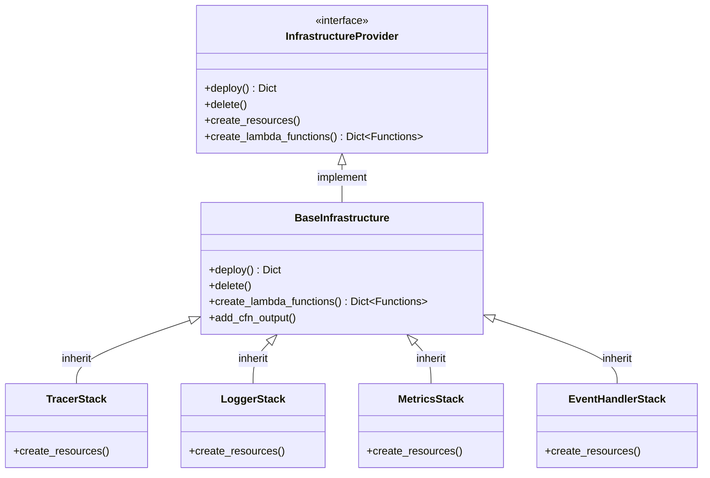
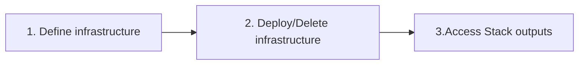
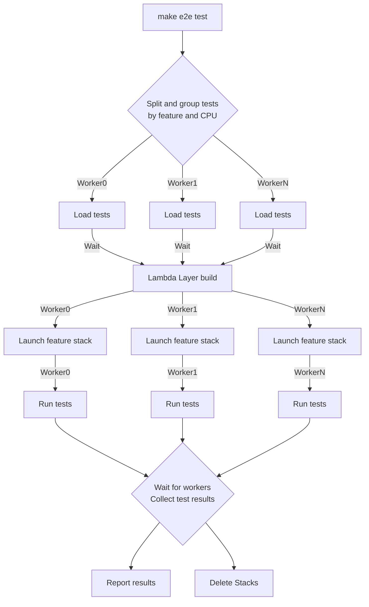
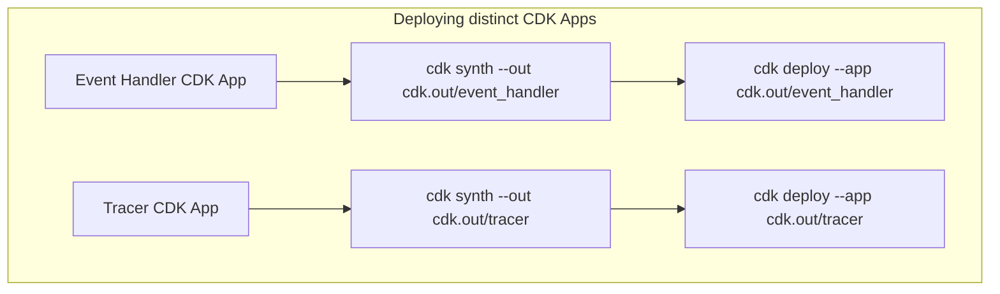
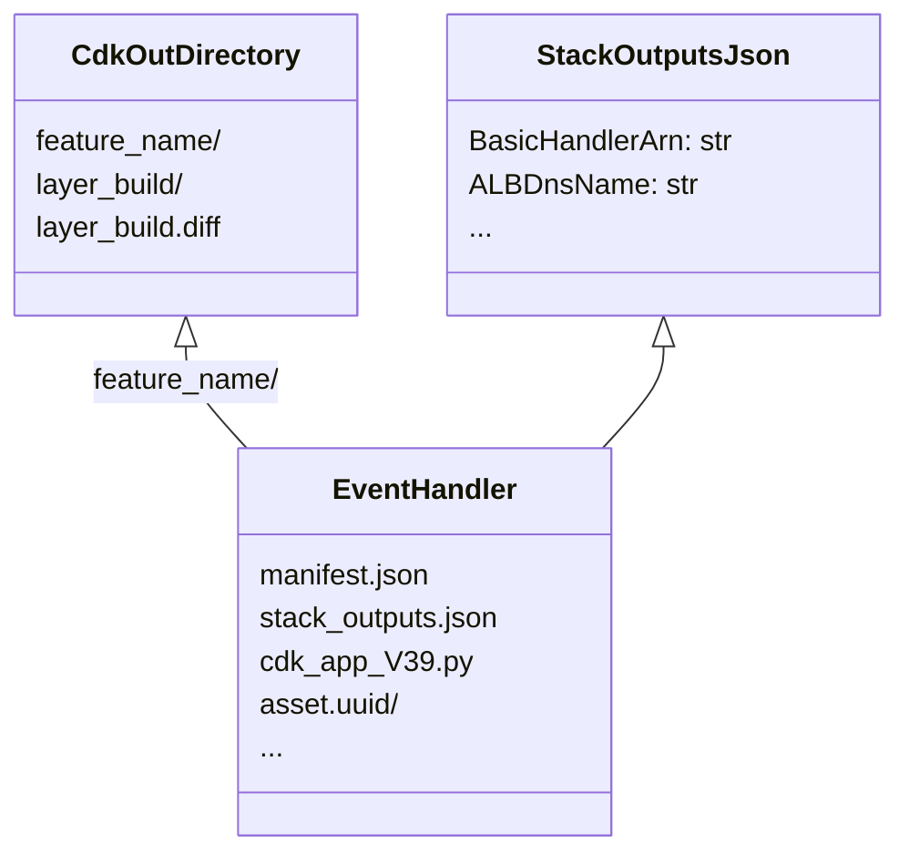

<!--  markdownlint-disable MD043 -->
## Table of contents <!-- omit in toc -->

- [Overview](#overview)
- [Current Maintainers](#current-maintainers)
- [Emeritus](#emeritus)
- [Labels](#labels)
- [Maintainer Responsibilities](#maintainer-responsibilities)
    - [Uphold Code of Conduct](#uphold-code-of-conduct)
    - [Prioritize Security](#prioritize-security)
    - [Review Pull Requests](#review-pull-requests)
    - [Triage New Issues](#triage-new-issues)
    - [Triage Bug Reports](#triage-bug-reports)
    - [Triage RFCs](#triage-rfcs)
    - [Releasing a new version](#releasing-a-new-version)
        - [Drafting release notes](#drafting-release-notes)
    - [Run end to end tests](#run-end-to-end-tests)
    - [Releasing a documentation hotfix](#releasing-a-documentation-hotfix)
    - [Maintain Overall Health of the Repo](#maintain-overall-health-of-the-repo)
    - [Manage Roadmap](#manage-roadmap)
    - [Add Continuous Integration Checks](#add-continuous-integration-checks)
    - [Negative Impact on the Project](#negative-impact-on-the-project)
    - [Becoming a maintainer](#becoming-a-maintainer)
- [Common scenarios](#common-scenarios)
    - [Contribution is stuck](#contribution-is-stuck)
    - [Insufficient feedback or information](#insufficient-feedback-or-information)
    - [Crediting contributions](#crediting-contributions)
    - [Is that a bug?](#is-that-a-bug)
    - [Mentoring contributions](#mentoring-contributions)
    - [Long running issues or PRs](#long-running-issues-or-prs)
- [E2E framework](#e2e-framework)
    - [Structure](#structure)
    - [Mechanics](#mechanics)
    - [Authoring a new feature E2E test](#authoring-a-new-feature-e2e-test)
        - [1. Define infrastructure](#1-define-infrastructure)
        - [2. Deploy/Delete infrastructure when tests run](#2-deploydelete-infrastructure-when-tests-run)
        - [3. Access stack outputs for E2E tests](#3-access-stack-outputs-for-e2e-tests)
    - [Internals](#internals)
        - [Test runner parallelization](#test-runner-parallelization)
        - [CDK CLI parallelization](#cdk-cli-parallelization)

## Overview

> **Please treat this content as a living document.**

This is document explains who the maintainers are (see below), what they do in this repo, and how they should be doing it. If you're interested in contributing, see [CONTRIBUTING](CONTRIBUTING.md).

## Current Maintainers

| Maintainer        | GitHub ID                                               | Affiliation |
| ----------------- | ------------------------------------------------------- | ----------- |
| Heitor Lessa      | [heitorlessa](https://github.com/heitorlessa)           | Amazon      |
| Alexander Melnyk  | [am29d](https://github.com/am29d)                       | Amazon      |
| Michal Ploski     | [mploski](https://github.com/mploski)                   | Amazon      |
| Simon Thulbourn   | [sthulb](https://github.com/sthulb)                     | Amazon      |
| Ruben Fonseca     | [rubenfonseca](https://github.com/rubenfonseca)         | Amazon      |
| Leandro Damascena | [leandrodamascena](https://github.com/leandrodamascena) | Amazon      |

## Emeritus

Previous active maintainers who contributed to this project.

| Maintainer        | GitHub ID                                       | Affiliation |
| ----------------- | ----------------------------------------------- | ----------- |
| Tom McCarthy      | [cakepietoast](https://github.com/cakepietoast) | MongoDB     |
| Nicolas Moutschen | [nmoutschen](https://github.com/nmoutschen)     | Apollo      |

## Labels

These are the most common labels used by maintainers to triage issues, pull requests (PR), and for project management:

| Label                  | Usage                                                            | Notes                                                           |
| ---------------------- | ---------------------------------------------------------------- | --------------------------------------------------------------- |
| triage                 | New issues that require maintainers review                       | Issue template                                                  |
| bug                    | Unexpected, reproducible and unintended software behavior        | PR/Release automation; Doc snippets are excluded;               |
| not-a-bug              | New and existing bug reports incorrectly submitted as bug        | Analytics                                                       |
| documentation          | Documentation improvements                                       | PR/Release automation; Doc additions, fixes, etc.;              |
| feature-request        | New or enhancements to existing features                         | Issue template                                                  |
| typing                 | New or enhancements to static typing                             | Issue template                                                  |
| RFC                    | Technical design documents related to a feature request          | Issue template                                                  |
| bug-upstream           | Bug caused by upstream dependency                                |                                                                 |
| help wanted            | Tasks you want help from anyone to move forward                  | Bandwidth, complex topics, etc.                                 |
| need-customer-feedback | Tasks that need more feedback before proceeding                  | 80/20% rule, uncertain, etc.                                    |
| need-more-information  | Missing information before making any calls                      |                                                                 |
| need-documentation     | PR is missing or has incomplete documentation                    |                                                                 |
| need-issue             | PR is missing a related issue for tracking change                | PR automation                                                   |
| need-rfc               | Feature request requires a RFC to improve discussion             |                                                                 |
| pending-release        | Merged changes that will be available soon                       | Release automation auto-closes/notifies it                      |
| revisit-in-3-months    | Blocked issues/PRs that need to be revisited                     | Often related to `need-customer-feedback`, prioritization, etc. |
| breaking-change        | Changes that will cause customer impact and need careful triage  |                                                                 |
| do-not-merge           | PRs that are blocked for varying reasons                         | Timeline is uncertain                                           |
| size/XS                | PRs between 0-9 LOC                                              | PR automation                                                   |
| size/S                 | PRs between 10-29 LOC                                            | PR automation                                                   |
| size/M                 | PRs between 30-99 LOC                                            | PR automation                                                   |
| size/L                 | PRs between 100-499 LOC                                          | PR automation                                                   |
| size/XL                | PRs between 500-999 LOC, often PRs that grown with feedback      | PR automation                                                   |
| size/XXL               | PRs with 1K+ LOC, largely documentation related                  | PR automation                                                   |
| tests                  | PRs that add or change tests                                     | PR automation                                                   |
| `<utility>`            | PRs related to a Powertools utility, e.g. `parameters`, `tracer` | PR automation                                                   |
| feature                | New features or minor changes                                    | PR/Release automation                                           |
| dependencies           | Changes that touch dependencies, e.g. Dependabot, etc.           | PR/ automation                                                  |
| github-actions         | Changes in GitHub workflows                                      | PR automation                                                   |
| github-templates       | Changes in GitHub issue/PR templates                             | PR automation                                                   |
| internal               | Changes in governance and chores (linting setup, baseline, etc.) | PR automation                                                   |
| tech-debt              | Changes in tech debt                                             |                                                                 |
| customer-reference     | Authorization to use company name in our documentation           | Public Relations                                                |
| community-content      | Suggested content to feature in our documentation                | Public Relations                                                |

## Maintainer Responsibilities

Maintainers are active and visible members of the community, and have [maintain-level permissions on a repository](https://docs.github.com/en/organizations/managing-access-to-your-organizations-repositories/repository-permission-levels-for-an-organization). Use those privileges to serve the community and evolve code as follows.

Be aware of recurring ambiguous situations and [document them](#common-scenarios) to help your fellow maintainers.

### Uphold Code of Conduct

Model the behavior set forward by the [Code of Conduct](CODE_OF_CONDUCT.md) and raise any violations to other maintainers and admins. There could be unusual circumstances where inappropriate behavior does not immediately fall within the [Code of Conduct](CODE_OF_CONDUCT.md).

These might be nuanced and should be handled with extra care - when in doubt, do not engage and reach out to other maintainers and admins.

### Prioritize Security

Security is your number one priority. Maintainer's Github keys must be password protected securely and any reported security vulnerabilities are addressed before features or bugs.

Note that this repository is monitored and supported 24/7 by Amazon Security, see [Reporting a Vulnerability](SECURITY.md) for details.

### Review Pull Requests

Review pull requests regularly, comment, suggest, reject, merge and close. Accept only high quality pull-requests. Provide code reviews and guidance on incoming pull requests.

PRs are [labeled](#labels) based on file changes and semantic title. Pay attention to whether labels reflect the current state of the PR and correct accordingly.

Use and enforce [semantic versioning](https://semver.org/) pull request titles, as these will be used for [CHANGELOG](CHANGELOG.md) and [Release notes](https://github.com/awslabs/aws-lambda-powertools-python/releases) - make sure they communicate their intent at the human level.

> TODO: This is an area we want to automate using the new GitHub GraphQL API.

For issues linked to a PR, make sure `pending release` label is applied to them when merging. [Upon release](#releasing-a-new-version), these issues will be notified which release version contains their change.

See [Common scenarios](#common-scenarios) section for additional guidance.

### Triage New Issues

Manage [labels](#labels), review issues regularly, and create new labels as needed by the project. Remove `triage` label when you're able to confirm the validity of a request, a bug can be reproduced, etc. Give priority to the original author for implementation, unless it is a sensitive task that is best handled by maintainers.

> TODO: This is an area we want to automate using the new GitHub GraphQL API.

Make sure issues are assigned to our [board of activities](https://github.com/orgs/awslabs/projects/51/) and have the right [status](https://awslabs.github.io/aws-lambda-powertools-python/latest/roadmap/#roadmap-status-definition).

Use our [labels](#labels) to signal good first issues to new community members, and to set expectation that this might need additional feedback from the author, other customers, experienced community members and/or maintainers.

Be aware of [casual contributors](https://opensource.com/article/17/10/managing-casual-contributors) and recurring contributors. Provide the experience and attention you wish you had if you were starting in open source.

See [Common scenarios](#common-scenarios) section for additional guidance.

### Triage Bug Reports

Be familiar with [our definition of bug](#is-that-a-bug). If it's not a bug, you can close it or adjust its title and labels - always communicate the reason accordingly.

For bugs caused by upstream dependencies, replace `bug` with `bug-upstream` label. Ask the author whether they'd like to raise the issue upstream or if they prefer us to do so.

Assess the impact and make the call on whether we need an emergency release. Contact other [maintainers](#current-maintainers) when in doubt.

See [Common scenarios](#common-scenarios) section for additional guidance.

### Triage RFCs

RFC is a collaborative process to help us get to the most optimal solution given the context. Their purpose is to ensure everyone understands what this context is, their trade-offs, and alternative solutions that were part of the research before implementation begins.

Make sure you ask these questions in mind when reviewing:

- Does it use our [RFC template](https://github.com/awslabs/aws-lambda-powertools-python/issues/new?assignees=&labels=RFC%2Ctriage&template=rfc.yml&title=RFC%3A+TITLE)?
- Does the match our [Tenets](https://awslabs.github.io/aws-lambda-powertools-python/latest/#tenets)?
- Does the proposal address the use case? If so, is the recommended usage explicit?
- Does it focus on the mechanics to solve the use case over fine-grained implementation details?
- Can anyone familiar with the code base implement it?
- If approved, are they interested in contributing? Do they need any guidance?
- Does this significantly increase the overall project maintenance? Do we have the skills to maintain it?
- If we can't take this use case, are there alternative projects we could recommend? Or does it call for a new project altogether?

When necessary, be upfront that the time to review, approve, and implement a RFC can vary - see [Contribution is stuck](#contribution-is-stuck). Some RFCs may be further updated after implementation, as certain areas become clearer.

Some examples using our initial and new RFC templates: #92, #94, #95, #991, #1226

### Releasing a new version

Firstly, make sure the commit history in the `develop` branch **(1)** it's up to date, **(2)** commit messages are semantic, and **(3)** commit messages have their respective area, for example `feat(logger): <change>`, `chore(ci): ...`).

**Found typos or unclear commit messages?**

Reword through rebase and push with `--force-with-lease` once you're confident. This will ensure [CHANGELOG](./CHANGELOG.md) is always clear for customers looking to understand what changed in between releases - was that a bug? what new features and for which utility?

**Looks good, what's next?**

The only step is to draft and publish a good release notes, everything else is automated.

#### Drafting release notes

Visit the [Releases page](https://github.com/awslabs/aws-lambda-powertools-python/releases) and choose the edit pencil button.

Make sure the `tag` field reflects the new version you're releasing, the target branch field is set to `develop`, and `release title` matches your tag e.g., `v1.26.0`.

You'll notice we group all changes based on their [labels](#labels) like `feature`, `bug`, `documentation`, etc.

**I spotted a typo or incorrect grouping - how do I fix it?**

Edit the respective PR title and update their [labels](#labels). Then run the [Release Drafter workflow](https://github.com/awslabs/aws-lambda-powertools-python/actions/workflows/release-drafter.yml) to update the Draft release.

**All looking good, what's next?**

The best part comes now. Replace the placeholder `[Human readable summary of changes]` with what you'd like to communicate to customers what this release is all about. Rule of thumb: always put yourself in the customers shoes.

These are some questions to keep in mind when drafting your first or future release notes:

- Can customers understand at a high level what changed in this release?
- Is there a link to the documentation where they can read more about each main change?
- Are there any graphics or [code snippets](carbon.now.sh/) that can enhance readability?
- Are we calling out any key contributor(s) to this release?
    - All contributors are automatically credited, use this as an exceptional case to feature them

Once you're happy, hit `Publish release` 🎉🎉🎉.

This will kick off the [Publishing workflow](https://github.com/awslabs/aws-lambda-powertools-python/actions/workflows/release.yml) and within a few minutes you should see the latest version in PyPi, and all issues labeled as `pending-release` will be closed and notified.

> TODO: Include information to verify SAR and Lambda Layers deployment; we're still finalizing Lambda Layer automated deployment in GitHub Actions - ping @am29d when in doubt.

### Run end to end tests

E2E tests are run on every push to `develop` or manually via [run-e2e-tests workflow](https://github.com/awslabs/aws-lambda-powertools-python/actions/workflows/run-e2e-tests.yml).

To run locally, you need [AWS CDK CLI](https://docs.aws.amazon.com/cdk/v2/guide/getting_started.html#getting_started_prerequisites) and an [account bootstrapped](https://docs.aws.amazon.com/cdk/v2/guide/bootstrapping.html) (`cdk bootstrap`). With a default AWS CLI profile configured, or `AWS_PROFILE` environment variable set, run `make e2e tests`.

### Releasing a documentation hotfix

You can rebuild the latest documentation without a full release via this [GitHub Actions Workflow](https://github.com/awslabs/aws-lambda-powertools-python/actions/workflows/rebuild_latest_docs.yml). Choose `Run workflow`, keep `develop` as the branch, and input the latest Powertools version available.

This workflow will update both user guide and API documentation.

### Maintain Overall Health of the Repo

> TODO: Coordinate renaming `develop` to `main`

Keep the `develop` branch at production quality at all times. Backport features as needed. Cut release branches and tags to enable future patches.

### Manage Roadmap

See [Roadmap section](https://awslabs.github.io/aws-lambda-powertools-python/latest/roadmap/)

Ensure the repo highlights features that should be elevated to the project roadmap. Be clear about the feature’s status, priority, target version, and whether or not it should be elevated to the roadmap.

### Add Continuous Integration Checks

Add integration checks that validate pull requests and pushes to ease the burden on Pull Request reviewers. Continuously revisit areas of improvement to reduce operational burden in all parties involved.

### Negative Impact on the Project

Actions that negatively impact the project will be handled by the admins, in coordination with other maintainers, in balance with the urgency of the issue. Examples would be [Code of Conduct](CODE_OF_CONDUCT.md) violations, deliberate harmful or malicious actions, spam, monopolization, and security risks.

### Becoming a maintainer

In 2023, we will revisit this. We need to improve our understanding of how other projects are doing, their mechanisms to promote key contributors, and how they interact daily.

We suspect this process might look similar to the [OpenSearch project](https://github.com/opensearch-project/.github/blob/main/MAINTAINERS.md#becoming-a-maintainer).

## Common scenarios

These are recurring ambiguous situations that new and existing maintainers may encounter. They serve as guidance. It is up to each maintainer to follow, adjust, or handle in a different manner as long as [our conduct is consistent](#uphold-code-of-conduct)

### Contribution is stuck

A contribution can get stuck often due to lack of bandwidth and language barrier. For bandwidth issues, check whether the author needs help. Make sure you get their permission before pushing code into their existing PR - do not create a new PR unless strictly necessary.

For language barrier and others, offer a 1:1 chat to get them unblocked. Often times, English might not be their primary language, and writing in public might put them off, or come across not the way they intended to be.

In other cases, you may have constrained capacity. Use `help wanted` label when you want to signal other maintainers and external contributors that you could use a hand to move it forward.

### Insufficient feedback or information

When in doubt, use `need-more-information` or `need-customer-feedback` labels to signal more context and feedback are necessary before proceeding. You can also use `revisit-in-3-months` label when you expect it might take a while to gather enough information before you can decide.

### Crediting contributions

We credit all contributions as part of each [release note](https://github.com/awslabs/aws-lambda-powertools-python/releases) as an automated process. If you find  contributors are missing from the release note you're producing, please add them manually.

### Is that a bug?

A bug produces incorrect or unexpected results at runtime that differ from its intended behavior. Bugs must be reproducible. They directly affect customers experience at runtime despite following its recommended usage.

Documentation snippets, use of internal components, or unadvertised functionalities are not considered bugs.

### Mentoring contributions

Always favor mentoring issue authors to contribute, unless they're not interested or the implementation is sensitive (_e.g., complexity, time to release, etc._).

Make use of `help wanted` and `good first issue` to signal additional contributions the community can help.

### Long running issues or PRs

Try offering a 1:1 call in the attempt to get to a mutual understanding and clarify areas that maintainers could help.

In the rare cases where both parties don't have the bandwidth or expertise to continue, it's best to use the `revisit-in-3-months` label. By then, see if it's possible to break the PR or issue in smaller chunks, and eventually close if there is no progress.

## E2E framework

### Structure

Our E2E framework relies on [Pytest fixtures](https://docs.pytest.org/en/6.2.x/fixture.html) to coordinate infrastructure and test parallelization - see [Test Parallelization](#test-runner-parallelization) and [CDK CLI Parallelization](#cdk-cli-parallelization).

**tests/e2e structure**

```shell
.
├── __init__.py
├── conftest.py # builds Lambda Layer once
├── logger
│   ├── __init__.py
│   ├── conftest.py  # deploys LoggerStack
│   ├── handlers
│   │   └── basic_handler.py
│   ├── infrastructure.py # LoggerStack definition
│   └── test_logger.py
├── metrics
│   ├── __init__.py
│   ├── conftest.py  # deploys MetricsStack
│   ├── handlers
│   │   ├── basic_handler.py
│   │   └── cold_start.py
│   ├── infrastructure.py # MetricsStack definition
│   └── test_metrics.py
├── tracer
│   ├── __init__.py
│   ├── conftest.py  # deploys TracerStack
│   ├── handlers
│   │   ├── async_capture.py
│   │   └── basic_handler.py
│   ├── infrastructure.py  # TracerStack definition
│   └── test_tracer.py
└── utils
    ├── __init__.py
    ├── data_builder  # build_service_name(), build_add_dimensions_input, etc.
    ├── data_fetcher  # get_traces(), get_logs(), get_lambda_response(), etc.
    ├── infrastructure.py # base infrastructure like deploy logic, etc.
```

Where:

- **`<feature>/infrastructure.py`**. Uses CDK to define the infrastructure a given feature needs.
- **`<feature>/handlers/`**. Lambda function handlers to build, deploy, and exposed as stack output in PascalCase (e.g., `BasicHandler`).
- **`utils/`**. Test utilities to build data and fetch AWS data to ease assertion
- **`conftest.py`**. Deploys and deletes a given feature infrastructure. Hierarchy matters:
    - **Top-level (`e2e/conftest`)**. Builds Lambda Layer only once and blocks I/O across all CPU workers.
    - **Feature-level (`e2e/<feature>/conftest`)**. Deploys stacks in parallel and make them independent of each other.

### Mechanics

Under [`BaseInfrastructure`](https://github.com/awslabs/aws-lambda-powertools-python/blob/develop/tests/e2e/utils/infrastructure.py), we hide the complexity of deployment and delete coordination under `deploy`, `delete`, and `create_lambda_functions` methods.

This allows us to benefit from test and deployment parallelization, use IDE step-through debugging for a single test, run one, subset, or all tests and only deploy their related infrastructure, without any custom configuration.

> Class diagram to understand abstraction built when defining a new stack (`LoggerStack`)



### Authoring a new feature E2E test

Imagine you're going to create E2E for Event Handler feature for the first time. Keep the following mental model when reading:



#### 1. Define infrastructure

We use CDK as our Infrastructure as Code tool of choice. Before you start using CDK, you'd take the following steps:

1. Create `tests/e2e/event_handler/infrastructure.py` file
2. Create a new class `EventHandlerStack` and inherit from `BaseInfrastructure`
3. Override `create_resources` method and define your infrastructure using CDK
4. (Optional) Create a Lambda function under `handlers/alb_handler.py`

> Excerpt `tests/e2e/event_handler/infrastructure.py`

```python
class EventHandlerStack(BaseInfrastructure):
    def create_resources(self):
        functions = self.create_lambda_functions()

        self._create_alb(function=functions["AlbHandler"])
        ...

    def _create_alb(self, function: Function):
        vpc = ec2.Vpc.from_lookup(
            self.stack,
            "VPC",
            is_default=True,
            region=self.region,
        )

        alb = elbv2.ApplicationLoadBalancer(self.stack, "ALB", vpc=vpc, internet_facing=True)
        CfnOutput(self.stack, "ALBDnsName", value=alb.load_balancer_dns_name)
        ...
```

> Excerpt `tests/e2e/event_handler/handlers/alb_handler.py`

```python
from aws_lambda_powertools.event_handler import ALBResolver, Response, content_types

app = ALBResolver()


@app.get("/todos")
def hello():
    return Response(
        status_code=200,
        content_type=content_types.TEXT_PLAIN,
        body="Hello world",
        cookies=["CookieMonster", "MonsterCookie"],
        headers={"Foo": ["bar", "zbr"]},
    )


def lambda_handler(event, context):
    return app.resolve(event, context)
```

#### 2. Deploy/Delete infrastructure when tests run

We need to create a Pytest fixture for our new feature under `tests/e2e/event_handler/conftest.py`.

This will instruct Pytest to deploy our infrastructure when our tests start, and delete it when they complete whether tests are successful or not. Note that this file will not need any modification in the future.

> Excerpt `conftest.py` for Event Handler

```python
import pytest

from tests.e2e.event_handler.infrastructure import EventHandlerStack


@pytest.fixture(autouse=True, scope="module")
def infrastructure():
    """Setup and teardown logic for E2E test infrastructure

    Yields
    ------
    Dict[str, str]
        CloudFormation Outputs from deployed infrastructure
    """
    stack = EventHandlerStack()
    try:
        yield stack.deploy()
    finally:
        stack.delete()

```

#### 3. Access stack outputs for E2E tests

Within our tests, we should now have access to the `infrastructure` fixture we defined earlier in `tests/e2e/event_handler/conftest.py`.

We can access any Stack Output using pytest dependency injection.

> Excerpt `tests/e2e/event_handler/test_header_serializer.py`

```python
@pytest.fixture
def alb_basic_listener_endpoint(infrastructure: dict) -> str:
    dns_name = infrastructure.get("ALBDnsName")
    port = infrastructure.get("ALBBasicListenerPort", "")
    return f"http://{dns_name}:{port}"


def test_alb_headers_serializer(alb_basic_listener_endpoint):
    # GIVEN
    url = f"{alb_basic_listener_endpoint}/todos"
    ...
```

### Internals

#### Test runner parallelization

Besides speed, we parallelize our end-to-end tests to ease asserting async side-effects may take a while per test too, _e.g., traces to become available_.

The following diagram demonstrates the process we take every time you use `make e2e` locally or at CI:



#### CDK CLI parallelization

For CDK CLI to work with [independent CDK Apps](https://docs.aws.amazon.com/cdk/v2/guide/apps.html), we specify an output directory when synthesizing our stack and deploy from said output directory.



We create the typical CDK `app.py` at runtime when tests run, since we know which feature and Python version we're dealing with (locally or at CI).

> Excerpt `cdk_app_V39.py` for Event Handler created at deploy phase

```python
from tests.e2e.event_handler.infrastructure import EventHandlerStack
stack = EventHandlerStack()
stack.create_resources()
stack.app.synth()
```

When we run E2E tests for a single feature or all of them, our `cdk.out` looks like this:

```shell
total 8
drwxr-xr-x  18 lessa  staff   576B Sep  6 15:38 event-handler
drwxr-xr-x   3 lessa  staff    96B Sep  6 15:08 layer_build
-rw-r--r--   1 lessa  staff    32B Sep  6 15:08 layer_build.diff
drwxr-xr-x  18 lessa  staff   576B Sep  6 15:38 logger
drwxr-xr-x  18 lessa  staff   576B Sep  6 15:38 metrics
drwxr-xr-x  22 lessa  staff   704B Sep  9 10:52 tracer
```



Where:

- **`<feature>`**. Contains CDK Assets, CDK `manifest.json`, our `cdk_app_<PyVersion>.py` and `stack_outputs.json`
- **`layer_build`**. Contains our Lambda Layer source code built once, used by all stacks independently
- **`layer_build.diff`**. Contains a hash on whether our source code has changed to speed up further deployments and E2E tests

Together, all of this allows us to use Pytest like we would for any project, use CDK CLI and its [context methods](https://docs.aws.amazon.com/cdk/v2/guide/context.html#context_methods) (`from_lookup`), and use step-through debugging for a single E2E test without any extra configuration.

> NOTE: VSCode doesn't support debugging processes spawning sub-processes (like CDK CLI does w/ shell and CDK App). Maybe [this works](https://stackoverflow.com/a/65339352). PyCharm works just fine.
