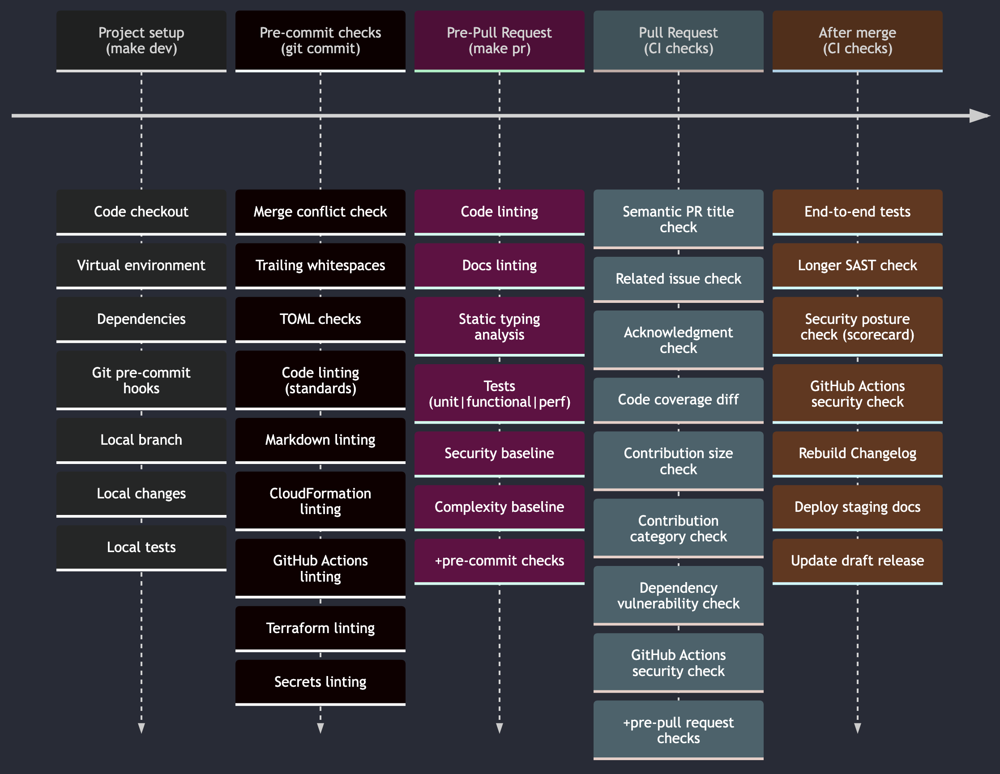

<!-- markdownlint-disable MD043 MD013 -->

## Continuous integration practices

!!! note "We adhere to industry recommendations from the [OSSF Scorecard project](https://bestpractices.coreinfrastructure.org/en/criteria){target="_blank" rel="nofollow"}, among [others](https://docs.github.com/en/actions/security-guides/security-hardening-for-github-actions){target="_blank" rel="nofollow"}."

Since all code changes require a pull request (PR) along with one or more reviewers, we automate quality and security checks **before**, **during**, and **after** a PR is merged to trunk (`develop`).

We use a combination of tools coupled with peer review to increase its compound effect in detecting issues early.

This is a snapshot of our automated checks at a glance.

<!-- NOTE: mkdocs material doesn't render timeline mermaid diagrams hence png for now -->

### Pre-commit checks

> [**Pre-commit configuration**](https://github.com/aws-powertools/powertools-lambda-python/blob/0523ff64606514ea3e59c07c8c69c83d751f61fa/.pre-commit-config.yaml){target="_blank"}.

Pre-commit checks are crucial for a fast feedback loop while ensuring security practices at the individual change level.

To prevent scenarios where these checks are intentionally omitted at the client side, we run at [CI level too](#pull-request-checks).

!!! note "These run locally only for changed files"

* [**Merge conflict check**](https://github.com/aws-powertools/powertools-lambda-python/blob/0523ff64606514ea3e59c07c8c69c83d751f61fa/.pre-commit-config.yaml#L10){target="_blank" }. Checks for merge strings in each individual change accidentally left unresolved to prevent breakage.
* [**Code linting**](https://github.com/aws-powertools/powertools-lambda-python/blob/0523ff64606514ea3e59c07c8c69c83d751f61fa/Makefile#L22){target="_blank"}. Linter checks for industry quality standards and known bad practices that could lead to abuse.
* [**CloudFormation linting**](https://github.com/aws-powertools/powertools-lambda-python/blob/0523ff64606514ea3e59c07c8c69c83d751f61fa/.pre-commit-config.yaml#L34){target="_blank"}. `cfn-lint` ensures [best practices](https://github.com/aws-cloudformation/cfn-lint/blob/86f0370bd43b400ed4c485180dbc2697f73367b2/docs/rules.md){target=""_blank"} at our documentation examples.
* [**Markdown linting**](https://github.com/aws-powertools/powertools-lambda-python/blob/0523ff64606514ea3e59c07c8c69c83d751f61fa/.pre-commit-config.yaml#L25){target="_blank}. Primarily [industry markdown practices](https://github.com/DavidAnson/markdownlint/blob/d01180ec5a014083ee9d574b693a8d7fbc1e566d/README.md#rules--aliases){target="_blank"} at this stage.
* [**GitHub Actions linting**](https://github.com/rhysd/actionlint/blob/main/docs/checks.md){target="_blank" rel="nofollow"}. `actionlint` ensures workflows follow [GitHub Actions security practices](https://docs.github.com/en/actions/security-guides/security-hardening-for-github-actions){target="_blank" rel="nofollow"}. It  guards against numerous [leading practices](https://github.com/rhysd/actionlint/blob/main/docs/checks.md){target="_blank" rel="nofollow"} to prevent common configuration mistakes, insecure inline scripts, among many others.
* [**Terraform linting**](https://github.com/aws-powertools/powertools-lambda-python/blob/0523ff64606514ea3e59c07c8c69c83d751f61fa/.pre-commit-config.yaml#L43){target="_blank"}. As of now, largely formatting until we increase our Terraform coverage in documentation examples.
* [**Secrets linting**](https://github.com/aws-powertools/powertools-lambda-python/blob/develop/.pre-commit-config.yaml#L49){target="_blank"}. Detects industry credentials that might be accidentally leaked in source code.

### Pre-Pull Request checks

For an improved contributing experience, most of our checks can run locally. For maintainers, this also means increased focus on reviewing actual value instead of standards and security malpractices that can be caught earlier.

!!! note "These are in addition to [pre-commit checks](#pre-commit-checks)."

* [**Static typing analysis**](https://github.com/aws-powertools/powertools-lambda-python/blob/0523ff64606514ea3e59c07c8c69c83d751f61fa/Makefile#L108){target="_blank"}. `mypy` checks for static typing annotations to prevent common bugs in Python that may or may not lead to abuse.
* [**Tests**](https://github.com/aws-powertools/powertools-lambda-python/blob/0523ff64606514ea3e59c07c8c69c83d751f61fa/Makefile#L31){target="_blank"}. We run `unit`, `functional`, and `performance` tests ([_see our definition_](https://github.com/aws-powertools/powertools-lambda-python/blob/0523ff64606514ea3e59c07c8c69c83d751f61fa/CONTRIBUTING.md#testing-definition){target="_blank"}). Besides breaking changes, we are investing in mutation testing to find additional sources of bugs and potential abuse.
* [**Security baseline**](https://github.com/aws-powertools/powertools-lambda-python/blob/0523ff64606514ea3e59c07c8c69c83d751f61fa/CONTRIBUTING.md#testing-definition){target="_blank"}. `bandit` detects common security issues defined by Python Code Quality Authority (PyCQA).
* [**Complexity baseline**](https://github.com/aws-powertools/powertools-lambda-python/blob/0523ff64606514ea3e59c07c8c69c83d751f61fa/Makefile#L79){target="_blank"}. We run a series of maintainability and cyclomatic checks to reduce code and logic complexity. This aids reviewers' cognitive overhead and long-term maintainers revisiting legacy code at a later date.

### Pull Request checks

While we trust contributors and maintainers do go through pre-commit and pre-pull request due diligence, we verify them at CI level.

!!! note "Checks described earlier are omitted to improve reading experience."

* [**Semantic PR title**](https://github.com/Ezard/semantic-prs){target="_blank" rel="nofollow"}. We enforce PR titles follow semantic naming, for example `chore(category): change`. This benefits contributors with a lower entry bar, no need for semantic commits. It also benefits everyone looking for an [useful changelog message](https://docs.powertools.aws.dev/lambda/python/latest/changelog/){target="_blank"} on **what** changed and **where**.
* [**Related issue check**](https://github.com/aws-powertools/powertools-lambda-python/blob/0523ff64606514ea3e59c07c8c69c83d751f61fa/.github/workflows/on_opened_pr.yml#L44){target="_blank"}. [Every change require an issue](https://github.com/aws-powertools/powertools-lambda-python/blob/0523ff64606514ea3e59c07c8c69c83d751f61fa/CONTRIBUTING.md#contributing-via-pull-requests){target="_blank"} describing its needs. This enforces a PR has a related issue by blocking merge operations if missing.
* [**Acknowledgment check**](https://github.com/aws-powertools/powertools-lambda-python/blob/0523ff64606514ea3e59c07c8c69c83d751f61fa/.github/workflows/on_opened_pr.yml#L63){target="_blank"}. [Ensures PR template](https://github.com/aws-powertools/powertools-lambda-python/blob/0523ff64606514ea3e59c07c8c69c83d751f61fa/.github/PULL_REQUEST_TEMPLATE.md#L36){target="_blank"} is used and every contributor is aware of code redistribution.
* [**Code coverage diff**](https://github.com/aws-powertools/powertools-lambda-python/blob/0523ff64606514ea3e59c07c8c69c83d751f61fa/.github/workflows/quality_check.yml#L73){target="_blank"}. Educates contributors and maintainers about code coverage differences for a given change.
* [**Contribution size check**](https://github.com/aws-powertools/powertools-lambda-python/blob/0523ff64606514ea3e59c07c8c69c83d751f61fa/.github/workflows/on_label_added.yml#L44){target="_blank"}. Suggests contributors and maintainers to break up large changes (100-499 LOC) in smaller PRs. It helps reduce overlooking security and other practices due to increased cognitive overhead.
* [**Dependency vulnerability check**](https://github.com/aws-powertools/powertools-lambda-python/blob/0523ff64606514ea3e59c07c8c69c83d751f61fa/.github/workflows/dependency-review.yml#L22){target="_blank"}. Verifies any dependency changes for common vulnerability exposures (CVEs), in addition to our daily check on any dependencies used (e.g., Python, Docker, Go, etc.)
* [**GitHub Actions security check**](https://github.com/aws-powertools/powertools-lambda-python/blob/0523ff64606514ea3e59c07c8c69c83d751f61fa/.github/workflows/secure_workflows.yml#L35){target="_blank"}. Enforces use of immutable 3rd-party GitHub Actions (_e.g., `actions/checkout@<git-SHA>_`) to prevent abuse. Upgrades are handled by a [separate automated process](https://github.com/aws-powertools/powertools-lambda-python/blob/0523ff64606514ea3e59c07c8c69c83d751f61fa/.github/dependabot.yml#L4){target="_blank"} that includes a maintainer review to also prevent unexpected behavior changes.

### After merge checks

!!! note "Checks described earlier are omitted to improve reading experience."

We strike a balance in security and contribution experience. These automated checks take several minutes to complete. Failures are reviewed by a maintainer on-call and before a release.

* [**End-to-end tests**](https://github.com/aws-powertools/powertools-lambda-python/blob/0523ff64606514ea3e59c07c8c69c83d751f61fa/.github/workflows/run-e2e-tests.yml#L41){target="_blank"}. We run E2E with a [high degree of parallelization](https://github.com/aws-powertools/powertools-lambda-python/blob/0523ff64606514ea3e59c07c8c69c83d751f61fa/MAINTAINERS.md#test-runner-parallelization). While it is designed to also run locally, it may incur AWS charges to contributors. For additional security, all infrastructure is ephemeral per change and per Python version.
* [**SAST check**](https://github.com/aws-powertools/powertools-lambda-python/blob/0523ff64606514ea3e59c07c8c69c83d751f61fa/.github/workflows/codeql-analysis.yml#L20){target="_blank"}. GitHub CodeQL runs ~30m static analysis in the entire codebase.
* [**Security posture check**](https://github.com/aws-powertools/powertools-lambda-python/blob/0523ff64606514ea3e59c07c8c69c83d751f61fa/.github/workflows/ossf_scorecard.yml#L14){target="_blank"}. OSSF Scorecard runs numerous automated checks upon changes, and raises security alerts if [OSSF security practices](https://bestpractices.coreinfrastructure.org/en/criteria){target="_blank" rel="nofollow"} are no longer followed.
* [**Rebuild Changelog**](https://github.com/aws-powertools/powertools-lambda-python/blob/0523ff64606514ea3e59c07c8c69c83d751f61fa/.github/workflows/build_changelog.yml#L23){target="_blank"}. We rebuild our entire changelog upon changes and create a PR for maintainers. This has the added benefit in keeping a [protected branch](https://docs.github.com/en/repositories/configuring-branches-and-merges-in-your-repository/managing-protected-branches/about-protected-branches){target="_blank" rel="nofollow"} while keeping removing error-prone tasks from maintainers.
* [**Stage documentation**](https://github.com/aws-powertools/powertools-lambda-python/blob/0523ff64606514ea3e59c07c8c69c83d751f61fa/.github/workflows/on_push_docs.yml#L27C16-L27C16){target="_blank"}. We rebuild and deploy changes to the documentation to a [staged version](https://docs.powertools.aws.dev/lambda/python/stage/){target="_blank"}. This gives us safety that our docs can always be rebuilt, and ready to release to production when needed.
* [**Update draft release**](https://github.com/aws-powertools/powertools-lambda-python/blob/0523ff64606514ea3e59c07c8c69c83d751f61fa/.github/workflows/release-drafter.yml#L25){target="_blank"}. We use [Release Drafter](https://github.com/release-drafter/release-drafter){target="_blank" rel="nofollow"} to generate a portion of our release notes and to always keep a fresh draft upon changes. You can read our [thoughts on a good quality release notes here](https://github.com/aws-powertools/powertools-lambda-python/blob/0523ff64606514ea3e59c07c8c69c83d751f61fa/MAINTAINERS.md#drafting-release-notes){target="_blank"} (human readable changes + automation).

## Continuous deployment practices

!!! note "We adhere to industry recommendations from the [OSSF Scorecard project](https://bestpractices.coreinfrastructure.org/en/criteria){target="_blank" rel="nofollow"}, among [others](https://docs.github.com/en/actions/security-guides/security-hardening-for-github-actions){target="_blank" rel="nofollow"}."

Releases are triggered by maintainers along with a reviewer - [detailed info here](https://github.com/aws-powertools/powertools-lambda-python/blob/develop/MAINTAINERS.md#releasing-a-new-version){target="_blank"}. In addition to [checks that run for every code change](#continuous-integration-practices), our pipeline requires a manual approval before releasing.

We use a combination of provenance and signed attestation for our builds, source code sealing, SAST scanners, Python specific static code analysis, ephemeral credentials that last a given job step, and more.

This is a snapshot of our automated checks at a glance.

!!! info "More details to come"
