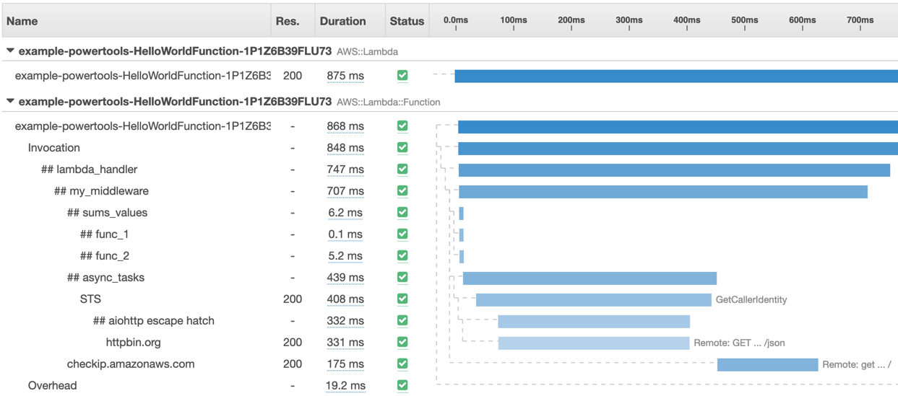

import Note from "../../src/components/Note"

Tracer is an opinionated thin wrapper for [AWS X-Ray Python SDK](https://github.com/aws/aws-xray-sdk-python/).



**Key features**

* Capture cold start as annotation, and responses as well as full exceptions as metadata
* Run functions locally with SAM CLI without code change to disable tracing
* Explicitly disable tracing via env var `POWERTOOLS_TRACE_DISABLED="true"`
* Support tracing async methods, generators, and context managers
* Auto patch supported modules, or a tuple of explicit modules supported by AWS X-Ray

<Note type="warning">
  <strong>Returning sensitive information from your Lambda handler or functions, where Tracer is used?</strong>
  <br/><br/>
  You can disable capturing their responses as tracing metadata with <strong><code>capture_response=False</code></strong> parameter for both capture_lambda_handler and capture_method decorators.
</Note><br/>

## Initialization

Your AWS Lambda function must have permission to send traces to AWS X-Ray - Here is an example using AWS Serverless Application Model (SAM)

```yaml:title=template.yaml
Resources:
    HelloWorldFunction:
        Type: AWS::Serverless::Function
        Properties:
        ...
        Runtime: python3.8
        Tracing: Active # highlight-line
        Environment:
            Variables:
                POWERTOOLS_SERVICE_NAME: example
```

You can either explicitly pass using `service` param or via `POWERTOOLS_SERVICE_NAME` environment variable. The service name is utilized for exceptions, metadata, and namespace data.

```python:title=app.py
from aws_lambda_powertools import Tracer
# POWERTOOLS_SERVICE_NAME defined
tracer = Tracer() # highlight-line

# Explicit definition
tracer = Tracer(service="booking")
```

## Lambda handler

You can trace your Lambda function handler via `capture_lambda_handler`.

When using this decorator, Tracer performs these additional tasks to ease operations:

* Creates a `ColdStart` annotation to easily filter traces that have had an initialization overhead
* Adds any response, or full exceptions generated by the handler as metadata

```python:title=lambda_handler.py
from aws_lambda_powertools import Tracer
tracer = Tracer()

@tracer.capture_lambda_handler # highlight-line
def handler(event, context):
    charge_id = event.get('charge_id')
    payment = collect_payment(charge_id)
    ...

@tracer.capture_lambda_handler(capture_response=False) # highlight-line
def handler(event, context):
	return "sensitive_information"
```

### Annotations

Annotations are key-values indexed by AWS X-Ray on a per trace basis. You can use them to filter traces as well as to create [Trace Groups](https://aws.amazon.com/about-aws/whats-new/2018/11/aws-xray-adds-the-ability-to-group-traces/).

You can add annotations using `put_annotation` method from Tracer.

```python:title=app.py
from aws_lambda_powertools import Tracer
tracer = Tracer()

@tracer.capture_lambda_handler
def handler(event, context):
    ...
    tracer.put_annotation(key="PaymentStatus", value="SUCCESS") # highlight-line
```

### Metadata

Metadata are non-indexed values that can add additional context for an operation.

You can add metadata using `put_metadata` method from Tracer.

```python:title=app.py
from aws_lambda_powertools import Tracer
tracer = Tracer()

@tracer.capture_lambda_handler
def handler(event, context):
    ...
    ret = some_logic()
    tracer.put_metadata(key="payment_response", value=ret) # highlight-line
```

## Synchronous functions

You can trace a synchronous function using the `capture_method`.

```python:title=app.py
@tracer.capture_method
def collect_payment(charge_id):
    ret = requests.post(PAYMENT_ENDPOINT) # logic
    tracer.put_annotation("PAYMENT_STATUS", "SUCCESS") # custom annotation
    return ret

@tracer.capture_method(capture_response=False) # highlight-line
def sensitive_information_to_be_processed():
	return "sensitive_information"
```

## Asynchronous and generator functions

<Note type="warning">
  <strong>We do not support async Lambda handler</strong> - Lambda handler itself must be synchronous
</Note><br/>

You can trace asynchronous functions and generator functions (including context managers) using `capture_method`.
The decorator will detect whether your function is asynchronous, a generator, or a  context manager and adapt its behaviour accordingly.

```python:title=lambda_handler_with_async_code.py
import asyncio
import contextlib
from aws_lambda_powertools import Tracer
tracer = Tracer()

# highlight-start
@tracer.capture_method
async def collect_payment():
    ...
# highlight-end

# highlight-start
@contextlib.contextmanager
@tracer.capture_method
def collect_payment_ctxman():
    yield result
    ...
# highlight-end

# highlight-start
@tracer.capture_method
def collect_payment_gen():
    yield result
    ...
# highlight-end

@tracer.capture_lambda_handler
def handler(evt, ctx): # highlight-line
    asyncio.run(collect_payment())

    with collect_payment_ctxman as result:
        do_something_with(result)

    another_result = list(collect_payment_gen())
```

## Tracing aiohttp requests

<Note type="info">
    This snippet assumes you have <strong>aiohttp</strong> as a dependency
</Note><br/>

You can use `aiohttp_trace_config` function to create a valid [aiohttp trace_config object](https://docs.aiohttp.org/en/stable/tracing_reference.html). This is necessary since X-Ray utilizes aiohttp trace hooks to capture requests end-to-end.

```python:title=app.py
import asyncio
import aiohttp

from aws_lambda_powertools import Tracer
from aws_lambda_powertools.tracing import aiohttp_trace_config # highlight-line
tracer = Tracer()

async def aiohttp_task():
    async with aiohttp.ClientSession(trace_configs=[aiohttp_trace_config()]) as session: # highlight-line
        async with session.get("https://httpbin.org/json") as resp:
            resp = await resp.json()
            return resp
```

## Escape hatch mechanism

You can use `tracer.provider` attribute to access all methods provided by AWS X-Ray `xray_recorder` object.

This is useful when you need a feature available in X-Ray that is not available in the Tracer utility, for example [thread-safe](https://github.com/aws/aws-xray-sdk-python/#user-content-trace-threadpoolexecutor), or [context managers](https://github.com/aws/aws-xray-sdk-python/#user-content-start-a-custom-segmentsubsegment).

## Concurrent asynchronous functions

<Note type="info">
    <a href="https://github.com/aws/aws-xray-sdk-python/issues/164">As of now, X-Ray SDK will raise an exception when async functions are run and traced concurrently</a>.
</Note><br/>

A safe workaround mechanism is to use `in_subsegment_async` available via Tracer escape hatch (`tracer.provider`).

```python:title=lambda_handler_with_concurret_async_code_workaround.py
import asyncio

from aws_lambda_powertools import Tracer
tracer = Tracer()

async def another_async_task():
    # highlight-start
    async with tracer.provider.in_subsegment_async("## another_async_task") as subsegment:
        subsegment.put_annotation(key="key", value="value")
        subsegment.put_metadata(key="key", value="value", namespace="namespace")
        ...
    # highlight-end

async def another_async_task_2():
    ...

@tracer.capture_method
async def collect_payment(charge_id):
    asyncio.gather(another_async_task(), another_async_task_2()) # highlight-line
    ...
```

## Reusing Tracer across your code

Tracer keeps a copy of its configuration after the first initialization. This is useful for scenarios where you want to use Tracer in more than one location across your code base.

<Note type="warning">
    When reusing Tracer in Lambda Layers, or in multiple modules, <strong>do not set <code>auto_patch=False</code></strong>, because import order matters.
    <br/><br/>This can result in the first Tracer config being inherited by new instances, and their modules not being patched.
</Note><br/>

```python:title=lambda_handler.py
# handler.py
from aws_lambda_powertools import Tracer
tracer = Tracer(service="payment")

@tracer.capture_lambda_handler
def handler(event, context):
    charge_id = event.get('charge_id')
    payment = collect_payment(charge_id)
...
```

```python:title=another_file.py
from aws_lambda_powertools import Tracer
# highlight-start
# new instance using existing configuration
tracer = Tracer(service="payment")
# highlight-end
```

## Testing your code

You can safely disable Tracer when unit testing your code using `POWERTOOLS_TRACE_DISABLED` environment variable.

```bash:title=pytest_disable_tracing.sh
POWERTOOLS_TRACE_DISABLED=1 python -m pytest
```

## Tips

* Use annotations on key operations to slice and dice traces, create unique views, and create metrics from it via Trace Groups
* Use a namespace when adding metadata to group data more easily
* Annotations and metadata are added to the current subsegment opened. If you want them in a specific subsegment, use a [context manager](https://github.com/aws/aws-xray-sdk-python/#start-a-custom-segmentsubsegment) via the escape hatch mechanism
