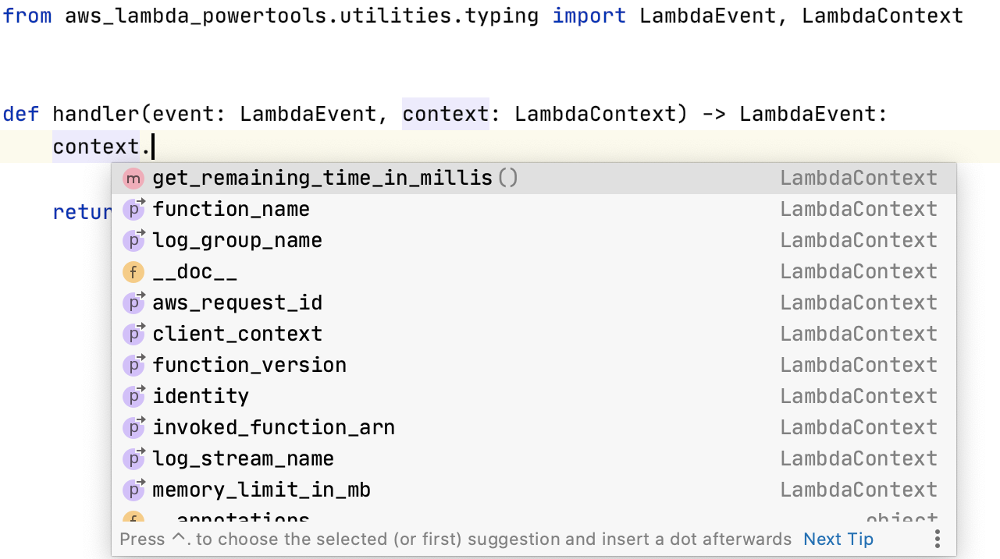

import Note from "../../src/components/Note"

This typing utility provides static typing classes that can be used to ease the development by providing the IDE type hints.



## LambdaContext

The `LambdaContext` typing is typically used in the handler method for the Lambda function.

```python:title=index.py
from typing import Any, Dict
from aws_lambda_powertools.utilities.typing import LambdaContext

# highlight-start
def handler(event: Dict[str, Any], context: LambdaContext) -> Dict[str, Any]:
# highlight-end
    # Insert business logic
    return event
```
