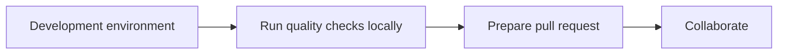

<!-- markdownlint-disable MD043 -->

[](https://discord.gg/B8zZKbbyET){target="_blank" rel="nofollow"}

This page describes how to setup your development environment (Cloud or locally) to contribute to Powertools for AWS Lambda.

<center>

<i>End-to-end process</i>
</center>

## Requirements

!!! question "First time contributing to an open-source project ever?"
    Read this [introduction on how to fork and clone a project on GitHub](https://docs.github.com/en/get-started/quickstart/contributing-to-projects){target="_blank" rel="nofollow"}.

Unless you're using the pre-configured Cloud environment, you'll need the following installed:

* [GitHub account](https://github.com/join){target="_blank" rel="nofollow"}. You'll need to be able to fork, clone, and contribute via pull request.
* [Python 3.8+](https://www.python.org/downloads/){target="_blank" rel="nofollow"}. Pick any version supported in [AWS Lambda runtime](https://docs.aws.amazon.com/lambda/latest/dg/lambda-runtimes.html).
* [Docker](https://docs.docker.com/engine/install/){target="_blank" rel="nofollow"}. We use it to run documentation linters and non-Python tooling.
* [Fork the repository](https://github.com/aws-powertools/powertools-lambda-python/fork). You'll work against your fork of this repository.

??? note "Additional requirements if running end-to-end tests"

    * [AWS CDK CLI](https://docs.aws.amazon.com/cdk/v2/guide/getting_started.html#getting_started_prerequisites){target="_blank"}
    * [AWS Account bootstrapped with CDK](https://docs.aws.amazon.com/cdk/v2/guide/bootstrapping.html){target="_blank"}
    * [AWS CLI installed and configured](https://docs.aws.amazon.com/cli/latest/userguide/getting-started-install.html)

## Cloud environment

> **NOTE**. Be mindful of [Gitpod pricing structure](https://www.gitpod.io/pricing){target="_blank" rel="nofollow"} for long-running contributions. When in doubt, use the local environment below.

To use a pre-configured environment, replace `YOUR_USERNAME` with your GitHub username or organization.

```bash
https://gitpod.io/#https://github.com/YOUR_USERNAME/powertools-lambda-python  #(1)!
```

1. For example, my username is `heitorlessa`. <br><br> Therefore, my final URL should be `https://gitpod.io/#https://github.com/heitorlessa/powertools-lambda-python`

Once provisioned, it'll install all development dependencies and tools you'll need to contribute.

## Local environment

> Assuming you've got all [requirements](#requirements).

You can use `make dev` to create a local virtual environment and install all dependencies locally.

!!! note "Curious about what `make dev` does under the hood?"
    We use `Make` to [automate common tasks](https://github.com/aws-powertools/powertools-lambda-python/blob/1ebe3275a5c53aed5a8eb76318e7d0af2367edfa/Makefile#L7){target="_blank" rel="nofollow"} locally and in Continuous Integration environments.

## Local documentation

You might find useful to run both the documentation website and the API reference locally while contributing:

* **Docs website**: `make docs-local`
    * If you prefer using Docker: `make docs-local-docker`
* **API reference**: `make docs-api-local`
