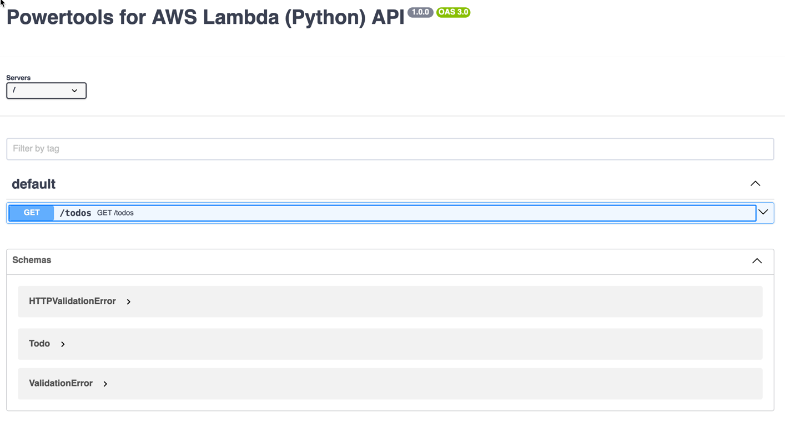
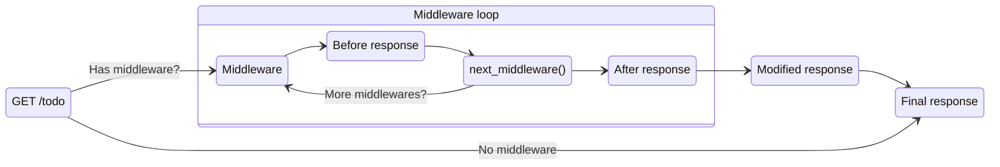

Event handler for Amazon API Gateway REST and HTTP APIs, Application Loader Balancer (ALB), Lambda Function URLs, and VPC Lattice.

## Key Features

* Lightweight routing to reduce boilerplate for API Gateway REST/HTTP API, ALB and Lambda Function URLs.
* Support for CORS, binary and Gzip compression, Decimals JSON encoding and bring your own JSON serializer
* Built-in integration with [Event Source Data Classes utilities](../../utilities/data_classes.md){target="_blank"} for self-documented event schema
* Works with micro function (one or a few routes) and monolithic functions (all routes)
* Support for OpenAPI and data validation for requests/responses

## Getting started

???+ tip
    All examples shared in this documentation are available within the [project repository](https://github.com/aws-powertools/powertools-lambda-python/tree/develop/examples){target="_blank"}.

### Install

!!! info "This is not necessary if you're installing Powertools for AWS Lambda (Python) via [Lambda Layer/SAR](../../index.md#lambda-layer){target="_blank"}."

**When using the data validation feature**, you need to add `pydantic` as a dependency in your preferred tool _e.g., requirements.txt, pyproject.toml_.

As of now, both Pydantic V1 and V2 are supported. For a future major version, we will only support Pydantic V2.

### Required resources

<!-- markdownlint-disable-next-line MD013 -->
If you're using any API Gateway integration, you must have an existing [API Gateway Proxy integration](https://docs.aws.amazon.com/apigateway/latest/developerguide/set-up-lambda-proxy-integrations.html){target="_blank"} or [ALB](https://docs.aws.amazon.com/elasticloadbalancing/latest/application/lambda-functions.html){target="_blank"} configured to invoke your Lambda function.

In case of using [VPC Lattice](https://docs.aws.amazon.com/lambda/latest/dg/services-vpc-lattice.html){target="_blank"}, you must have a service network configured to invoke your Lambda function.

This is the sample infrastructure for API Gateway and Lambda Function URLs we are using for the examples in this documentation.

???+ info "There is no additional permissions or dependencies required to use this utility."

=== "API Gateway SAM Template"

    ```yaml title="AWS Serverless Application Model (SAM) example"
    --8<-- "examples/event_handler_rest/sam/template.yaml"
    ```

=== "Lambda Function URL SAM Template"

    ```yaml title="AWS Serverless Application Model (SAM) example"
    --8<-- "examples/event_handler_lambda_function_url/sam/template.yaml"
    ```

### Event Resolvers

Before you decorate your functions to handle a given path and HTTP method(s), you need to initialize a resolver.

A resolver will handle request resolution, including [one or more routers](#split-routes-with-router), and give you access to the current event via typed properties.

For resolvers, we provide: `APIGatewayRestResolver`, `APIGatewayHttpResolver`, `ALBResolver`, `LambdaFunctionUrlResolver`, and `VPCLatticeResolver`. From here on, we will default to `APIGatewayRestResolver` across examples.

???+ info "Auto-serialization"
    We serialize `Dict` responses as JSON, trim whitespace for compact responses, set content-type to `application/json`, and
    return a 200 OK HTTP status. You can optionally set a different HTTP status code as the second argument of the tuple:

    ```python hl_lines="15 16"
    --8<-- "examples/event_handler_rest/src/getting_started_return_tuple.py"
    ```

#### API Gateway REST API

When using Amazon API Gateway REST API to front your Lambda functions, you can use `APIGatewayRestResolver`.

Here's an example on how we can handle the `/todos` path.

???+ info "Trailing slash in routes"
    For `APIGatewayRestResolver`, we seamless handle routes with a trailing slash (`/todos/`).

=== "getting_started_rest_api_resolver.py"

    ```python hl_lines="5 11 14 28"
    --8<-- "examples/event_handler_rest/src/getting_started_rest_api_resolver.py"
    ```

=== "getting_started_rest_api_resolver.json"

    This utility uses `path` and `httpMethod` to route to the right function. This helps make unit tests and local invocation easier too.

    ```json hl_lines="4-5"
    --8<-- "examples/event_handler_rest/src/getting_started_rest_api_resolver.json"
    ```

=== "getting_started_rest_api_resolver_output.json"

    ```json
    --8<-- "examples/event_handler_rest/src/getting_started_rest_api_resolver_output.json"
    ```

#### API Gateway HTTP API

When using Amazon API Gateway HTTP API to front your Lambda functions, you can use `APIGatewayHttpResolver`.

???+ note
    Using HTTP API v1 payload? Use `APIGatewayRestResolver` instead. `APIGatewayHttpResolver` defaults to v2 payload.

```python hl_lines="5 11" title="Using HTTP API resolver"
--8<-- "examples/event_handler_rest/src/getting_started_http_api_resolver.py"
```

#### Application Load Balancer

When using Amazon Application Load Balancer (ALB) to front your Lambda functions, you can use `ALBResolver`.

```python hl_lines="5 11" title="Using ALB resolver"
--8<-- "examples/event_handler_rest/src/getting_started_alb_api_resolver.py"
```

#### Lambda Function URL

When using [AWS Lambda Function URL](https://docs.aws.amazon.com/lambda/latest/dg/urls-configuration.html){target="_blank"}, you can use `LambdaFunctionUrlResolver`.

=== "getting_started_lambda_function_url_resolver.py"

    ```python hl_lines="5 11" title="Using Lambda Function URL resolver"
    --8<-- "examples/event_handler_lambda_function_url/src/getting_started_lambda_function_url_resolver.py"
    ```

=== "getting_started_lambda_function_url_resolver.json"

    ```json hl_lines="4-5" title="Example payload delivered to the handler"
    --8<-- "examples/event_handler_lambda_function_url/src/getting_started_lambda_function_url_resolver.json"
    ```

#### VPC Lattice

When using [VPC Lattice with AWS Lambda](https://docs.aws.amazon.com/lambda/latest/dg/services-vpc-lattice.html){target="_blank"}, you can use `VPCLatticeV2Resolver`.

=== "Payload v2 (Recommended)"

    ```python hl_lines="5 11" title="Using VPC Lattice resolver"
    --8<-- "examples/event_handler_rest/src/getting_started_vpclatticev2_resolver.py"
    ```

=== "Payload v2 (Recommended) - Sample Event"

    ```json hl_lines="2 3" title="Example payload delivered to the handler"
    --8<-- "examples/event_handler_rest/src/getting_started_vpclatticev2_resolver.json"
    ```

=== "Payload v1"

    ```python hl_lines="5 11" title="Using VPC Lattice resolver"
    --8<-- "examples/event_handler_rest/src/getting_started_vpclattice_resolver.py"
    ```

=== "Payload v1 - Sample Event"

    ```json hl_lines="2 3" title="Example payload delivered to the handler"
    --8<-- "examples/event_handler_rest/src/getting_started_vpclattice_resolver.json"
    ```

### Dynamic routes

You can use `/todos/<todo_id>` to configure dynamic URL paths, where `<todo_id>` will be resolved at runtime.

Each dynamic route you set must be part of your function signature. This allows us to call your function using keyword arguments when matching your dynamic route.

???+ note
    For brevity, we will only include the necessary keys for each sample request for the example to work.

=== "dynamic_routes.py"

    ```python hl_lines="14 16"
    --8<-- "examples/event_handler_rest/src/dynamic_routes.py"
    ```

=== "dynamic_routes.json"

    ```json
    --8<-- "examples/event_handler_rest/src/dynamic_routes.json"
    ```

???+ tip
    You can also nest dynamic paths, for example `/todos/<todo_id>/<todo_status>`.

#### Catch-all routes

???+ note
    We recommend having explicit routes whenever possible; use catch-all routes sparingly.

You can use a [regex](https://docs.python.org/3/library/re.html#regular-expression-syntax){target="_blank" rel="nofollow"} string to handle an arbitrary number of paths within a request, for example `.+`.

You can also combine nested paths with greedy regex to catch in between routes.

???+ warning
    We choose the most explicit registered route that matches an incoming event.

=== "dynamic_routes_catch_all.py"

    ```python hl_lines="11"
    --8<-- "examples/event_handler_rest/src/dynamic_routes_catch_all.py"
    ```

=== "dynamic_routes_catch_all.json"

    ```json
    --8<-- "examples/event_handler_rest/src/dynamic_routes_catch_all.json"
    ```

### HTTP Methods

You can use named decorators to specify the HTTP method that should be handled in your functions. That is, `app.<http_method>`, where the HTTP method could be `get`, `post`, `put`, `patch` and `delete`.

=== "http_methods.py"

    ```python hl_lines="14 17"
    --8<-- "examples/event_handler_rest/src/http_methods.py"
    ```

=== "http_methods.json"

    ```json
    --8<-- "examples/event_handler_rest/src/http_methods.json"
    ```

If you need to accept multiple HTTP methods in a single function, you can use the `route` method and pass a list of HTTP methods.

```python hl_lines="15" title="Handling multiple HTTP Methods"
--8<-- "examples/event_handler_rest/src/http_methods_multiple.py"
```

???+ note
    It is generally better to have separate functions for each HTTP method, as the functionality tends to differ depending on which method is used.

### Data validation

!!! note "This changes the authoring experience by relying on Python's type annotations"
    It's inspired by [FastAPI framework](https://fastapi.tiangolo.com/){target="_blank" rel="nofollow"} for ergonomics and to ease migrations in either direction. We support both Pydantic models and Python's dataclass.

    For brevity, we'll focus on Pydantic only.

All resolvers can optionally coerce and validate incoming requests by setting `enable_validation=True`.

With this feature, we can now express how we expect our incoming data and response to look like. This moves data validation responsibilities to Event Handler resolvers, reducing a ton of boilerplate code.

Let's rewrite the previous examples to signal our resolver what shape we expect our data to be.

<!-- markdownlint-disable MD013 -->

=== "data_validation.py"

    ```python hl_lines="13 16 25 29"
    --8<-- "examples/event_handler_rest/src/data_validation.py"
    ```

    1. This enforces data validation at runtime. Any validation error will return `HTTP 422: Unprocessable Entity error`.
    2. We create a Pydantic model to define how our data looks like.
    3. Defining a route remains exactly as before.
    4. By default, URL Paths will be `str`. Here, we are telling our resolver it should be `int`, so it converts it for us. <br/><br/> Lastly, we're also saying the return should be our `Todo`. This will help us later when we touch OpenAPI auto-documentation.
    5. `todo.json()` returns a dictionary. However, Event Handler knows the response should be `Todo` so it converts and validates accordingly.

=== "data_validation.json"

    ```json hl_lines="4"
    --8<-- "examples/event_handler_rest/src/data_validation.json"
    ```

=== "data_validation_output.json"

    ```json hl_lines="2-3"
    --8<-- "examples/event_handler_rest/src/data_validation_output.json"
    ```

<!-- markdownlint-enable MD013 -->

#### Handling validation errors

!!! info "By default, we hide extended error details for security reasons _(e.g., pydantic url, Pydantic code)_."

Any incoming request that fails validation will lead to a `HTTP 422: Unprocessable Entity error` response that will look similar to this:

```json hl_lines="2 3" title="data_validation_error_unsanitized_output.json"
--8<-- "examples/event_handler_rest/src/data_validation_error_unsanitized_output.json"
```

You can customize the error message by catching the `RequestValidationError` exception. This is useful when you might have a security policy to return opaque validation errors, or have a company standard for API validation errors.

Here's an example where we catch validation errors, log all details for further investigation, and return the same `HTTP 422` with an opaque error.

=== "data_validation_sanitized_error.py"

    Note that Pydantic versions [1](https://docs.pydantic.dev/1.10/usage/models/#error-handling){target="_blank" rel="nofollow"} and [2](https://docs.pydantic.dev/latest/errors/errors/){target="_blank" rel="nofollow"} report validation detailed errors differently.

    ```python hl_lines="8 24-25 31"
    --8<-- "examples/event_handler_rest/src/data_validation_sanitized_error.py"
    ```

    1. We use [exception handler](#exception-handling) decorator to catch **any** request validation errors. <br/><br/> Then, we log the detailed reason as to why it failed while returning a custom `Response` object to hide that from them.

=== "data_validation_sanitized_error_output.json"

    ```json hl_lines="2 3"
    --8<-- "examples/event_handler_rest/src/data_validation_sanitized_error_output.json"
    ```

#### Validating payloads

!!! info "We will automatically validate, inject, and convert incoming request payloads based on models via type annotation."

Let's improve our previous example by handling the creation of todo items via `HTTP POST`.

What we want is for Event Handler to convert the incoming payload as an instance of our `Todo` model. We handle the creation of that `todo`, and then return the `ID` of the newly created `todo`.

Even better, we can also let Event Handler validate and convert our response according to type annotations, further reducing boilerplate.

=== "validating_payloads.py"

    ```python hl_lines="13 16 24 33"
    --8<-- "examples/event_handler_rest/src/validating_payloads.py"
    ```

    1. This enforces data validation at runtime. Any validation error will return `HTTP 422: Unprocessable Entity error`.
    2. We create a Pydantic model to define how our data looks like.
    3. We define `Todo` as our type annotation. Event Handler then uses this model to validate and inject the incoming request as `Todo`.
    4. Lastly, we return the ID of our newly created `todo` item. <br/><br/> Because we specify the return type (`str`), Event Handler will take care of serializing this as a JSON string.
    5. Note that the return type is `List[Todo]`. <br><br> Event Handler will take the return (`todo.json`), and validate each list item against `Todo` model before returning the response accordingly.

=== "validating_payloads.json"

    ```json hl_lines="3 5-6"
    --8<-- "examples/event_handler_rest/src/validating_payloads.json"
    ```

=== "validating_payloads_output.json"

    ```json hl_lines="3"
    --8<-- "examples/event_handler_rest/src/validating_payloads_output.json"
    ```

##### Validating payload subset

With the addition of the [`Annotated` type starting in Python 3.9](https://docs.python.org/3/library/typing.html#typing.Annotated){target="_blank" rel="nofollow"}, types can contain additional metadata, allowing us to represent anything we want.

We use the `Annotated` and OpenAPI `Body` type to instruct Event Handler that our payload is located in a particular JSON key.

!!! note "Event Handler will match the parameter name with the JSON key to validate and inject what you want."

=== "validating_payload_subset.py"

    ```python hl_lines="7 8 22"
    --8<-- "examples/event_handler_rest/src/validating_payload_subset.py"
    ```

    1. `Body` is a special OpenAPI type that can add additional constraints to a request payload.
    2. `Body(embed=True)` instructs Event Handler to look up inside the payload for a key.<br><br> This means Event Handler will look up for a key named `todo`, validate the value against `Todo`, and inject it.

=== "validating_payload_subset.json"

    ```json hl_lines="3-4 6"
    --8<-- "examples/event_handler_rest/src/validating_payload_subset.json"
    ```

=== "validating_payload_subset_output.json"

    ```json hl_lines="3"
    --8<-- "examples/event_handler_rest/src/validating_payload_subset_output.json"
    ```

#### Validating query strings

!!! info "We will automatically validate and inject incoming query strings via type annotation."

We use the `Annotated` type to tell Event Handler that a particular parameter is not only an optional string, but also a query string with constraints.

In the following example, we use a new `Query` OpenAPI type to add [one out of many possible constraints](#customizing-openapi-parameters), which should read as:

* `completed` is a query string with a `None` as its default value
* `completed`, when set, should have at minimum 4 characters
* Doesn't match? Event Handler will return a validation error response

<!-- markdownlint-disable MD013 -->

=== "validating_query_strings.py"

    ```python hl_lines="8 10 27"
    --8<-- "examples/event_handler_rest/src/validating_query_strings.py"
    ```

    1. If you're not using Python 3.9 or higher, you can install and use [`typing_extensions`](https://pypi.org/project/typing-extensions/){target="_blank" rel="nofollow"} to the same effect
    2. `Query` is a special OpenAPI type that can add constraints to a query string as well as document them
    3. **First time seeing the `Annotated`?** <br><br> This special type uses the first argument as the actual type, and subsequent arguments are metadata. <br><br> At runtime, static checkers will also see the first argument, but anyone receiving them could inspect them to fetch their metadata.

=== "skip_validating_query_strings.py"

    If you don't want to validate query strings but simply let Event Handler inject them as parameters, you can omit `Query` type annotation.

    This is merely for your convenience.

    ```python hl_lines="25"
    --8<-- "examples/event_handler_rest/src/skip_validating_query_strings.py"
    ```

    1. `completed` is still the same query string as before, except we simply state it's an string. No `Query` or `Annotated` to validate it.

=== "working_with_multi_query_values.py"

    If you need to handle multi-value query parameters, you can create a list of the desired type.

    ```python hl_lines="23"
    --8<-- "examples/event_handler_rest/src/working_with_multi_query_values.py"
    ```

    1. `example_multi_value_param` is a list containing values from the `ExampleEnum` enumeration.

<!-- markdownlint-enable MD013 -->

#### Validating path parameters

Just like we learned in [query string validation](#validating-query-strings), we can use a new `Path` OpenAPI type to [add constraints](#customizing-openapi-parameters).

For example, we could validate that `<todo_id>` dynamic path should be no greater than three digits.

```python hl_lines="8 10 27" title="validating_path.py"
--8<-- "examples/event_handler_rest/src/validating_path.py"
```

1. `Path` is a special OpenAPI type that allows us to constrain todo_id to be less than 999.

### Accessing request details

Event Handler integrates with [Event Source Data Classes utilities](../../utilities/data_classes.md){target="_blank"}, and it exposes their respective resolver request details and convenient methods under `app.current_event`.

That is why you see `app.resolve(event, context)` in every example. This allows Event Handler to resolve requests, and expose data like `app.lambda_context` and  `app.current_event`.

#### Query strings and payload

Within `app.current_event` property, you can access all available query strings as a dictionary via `query_string_parameters`, or a specific one via  `get_query_string_value` method.

You can access the raw payload via `body` property, or if it's a JSON string you can quickly deserialize it via `json_body` property - like the earlier example in the [HTTP Methods](#http-methods) section.

```python hl_lines="19 24" title="Accessing query strings and raw payload"
--8<-- "examples/event_handler_rest/src/accessing_request_details.py"
```

#### Headers

Similarly to [Query strings](#query-strings-and-payload), you can access headers as dictionary via `app.current_event.headers`, or by name via `get_header_value`. If you prefer a case-insensitive lookup of the header value, the `app.current_event.get_header_value` function automatically handles it.

```python hl_lines="19" title="Accessing HTTP Headers"
--8<-- "examples/event_handler_rest/src/accessing_request_details_headers.py"
```

### Handling not found routes

By default, we return `404` for any unmatched route.

You can use **`not_found`** decorator to override this behavior, and return a custom **`Response`**.

```python hl_lines="18 22" title="Handling not found"
--8<-- "examples/event_handler_rest/src/not_found_routes.py"
```

### Exception handling

You can use **`exception_handler`** decorator with any Python exception. This allows you to handle a common exception outside your route, for example validation errors.

```python hl_lines="17-18" title="Exception handling"
--8<-- "examples/event_handler_rest/src/exception_handling.py"
```

???+ info
    The `exception_handler` also supports passing a list of exception types you wish to handle with one handler.

### Raising HTTP errors

You can easily raise any HTTP Error back to the client using `ServiceError` exception. This ensures your Lambda function doesn't fail but return the correct HTTP response signalling the error.

???+ info
    If you need to send custom headers, use [Response](#fine-grained-responses) class instead.

We provide pre-defined errors for the most popular ones such as HTTP 400, 401, 404, 500.

```python hl_lines="6-11 23 28 33 38 43" title="Raising common HTTP Status errors (4xx, 5xx)"
--8<-- "examples/event_handler_rest/src/raising_http_errors.py"
```

### Enabling SwaggerUI

!!! note "This feature requires [data validation](#data-validation) feature to be enabled."

Behind the scenes, the [data validation](#data-validation) feature auto-generates an OpenAPI specification from your routes and type annotations. You can use [Swagger UI](https://swagger.io/tools/swagger-ui/){target="_blank" rel="nofollow"} to visualize and interact with your newly auto-documented API.

There are some important **caveats** that you should know before enabling it:

| Caveat                                           | Description                                                                                                                                                                              |
| ------------------------------------------------ | ---------------------------------------------------------------------------------------------------------------------------------------------------------------------------------------- |
| Swagger UI is **publicly accessible by default** | When using `enable_swagger` method, you can [protect sensitive API endpoints by implementing a custom middleware](#customizing-swagger-ui) using your preferred authorization mechanism. |
| **No micro-functions support** yet               | Swagger UI is enabled on a per resolver instance which will limit its accuracy here.                                                                                                     |
| You need to expose a **new route**               | You'll need to expose the following path to Lambda: `/swagger`; ignore if you're routing this path already.                         |

```python hl_lines="12-13" title="enabling_swagger.py"
--8<-- "examples/event_handler_rest/src/enabling_swagger.py"
```

1. `enable_swagger` creates a route to serve Swagger UI and allows quick customizations. <br><br> You can also include  middlewares to protect or enhance the overall experience.

Here's an example of what it looks like by default:



### Custom Domain API Mappings

When using [Custom Domain API Mappings feature](https://docs.aws.amazon.com/apigateway/latest/developerguide/rest-api-mappings.html){target="_blank"}, you must use **`strip_prefixes`** param in the `APIGatewayRestResolver` constructor.

**Scenario**: You have a custom domain `api.mydomain.dev`. Then you set `/payment` API Mapping to forward any payment requests to your Payments API.

**Challenge**: This means your `path` value for any API requests will always contain `/payment/<actual_request>`, leading to HTTP 404 as Event Handler is trying to match what's after `payment/`. This gets further complicated with an [arbitrary level of nesting](https://github.com/aws-powertools/powertools-lambda/issues/34){target="_blank"}.

To address this API Gateway behavior, we use `strip_prefixes` parameter to account for these prefixes that are now injected into the path regardless of which type of API Gateway you're using.

=== "custom_api_mapping.py"

    ```python hl_lines="8"
    --8<-- "examples/event_handler_rest/src/custom_api_mapping.py"
    ```

=== "custom_api_mapping.json"

    ```json
    --8<-- "examples/event_handler_rest/src/custom_api_mapping.json"
    ```

???+ note
    After removing a path prefix with `strip_prefixes`, the new root path will automatically be mapped to the path argument of `/`.

	For example, when using `strip_prefixes` value of `/pay`, there is no difference between a request path of `/pay` and `/pay/`; and the path argument would be defined as `/`.

For added flexibility, you can use regexes to strip a prefix. This is helpful when you have many options due to different combinations of prefixes (e.g: multiple environments, multiple versions).

=== "strip_route_prefix_regex.py"

    ```python hl_lines="12"
    --8<-- "examples/event_handler_rest/src/strip_route_prefix_regex.py"
    ```

## Advanced

### CORS

You can configure CORS at the `APIGatewayRestResolver` constructor via `cors` parameter using the `CORSConfig` class.

This will ensure that CORS headers are returned as part of the response when your functions match the path invoked and the `Origin`
matches one of the allowed values.

???+ tip
    Optionally disable CORS on a per path basis with `cors=False` parameter.

=== "setting_cors.py"

    ```python hl_lines="5 11-12 34"
    --8<-- "examples/event_handler_rest/src/setting_cors.py"
    ```

=== "setting_cors_output.json"

    ```json
    --8<-- "examples/event_handler_rest/src/setting_cors_output.json"
    ```

=== "setting_cors_extra_origins.py"

    ```python hl_lines="5 11-12 34"
    --8<-- "examples/event_handler_rest/src/setting_cors_extra_origins.py"
    ```

=== "setting_cors_extra_origins_output.json"

    ```json
    --8<-- "examples/event_handler_rest/src/setting_cors_extra_origins_output.json"
    ```

#### Pre-flight

Pre-flight (OPTIONS) calls are typically handled at the API Gateway or Lambda Function URL level as per [our sample infrastructure](#required-resources), no Lambda integration is necessary. However, ALB expects you to handle pre-flight requests.

For convenience, we automatically handle that for you as long as you [setup CORS in the constructor level](#cors).

#### Defaults

For convenience, these are the default values when using `CORSConfig` to enable CORS:

???+ warning
    Always configure `allow_origin` when using in production.

???+ tip "Multiple origins?"
    If you need to allow multiple origins, pass the additional origins using the `extra_origins` key.

| Key                                                                                                                                                         | Value                                                                        | Note                                                                                                                                                                                     |
| ----------------------------------------------------------------------------------------------------------------------------------------------------------- | ---------------------------------------------------------------------------- | ---------------------------------------------------------------------------------------------------------------------------------------------------------------------------------------- |
| **[allow_origin](https://developer.mozilla.org/en-US/docs/Web/HTTP/Headers/Access-Control-Allow-Origin){target="_blank" rel="nofollow"}**: `str`            | `*`                                                                          | Only use the default value for development. **Never use `*` for production** unless your use case requires it                                                                            |
| **[extra_origins](https://developer.mozilla.org/en-US/docs/Web/HTTP/Headers/Access-Control-Allow-Origin){target="_blank" rel="nofollow"}**: `List[str]`     | `[]`                                                                         | Additional origins to be allowed, in addition to the one specified in `allow_origin`                                                                                                     |
| **[allow_headers](https://developer.mozilla.org/en-US/docs/Web/HTTP/Headers/Access-Control-Allow-Headers){target="_blank" rel="nofollow"}**: `List[str]`    | `[Authorization, Content-Type, X-Amz-Date, X-Api-Key, X-Amz-Security-Token]` | Additional headers will be appended to the default list for your convenience                                                                                                             |
| **[expose_headers](https://developer.mozilla.org/en-US/docs/Web/HTTP/Headers/Access-Control-Expose-Headers){target="_blank" rel="nofollow"}**: `List[str]`  | `[]`                                                                         | Any additional header beyond the [safe listed by CORS specification](https://developer.mozilla.org/en-US/docs/Glossary/CORS-safelisted_response_header){target="_blank" rel="nofollow"}. |
| **[max_age](https://developer.mozilla.org/en-US/docs/Web/HTTP/Headers/Access-Control-Max-Age){target="_blank" rel="nofollow"}**: `int`                      | ``                                                                           | Only for pre-flight requests if you choose to have your function to handle it instead of API Gateway                                                                                     |
| **[allow_credentials](https://developer.mozilla.org/en-US/docs/Web/HTTP/Headers/Access-Control-Allow-Credentials){target="_blank" rel="nofollow"}**: `bool` | `False`                                                                      | Only necessary when you need to expose cookies, authorization headers or TLS client certificates.                                                                                        |

### Middleware



A middleware is a function you register per route to **intercept** or **enrich** a **request before** or **after** any response.

Each middleware function receives the following arguments:

1. **app**. An Event Handler instance so you can access incoming request information, Lambda context, etc.
2. **next_middleware**. A function to get the next middleware or route's response.

Here's a sample middleware that extracts and injects correlation ID, using `APIGatewayRestResolver` (works for any [Resolver](#event-resolvers)):

=== "middleware_getting_started.py"

    ```python hl_lines="11 22 29" title="Your first middleware to extract and inject correlation ID"
    --8<-- "examples/event_handler_rest/src/middleware_getting_started.py"
    ```

    1. You can access current request like you normally would.
    2. Logger extracts it first in the request path, so we can use it. <br><br> If this was available before, we'd use `app.context.get("correlation_id")`.
    3. [Shared context is available](#sharing-contextual-data) to any middleware, Router and App instances. <br><br> For example, another middleware can now use `app.context.get("correlation_id")` to retrieve it.
    4. Get response from the next middleware (if any) or from `/todos` route.
    5. You can manipulate headers, body, or status code before returning it.
    6. Register one or more middlewares in order of execution.
    7. Logger extracts correlation ID from header and makes it available under `correlation_id` key, and `get_correlation_id()` method.

=== "middleware_getting_started_output.json"

    ```json hl_lines="9-10"
    --8<-- "examples/event_handler_rest/src/middleware_getting_started_output.json"
    ```

#### Global middlewares

<center>


_Request flowing through multiple registered middlewares_
</center>

You can use `app.use` to register middlewares that should always run regardless of the route, also known as global middlewares.

Event Handler **calls global middlewares first**, then middlewares defined at the route level. Here's an example with both middlewares:

=== "middleware_global_middlewares.py"

    > Use [debug mode](#debug-mode) if you need to log request/response.

    ```python hl_lines="10"
    --8<-- "examples/event_handler_rest/src/middleware_global_middlewares.py"
    ```

    1. A separate file where our middlewares are to keep this example focused.
    2. We register `log_request_response` as a global middleware to run before middleware.
       ```mermaid
       stateDiagram
           direction LR

           GlobalMiddleware: Log request response
           RouteMiddleware: Inject correlation ID
           EventHandler: Event Handler

           EventHandler --> GlobalMiddleware
           GlobalMiddleware --> RouteMiddleware
       ```

=== "middleware_global_middlewares_module.py"

    ```python hl_lines="8"
    --8<-- "examples/event_handler_rest/src/middleware_global_middlewares_module.py"
    ```

#### Returning early

<center>


_Interrupting request flow by returning early_
</center>

Imagine you want to stop processing a request if something is missing, or return immediately if you've seen this request before.

In these scenarios, you short-circuit the middleware processing logic by returning a [Response object](#fine-grained-responses), or raising a [HTTP Error](#raising-http-errors). This signals to Event Handler to stop and run each `After` logic left in the chain all the way back.

Here's an example where we prevent any request that doesn't include a correlation ID header:

=== "middleware_early_return.py"

    ```python hl_lines="12"
    --8<-- "examples/event_handler_rest/src/middleware_early_return.py"
    ```

    1. This middleware will raise an exception if correlation ID header is missing.
    2. This code section will not run if `enforce_correlation_id` returns early.

=== "middleware_global_middlewares_module.py"

    ```python hl_lines="35 38"
    --8<-- "examples/event_handler_rest/src/middleware_global_middlewares_module.py"
    ```

    1. Raising an exception OR returning a Response object early will short-circuit the middleware chain.

=== "middleware_early_return_output.json"

    ```python hl_lines="2-3"
    --8<-- "examples/event_handler_rest/src/middleware_early_return_output.json"
    ```

#### Handling exceptions

!!! tip "For catching exceptions more broadly, we recommend you use the [exception_handler](#exception-handling) decorator."

By default, any unhandled exception in the middleware chain is eventually propagated as a HTTP 500 back to the client.

While there isn't anything special on how to use [`try/catch`](https://docs.python.org/3/tutorial/errors.html#handling-exceptions){target="_blank" rel="nofollow"} for middlewares, it is important to visualize how Event Handler deals with them under the following scenarios:

=== "Unhandled exception from route handler"

    An exception wasn't caught by any middleware during `next_middleware()` block, therefore it propagates all the way back to the client as HTTP 500.

    <center>
    
    

    _Unhandled route exceptions propagate back to the client_
    </center>

=== "Route handler exception caught by a middleware"

    An exception was only caught by the third middleware, resuming the normal execution of each `After` logic for the second and first middleware.

    <center>
    
    

    _Unhandled route exceptions propagate back to the client_
    </center>

=== "Middleware short-circuit by raising exception"

    The third middleware short-circuited the chain by raising an exception and completely skipping the fourth middleware. Because we only caught it in  the first middleware, it skipped the `After` logic in the second middleware.

    <center>
    
    

    _Middleware handling short-circuit exceptions_
    </center>

#### Extending middlewares

You can implement `BaseMiddlewareHandler` interface to create middlewares that accept configuration, or perform complex operations (_see [being a good citizen section](#being-a-good-citizen)_).

As a practical example, let's refactor our correlation ID middleware so it accepts a custom HTTP Header to look for.

```python hl_lines="5 11 23 36" title="Authoring class-based middlewares with BaseMiddlewareHandler"
--8<-- "examples/event_handler_rest/src/middleware_extending_middlewares.py"
```

1. You can add any constructor argument like you normally would
2. We implement `handler` just like we [did before](#middleware) with the only exception of the `self` argument, since it's a method.
3. Get response from the next middleware (if any) or from `/todos` route.
4. Register an instance of `CorrelationIdMiddleware`.

!!! note "Class-based **vs** function-based middlewares"
    When registering a middleware, we expect a callable in both cases. For class-based middlewares, `BaseMiddlewareHandler` is doing the work of calling your `handler` method with the correct parameters, hence why we expect an instance of it.

#### Native middlewares

These are native middlewares that may become native features depending on customer demand.

| Middleware                                                                                                                | Purpose                                                                                                                                    |
| ------------------------------------------------------------------------------------------------------------------------- | ------------------------------------------------------------------------------------------------------------------------------------------ |
| [SchemaValidationMiddleware](/lambda/python/latest/api/event_handler/middlewares/schema_validation.html){target="_blank"} | Validates API request body and response against JSON Schema, using [Validation utility](../../utilities/validation.md){target="_blank"} |

#### Being a good citizen

Middlewares can add subtle improvements to request/response processing, but also add significant complexity if you're not careful.

Keep the following in mind when authoring middlewares for Event Handler:

1. **Use built-in features over middlewares**. We include built-in features like [CORS](#cors), [compression](#compress), [binary responses](#binary-responses), [global exception handling](#exception-handling), and [debug mode](#debug-mode) to reduce the need for middlewares.
2. **Call the next middleware**. Return the result of `next_middleware(app)`, or a [Response object](#fine-grained-responses) when you want to [return early](#returning-early).
3. **Keep a lean scope**. Focus on a single task per middleware to ease composability and maintenance. In [debug mode](#debug-mode), we also print out the order middlewares will be triggered to ease operations.
4. **Catch your own exceptions**. Catch and handle known exceptions to your logic. Unless you want to raise [HTTP Errors](#raising-http-errors), or propagate specific exceptions to the client. To catch all and any exceptions, we recommend you use the [exception_handler](#exception-handling) decorator.
5. **Use context to share data**. Use `app.append_context` to [share contextual data](#sharing-contextual-data) between middlewares and route handlers, and `app.context.get(key)` to fetch them. We clear all contextual data at the end of every request.

### Fine grained responses

You can use the `Response` class to have full control over the response. For example, you might want to add additional headers, cookies, or set a custom Content-type.

???+ info
    Powertools for AWS Lambda (Python) serializes headers and cookies according to the type of input event.
    Some event sources require headers and cookies to be encoded as `multiValueHeaders`.

???+ warning "Using multiple values for HTTP headers in ALB?"
    Make sure you [enable the multi value headers feature](https://docs.aws.amazon.com/elasticloadbalancing/latest/application/lambda-functions.html#multi-value-headers){target="_blank"} to serialize response headers correctly.

=== "fine_grained_responses.py"

    ```python hl_lines="9 29-35"
    --8<-- "examples/event_handler_rest/src/fine_grained_responses.py"
    ```

=== "fine_grained_responses_output.json"

    ```json
    --8<-- "examples/event_handler_rest/src/fine_grained_responses_output.json"
    ```

### Compress

You can compress with gzip and base64 encode your responses via `compress` parameter. You have the option to pass the `compress` parameter when working with a specific route or using the Response object.

???+ info
    The `compress` parameter used in the Response object takes precedence over the one used in the route.

???+ warning
    The client must send the `Accept-Encoding` header, otherwise a normal response will be sent.

=== "compressing_responses_using_route.py"

    ```python hl_lines="17 27"
     --8<-- "examples/event_handler_rest/src/compressing_responses_using_route.py"
    ```

=== "compressing_responses_using_response.py"

    ```python hl_lines="24"
     --8<-- "examples/event_handler_rest/src/compressing_responses_using_response.py"
    ```

=== "compressing_responses.json"

    ```json
    --8<-- "examples/event_handler_rest/src/compressing_responses.json"
    ```

=== "compressing_responses_output.json"

    ```json
    --8<-- "examples/event_handler_rest/src/compressing_responses_output.json"
    ```

### Binary responses

???+ warning "Amazon API Gateway does not support `*/*` binary media type [when CORS is also configured](https://github.com/aws-powertools/powertools-lambda-python/issues/3373#issuecomment-1821144779){target='blank'}."
    This feature requires API Gateway to configure binary media types, see [our sample infrastructure](#required-resources) for reference.

For convenience, we automatically base64 encode binary responses. You can also use in combination with `compress` parameter if your client supports gzip.

Like `compress` feature, the client must send the `Accept` header with the correct media type.

!!! note "Lambda Function URLs handle binary media types automatically."

=== "binary_responses.py"

    ```python hl_lines="17 23"
    --8<-- "examples/event_handler_rest/src/binary_responses.py"
    ```

=== "binary_responses_logo.svg"

    ```xml
    --8<-- "examples/event_handler_rest/src/binary_responses_logo.svg"
    ```

=== "binary_responses.json"

    ```json
    --8<-- "examples/event_handler_rest/src/binary_responses.json"
    ```

=== "binary_responses_output.json"

    ```json
    --8<-- "examples/event_handler_rest/src/binary_responses_output.json"
    ```

### Debug mode

You can enable debug mode via `debug` param, or via `POWERTOOLS_DEV` [environment variable](../../index.md#environment-variables){target="_blank"}.

This will enable full tracebacks errors in the response, print request and responses, and set CORS in development mode.

???+ danger
    This might reveal sensitive information in your logs and relax CORS restrictions, use it sparingly.

    It's best to use for local development only!

```python hl_lines="11" title="Enabling debug mode"
--8<-- "examples/event_handler_rest/src/debug_mode.py"
```

### OpenAPI

When you enable [Data Validation](#data-validation), we use a combination of Pydantic Models and [OpenAPI](https://www.openapis.org/){target="_blank"} type annotations to add constraints to your API's parameters.

In OpenAPI documentation tools like [SwaggerUI](#enabling-swaggerui), these annotations become readable descriptions, offering a self-explanatory API interface. This reduces boilerplate code while improving functionality and enabling auto-documentation.

???+ note
	We don't have support for files, form data, and header parameters at the moment. If you're interested in this, please [open an issue](https://github.com/aws-powertools/powertools-lambda-python/issues/new?assignees=&labels=feature-request%2Ctriage&projects=&template=feature_request.yml&title=Feature+request%3A+TITLE).

#### Customizing OpenAPI parameters

Whenever you use OpenAPI parameters to validate [query strings](#validating-query-strings) or [path parameters](#validating-path-parameters), you can enhance validation and OpenAPI documentation by using any of these parameters:

| Field name            | Type          | Description                                                                                                                                                                |
| --------------------- | ------------- | -------------------------------------------------------------------------------------------------------------------------------------------------------------------------- |
| `alias`               | `str`         | Alternative name for a field, used when serializing and deserializing data                                                                                                 |
| `validation_alias`    | `str`         | Alternative name for a field during validation (but not serialization)                                                                                                     |
| `serialization_alias` | `str`         | Alternative name for a field during serialization (but not during validation)                                                                                              |
| `description`         | `str`         | Human-readable description                                                                                                                                                 |
| `gt`                  | `float`       | Greater than. If set, value must be greater than this. Only applicable to numbers                                                                                          |
| `ge`                  | `float`       | Greater than or equal. If set, value must be greater than or equal to this. Only applicable to numbers                                                                     |
| `lt`                  | `float`       | Less than. If set, value must be less than this. Only applicable to numbers                                                                                                |
| `le`                  | `float`       | Less than or equal. If set, value must be less than or equal to this. Only applicable to numbers                                                                           |
| `min_length`          | `int`         | Minimum length for strings                                                                                                                                                 |
| `max_length`          | `int`         | Maximum length for strings                                                                                                                                                 |
| `pattern`             | `string`      | A regular expression that the string must match.                                                                                                                           |
| `strict`              | `bool`        | If `True`, strict validation is applied to the field. See [Strict Mode](https://docs.pydantic.dev/latest/concepts/strict_mode/){target"_blank" rel="nofollow"} for details |
| `multiple_of`         | `float`       | Value must be a multiple of this. Only applicable to numbers                                                                                                               |
| `allow_inf_nan`       | `bool`        | Allow `inf`, `-inf`, `nan`. Only applicable to numbers                                                                                                                     |
| `max_digits`          | `int`         | Maximum number of allow digits for strings                                                                                                                                 |
| `decimal_places`      | `int`         | Maximum number of decimal places allowed for numbers                                                                                                                       |
| `examples`            | `List\[Any\]` | List of examples of the field                                                                                                                                              |
| `deprecated`          | `bool`        | Marks the field as deprecated                                                                                                                                              |
| `include_in_schema`   | `bool`        | If `False` the field will not be part of the exported OpenAPI schema                                                                                                       |
| `json_schema_extra`   | `JsonDict`    | Any additional JSON schema data for the schema property                                                                                                                    |

#### Customizing API operations

Customize your API endpoints by adding metadata to endpoint definitions. This provides descriptive documentation for API consumers and gives extra instructions to the framework.

Here's a breakdown of various customizable fields:

| Field Name             | Type                                    | Description                                                                                                                                                                                                                                                                                                                |
| ---------------------- |-----------------------------------------|----------------------------------------------------------------------------------------------------------------------------------------------------------------------------------------------------------------------------------------------------------------------------------------------------------------------------|
| `summary`              | `str`                                   | A concise overview of the main functionality of the endpoint. This brief introduction is usually displayed in autogenerated API documentation and helps consumers quickly understand what the endpoint does.                                                                                                               |
| `description`          | `str`                                   | A more detailed explanation of the endpoint, which can include information about the operation's behavior, including side effects, error states, and other operational guidelines.                                                                                                                                         |
| `responses`            | `Dict[int, Dict[str, OpenAPIResponse]]` | A dictionary that maps each HTTP status code to a Response Object as defined by the [OpenAPI Specification](https://swagger.io/specification/#response-object). This allows you to describe expected responses, including default or error messages, and their corresponding schemas or models for different status codes. |
| `response_description` | `str`                                   | Provides the default textual description of the response sent by the endpoint when the operation is successful. It is intended to give a human-readable understanding of the result.                                                                                                                                       |
| `tags`                 | `List[str]`                             | Tags are a way to categorize and group endpoints within the API documentation. They can help organize the operations by resources or other heuristic.                                                                                                                                                                      |
| `operation_id`         | `str`                                   | A unique identifier for the operation, which can be used for referencing this operation in documentation or code. This ID must be unique across all operations described in the API.                                                                                                                                       |
| `include_in_schema`    | `bool`                                  | A boolean value that determines whether or not this operation should be included in the OpenAPI schema. Setting it to `False` can hide the endpoint from generated documentation and schema exports, which might be useful for private or experimental endpoints.                                                          |

To implement these customizations, include extra parameters when defining your routes:

```python hl_lines="11-20" title="customizing_api_operations.py"
--8<-- "examples/event_handler_rest/src/customizing_api_operations.py"
```

#### Customizing Swagger UI

???+note "Customizing the Swagger metadata"
	The `enable_swagger` method accepts the same metadata as described at [Customizing OpenAPI metadata](#customizing-openapi-metadata).

The Swagger UI appears by default at the `/swagger` path, but you can customize this to serve the documentation from another path and specify the source for Swagger UI assets.

Below is an example configuration for serving Swagger UI from a custom path or CDN, with assets like CSS and JavaScript loading from a chosen CDN base URL.

=== "customizing_swagger.py"

    ```python hl_lines="10"
    --8<-- "examples/event_handler_rest/src/customizing_swagger.py"
    ```

=== "customizing_swagger_middlewares.py"

   A Middleware can handle tasks such as adding security headers, user authentication, or other request processing for serving the Swagger UI.

   ```python hl_lines="7 13-18 21"
   --8<-- "examples/event_handler_rest/src/customizing_swagger_middlewares.py"
   ```

#### Customizing OpenAPI metadata

Defining and customizing OpenAPI metadata gives detailed, top-level information about your API. Here's the method to set and tailor this metadata:

| Field Name         | Type           | Description                                                                                                                                                                         |
| ------------------ | -------------- | ----------------------------------------------------------------------------------------------------------------------------------------------------------------------------------- |
| `title`            | `str`          | The title for your API. It should be a concise, specific name that can be used to identify the API in documentation or listings.                                                    |
| `version`          | `str`          | The version of the API you are documenting. This could reflect the release iteration of the API and helps clients understand the evolution of the API.                              |
| `openapi_version`  | `str`          | Specifies the version of the OpenAPI Specification on which your API is based. For most contemporary APIs, the default value would be `3.0.0` or higher.                            |
| `summary`          | `str`          | A short and informative summary that can provide an overview of what the API does. This can be the same as or different from the title but should add context or information.       |
| `description`      | `str`          | A verbose description that can include Markdown formatting, providing a full explanation of the API's purpose, functionalities, and general usage instructions.                     |
| `tags`             | `List[str]`    | A collection of tags that categorize endpoints for better organization and navigation within the documentation. This can group endpoints by their functionality or other criteria.  |
| `servers`          | `List[Server]` | An array of Server objects, which specify the URL to the server and a description for its environment (production, staging, development, etc.), providing connectivity information. |
| `terms_of_service` | `str`          | A URL that points to the terms of service for your API. This could provide legal information and user responsibilities related to the usage of the API.                             |
| `contact`          | `Contact`      | A Contact object containing contact details of the organization or individuals maintaining the API. This may include fields such as name, URL, and email.                           |
| `license_info`     | `License`      | A License object providing the license details for the API, typically including the name of the license and the URL to the full license text.                                       |

Include extra parameters when exporting your OpenAPI specification to apply these customizations:

=== "customizing_api_metadata.py"

    ```python hl_lines="25-31"
    --8<-- "examples/event_handler_rest/src/customizing_api_metadata.py"
    ```

### Custom serializer

You can instruct event handler to use a custom serializer to best suit your needs, for example take into account Enums when serializing.

```python hl_lines="35 40" title="Using a custom JSON serializer for responses"
--8<-- "examples/event_handler_rest/src/custom_serializer.py"
```

### Split routes with Router

As you grow the number of routes a given Lambda function should handle, it is natural to either break into smaller Lambda functions, or split routes into separate files to ease maintenance - that's where the `Router` feature is useful.

Let's assume you have `split_route.py` as your Lambda function entrypoint and routes in `split_route_module.py`. This is how you'd use the `Router` feature.

<!-- markdownlint-disable MD013 -->

=== "split_route_module.py"

	We import **Router** instead of **APIGatewayRestResolver**; syntax wise is exactly the same.

    !!! info
        This means all methods, including [middleware](#middleware) will work as usual.

    ```python hl_lines="5 13 16 25 28"
    --8<-- "examples/event_handler_rest/src/split_route_module.py"
    ```

=== "split_route.py"

	We use `include_router` method and include all user routers registered in the `router` global object.

    !!! note
          This method merges routes, [context](#sharing-contextual-data) and [middleware](#middleware) from `Router` into the main resolver instance (`APIGatewayRestResolver()`).

	```python hl_lines="11"
    --8<-- "examples/event_handler_rest/src/split_route.py"
	```

    1. When using [middleware](#middleware) in both `Router` and main resolver, you can make `Router` middlewares to take precedence by using `include_router` before `app.use()`.

<!-- markdownlint-enable MD013 -->
#### Route prefix

In the previous example, `split_route_module.py` routes had a `/todos` prefix. This might grow over time and become repetitive.

When necessary, you can set a prefix when including a router object. This means you could remove `/todos` prefix altogether.

=== "split_route_prefix.py"

	```python hl_lines="12"
    --8<-- "examples/event_handler_rest/src/split_route_prefix.py"
	```

=== "split_route_prefix_module.py"

    ```python hl_lines="13 25"
    --8<-- "examples/event_handler_rest/src/split_route_prefix_module.py"
    ```

#### Specialized router types

You can use specialized router classes according to the type of event that you are resolving. This way you'll get type hints from your IDE as you access the `current_event` property.

| Router                  | Resolver                  | `current_event` type   |
| ----------------------- | ------------------------- | ---------------------- |
| APIGatewayRouter        | APIGatewayRestResolver    | APIGatewayProxyEvent   |
| APIGatewayHttpRouter    | APIGatewayHttpResolver    | APIGatewayProxyEventV2 |
| ALBRouter               | ALBResolver               | ALBEvent               |
| LambdaFunctionUrlRouter | LambdaFunctionUrlResolver | LambdaFunctionUrlEvent |

```python hl_lines="1 5 9"
--8<-- "examples/event_handler_rest/src/split_route_specialized_router.py"
```

#### Sharing contextual data

You can use `append_context` when you want to share data between your App and Router instances. Any data you share will be available via the `context` dictionary available in your App or Router context.

???+ info "We always clear data available in `context` after each invocation."
    This can be useful for middlewares injecting contextual information before a request is processed.

=== "split_route_append_context.py"

	```python hl_lines="18"
    --8<-- "examples/event_handler_rest/src/split_route_append_context.py"
	```

=== "split_route_append_context_module.py"

	```python hl_lines="16"
    --8<-- "examples/event_handler_rest/src/split_route_append_context_module.py"
	```

#### Sample layout

This is a sample project layout for a monolithic function with routes split in different files (`/todos`, `/health`).

```shell hl_lines="4 7 10 12-13" title="Sample project layout"
.
├── pyproject.toml            # project app & dev dependencies; poetry, pipenv, etc.
├── poetry.lock
├── src
│       ├── __init__.py
│       ├── requirements.txt  # sam build detect it automatically due to CodeUri: src. poetry export --format src/requirements.txt
│       └── todos
│           ├── __init__.py
│           ├── main.py       # this will be our todos Lambda fn; it could be split in folders if we want separate fns same code base
│           └── routers       # routers module
│               ├── __init__.py
│               ├── health.py # /health routes. from routers import todos; health.router
│               └── todos.py  # /todos routes. from .routers import todos; todos.router
├── template.yml              # SAM. CodeUri: src, Handler: todos.main.lambda_handler
└── tests
    ├── __init__.py
    ├── unit
    │   ├── __init__.py
    │   └── test_todos.py     # unit tests for the todos router
    │   └── test_health.py    # unit tests for the health router
    └── functional
        ├── __init__.py
        ├── conftest.py       # pytest fixtures for the functional tests
        └── test_main.py      # functional tests for the main lambda handler
```

### Considerations

This utility is optimized for fast startup, minimal feature set, and to quickly on-board customers familiar with frameworks like Flask — it's not meant to be a fully fledged framework.

Event Handler naturally leads to a single Lambda function handling multiple routes for a given service, which can be eventually broken into multiple functions.

Both single (monolithic) and multiple functions (micro) offer different set of trade-offs worth knowing.

???+ tip
    TL;DR. Start with a monolithic function, add additional functions with new handlers, and possibly break into micro functions if necessary.

#### Monolithic function


A monolithic function means that your final code artifact will be deployed to a single function. This is generally the best approach to start.

_**Benefits**_

* **Code reuse**. It's easier to reason about your service, modularize it and reuse code as it grows. Eventually, it can be turned into a standalone library.
* **No custom tooling**. Monolithic functions are treated just like normal Python packages; no upfront investment in tooling.
* **Faster deployment and debugging**. Whether you use all-at-once, linear, or canary deployments, a monolithic function is a single deployable unit. IDEs like PyCharm and VSCode have tooling to quickly profile, visualize, and step through debug any Python package.

_**Downsides**_

* **Cold starts**. Frequent deployments and/or high load can diminish the benefit of monolithic functions depending on your latency requirements, due to [Lambda scaling model](https://docs.aws.amazon.com/lambda/latest/dg/invocation-scaling.html){target="_blank"}. Always load test to pragmatically balance between your customer experience and development cognitive load.
* **Granular security permissions**. The micro function approach enables you to use fine-grained permissions & access controls, separate external dependencies & code signing at the function level. Conversely, you could have multiple functions while duplicating the final code artifact in a monolithic approach.
    * Regardless, least privilege can be applied to either approaches.
* **Higher risk per deployment**. A misconfiguration or invalid import can cause disruption if not caught earlier in automated testing. Multiple functions can mitigate misconfigurations but they would still share the same code artifact. You can further minimize risks with multiple environments in your CI/CD pipeline.

#### Micro function


A micro function means that your final code artifact will be different to each function deployed. This is generally the approach to start if you're looking for fine-grain control and/or high load on certain parts of your service.

**Benefits**

* **Granular scaling**. A micro function can benefit from the [Lambda scaling model](https://docs.aws.amazon.com/lambda/latest/dg/invocation-scaling.html){target="_blank"} to scale differently depending on each part of your application. Concurrency controls and provisioned concurrency can also be used at a granular level for capacity management.
* **Discoverability**. Micro functions are easier to visualize when using distributed tracing. Their high-level architectures can be self-explanatory, and complexity is highly visible — assuming each function is named to the business purpose it serves.
* **Package size**. An independent function can be significant smaller (KB vs MB) depending on external dependencies it require to perform its purpose. Conversely, a monolithic approach can benefit from [Lambda Layers](https://docs.aws.amazon.com/lambda/latest/dg/invocation-layers.html){target="_blank"} to optimize builds for external dependencies.

**Downsides**

* **Upfront investment**. You need custom build tooling to bundle assets, including [C bindings for runtime compatibility](https://docs.aws.amazon.com/lambda/latest/dg/lambda-runtimes.html){target="_blank"}. Operations become more elaborate — you need to standardize tracing labels/annotations, structured logging, and metrics to pinpoint root causes.
    * Engineering discipline is necessary for both approaches. Micro-function approach however requires further attention in consistency as the number of functions grow, just like any distributed system.
* **Harder to share code**. Shared code must be carefully evaluated to avoid unnecessary deployments when that changes. Equally, if shared code isn't a library,
your development, building, deployment tooling need to accommodate the distinct layout.
* **Slower safe deployments**. Safely deploying multiple functions require coordination — AWS CodeDeploy deploys and verifies each function sequentially. This increases lead time substantially (minutes to hours) depending on the deployment strategy you choose. You can mitigate it by selectively enabling it in prod-like environments only, and where the risk profile is applicable.
    * Automated testing, operational and security reviews are essential to stability in either approaches.

**Example**

Consider a simplified micro function structured REST API that has two routes:

* `/users` - an endpoint that will return all users of the application on `GET` requests
* `/users/<id>` - an endpoint that looks up a single users details by ID on `GET` requests

Each endpoint will be it's own Lambda function that is configured as a [Lambda integration](https://docs.aws.amazon.com/apigateway/latest/developerguide/getting-started-with-lambda-integration.html){target="_blank"}. This allows you to set different configurations for each lambda (memory size, layers, etc.).

=== "`/users` Endpoint"
    ```python
    --8<-- "examples/event_handler_rest/src/micro_function_all_users_route.py"
    ```

=== "`/users/<id>` Endpoint"
    ```python
    --8<-- "examples/event_handler_rest/src/micro_function_user_by_id_route.py"
    ```

=== "Micro Function Example SAM Template"
    ```yaml
    --8<-- "examples/event_handler_rest/sam/micro_function_template.yaml"
    ```

<!-- markdownlint-disable MD013 -->
???+ note
    You can see some of the downsides in this example such as some code reuse. If set up with proper build tooling, the `User` class could be shared across functions. This could be accomplished by packaging shared code as a [Lambda Layer](https://docs.aws.amazon.com/lambda/latest/dg/chapter-layers.html){target="_blank"} or [Pants](https://www.pantsbuild.org/docs/awslambda-python){target="_blank" rel="nofollow"}.
<!-- markdownlint-enable MD013 -->

## Testing your code

You can test your routes by passing a proxy event request with required params.

=== "API Gateway REST API"

    === "assert_rest_api_resolver_response.py"

        ```python hl_lines="21-24"
        --8<-- "examples/event_handler_rest/src/assert_rest_api_resolver_response.py"
        ```

    === "assert_rest_api_response_module.py"

        ```python
        --8<-- "examples/event_handler_rest/src/assert_rest_api_response_module.py"
        ```

=== "API Gateway HTTP API"

    === "assert_http_api_resolver_response.py"

        ```python hl_lines="21-29"
        --8<-- "examples/event_handler_rest/src/assert_http_api_resolver_response.py"
        ```

    === "assert_http_api_response_module.py"

        ```python
        --8<-- "examples/event_handler_rest/src/assert_http_api_response_module.py"
        ```

=== "Application Load Balancer"

    === "assert_alb_api_resolver_response.py"

        ```python hl_lines="21-24"
        --8<-- "examples/event_handler_rest/src/assert_alb_api_resolver_response.py"
        ```

    === "assert_alb_api_response_module.py"

        ```python
        --8<-- "examples/event_handler_rest/src/assert_alb_api_response_module.py"
        ```

=== "Lambda Function URL"

    === "assert_function_url_api_resolver_response.py"

        ```python hl_lines="21-29"
        --8<-- "examples/event_handler_rest/src/assert_function_url_api_resolver_response.py"
        ```

    === "assert_function_url_api_response_module.py"

        ```python
        --8<-- "examples/event_handler_rest/src/assert_function_url_api_response_module.py"
        ```

## FAQ

**What's the difference between this utility and frameworks like Chalice?**

Chalice is a full featured microframework that manages application and infrastructure. This utility, however, is largely focused on routing to reduce boilerplate and expects you to setup and manage infrastructure with your framework of choice.

That said, [Chalice has native integration with Lambda Powertools](https://aws.github.io/chalice/topics/middleware.html){target="_blank" rel="nofollow"} if you're looking for a more opinionated and web framework feature set.

**What happened to `ApiGatewayResolver`?**

It's been superseded by more explicit resolvers like `APIGatewayRestResolver`, `APIGatewayHttpResolver`, and `ALBResolver`.

`ApiGatewayResolver` handled multiple types of event resolvers for convenience via `proxy_type` param. However,
it made it impossible for static checkers like Mypy and IDEs IntelliSense to know what properties a `current_event` would have due to late bound resolution.

This provided a suboptimal experience for customers not being able to find all properties available besides common ones between API Gateway REST, HTTP, and ALB - while manually annotating `app.current_event` would work it is not the experience we want to provide to customers.

`ApiGatewayResolver` will be deprecated in v2 and have appropriate warnings as soon as we have a v2 draft.
