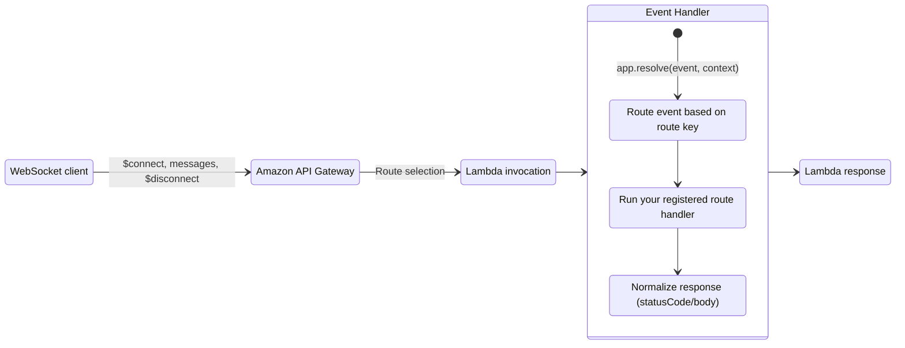
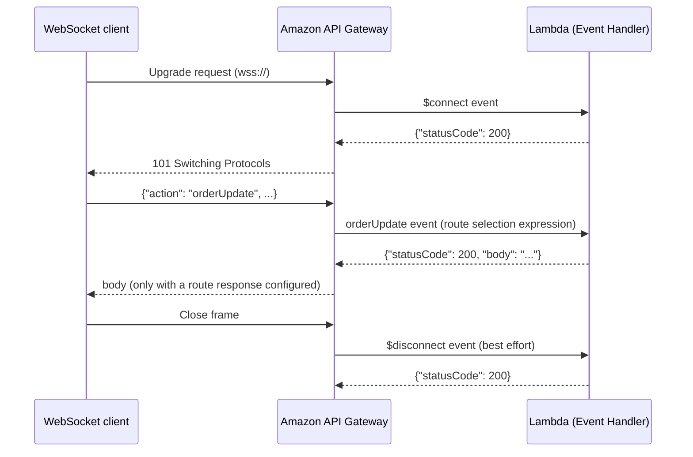
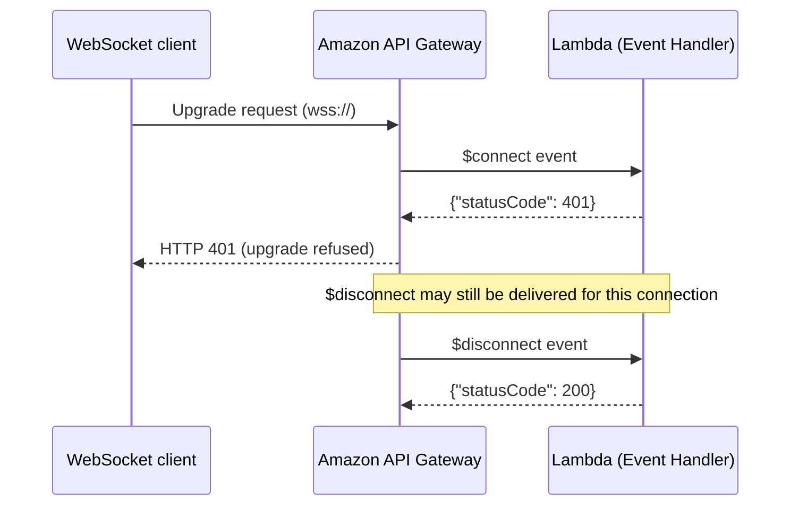

Event Handler for Amazon API Gateway WebSocket APIs.



## Key Features

* Route WebSocket events by route key with dedicated `$connect`, `$disconnect`, and `$default` decorators
* Automatic response normalization to the `statusCode`/`body` shape API Gateway expects
* Accept or reject connections from your `$connect` handler with a status code
* Exception handling with a safety net that prevents stack traces from reaching connected clients
* No dependencies beyond the standard library — routing works with the core Powertools for AWS package

## Terminology

**[WebSocket API](https://docs.aws.amazon.com/apigateway/latest/developerguide/apigateway-websocket-api.html){target="_blank"}**. An API Gateway API type that maintains a persistent, bidirectional connection between clients and your backend. API Gateway manages the connections; your Lambda function receives one event per client message or lifecycle change.

**Route key**. The value API Gateway uses to select which route (and backend integration) handles a message. Lifecycle events use the predefined `$connect`, `$disconnect`, and `$default` route keys; your API can define custom route keys for application messages.

**[Route selection expression](https://docs.aws.amazon.com/apigateway/latest/developerguide/apigateway-websocket-api-develop-routes.html){target="_blank"}**. An API-level expression, commonly `$request.body.action`, that extracts the route key from each incoming message. Messages that don't match any custom route fall through to `$default`.

**Connection ID**. A unique identifier API Gateway assigns to each connection. After `$connect`, it is the only identity a message carries unless a Lambda authorizer is configured — treat it as the session key and look up anything else you need against it.

**[Route response](https://docs.aws.amazon.com/apigateway/latest/developerguide/apigateway-websocket-api-route-response.html){target="_blank"}**. Opt-in configuration that makes API Gateway deliver your handler's returned body back to the calling client. Without a route response on the route, returned bodies are discarded.

**[Lambda authorizer](https://docs.aws.amazon.com/apigateway/latest/developerguide/apigateway-websocket-api-lambda-auth.html){target="_blank"}**. An optional authorization step you configure on your API's `$connect` route. API Gateway invokes it before your handler; on success, it stores the authorizer's output with the connection and injects it into every subsequent invocation.

## Getting started

### Required resources

You need an API Gateway WebSocket API with its routes integrated with your Lambda function. The template below wires `$connect`, `$disconnect`, `$default`, and a custom `orderUpdate` route to a single function.

???+ warning "Returned bodies need a route response"
    A handler's returned body reaches the calling client only on routes with a **route response** configured. Without it, API Gateway silently discards the body. The template configures route responses on `orderUpdate` and `$default` so the replies in the examples below actually reach the client.

=== "getting_started_with_websocket_api.yaml"

    ```yaml hl_lines="27 50-80"
    --8<-- "examples/event_handler_api_gateway_websocket/sam/getting_started_with_websocket_api.yaml"
    ```

### Route decorators

Register handlers with `@app.on_connect()`, `@app.on_disconnect()`, `@app.on_default()`, or `@app.route("yourRouteKey")` for custom route keys. Handlers take no arguments; they access the request through `app.current_event` and return a value that becomes the Lambda response.

Route keys are matched exactly — API Gateway resolves the route key through the route selection expression before invoking your function, so there is nothing to pattern-match.

=== "getting_started_with_connect.py"

    ```python hl_lines="6 9 12 16"
    --8<-- "examples/event_handler_api_gateway_websocket/src/getting_started_with_connect.py"
    ```

    1. Headers and cookies are only available on `$connect` — later messages carry only the connection ID.
    2. Returning a non-2xx status code rejects the WebSocket upgrade.
    3. `None` normalizes to `{"statusCode": 200}`, accepting the connection.

=== "getting_started_with_disconnect.py"

    ```python hl_lines="6 9"
    --8<-- "examples/event_handler_api_gateway_websocket/src/getting_started_with_disconnect.py"
    ```

    1. `$disconnect` is delivered on a best-effort basis, including for connections whose `$connect` was rejected — don't assume your connect handler accepted this connection.

=== "getting_started_with_custom_route.py"

    ```python hl_lines="4 7 13"
    --8<-- "examples/event_handler_api_gateway_websocket/src/getting_started_with_custom_route.py"
    ```

    1. With the route selection expression `$request.body.action`, this handles messages like `{"action": "orderUpdate", "orderId": 123}`.
    2. Messages whose route key doesn't match any route fall through to `$default`.

### Response format

The resolver normalizes your handler's return value into the response shape API Gateway expects. Return a plain value, or a 2-tuple to set the status code:

| Handler returns | Lambda response |
| --------------- | --------------- |
| `None` | `{"statusCode": 200}` |
| `str` | `{"statusCode": 200, "body": <str>}` |
| `dict` / `list` | `{"statusCode": 200, "body": json.dumps(value)}` |
| 2-tuple `(value, status_code)` | status code from the tuple; body from `value` per the rules above |

A returned dict is always body content — it is never inspected for a `statusCode` key.

???+ note "`None` maps to 200, not an empty response"
    Unlike the REST resolver, `None` returns `{"statusCode": 200}` because `$connect` requires a status code, and accepting the connection is the only sensible default.

The status code has different effects depending on the route:

* **`$connect`**: the status code decides the connection — 2xx accepts the WebSocket upgrade, anything else rejects it.
* **All other routes**: the body is delivered back to the client only on routes with a [route response](#terminology), and a non-2xx status code does **not** drop the connection.

An event whose route key has no registered handler emits a `PowertoolsUserWarning` and returns `{"statusCode": 400}` — on `$connect`, that rejects the connection.

## Advanced

### Middleware

The resolver reuses the same middleware framework as the REST resolver. A middleware is a callable receiving the resolver instance and the next handler in the chain; it runs code before and/or after the route handler, and its return value goes through the same [response normalization](#response-format) as handler returns.

Execution order is: global middlewares (`app.use`), then route-level `middlewares=[...]`, then the route handler. Return without calling `next_middleware(app)` to short-circuit the chain; exceptions raised in middlewares follow the same [exception handling](#exception-handling) flow as handlers.

=== "working_with_middleware.py"

    ```python hl_lines="9 11 17 21 24"
    --8<-- "examples/event_handler_api_gateway_websocket/src/working_with_middleware.py"
    ```

    1. Middlewares receive the resolver instance and the next handler in the chain.
    2. Call `next_middleware(app)` to continue the chain; its return value is the route response.
    3. Short-circuit: the handler never runs and this value becomes the response.
    4. Global middlewares run on every event — including unmatched route keys — before route-level ones.
    5. Route-level middlewares run for this route only.

### Authentication patterns

`$connect` is the only route where credentials exist: headers and cookies are present on the WebSocket handshake only, and later messages carry nothing from the client but the connection ID. There are two ways to bridge that gap.

#### Lambda authorizer

Prefer a Lambda authorizer on `$connect` when you can run a separate authorizer function. API Gateway persists the authorizer's output with the connection and injects it into `request_context.authorizer` on **every** invocation for that connection — a managed connection-to-identity store, no code needed in your handlers beyond reading it.

=== "working_with_lambda_authorizer.py"

    ```python hl_lines="9 14-15"
    --8<-- "examples/event_handler_api_gateway_websocket/src/working_with_lambda_authorizer.py"
    ```

    1. Injected by API Gateway on every route for this connection — message routes, `$default`, and `$disconnect` included.
    2. Authorizer context values arrive stringified (a numeric `1` arrives as `"1"`).

#### Authenticating with middleware

Without a Lambda authorizer, authenticate on `$connect` with a middleware and persist identity against the connection ID in your own store; a second middleware resolves it on message routes and shares it via `app.append_context`.

=== "working_with_middleware_authentication.py"

    ```python hl_lines="6 13-14 16 25 29 39"
    --8<-- "examples/event_handler_api_gateway_websocket/src/working_with_middleware_authentication.py"
    ```

    1. Bring your own connection store. The in-memory dictionary keeps this example short — real invocations for one connection can hit different Lambda environments, so use an external store such as DynamoDB with a TTL.
    2. Headers only exist on `$connect`.
    3. Returning without calling `next_middleware` short-circuits the chain — the handler never runs and the connection is rejected.
    4. Handlers and later middlewares read it from `app.context`.

### Split routes with Router

As your API grows, group related route keys in separate files with `Router`, then include them in the resolver. `include_router` merges the router's routes, global middlewares (`use`), exception handlers, and context into the app. Inside a router file, access the request through the router instance — `router.current_event`, `router.lambda_context`, and `router.context`.

=== "working_with_router_orders.py"

    ```python hl_lines="3 8"
    --8<-- "examples/event_handler_api_gateway_websocket/src/working_with_router_orders.py"
    ```

    1. Use the router instance to access the current event inside router files.

=== "working_with_router.py"

    ```python hl_lines="1 7"
    --8<-- "examples/event_handler_api_gateway_websocket/src/working_with_router.py"
    ```

    1. Registers every route, middleware, and exception handler defined on the router.

### Exception handling

Register handlers for specific exception types with `@app.exception_handler`; it also accepts a list of types, and lookup respects inheritance. The handler receives the exception, and its return value goes through the same [response normalization](#response-format).

=== "working_with_exception_handling.py"

    ```python hl_lines="9 12 19"
    --8<-- "examples/event_handler_api_gateway_websocket/src/working_with_exception_handling.py"
    ```

    1. Also accepts a list of exception types, and matches subclasses of the registered type.
    2. The handler's return value goes through the same normalization as route handler returns.

???+ note "Unhandled exceptions never reach the client"
    An exception with no registered handler is logged and becomes a bare `{"statusCode": 500}`. If it propagated to the Lambda runtime instead, the runtime's error response — exception type, message, and stack trace — would be delivered to the connected client.

### Accessing the event and Lambda context

Inside handlers and middlewares, `app.current_event` is the current `APIGatewayWebSocketEvent` ([Event Source Data Classes](../../utilities/data_classes.md){target="_blank"} utility) and `app.lambda_context` is the Lambda context.

Use `app.append_context` / `app.context` to share data between middlewares and handlers within a single invocation — the context is cleared after each `resolve`.

=== "accessing_websocket_event_and_context.py"

    ```python hl_lines="9 13 14"
    --8<-- "examples/event_handler_api_gateway_websocket/src/accessing_websocket_event_and_context.py"
    ```

    1. Route, connection, and identity details live in `request_context`.
    2. `json_body` parses the message body; `body` and `decoded_body` are also available.
    3. The standard Lambda context object.

### Sending messages to connected clients

Returned bodies only reply to the **calling** client. To push a message to a client at any time — including after the invocation that received the request has long finished — call the API Gateway Management API's `PostToConnection` with the connection ID, against the endpoint the `callback_url` property gives you.

Capture `connection_id` and `callback_url` together at `$connect` and persist them: that record is everything **any** process needs to push to that client later.

The example shows both sending situations. Inside the resolver, `broadcast` pushes to every stored connection from the same invocation, building the client from the current event.

Outside it, `submitReport` acknowledges a long-running request immediately, and a **separate Lambda function** — for example the final state of a Step Functions workflow — pushes the finished result to the one client that asked, using the stored `callback_url`. Progress updates are that same call made mid-work.

A stale connection ID raises `GoneException` — the client is no longer connected, so treat it as a signal to remove that connection from your store. The posting function also needs the `execute-api:ManageConnections` IAM permission on `arn:aws:execute-api:{region}:{account}:{api-id}/{stage}/POST/@connections/*`.

=== "working_with_post_to_connection.py"

    ```python hl_lines="2 16 28 35 41"
    --8<-- "examples/event_handler_api_gateway_websocket/src/working_with_post_to_connection.py"
    ```

    1. The only thing the WebSocket resolver and the pushing function share.
    2. Captured at `$connect`: the only moment you get for free, and all anyone needs to post to this client later.
    3. Acknowledge immediately; the result is pushed by another function when it is ready. For the ack to reach the client, configure a route response on `submitReport`.
    4. Sending from inside the resolver: the current event provides the endpoint directly.

=== "working_with_post_to_connection_report_ready.py"

    ```python hl_lines="18 23"
    --8<-- "examples/event_handler_api_gateway_websocket/src/working_with_post_to_connection_report_ready.py"
    ```

    1. The stored `callback_url` rebuilds the Management API client in any execution environment.
    2. The client disconnected before the result was ready — remove it from the store.

=== "my_connection_store.py"

    ```python
    --8<-- "examples/event_handler_api_gateway_websocket/src/my_connection_store.py"
    ```

???+ note "Custom domain names"
    `callback_url` is built from the event's domain name. When clients connect through a custom domain whose API mapping path differs from the stage name, construct the endpoint yourself instead: `https://{api_id}.execute-api.{region}.amazonaws.com/{stage}`.

## Event Handler workflow

### Connection lifecycle

Connection accepted, message exchanged, connection closed.

<center>

</center>

### Rejected connection

Connection rejected by the `$connect` handler.

<center>

</center>

## Testing your code

Test your handlers by passing a WebSocket event payload to `app.resolve()` — no mocks of API Gateway needed.

=== "getting_started_with_testing.py"

    ```python
    --8<-- "examples/event_handler_api_gateway_websocket/src/getting_started_with_testing.py"
    ```

=== "getting_started_with_testing_event.json"

    ```json
    --8<-- "examples/event_handler_api_gateway_websocket/src/getting_started_with_testing_event.json"
    ```
