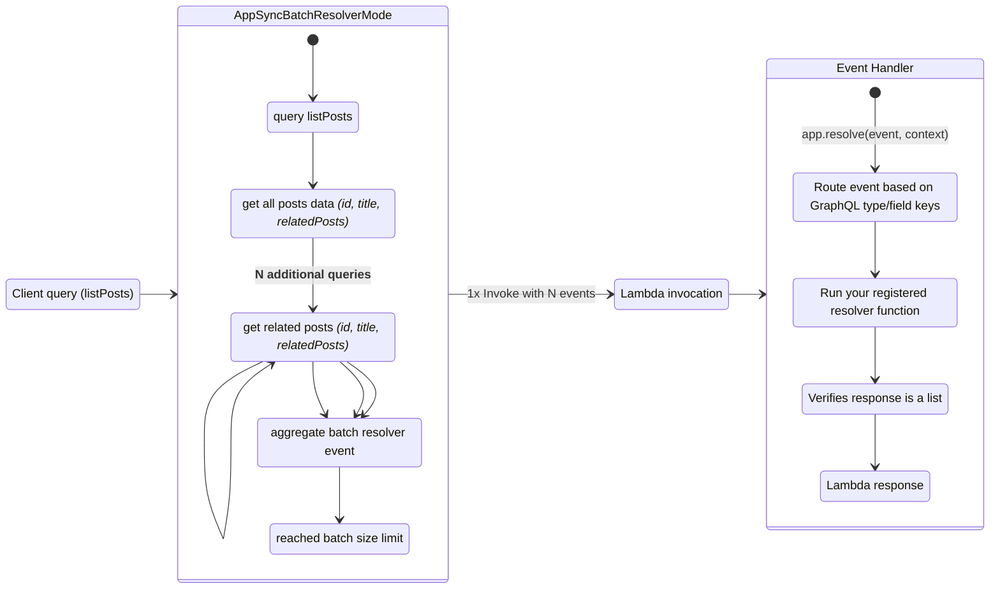
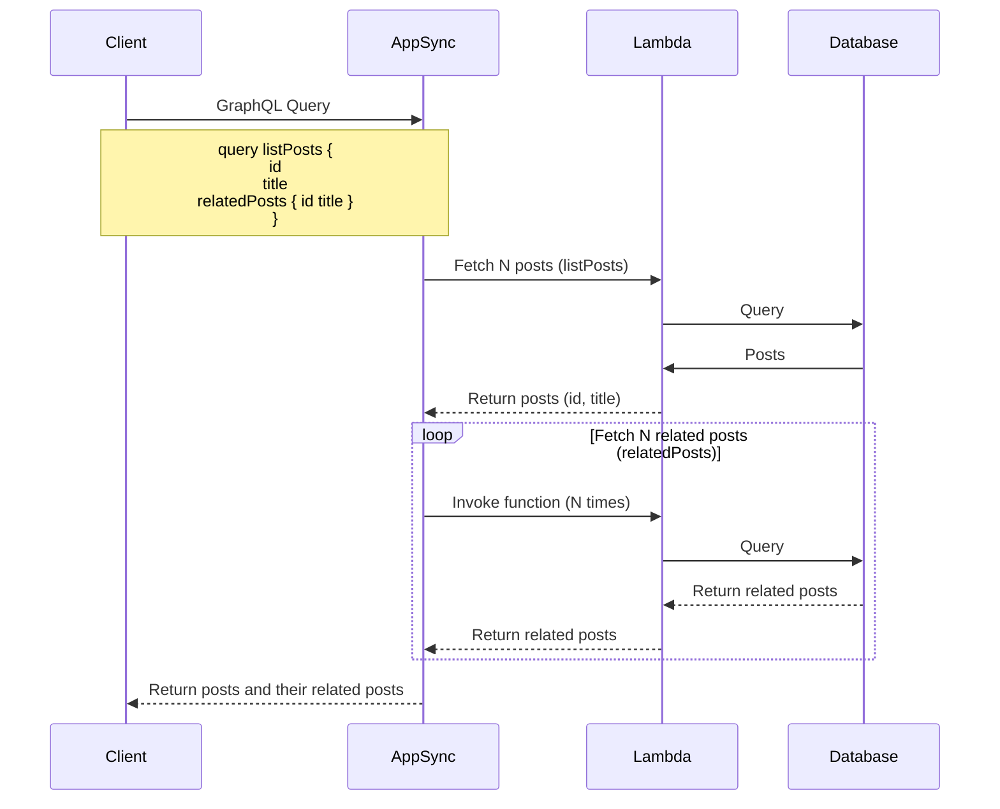
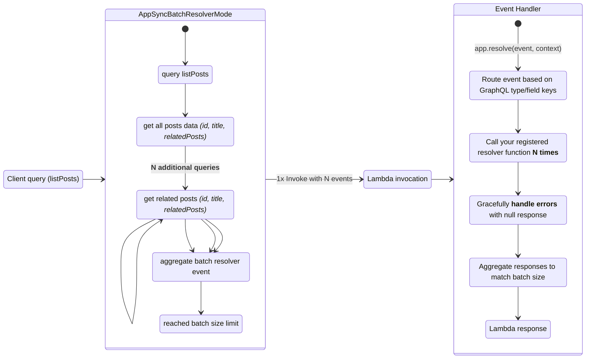
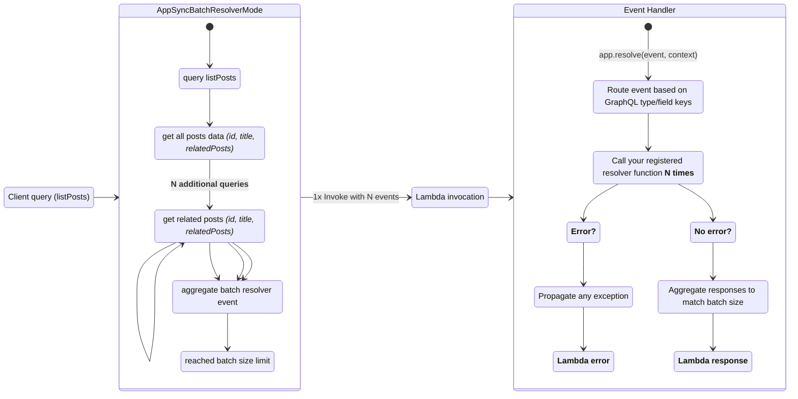

Event Handler for AWS AppSync and Amplify GraphQL Transformer.


## Key Features

* Choose between strictly match a GraphQL field name or all of them to a function
* Automatically parse API arguments to function arguments
* Integrates with [Event Source Data classes utilities](../../utilities/data_classes.md){target="_blank"} to access resolver and identity information
* Support async Python 3.8+ functions and generators

## Terminology

**[Direct Lambda Resolver](https://docs.aws.amazon.com/appsync/latest/devguide/direct-lambda-reference.html){target="_blank"}**. A custom AppSync Resolver to bypass the use of Apache Velocity Template (VTL) and automatically map your function's response to a GraphQL field.

**[Amplify GraphQL Transformer](https://docs.amplify.aws/cli/graphql-transformer/function){target="_blank"}**. Custom GraphQL directives to define your application's data model using Schema Definition Language _(SDL)_, _e.g., `@function`_. Amplify CLI uses these directives to convert GraphQL SDL into full descriptive AWS CloudFormation templates.

## Getting started

???+ tip "Tip: Designing GraphQL Schemas for the first time?"
    Visit [AWS AppSync schema documentation](https://docs.aws.amazon.com/appsync/latest/devguide/designing-your-schema.html){target="_blank"} to understand how to define types, nesting, and pagination.

### Required resources

You must have an existing AppSync GraphQL API and IAM permissions to invoke your Lambda function. That said, there is no additional permissions to use Event Handler as routing requires no dependency (_standard library_).

This is the sample infrastructure we are using for the initial examples with a AppSync Direct Lambda Resolver.

=== "getting_started_schema.graphql"

    ```typescript
    --8<-- "examples/event_handler_graphql/src/getting_started_schema.graphql"
    ```

=== "template.yaml"

    ```yaml hl_lines="59-60 71-72 94-95 104-105 112-113"
    --8<-- "examples/event_handler_graphql/sam/template.yaml"
    ```

### Resolver decorator

You can define your functions to match GraphQL types and fields with the `app.resolver()` decorator.

???+ question "What is a type and field?"
    A type would be a top-level **GraphQL Type** like `Query`, `Mutation`, `Todo`. A **GraphQL Field** would be `listTodos` under `Query`, `createTodo` under `Mutation`, etc.

Here's an example with two separate functions to resolve `getTodo` and `listTodos` fields within the `Query` type. For completion, we use [Scalar type utilities](#scalar-functions) to generate the right output based on our schema definition.

???+ important
    GraphQL arguments are passed as function keyword arguments.

    **Example**

    The GraphQL Query `getTodo(id: "todo_id_value")` will
    call `get_todo` as `get_todo(id="todo_id_value")`.

=== "getting_started_graphql_api_resolver.py"

    ```python hl_lines="7 15 25 27 28 37 39 47 49 60"
    --8<-- "examples/event_handler_graphql/src/getting_started_graphql_api_resolver.py"
    ```

=== "getting_started_schema.graphql"

    ```typescript hl_lines="7-9 13"
    --8<-- "examples/event_handler_graphql/src/getting_started_schema.graphql"
    ```

=== "sample events"

    === "getting_started_get_todo.json"

        ```json hl_lines="2-3 42"
        --8<-- "examples/event_handler_graphql/src/getting_started_get_todo.json"
        ```

    === "getting_started_list_todos.json"

        ```json hl_lines="2 40"
        --8<-- "examples/event_handler_graphql/src/getting_started_list_todos.json"
        ```

    === "getting_started_create_todo.json"

        ```json hl_lines="2 48 49"
        --8<-- "examples/event_handler_graphql/src/getting_started_create_todo.json"
        ```

### Scalar functions

When working with [AWS AppSync Scalar types](https://docs.aws.amazon.com/appsync/latest/devguide/scalars.html){target="_blank"}, you might want to generate the same values for data validation purposes.

For convenience, the most commonly used values are available as functions within `scalar_types_utils` module.

```python hl_lines="1-6" title="Creating key scalar values with scalar_types_utils"
--8<-- "examples/event_handler_graphql/src/scalar_functions.py"
```

Here's a table with their related scalar as a quick reference:

| Scalar type      | Scalar function                    | Sample value                           |
| ---------------- | ---------------------------------- | -------------------------------------- |
| **ID**           | `scalar_types_utils.make_id`       | `e916c84d-48b6-484c-bef3-cee3e4d86ebf` |
| **AWSDate**      | `scalar_types_utils.aws_date`      | `2022-07-08Z`                          |
| **AWSTime**      | `scalar_types_utils.aws_time`      | `15:11:00.189Z`                        |
| **AWSDateTime**  | `scalar_types_utils.aws_datetime`  | `2022-07-08T15:11:00.189Z`             |
| **AWSTimestamp** | `scalar_types_utils.aws_timestamp` | `1657293060`                           |

## Advanced

### Nested mappings

???+ note

    The following examples use a more advanced schema. These schemas differ from [initial sample infrastructure we used earlier](#required-resources).

You can nest `app.resolver()` decorator multiple times when resolving fields with the same return value.

=== "nested_mappings.py"

    ```python hl_lines="4 11 21 22 24 31"
    --8<-- "examples/event_handler_graphql/src/nested_mappings.py"
    ```

=== "nested_mappings_schema.graphql"

    ```typescript hl_lines="6 20"
    --8<-- "examples/event_handler_graphql/src/nested_mappings_schema.graphql"
    ```

### Async functions

For Lambda Python3.8+ runtime, this utility supports async functions when you use in conjunction with `asyncio.run`.

```python hl_lines="6 15 25 26 35 37" title="Resolving GraphQL resolvers async"
--8<-- "examples/event_handler_graphql/src/async_resolvers.py"
```

### Amplify GraphQL Transformer

Assuming you have [Amplify CLI installed](https://docs.amplify.aws/cli/start/install){target="_blank"}, create a new API using `amplify add api` and use the following GraphQL Schema.

<!-- AppSync resolver decorator is a concise way to create lambda functions to handle AppSync resolvers for multiple `typeName` and `fieldName` declarations. -->

```typescript hl_lines="7 15 20 22" title="Example GraphQL Schema"
--8<-- "examples/event_handler_graphql/src/amplify_graphql_transformer_schema.graphql"
```

[Create two new basic Python functions](https://docs.amplify.aws/cli/function#set-up-a-function){target="_blank"} via `amplify add function`.

???+ note
    Amplify CLI generated functions use `Pipenv` as a dependency manager. Your function source code is located at **`amplify/backend/function/your-function-name`**.

Within your function's folder, add Powertools for AWS Lambda (Python) as a dependency with `pipenv install aws-lambda-powertools`.

Use the following code for `merchantInfo` and `searchMerchant` functions respectively.

=== "graphql_transformer_merchant_info.py"

    ```python hl_lines="4 7 23 24 29 30 37"
    --8<-- "examples/event_handler_graphql/src/graphql_transformer_merchant_info.py"
    ```

=== "graphql_transformer_search_merchant.py"

    ```python hl_lines="4 7 22 23 37 43"
    --8<-- "examples/event_handler_graphql/src/graphql_transformer_search_merchant.py"
    ```

=== "graphql_transformer_list_locations.json"

    ```json hl_lines="2-7"
    --8<-- "examples/event_handler_graphql/src/graphql_transformer_list_locations.json"
    ```

=== "graphql_transformer_common_field.json"

    ```json hl_lines="2 3"
    --8<-- "examples/event_handler_graphql/src/graphql_transformer_common_field.json"
    ```

=== "graphql_transformer_find_merchant.json"

    ```json hl_lines="2-6"
    --8<-- "examples/event_handler_graphql/src/graphql_transformer_find_merchant.json"
    ```

### Custom data models

You can subclass [AppSyncResolverEvent](../../utilities/data_classes.md#appsync-resolver){target="_blank"} to bring your own set of methods to handle incoming events, by using `data_model` param in the `resolve` method.

=== "custom_models.py.py"

    ```python hl_lines="4 8-10 26-28 31 32 39 46"
    --8<-- "examples/event_handler_graphql/src/custom_models.py"
    ```

=== "nested_mappings_schema.graphql"

    ```typescript hl_lines="6 20"
    --8<-- "examples/event_handler_graphql/src/nested_mappings_schema.graphql"
    ```

=== "graphql_transformer_list_locations.json"

    ```json hl_lines="18-19"
     --8<-- "examples/event_handler_graphql/src/graphql_transformer_list_locations.json"
    ```

### Split operations with Router

???+ tip
    Read the **[considerations section for trade-offs between monolithic and micro functions](./api_gateway.md#considerations){target="_blank"}**, as it's also applicable here.

As you grow the number of related GraphQL operations a given Lambda function should handle, it is natural to split them into separate files to ease maintenance - That's when the `Router` feature comes handy.

Let's assume you have `split_operation.py` as your Lambda function entrypoint and routes in `split_operation_module.py`. This is how you'd use the `Router` feature.

=== "split_operation_module.py"

    We import **Router** instead of **AppSyncResolver**; syntax wise is exactly the same.

  	```python hl_lines="4 9 19 20"
    --8<-- "examples/event_handler_graphql/src/split_operation_module.py"
  	```

=== "split_operation.py"

  	We use `include_router` method and include all `location` operations registered in the `router` global object.

    ```python hl_lines="1 11"
    --8<-- "examples/event_handler_graphql/src/split_operation.py"
    ```

#### Sharing contextual data

You can use `append_context` when you want to share data between your App and Router instances. Any data you share will be available via the `context` dictionary available in your App or Router context.

???+ info
    For safety, we always clear any data available in the `context` dictionary after each invocation.

???+ tip
    This can also be useful for middlewares injecting contextual information before a request is processed.

=== "split_route_append_context.py"

	```python hl_lines="17"
    --8<-- "examples/event_handler_graphql/src/split_operation_append_context.py"
	```

=== "split_route_append_context_module.py"

	```python hl_lines="23"
    --8<-- "examples/event_handler_graphql/src/split_operation_append_context_module.py"
	```

### Batch processing



<em><center>Batch resolvers mechanics: visualizing N+1 in `relatedPosts` field.</center></em>

#### Understanding N+1 problem

When AWS AppSync has [batching enabled for Lambda Resolvers](https://docs.aws.amazon.com/appsync/latest/devguide/tutorial-lambda-resolvers.html#advanced-use-case-batching){target="_blank"}, it will group as many requests as possible before invoking your Lambda invocation. Effectively solving the [N+1 problem in GraphQL](https://aws.amazon.com/blogs/mobile/introducing-configurable-batching-size-for-aws-appsync-lambda-resolvers/){target="_blank"}.

For example, say you have a query named `listPosts`. For each post, you also want `relatedPosts`. **Without batching**, AppSync will:

1. Invoke your Lambda function to get the first post
2. Invoke your Lambda function for each related post
3. Repeat 1 until done



#### Batch resolvers

You can use `@batch_resolver` or `@async_batch_resolver` decorators to receive the entire batch of requests.

In this mode, you must return results in the same order of your batch items, so AppSync can associate the results back to the client.

=== "getting_started_with_batch_resolver.py"
  	```python hl_lines="5 9 23"
    --8<-- "examples/event_handler_graphql/src/getting_started_with_batch_resolver.py"
  	```

    1. The entire batch is sent to the resolver. You need to iterate through it to process all records.
    2. We use `post_id` as our unique identifier of the GraphQL request.

=== "getting_started_with_batch_resolver_payload.json"
  	```json hl_lines="4 16 21 29 41 46"
    --8<-- "examples/event_handler_graphql/src/getting_started_with_batch_resolver_payload.json"
  	```

=== "getting_started_with_batch_query.graphql"
  	```typescript hl_lines="4 16 21 29 41 46"
    --8<-- "examples/event_handler_graphql/src/getting_started_with_batch_query.graphql"
  	```

#### Processing items individually



<em><center>Batch resolvers: reducing Lambda invokes but fetching data N times (similar to single resolver).</center></em>

In rare scenarios, you might want to process each item individually, trading ease of use for increased latency as you handle one batch item at a time.

You can toggle `aggregate` parameter in `@batch_resolver` decorator for your resolver function to be called N times.

!!! note "This does not resolve the N+1 problem, but shifts it to the Lambda runtime."

In this mode, we will:

1. Aggregate each response we receive from your function in the exact order it receives
2. Gracefully handle errors by adding `None` in the final response for each batch item that failed processing
    * You can customize `nul` or error responses back to the client in the [AppSync resolver mapping templates](https://docs.aws.amazon.com/appsync/latest/devguide/tutorial-lambda-resolvers.html#returning-individual-errors){target="_blank"}

=== "getting_started_with_batch_resolver_individual.py"
  	```python hl_lines="3 7 17"
    --8<-- "examples/event_handler_graphql/src/getting_started_with_batch_resolver_individual.py"
  	```

    1. You need to disable the aggregated event by using `aggregate` flag.
        The resolver receives and processes each record one at a time.

=== "getting_started_with_batch_resolver_payload.json"
  	```json hl_lines="4 16 21 29 41 46"
    --8<-- "examples/event_handler_graphql/src/getting_started_with_batch_resolver_payload.json"
  	```

=== "getting_started_with_batch_query.graphql"
  	```typescript hl_lines="4 16 21 29 41 46"
    --8<-- "examples/event_handler_graphql/src/getting_started_with_batch_query.graphql"
  	```

##### Raise on error



<em><center>Batch resolvers: reducing Lambda invokes but fetching data N times (similar to single resolver).</center></em>

You can toggle `raise_on_error` parameter in `@batch_resolver` to propagate any exception instead of gracefully returning `None` for a given batch item.

This is useful when you want to stop processing immediately in the event of an unhandled or unrecoverable exception.

=== "getting_started_with_batch_resolver_handling_error.py"
  	```python hl_lines="3 7 17"
    --8<-- "examples/event_handler_graphql/src/getting_started_with_batch_resolver_handling_error.py"
  	```

    1. You can enable enable the error handling by using `raise_on_error` flag.

=== "getting_started_with_batch_resolver_payload.json"
  	```json hl_lines="4 16 21 29 41 46"
    --8<-- "examples/event_handler_graphql/src/getting_started_with_batch_resolver_payload.json"
  	```

=== "getting_started_with_batch_query.graphql"
  	```typescript hl_lines="4 16 21 29 41 46"
    --8<-- "examples/event_handler_graphql/src/getting_started_with_batch_query.graphql"
  	```

#### Async

Similar to `@batch_resolver` explained in [batch resolvers](#batch-resolvers), you can use `async_batch_resolver` to handle async functions.

=== "getting_started_with_batch_async_resolver.py"
  	```python hl_lines="3 7 17"
    --8<-- "examples/event_handler_graphql/src/getting_started_with_batch_async_resolver.py"
  	```

=== "getting_started_with_batch_async_resolver_payload.json"
  	```json hl_lines="4 16 21 29 41 46"
    --8<-- "examples/event_handler_graphql/src/getting_started_with_batch_async_resolver_payload.json"
  	```

=== "getting_started_with_batch_query.graphql"
  	```typescript hl_lines="4 16 21 29 41 46"
    --8<-- "examples/event_handler_graphql/src/getting_started_with_batch_query.graphql"
  	```

## Testing your code

You can test your resolvers by passing a mocked or actual AppSync Lambda event that you're expecting.

You can use either `app.resolve(event, context)` or simply `app(event, context)`.

Here's an example of how you can test your synchronous resolvers:

=== "assert_graphql_response.py"

    ```python hl_lines="8 28 31"
    --8<-- "examples/event_handler_graphql/src/assert_graphql_response.py"
    ```

=== "assert_graphql_response_module.py"

    ```python hl_lines="11"
    --8<-- "examples/event_handler_graphql/src/assert_graphql_response_module.py"
    ```

=== "assert_graphql_response.json"

    ```json hl_lines="5"
    --8<-- "examples/event_handler_graphql/src/assert_graphql_response.json"
    ```

And an example for testing asynchronous resolvers. Note that this requires the `pytest-asyncio` package. This tests a specific async GraphQL operation.

???+ note
    Alternatively, you can continue call `lambda_handler` function synchronously as it'd run `asyncio.run` to await for the coroutine to complete.

=== "assert_async_graphql_response.py"

    ```python hl_lines="31"
    --8<-- "examples/event_handler_graphql/src/assert_async_graphql_response.py"
    ```

=== "assert_async_graphql_response_module.py"

    ```python hl_lines="15"
    --8<-- "examples/event_handler_graphql/src/assert_async_graphql_response_module.py"
    ```

=== "assert_async_graphql_response.json"

    ```json hl_lines="3 4"
    --8<-- "examples/event_handler_graphql/src/assert_async_graphql_response.json"
    ```
