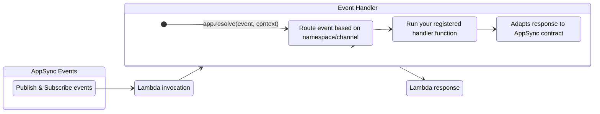

Event Handler for AWS AppSync real-time events.



## Key Features

* Easily handle publish and subscribe events with dedicated handler methods
* Automatic routing based on namespace and channel patterns
* Support for wildcard patterns to create catch-all handlers
* Process events in parallel or sequentially
* Control over event aggregation for batch processing
* Graceful error handling for individual events

## Terminology

**[AWS AppSync Events](https://docs.aws.amazon.com/appsync/latest/eventapi/event-api-welcome.html){target="_blank"}**. A service that enables you to quickly build secure, scalable real-time WebSocket APIs without managing infrastructure or writing API code. It handles connection management, message broadcasting, authentication, and monitoring, reducing time to market and operational costs.

## Getting started

???+ tip "Tip: New to AppSync Real-time API?"
    Visit [AWS AppSync Real-time documentation](https://docs.aws.amazon.com/appsync/latest/eventapi/event-api-getting-started.html){target="_blank"} to understand how to set up subscriptions and pub/sub messaging.

### Required resources

You must have an existing AppSync Events API with real-time capabilities enabled and IAM permissions to invoke your Lambda function. That said, there are no additional permissions required to use Event Handler as routing requires no dependency (_standard library_).

=== "getting_started_with_appsync_events.yaml"

    ```python hl_lines="5 10 12"
    --8<-- "examples/event_handler_appsync_events/src/getting_started_with_appsync_events.yaml"
    ```

### AppSync request and response format

AppSync Events uses a specific event format for Lambda requests and responses. In most scenarios, Powertools simplifies this interaction by automatically formatting resolver returns to match the expected AppSync response structure.

=== "appsync_payload_request.json"

    ```python hl_lines="5 10 12"
    --8<-- "examples/event_handler_appsync_events/src/appsync_payload_request.json"
    ```

=== "appsync_payload_response.json"

    ```python hl_lines="5 10 12"
    --8<-- "examples/event_handler_appsync_events/src/appsync_payload_response.json"
    ```

=== "appsync_payload_response_with_error.json"

    ```python hl_lines="5 10 12"
    --8<-- "examples/event_handler_appsync_events/src/appsync_payload_response_with_error.json"
    ```

#### Events response with error

When processing events with Lambda, you can return errors to AppSync in three ways:

* **Error per item:** Return an `error` key within each individual item's response. AppSync Events expects this format for item-specific errors.
* **Fail entire request:** Return a JSON object with a top-level `error` key. This signals a general failure, and AppSync treats the entire request as unsuccessful.
* **Unauthorized exception**: Raise the **UnauthorizedException** exception to reject a subscribe or publish request with HTTP 403.

### Resolver decorator

???+ important
    The event handler automatically parses the incoming event data and invokes the appropriate handler based on the namespace/channel pattern you register.

You can define your handlers for different event types using the `app.on_publish()`, `app.async_on_publish()`, and `app.on_subscribe()` methods.

=== "getting_started_with_publish_events.py"

    ```python hl_lines="5 10 12"
    --8<-- "examples/event_handler_appsync_events/src/getting_started_with_publish_events.py"
    ```

=== "getting_started_with_subscribe_events.py"

    ```python hl_lines="5 6 13"
    --8<-- "examples/event_handler_appsync_events/src/getting_started_with_subscribe_events.py"
    ```

## Advanced

### Wildcard patterns and handler precedence

You can use wildcard patterns to create catch-all handlers for multiple channels or namespaces. This is particularly useful for centralizing logic that applies to multiple channels.

When multiple handlers could match the same event, the most specific pattern takes precedence.

=== "working_with_wildcard_resolvers.py"

    ```python hl_lines="5 6 13"
    --8<-- "examples/event_handler_appsync_events/src/working_with_wildcard_resolvers.py"
    ```

???+ note "Supported wildcard patterns"
    Only the following patterns are supported:

    * `/namespace/*` - Matches all channels in the specified namespace
    * `/*` - Matches all channels in all namespaces

    Patterns like `/namespace/channel*` or `/namespace/*/subpath` are not supported.

    More specific routes will always take precedence over less specific ones. For example, `/default/channel1` will take precedence over `/default/*`, which will take precedence over `/*`.

### Aggregated processing

???+ note "Aggregate Processing"
    When `aggregate=True`, your handler receives a list of all events, requiring you to manage the response format. Ensure your response includes results for each event in the expected [AppSync Request and Response Format](#appsync-request-and-response-format).

In some scenarios, you might want to process all events for a channel as a batch rather than individually. This is useful when you need to:

* Optimize database operations by making a single batch query
* Ensure all events are processed together or not at all
* Apply custom error handling logic for the entire batch

You can enable this with the `aggregate` parameter:

=== "working_with_aggregated_events.py"

    ```python hl_lines="5 6 13"
    --8<-- "examples/event_handler_appsync_events/src/working_with_aggregated_events.py"
    ```

### Handling errors

You can filter or reject events by throwing exceptions in your resolvers or by formatting the payload according to the expected response structure. This instructs AppSync not to propagate that specific message, so subscribers will not receive the corresponding message.

#### Handling errors with individual items

When processing items individually with `aggregate=False`, you can raise an exception to fail a specific item. When an exception is raised, the Event Handler will catch it and include the exception name and message in the response.

=== "working_with_error_handling.py"

    ```python hl_lines="5 6 13"
    --8<-- "examples/event_handler_appsync_events/src/working_with_error_handling.py"
    ```

=== "working_with_error_handling_response.json"

    ```python hl_lines="5 6 13"
    --8<-- "examples/event_handler_appsync_events/src/working_with_error_handling_response.json"
    ```

#### Handling errors with batch of items

When processing batch of items with `aggregate=False`, you can must format the payload according the expected response.

=== "working_with_error_handling.py"

    ```python hl_lines="5 6 13"
    --8<-- "examples/event_handler_appsync_events/src/working_with_error_handling.py"
    ```

=== "working_with_error_handling_response.json"

    ```python hl_lines="5 6 13"
    --8<-- "examples/event_handler_appsync_events/src/working_with_error_handling_response.json"
    ```

#### Rejecting the entire request

??? warning "Raising `UnauthorizedException` will cause the Lambda invocation to fail."

You can also reject the entire payload by raising an `UnauthorizedException`. This prevents Powertools from processing any messages and causes the Lambda invocation to fail, returning an error to AppSync.

=== "working_with_error_handling.py"

    ```python hl_lines="5 6 13"
    --8<-- "examples/event_handler_appsync_events/src/working_with_error_handling.py"
    ```

=== "working_with_error_handling_response.json"

    ```python hl_lines="5 6 13"
    --8<-- "examples/event_handler_appsync_events/src/working_with_error_handling_response.json"
    ```

### Processing events with async resolvers

Use the `@app.async_on_publish()` decorator to process events asynchronously.

We use `asyncio` module to support async functions, and we ensure reliable execution by managing the event loop.

???+ note "Events order and AppSync Events"
    AppSync does not rely on event order. As long as each event includes the original `id`, AppSync processes them correctly regardless of the order in which they are received.

=== "working_with_async_resolvers.py"

    ```python hl_lines="5 6 13"
    --8<-- "examples/event_handler_appsync_events/src/working_with_async_resolvers.py"
    ```

### Accessing Lambda context and event

You can access to the original Lambda event or context for additional information. These are accessible via the app instance:

=== "accessing_event_and_context.py"

    ```python hl_lines="5 6 13"
    --8<-- "examples/event_handler_appsync_events/src/accessing_event_and_context.py"
    ```

## Testing your code

You can test your event handlers by passing a mocked or actual AppSync Events Lambda event.

### Testing publish events

=== "getting_started_with_testing_publish.py"

    ```python hl_lines="5 6 13"
    --8<-- "examples/event_handler_appsync_events/src/getting_started_with_testing_publish.py"
    ```

=== "getting_started_with_testing_publish_event.json"

    ```python hl_lines="5 6 13"
    --8<-- "examples/event_handler_appsync_events/src/getting_started_with_testing_publish_event.json"
    ```

### Testing subscribe events

=== "getting_started_with_testing_subscribe.py"

    ```python hl_lines="5 6 13"
    --8<-- "examples/event_handler_appsync_events/src/getting_started_with_testing_subscribe.py"
    ```

=== "getting_started_with_testing_subscribe_event.json"

    ```python hl_lines="5 6 13"
    --8<-- "examples/event_handler_appsync_events/src/getting_started_with_testing_subscribe_event.json"
    ```
