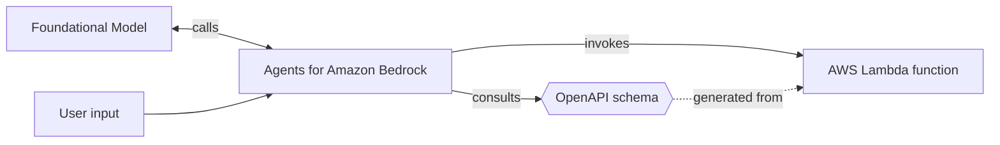

Author [Agents for Amazon Bedrock](https://aws.amazon.com/bedrock/agents/) with an event handler and auto generation of OpenAPI schemas.



## Key features

* Same declarative syntax as the [other event handler resolvers](api_gateway.md)
* Drastic reduction of the boilerplate to build Agents for Amazon Bedrock
* Automatic generation of [OpenAPI schemas](https://www.openapis.org/){target="_blank"} from your business logic code
* Built-in data validation for requests and responses

## Terminology

**Action group** is lorem ipsum

**Another term** is another thing totally different

## Getting started

To build Agents for Amazon Bedrock, you need:

* Create the Lambda function that defines the business logic for the action that your agent carries out.
* Create an OpenAPI schema with the API description, structure, and parameters for the action group.
* Ensure that Amazon Bedrock and your Lambda functions have the [necessary permissions](https://docs.aws.amazon.com/bedrock/latest/userguide/agents-permissions.html).

Powertools for AWS Lambda makes it easier to author the Lambda function and the creation of the OpenAPI schema.

### Install

!!! info "This is unnecessary if you're installing Powertools for AWS Lambda (Python) via [Lambda Layer/SAR](../../index.md#lambda-layer){target="_blank"}."

You need to add `pydantic` as a dependency in your preferred tool _e.g., requirements.txt, pyproject.toml_.

At this time, we support both Pydantic V1 and V2. For a future major version, we will only support Pydantic V2.

### Required resources

SAM example here otherwise it's not enough to say "create a Lambda function".

#### IAM permissions

A table explaining the required permissions, summarizing the official AWS docs

### Your first Agent

To create an Agent for Amazon Bedrock, use the `BedrockAgentResolver` to annotate your actions.
This is similar to the way [all the other Event Handler](api_gateway.md) resolvers work.

=== "Lambda handler"

    ```python hl_lines="4 9 12 21"
    --8<-- "examples/event_handler_bedrock_agents/src/getting_started.py"
    ```

	1. `description` is a recommended field that should contain a human readable descriptin of your action
	2. We take care of **parsing**, **validating**, **routing** and **responding** to the request.

=== "Input payload"

	```json hl_lines="7 9 16"
	--8<-- "examples/event_handler_bedrock_agents/src/getting_started.json"
	```

=== "Output payload"

	```json hl_lines="12-14"
	--8<-- "examples/event_handler_bedrock_agents/src/getting_started_output.json"
	```

!!! note "It's important to include a `description` for each API endpoint because reasons"

The resolvers used by Agents for Amazon Bedrock are compatible with the full suite of Powertools for AWS Lambda utilities.
This includes [Logger](../logger.md), [Metrics](../metrics.md) and [Tracer](../tracer.md).

### Validating parameters

Add an example for validating parameters like EmailStr from Pydantic.

### Generating OpenAPI schemas

Use the `get_openapi_json_schema` function provided by the resolver.
This function will produce a JSON-serialized string that represents your OpenAPI schema.
You can print this string or save it to a file for future reference.

=== "Generating the OpenAPI schema"

    ```python hl_lines="24 25"
    --8<-- "examples/event_handler_bedrock_agents/src/generating_openapi_schema.py"
    ```

	1. This ensures that it's only executed when running the file directly, and not when running on the Lambda runtime.
    2. You can use [additional options](#customizing-openapi-metadata) to customize the OpenAPI schema.

=== "OpenAPI schema"

    ```json hl_lines="13 16 24"
    --8<-- "examples/event_handler_bedrock_agents/src/generating_openapi_schema.json"
    ```

To get the OpenAPI schema, run the Python script from your terminal.
The script will generate the schema directly to standard output, which you can redirect to a file.

```sh
python app.py > schema.json
```

### Creating your Agent on the AWS Console

To create an Agent for Amazon Bedrock, refer to the [official documentation](https://docs.aws.amazon.com/bedrock/latest/userguide/agents-create.html) provided by AWS.

The following video demonstrates the end-to-end process:

During the creation process, you can use the schema generated in the previous step when prompted for an OpenAPI specification.

## Advanced

### Additional metadata

To enrich the view that Agents for Amazon Bedrock has of your Lambda functions,
use a combination of [Pydantic Models](https://docs.pydantic.dev/latest/concepts/models/){target="_blank"} and [OpenAPI](https://www.openapis.org/){target="_blank"} type annotations to add constraints to your APIs parameters.

--8<-- "docs/core/event_handler/_openapi_customization_intro.md"

#### Customizing OpenAPI parameters

--8<-- "docs/core/event_handler/_openapi_customization_parameters.md"

#### Customizing API operations

--8<-- "docs/core/event_handler/_openapi_customization_operations.md"

To implement these customizations, include extra parameters when defining your routes:

```python hl_lines="14-23 25" title="customizing_api_operations.py"
--8<-- "examples/event_handler_bedrock_agents/src/customizing_api_operations.py"
```

#### Customizing OpenAPI metadata

--8<-- "docs/core/event_handler/_openapi_customization_metadata.md"

Include extra parameters when exporting your OpenAPI specification to apply these customizations:

=== "customizing_api_metadata.py"

    ```python hl_lines="25-31"
    --8<-- "examples/event_handler_bedrock_agents/src/customizing_api_metadata.py"
    ```

### Data validation

The Agents for Amazon Bedrock resolver allows for the clear definition of the expected format for incoming data and responses.
By delegating data validation tasks to Powertools for AWS Lambda, you can significantly reduce the amount of repetitive code in your project.

For detailed guidance on implementing this feature, see the [REST API validation documentation](api_gateway.md#data-validation).
There, you'll find step-by-step instructions on how to apply data validation when using the resolver.

???+ note
	When using the Agent for Amazon Bedrock resolver, there's no need to add the `enable_validation` parameter, as it's enabled by default.

## Testing your code

Test your routes by passing an [Agent for Amazon Bedrock proxy event](https://docs.aws.amazon.com/bedrock/latest/userguide/agents-lambda.html#agents-lambda-input) request:

=== "assert_bedrock_agent_response.py"

	```python hl_lines="21-23"
	--8<-- "examples/event_handler_bedrock_agents/src/assert_bedrock_agent_response.py"
	```

=== "assert_bedrock_agent_response_module.py"

	```python
	--8<-- "examples/event_handler_bedrock_agents/src/assert_bedrock_agent_response_module.py"
	```
