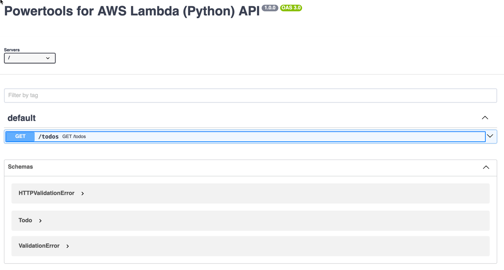
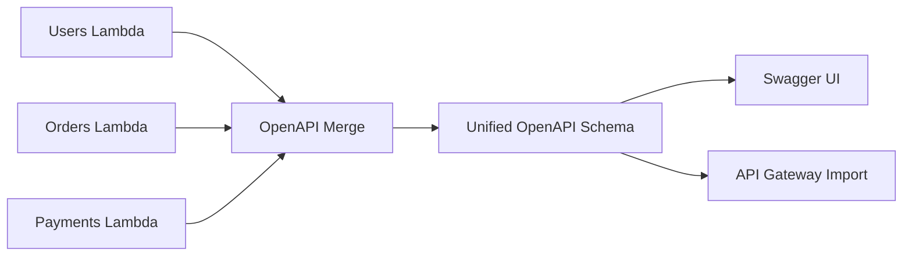

<!-- markdownlint-disable MD043 -->

Powertools for AWS Lambda supports automatic OpenAPI schema generation from your route definitions and type annotations. This includes Swagger UI integration, schema customization, and OpenAPI Merge for micro-functions architectures.

## Key features

* **Automatic schema generation** from Pydantic models and type annotations
* **Swagger UI** for interactive API documentation
* **OpenAPI Merge** for generating unified schemas from multiple Lambda handlers
* **Security schemes** support (OAuth2, API Key, HTTP auth, etc.)
* **Customizable** metadata, operations, and parameters

## Swagger UI

Behind the scenes, the [data validation](api_gateway.md#data-validation) feature auto-generates an OpenAPI specification from your routes and type annotations. You can use [Swagger UI](https://swagger.io/tools/swagger-ui/){target="_blank" rel="nofollow"} to visualize and interact with your API.

!!! note "This feature requires [data validation](api_gateway.md#data-validation) to be enabled."

???+ warning "Important caveats"
    | Caveat | Description |
    | ------ | ----------- |
    | Swagger UI is **publicly accessible by default** | Implement a [custom middleware](#customizing-swagger-ui) for authorization |
    | You need to expose a **new route** | Expose `/swagger` path to Lambda |
    | JS and CSS files are **embedded within Swagger HTML** | Consider enabling `compress` option for better performance |
    | Authorization data is **lost** on browser close/refresh | Use `enable_swagger(persist_authorization=True)` to persist |

=== "enabling_swagger.py"

    ```python hl_lines="12-13"
    --8<-- "examples/event_handler_rest/src/enabling_swagger.py"
    ```

    1. `enable_swagger` creates a route to serve Swagger UI and allows quick customizations.

Here's an example of what it looks like by default:



### Customizing Swagger UI

The Swagger UI appears by default at the `/swagger` path, but you can customize this to serve the documentation from another path and specify the source for Swagger UI assets.

=== "customizing_swagger.py"

    ```python hl_lines="10"
    --8<-- "examples/event_handler_rest/src/customizing_swagger.py"
    ```

=== "customizing_swagger_middlewares.py"

    Use middleware for security headers, authentication, or other request processing.

    ```python hl_lines="7 13-18 21"
    --8<-- "examples/event_handler_rest/src/customizing_swagger_middlewares.py"
    ```

## Customization

### Customizing parameters

--8<-- "docs/core/event_handler/_openapi_customization_parameters.md"

### Customizing operations

--8<-- "docs/core/event_handler/_openapi_customization_operations.md"

To implement these customizations, include extra parameters when defining your routes:

=== "customizing_api_operations.py"

    ```python hl_lines="11-20"
    --8<-- "examples/event_handler_rest/src/customizing_api_operations.py"
    ```

### Customizing metadata

--8<-- "docs/core/event_handler/_openapi_customization_metadata.md"

Include extra parameters when exporting your OpenAPI specification:

=== "customizing_api_metadata.py"

    ```python hl_lines="8-16"
    --8<-- "examples/event_handler_rest/src/customizing_api_metadata.py"
    ```

### Security schemes

???- info "Does Powertools implement any of the security schemes?"
    No. Powertools adds support for generating OpenAPI documentation with [security schemes](https://swagger.io/docs/specification/authentication/), but you must implement the security mechanisms separately.

Security schemes are declared at the top-level first, then referenced globally or per operation.

=== "Global security schemes"

    ```python hl_lines="17-27"
    --8<-- "examples/event_handler_rest/src/security_schemes_global.py"
    ```

    1. Using the oauth security scheme defined earlier, scoped to the "admin" role.

=== "Per operation security"

    ```python hl_lines="17-26 30"
    --8<-- "examples/event_handler_rest/src/security_schemes_per_operation.py"
    ```

    1. Using the oauth security scheme scoped to the "admin" role.

=== "Optional security per route"

    ```python hl_lines="17-26 35"
    --8<-- "examples/event_handler_rest/src/security_schemes_global_and_optional.py"
    ```

    1. An empty security requirement ({}) makes security optional for this route.

OpenAPI 3 supports these security schemes:

| Security Scheme | Type | Description |
| --------------- | ---- | ----------- |
| [HTTP auth](https://www.iana.org/assignments/http-authschemes/http-authschemes.xhtml){target="_blank"} | `HTTPBase` | HTTP authentication (Basic, Bearer) |
| [API keys](https://swagger.io/docs/specification/authentication/api-keys/){target="_blank"} | `APIKey` | API keys in headers, query strings or cookies |
| [OAuth 2](https://swagger.io/docs/specification/authentication/oauth2/){target="_blank"} | `OAuth2` | OAuth 2.0 authorization |
| [OpenID Connect](https://swagger.io/docs/specification/authentication/openid-connect-discovery/){target="_blank"} | `OpenIdConnect` | OpenID Connect Discovery |
| [Mutual TLS](https://swagger.io/specification/#security-scheme-object){target="_blank"} | `MutualTLS` | Client/server certificate authentication |

???- note "Using OAuth2 with Swagger UI?"
    Use `OAuth2Config` to configure a default OAuth2 app:

    ```python hl_lines="10 15-18 22"
    --8<-- "examples/event_handler_rest/src/swagger_with_oauth2.py"
    ```

### OpenAPI extensions

Define extensions using `openapi_extensions` parameter at Root, Servers, Operation, and Security Schemes levels.

???+ warning
    We do not support `x-amazon-apigateway-any-method` and `x-amazon-apigateway-integrations` extensions.

=== "working_with_openapi_extensions.py"

    ```python hl_lines="9 15 25 28"
    --8<-- "examples/event_handler_rest/src/working_with_openapi_extensions.py"
    ```

    1. Server level
    2. Operation level
    3. Security scheme level
    4. Root level

## OpenAPI Merge

OpenAPI Merge generates a unified OpenAPI schema from multiple Lambda handlers. This is designed for micro-functions architectures where each Lambda has its own resolver.

### Why OpenAPI Merge?

In a micro-functions architecture, each Lambda function handles a specific domain (users, orders, payments). Each has its own resolver with routes, but you need a single OpenAPI specification for documentation and API Gateway imports.



### How it works

OpenAPI Merge uses AST (Abstract Syntax Tree) analysis to detect resolver instances in your handler files. **No code is executed during discovery** - it's pure static analysis. This means:

* No side effects from importing handler code
* No Lambda cold starts
* No security concerns from arbitrary code execution
* Fast discovery across many files

???+ warning "Handler modules must be side-effect-free at import time"
    While discovery uses static analysis (AST), **schema generation requires importing your handler modules** to extract route definitions. If a handler module runs code at import time - such as validating environment variables, opening database connections, or calling external services — the import will fail silently and its routes will be missing from the final schema.

    If your schema is unexpectedly empty, check whether your handler files have decorators or top-level code that depends on runtime state. Move these to the handler function body or guard them with `if __name__ == "__main__"`.

### Discovery parameters

The `discover()` method accepts the following parameters:

| Parameter | Type | Default | Description |
| --------- | ---- | ------- | ----------- |
| `path` | `str` or `Path` | required | Root directory to search for handler files |
| `pattern` | `str` or `list[str]` | `"handler.py"` | Glob pattern(s) to match handler files |
| `exclude` | `list[str]` | `["**/tests/**", "**/__pycache__/**", "**/.venv/**"]` | Patterns to exclude from discovery |
| `resolver_name` | `str` | `"app"` | Variable name of the resolver instance in handler files |
| `recursive` | `bool` | `False` | Whether to search recursively in subdirectories |
| `project_root` | `str` or `Path` | Same as `path` | Root directory for resolving Python imports |

#### Pattern examples

Patterns use glob syntax:

| Pattern | Matches |
| ------- | ------- |
| `handler.py` | Files named exactly `handler.py` in the root directory |
| `*_handler.py` | Files ending with `_handler.py` (e.g., `users_handler.py`) |
| `**/*.py` | All Python files recursively (requires `recursive=True`) |
| `["handler.py", "api.py"]` | Multiple patterns |

#### Recursive search

By default, `recursive=False` searches only in the specified `path` directory. Set `recursive=True` to search subdirectories:

```python
# Only searches in ./src (not subdirectories)
merge.discover(path="./src", pattern="handler.py")

# Searches ./src and all subdirectories
merge.discover(path="./src", pattern="handler.py", recursive=True)

# Pattern with **/ also searches recursively
merge.discover(path="./src", pattern="**/handler.py")
```

#### Project root for imports

When handler files use absolute imports (e.g., `from myapp.utils.resolver import app`), set `project_root` to the directory that serves as the Python package root:

```python
merge.discover(
    path="./src/myapp/handlers",
    pattern="*.py",
    project_root="./src",  # Allows resolving "from myapp.x import y"
)
```

### Getting started example

Here's a typical micro-functions project structure and how to configure OpenAPI Merge:

```text
my-api/
├── functions/
│   ├── users/
│   │   └── handler.py      # app = APIGatewayRestResolver() with /users routes
│   ├── orders/
│   │   └── handler.py      # app = APIGatewayRestResolver() with /orders routes
│   ├── payments/
│   │   └── handler.py      # app = APIGatewayRestResolver() with /payments routes
│   └── docs/
│       └── handler.py      # Dedicated Lambda to serve unified OpenAPI docs
├── scripts/
│   └── generate_openapi.py # CI/CD script to generate openapi.json
└── template.yaml           # SAM/CloudFormation template
```

Each handler file defines its own resolver with domain-specific routes:

=== "functions/users/handler.py"

    ```python
    from aws_lambda_powertools.event_handler import APIGatewayRestResolver

    app = APIGatewayRestResolver(enable_validation=True)

    @app.get("/users")
    def list_users():
        return {"users": []}

    @app.get("/users/<user_id>")
    def get_user(user_id: str):
        return {"id": user_id, "name": "John"}

    def handler(event, context):
        return app.resolve(event, context)
    ```

=== "functions/orders/handler.py"

    ```python
    from aws_lambda_powertools.event_handler import APIGatewayRestResolver

    app = APIGatewayRestResolver(enable_validation=True)

    @app.get("/orders")
    def list_orders():
        return {"orders": []}

    @app.post("/orders")
    def create_order():
        return {"id": "order-123"}

    def handler(event, context):
        return app.resolve(event, context)
    ```

To generate a unified OpenAPI schema, you have two options:

=== "Option 1: CI/CD script"

    Generate `openapi.json` at build time:

    ```python
    # scripts/generate_openapi.py
    from pathlib import Path
    from aws_lambda_powertools.event_handler.openapi import OpenAPIMerge

    merge = OpenAPIMerge(
        title="My API",
        version="1.0.0",
        description="Unified API documentation",
    )

    merge.discover(
        path="./functions",
        pattern="handler.py",
        exclude=["**/docs/**"],  # Exclude the docs Lambda
        recursive=True,
    )

    output = Path("openapi.json")
    output.write_text(merge.get_openapi_json_schema())
    print(f"Generated {output}")
    ```

=== "Option 2: Dedicated docs Lambda"

    Serve Swagger UI from a dedicated Lambda:

    ```python
    # functions/docs/handler.py
    from aws_lambda_powertools.event_handler import APIGatewayRestResolver

    app = APIGatewayRestResolver()

    app.configure_openapi_merge(
        path="../",  # Parent directory containing other handlers
        pattern="handler.py",
        exclude=["**/docs/**"],
        recursive=True,
        title="My API",
        version="1.0.0",
    )

    app.enable_swagger(path="/")

    def handler(event, context):
        return app.resolve(event, context)
    ```

### Standalone class

Use `OpenAPIMerge` class to generate schemas. This is pure Python code where you control the paths and output.

=== "openapi_merge_standalone.py"

    ```python
    --8<-- "examples/event_handler_rest/src/openapi_merge_standalone.py"
    ```

=== "openapi_merge_with_exclusions.py"

    ```python
    --8<-- "examples/event_handler_rest/src/openapi_merge_with_exclusions.py"
    ```

=== "openapi_merge_multiple_patterns.py"

    ```python
    --8<-- "examples/event_handler_rest/src/openapi_merge_multiple_patterns.py"
    ```

### Resolver integration

Use `configure_openapi_merge()` on any resolver to serve merged schemas via Swagger UI. This is useful when you want a dedicated Lambda to serve the unified documentation.

=== "openapi_merge_resolver.py"

    ```python
    --8<-- "examples/event_handler_rest/src/openapi_merge_resolver.py"
    ```

???+ warning "Routes from other Lambdas are documentation only"
    The merged schema includes routes from all discovered handlers for documentation purposes. However, only routes defined in the current Lambda are actually executable. Other routes exist only in the OpenAPI spec - unless you configure API Gateway to route them to their respective Lambdas.

### Shared resolver pattern

In some architectures, instead of each handler file defining its own resolver, you have a central resolver file that is imported by multiple route files. Each route file registers its routes on the shared resolver instance.

```text
src/
├── myapp/
│   ├── resolver.py          # Defines: app = APIGatewayRestResolver()
│   ├── users_routes.py      # Imports app, registers /users routes
│   ├── orders_routes.py     # Imports app, registers /orders routes
│   └── payments_routes.py   # Imports app, registers /payments routes
```

OpenAPI Merge automatically detects this pattern. When you point `discover()` to the resolver file, it finds all files that import from it and loads them to ensure all routes are registered before extracting the schema.

=== "shared_resolver.py"

    ```python
    --8<-- "examples/event_handler_rest/src/openapi_merge_shared_resolver.py"
    ```

=== "shared_users_routes.py"

    ```python
    --8<-- "examples/event_handler_rest/src/openapi_merge_shared_users_routes.py"
    ```

=== "shared_orders_routes.py"

    ```python
    --8<-- "examples/event_handler_rest/src/openapi_merge_shared_orders_routes.py"
    ```

=== "Discovery"

    ```python
    --8<-- "examples/event_handler_rest/src/openapi_merge_shared_discovery.py"
    ```

### Conflict handling

When the same path+method is defined in multiple handlers, use `on_conflict` to control behavior:

| Strategy | Behavior |
| -------- | -------- |
| `warn` (default) | Log warning, keep first definition |
| `error` | Raise `OpenAPIMergeError` |
| `first` | Silently keep first definition |
| `last` | Use last definition (override) |

=== "openapi_merge_conflict.py"

    ```python
    --8<-- "examples/event_handler_rest/src/openapi_merge_conflict.py"
    ```

### Full configuration

=== "openapi_merge_full_config.py"

    ```python
    --8<-- "examples/event_handler_rest/src/openapi_merge_full_config.py"
    ```
