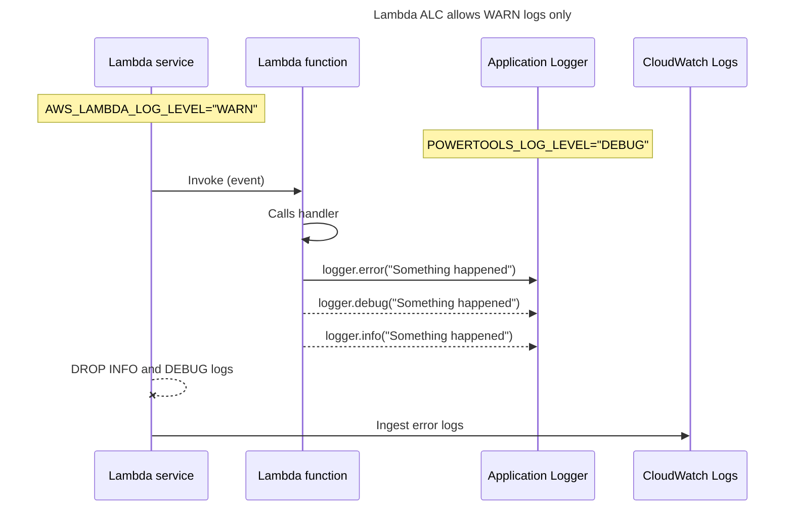
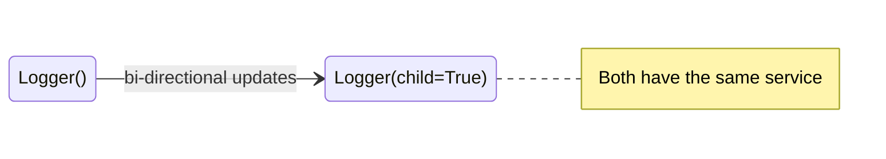

Logger provides an opinionated logger with output structured as JSON.

## Key features

* Capture key fields from Lambda context, cold start and structures logging output as JSON
* Log Lambda event when instructed (disabled by default)
* Log sampling enables DEBUG log level for a percentage of requests (disabled by default)
* Append additional keys to structured log at any point in time

## Getting started

???+ tip
    All examples shared in this documentation are available within the [project repository](https://github.com/aws-powertools/powertools-lambda-python/tree/develop/examples){target="_blank"}.

Logger requires two settings:

| Setting           | Description                                                         | Environment variable      | Constructor parameter |
| ----------------- | ------------------------------------------------------------------- | ------------------------- | --------------------- |
| **Logging level** | Sets how verbose Logger should be (INFO, by default)                | `POWERTOOLS_LOG_LEVEL`    | `level`               |
| **Service**       | Sets **service** key that will be present across all log statements | `POWERTOOLS_SERVICE_NAME` | `service`             |

There are some [other environment variables](#environment-variables) which can be set to modify Logger's settings at a global scope.

```yaml hl_lines="12-13" title="AWS Serverless Application Model (SAM) example"
--8<-- "examples/logger/sam/template.yaml"
```

### Standard structured keys

Your Logger will include the following keys to your structured logging:

| Key                        | Example                               | Note                                                                                                                                 |
| -------------------------- | ------------------------------------- | ------------------------------------------------------------------------------------------------------------------------------------ |
| **level**: `str`           | `INFO`                                | Logging level                                                                                                                        |
| **location**: `str`        | `collect.handler:1`                   | Source code location where statement was executed                                                                                    |
| **message**: `Any`         | `Collecting payment`                  | Unserializable JSON values are casted as `str`                                                                                       |
| **timestamp**: `str`       | `2021-05-03 10:20:19,650+0000`        | Timestamp with milliseconds, by default uses default AWS Lambda timezone (UTC)                                                       |
| **service**: `str`         | `payment`                             | Service name defined, by default `service_undefined`                                                                                 |
| **xray_trace_id**: `str`   | `1-5759e988-bd862e3fe1be46a994272793` | When [tracing is enabled](https://docs.aws.amazon.com/lambda/latest/dg/services-xray.html){target="_blank"}, it shows X-Ray Trace ID |
| **sampling_rate**: `float` | `0.1`                                 | When enabled, it shows sampling rate in percentage e.g. 10%                                                                          |
| **exception_name**: `str`  | `ValueError`                          | When `logger.exception` is used and there is an exception                                                                            |
| **exception**: `str`       | `Traceback (most recent call last)..` | When `logger.exception` is used and there is an exception                                                                            |

### Capturing Lambda context info

You can enrich your structured logs with key Lambda context information via `inject_lambda_context`.

=== "inject_lambda_context.py"

    ```python hl_lines="7"
    --8<-- "examples/logger/src/inject_lambda_context.py"
    ```

=== "inject_lambda_context_output.json"

    ```json hl_lines="8-12 17-20"
    --8<-- "examples/logger/src/inject_lambda_context_output.json"
    ```

When used, this will include the following keys:

| Key                             | Example                                                                                              |
| ------------------------------- | ---------------------------------------------------------------------------------------------------- |
| **cold_start**: `bool`          | `false`                                                                                              |
| **function_name** `str`         | `example-powertools-HelloWorldFunction-1P1Z6B39FLU73`                                                |
| **function_memory_size**: `int` | `128`                                                                                                |
| **function_arn**: `str`         | `arn:aws:lambda:eu-west-1:012345678910:function:example-powertools-HelloWorldFunction-1P1Z6B39FLU73` |
| **function_request_id**: `str`  | `899856cb-83d1-40d7-8611-9e78f15f32f4`                                                               |

### Logging incoming event

When debugging in non-production environments, you can instruct Logger to log the incoming event with `log_event` param or via `POWERTOOLS_LOGGER_LOG_EVENT` env var.

???+ warning
	This is disabled by default to prevent sensitive info being logged

```python hl_lines="7" title="Logging incoming event"
--8<-- "examples/logger/src/log_incoming_event.py"
```

### Setting a Correlation ID

You can set a Correlation ID using `correlation_id_path` param by passing a [JMESPath expression](https://jmespath.org/tutorial.html){target="_blank" rel="nofollow"}, including [our custom JMESPath Functions](../utilities/jmespath_functions.md#powertools_json-function).

???+ tip
	You can retrieve correlation IDs via `get_correlation_id` method.

=== "set_correlation_id.py"

    ```python hl_lines="7"
    --8<-- "examples/logger/src/set_correlation_id.py"
    ```

=== "set_correlation_id_event.json"

    ```json hl_lines="3"
    --8<-- "examples/logger/src/set_correlation_id_event.json"
    ```

=== "set_correlation_id_output.json"

    ```json hl_lines="12"
    --8<-- "examples/logger/src/set_correlation_id_output.json"
    ```

#### set_correlation_id method

You can also use `set_correlation_id` method to inject it anywhere else in your code. Example below uses [Event Source Data Classes utility](../utilities/data_classes.md){target="_blank"} to easily access events properties.

=== "set_correlation_id_method.py"

    ```python hl_lines="11"
    --8<-- "examples/logger/src/set_correlation_id_method.py"
    ```

=== "set_correlation_id_method.json"

    ```json hl_lines="3"
    --8<-- "examples/logger/src/set_correlation_id_method.json"
    ```

=== "set_correlation_id_method_output.json"

    ```json hl_lines="7"
    --8<-- "examples/logger/src/set_correlation_id_method_output.json"
    ```

#### Known correlation IDs

To ease routine tasks like extracting correlation ID from popular event sources, we provide [built-in JMESPath expressions](#built-in-correlation-id-expressions).

=== "set_correlation_id_jmespath.py"

    ```python hl_lines="2 8"
    --8<-- "examples/logger/src/set_correlation_id_jmespath.py"
    ```

=== "set_correlation_id_jmespath.json"

    ```json hl_lines="3"
    --8<-- "examples/logger/src/set_correlation_id_jmespath.json"
    ```

=== "set_correlation_id_jmespath_output.json"

    ```json hl_lines="12"
    --8<-- "examples/logger/src/set_correlation_id_jmespath_output.json"
    ```

### Appending additional keys

???+ info "Info: Custom keys are persisted across warm invocations"
    Always set additional keys as part of your handler to ensure they have the latest value, or explicitly clear them with [`clear_state=True`](#clearing-all-state).

You can append additional keys using either mechanism:

* Persist new keys across all future log messages via `append_keys` method
* Add additional keys on a per log message basis as a keyword=value, or via `extra` parameter

#### append_keys method

???+ warning
	`append_keys` is not thread-safe, please see [RFC](https://github.com/aws-powertools/powertools-lambda-python/issues/991){target="_blank"}.

You can append your own keys to your existing Logger via `append_keys(**additional_key_values)` method.

=== "append_keys.py"

    ```python hl_lines="12"
    --8<-- "examples/logger/src/append_keys.py"
    ```

=== "append_keys_output.json"

    ```json hl_lines="7"
    --8<-- "examples/logger/src/append_keys_output.json"
    ```

???+ tip "Tip: Logger will automatically reject any key with a None value"
    If you conditionally add keys depending on the payload, you can follow the example above.

    This example will add `order_id` if its value is not empty, and in subsequent invocations where `order_id` might not be present it'll remove it from the Logger.

#### ephemeral metadata

You can pass an arbitrary number of keyword arguments (kwargs) to all log level's methods, e.g. `logger.info, logger.warning`.

Two common use cases for this feature is to enrich log statements with additional metadata, or only add certain keys conditionally.

!!! info "Any keyword argument added will not be persisted in subsequent messages."

=== "append_keys_kwargs.py"

    ```python hl_lines="8"
    --8<-- "examples/logger/src/append_keys_kwargs.py"
    ```

=== "append_keys_kwargs_output.json"

    ```json hl_lines="7"
    --8<-- "examples/logger/src/append_keys_kwargs_output.json"
    ```

#### extra parameter

Extra parameter is available for all log levels' methods, as implemented in the standard logging library - e.g. `logger.info, logger.warning`.

It accepts any dictionary, and all keyword arguments will be added as part of the root structure of the logs for that log statement.

!!! info "Any keyword argument added using `extra` will not be persisted in subsequent messages."

=== "append_keys_extra.py"

    ```python hl_lines="9"
    --8<-- "examples/logger/src/append_keys_extra.py"
    ```

=== "append_keys_extra_output.json"

    ```json hl_lines="7"
    --8<-- "examples/logger/src/append_keys_extra_output.json"
    ```

### Removing additional keys

You can remove any additional key from Logger state using `remove_keys`.

=== "remove_keys.py"

    ```python hl_lines="11"
    --8<-- "examples/logger/src/remove_keys.py"
    ```

=== "remove_keys_output.json"

    ```json hl_lines="7"
    --8<-- "examples/logger/src/remove_keys_output.json"
    ```

#### Clearing all state

Logger is commonly initialized in the global scope. Due to [Lambda Execution Context reuse](https://docs.aws.amazon.com/lambda/latest/dg/runtimes-context.html){target="_blank"}, this means that custom keys can be persisted across invocations. If you want all custom keys to be deleted, you can use `clear_state=True` param in `inject_lambda_context` decorator.

???+ tip "Tip: When is this useful?"
    It is useful when you add multiple custom keys conditionally, instead of setting a default `None` value if not present. Any key with `None` value is automatically removed by Logger.

???+ danger "Danger: This can have unintended side effects if you use Layers"
    Lambda Layers code is imported before the Lambda handler.

    This means that `clear_state=True` will instruct Logger to remove any keys previously added before Lambda handler execution proceeds.

    You can either avoid running any code as part of Lambda Layers global scope, or override keys with their latest value as part of handler's execution.

=== "clear_state.py"

    ```python hl_lines="7 10"
    --8<-- "examples/logger/src/clear_state.py"
    ```

=== "clear_state_event_one.json"

    ```json hl_lines="7"
    --8<-- "examples/logger/src/clear_state_event_one.json"
    ```

=== "clear_state_event_two.json"

    ```json hl_lines="7"
    --8<-- "examples/logger/src/clear_state_event_two.json"
    ```

### Accessing currently configured keys

You can view all currently configured keys from the Logger state using the `get_current_keys()` method. This method is useful when you need to avoid overwriting keys that are already configured.

=== "get_current_keys.py"

    ```python hl_lines="4 11"
    --8<-- "examples/logger/src/get_current_keys.py"
    ```

### Log levels

The default log level is `INFO`. It can be set using the `level` constructor option, `setLevel()` method or by using the `POWERTOOLS_LOG_LEVEL` environment variable.

We support the following log levels:

| Level      | Numeric value | Standard logging   |
| ---------- | ------------- | ------------------ |
| `DEBUG`    | 10            | `logging.DEBUG`    |
| `INFO`     | 20            | `logging.INFO`     |
| `WARNING`  | 30            | `logging.WARNING`  |
| `ERROR`    | 40            | `logging.ERROR`    |
| `CRITICAL` | 50            | `logging.CRITICAL` |

If you want to access the numeric value of the current log level, you can use the `log_level` property. For example, if the current log level is `INFO`, `logger.log_level` property will return `10`.

=== "setting_log_level_constructor.py"

    ```python hl_lines="3"
    --8<-- "examples/logger/src/setting_log_level_via_constructor.py"
    ```

=== "setting_log_level_programmatically.py"

    ```python hl_lines="6 9 12"
    --8<-- "examples/logger/src/setting_log_level_programmatically.py"
    ```

#### AWS Lambda Advanced Logging Controls (ALC)

!!! question "When is it useful?"
    When you want to set a logging policy to drop informational or verbose logs for one or all AWS Lambda functions, regardless of runtime and logger used.

<!-- markdownlint-disable MD013 -->
With [AWS Lambda Advanced Logging Controls (ALC)](https://docs.aws.amazon.com/lambda/latest/dg/monitoring-cloudwatchlogs.html#monitoring-cloudwatchlogs-advanced){target="_blank"}, you can enforce a minimum log level that Lambda will accept from your application code.

When enabled, you should keep `Logger` and ALC log level in sync to avoid data loss.

Here's a sequence diagram to demonstrate how ALC will drop both `INFO` and `DEBUG` logs emitted from `Logger`, when ALC log level is stricter than `Logger`.
<!-- markdownlint-enable MD013 -->



**Priority of log level settings in Powertools for AWS Lambda**

We prioritise log level settings in this order:

1. `AWS_LAMBDA_LOG_LEVEL` environment variable
2. Explicit log level in `Logger` constructor, or by calling the `logger.setLevel()` method
3. `POWERTOOLS_LOG_LEVEL` environment variable

If you set `Logger` level lower than ALC, we will emit a warning informing you that your messages will be discarded by Lambda.

> **NOTE**
>
> With ALC enabled, we are unable to increase the minimum log level below the `AWS_LAMBDA_LOG_LEVEL` environment variable value, see [AWS Lambda service documentation](https://docs.aws.amazon.com/lambda/latest/dg/monitoring-cloudwatchlogs.html#monitoring-cloudwatchlogs-log-level){target="_blank"} for more details.

### Logging exceptions

Use `logger.exception` method to log contextual information about exceptions. Logger will include `exception_name` and `exception` keys to aid troubleshooting and error enumeration.

???+ tip
    You can use your preferred Log Analytics tool to enumerate and visualize exceptions across all your services using `exception_name` key.

=== "logging_exceptions.py"

    ```python hl_lines="15"
    --8<-- "examples/logger/src/logging_exceptions.py"
    ```

=== "logging_exceptions_output.json"

    ```json hl_lines="7-8"
    --8<-- "examples/logger/src/logging_exceptions_output.json"
    ```

#### Uncaught exceptions

!!! warning "CAUTION: some users reported a problem that causes this functionality not to work in the Lambda runtime. We recommend that you don't use this feature for the time being."

Logger can optionally log uncaught exceptions by setting `log_uncaught_exceptions=True` at initialization.

!!! info "Logger will replace any exception hook previously registered via [sys.excepthook](https://docs.python.org/3/library/sys.html#sys.excepthook){target='_blank'}."

??? question "What are uncaught exceptions?"

    It's any raised exception that wasn't handled by the [`except` statement](https://docs.python.org/3.9/tutorial/errors.html#handling-exceptions){target="_blank" rel="nofollow"}, leading a Python program to a non-successful exit.

    They are typically raised intentionally to signal a problem (`raise ValueError`), or a propagated exception from elsewhere in your code that you didn't handle it willingly or not (`KeyError`, `jsonDecoderError`, etc.).

=== "logging_uncaught_exceptions.py"

    ```python hl_lines="7"
    --8<-- "examples/logger/src/logging_uncaught_exceptions.py"
    ```

=== "logging_uncaught_exceptions_output.json"

    ```json hl_lines="7-8"
    --8<-- "examples/logger/src/logging_uncaught_exceptions_output.json"
    ```

#### Stack trace logging

By default, the Logger will automatically include the full stack trace in JSON format when using `logger.exception`. If you want to disable this feature, set `serialize_stacktrace=False` during initialization."

=== "logging_stacktrace.py"

    ```python hl_lines="7 15"
    --8<-- "examples/logger/src/logging_stacktrace.py"
    ```

=== "logging_stacktrace_output.json"

    ```json hl_lines="9-27"
    --8<-- "examples/logger/src/logging_stacktrace_output.json"
    ```

### Date formatting

Logger uses Python's standard logging date format with the addition of timezone: `2021-05-03 11:47:12,494+0000`.

You can easily change the date format using one of the following parameters:

* **`datefmt`**. You can pass any [strftime format codes](https://strftime.org/){target="_blank" rel="nofollow"}. Use `%F` if you need milliseconds.
* **`use_rfc3339`**. This flag will use a format compliant with both RFC3339 and ISO8601: `2022-10-27T16:27:43.738+00:00`

???+ tip "Prefer using [datetime string formats](https://docs.python.org/3/library/datetime.html#strftime-and-strptime-format-codes){target="_blank" rel="nofollow"}?"
	Use `use_datetime_directive` flag along with `datefmt` to instruct Logger to use `datetime` instead of `time.strftime`.

=== "date_formatting.py"

    ```python hl_lines="5 8"
    --8<-- "examples/logger/src/date_formatting.py"
    ```

=== "date_formatting_output.json"

    ```json hl_lines="6 13"
    --8<-- "examples/logger/src/date_formatting_output.json"
    ```

### Environment variables

The following environment variables are available to configure Logger at a global scope:

| Setting                   | Description                                                                                            | Environment variable                    | Default      |
| ------------------------- | ------------------------------------------------------------------------------------------------------ | --------------------------------------- | ------------ |
| **Event Logging**         | Whether to log the incoming event.                                                                     | `POWERTOOLS_LOGGER_LOG_EVENT`           | `false`      |
| **Debug Sample Rate**     | Sets the debug log sampling.                                                                           | `POWERTOOLS_LOGGER_SAMPLE_RATE`         | `0`          |
| **Disable Deduplication** | Disables log deduplication filter protection to use Pytest Live Log feature.                           | `POWERTOOLS_LOG_DEDUPLICATION_DISABLED` | `false`      |
| **TZ**                    | Sets timezone when using Logger, e.g., `US/Eastern`. Timezone is defaulted to UTC when `TZ` is not set | `TZ`                                    | `None` (UTC) |

[`POWERTOOLS_LOGGER_LOG_EVENT`](#logging-incoming-event) can also be set on a per-method basis, and [`POWERTOOLS_LOGGER_SAMPLE_RATE`](#sampling-debug-logs) on a per-instance basis. These parameter values will override the environment variable value.

## Advanced

### Built-in Correlation ID expressions

You can use any of the following built-in JMESPath expressions as part of [inject_lambda_context decorator](#setting-a-correlation-id).

???+ note "Note: Any object key named with `-` must be escaped"
    For example, **`request.headers."x-amzn-trace-id"`**.

| Name                          | Expression                            | Description                     |
| ----------------------------- | ------------------------------------- | ------------------------------- |
| **API_GATEWAY_REST**          | `"requestContext.requestId"`          | API Gateway REST API request ID |
| **API_GATEWAY_HTTP**          | `"requestContext.requestId"`          | API Gateway HTTP API request ID |
| **APPSYNC_RESOLVER**          | `'request.headers."x-amzn-trace-id"'` | AppSync X-Ray Trace ID          |
| **APPLICATION_LOAD_BALANCER** | `'headers."x-amzn-trace-id"'`         | ALB X-Ray Trace ID              |
| **EVENT_BRIDGE**              | `"id"`                                | EventBridge Event ID            |

### Reusing Logger across your code

Similar to [Tracer](./tracer.md#reusing-tracer-across-your-code){target="_blank"}, a new instance that uses the same `service` name will reuse a previous Logger instance.

Notice in the CloudWatch Logs output how `payment_id` appears as expected when logging in `collect.py`.

=== "logger_reuse.py"

    ```python hl_lines="1 9 11 12"
    --8<-- "examples/logger/src/logger_reuse.py"
    ```

=== "logger_reuse_payment.py"

    ```python hl_lines="3 7"
    --8<-- "examples/logger/src/logger_reuse_payment.py"
    ```

=== "logger_reuse_output.json"

    ```json hl_lines="12"
    --8<-- "examples/logger/src/logger_reuse_output.json"
    ```

### Sampling debug logs

Use sampling when you want to dynamically change your log level to **DEBUG** based on a **percentage of your concurrent/cold start invocations**.

You can use values ranging from `0.0` to `1` (100%) when setting `POWERTOOLS_LOGGER_SAMPLE_RATE` env var, or `sample_rate` parameter in Logger.

???+ tip "Tip: When is this useful?"
    Let's imagine a sudden spike increase in concurrency triggered a transient issue downstream. When looking into the logs you might not have enough information, and while you can adjust log levels it might not happen again.

    This feature takes into account transient issues where additional debugging information can be useful.

Sampling decision happens at the Logger initialization. This means sampling may happen significantly more or less than depending on your traffic patterns, for example a steady low number of invocations and thus few cold starts.

???+ note
	Open a [feature request](https://github.com/aws-powertools/powertools-lambda-python/issues/new?assignees=&labels=feature-request%2C+triage&template=feature_request.md&title=){target="_blank"} if you want Logger to calculate sampling for every invocation

=== "sampling_debug_logs.py"

    ```python hl_lines="6 10"
    --8<-- "examples/logger/src/sampling_debug_logs.py"
    ```

=== "sampling_debug_logs_output.json"

    ```json hl_lines="3 5 13 16 26"
    --8<-- "examples/logger/src/sampling_debug_logs_output.json"
    ```

### LambdaPowertoolsFormatter

Logger propagates a few formatting configurations to the built-in `LambdaPowertoolsFormatter` logging formatter.

If you prefer configuring it separately, or you'd want to bring this JSON Formatter to another application, these are the supported settings:

| Parameter                    | Description                                                                                                              | Default                                                       |
| ---------------------------- | ------------------------------------------------------------------------------------------------------------------------ | ------------------------------------------------------------- |
| **`json_serializer`**        | function to serialize `obj` to a JSON formatted `str`                                                                    | `json.dumps`                                                  |
| **`json_deserializer`**      | function to deserialize `str`, `bytes`, `bytearray` containing a JSON document to a Python obj                           | `json.loads`                                                  |
| **`json_default`**           | function to coerce unserializable values, when no custom serializer/deserializer is set                                  | `str`                                                         |
| **`datefmt`**                | string directives (strftime) to format log timestamp                                                                     | `%Y-%m-%d %H:%M:%S,%F%z`, where `%F` is a custom ms directive |
| **`use_datetime_directive`** | format the `datefmt` timestamps using `datetime`, not `time`  (also supports the custom `%F` directive for milliseconds) | `False`                                                       |
| **`utc`**                    | enforce logging timestamp to UTC (ignore `TZ` environment variable)                                                      | `False`                                                       |
| **`log_record_order`**       | set order of log keys when logging                                                                                       | `["level", "location", "message", "timestamp"]`               |
| **`kwargs`**                 | key-value to be included in log messages                                                                                 | `None`                                                        |

???+ info
    When `POWERTOOLS_DEV` env var is present and set to `"true"`, Logger's default serializer (`json.dumps`) will pretty-print log messages for easier readability.

```python hl_lines="2 7-8" title="Pre-configuring Powertools for AWS Lambda (Python) Formatter"
--8<-- "examples/logger/src/powertools_formatter_setup.py"
```

### Observability providers

!!! note "In this context, an observability provider is an [AWS Lambda Partner](https://go.aws/3HtU6CZ){target="_blank" rel="nofollow"} offering a platform for logging, metrics, traces, etc."

You can send logs to the observability provider of your choice via [Lambda Extensions](https://aws.amazon.com/blogs/compute/using-aws-lambda-extensions-to-send-logs-to-custom-destinations/){target="_blank"}. In most cases, you shouldn't need any custom Logger configuration, and logs will be shipped async without any performance impact.

#### Built-in formatters

In rare circumstances where JSON logs are not parsed correctly by your provider, we offer built-in formatters to make this transition easier.

| Provider | Formatter             | Notes                                                |
| -------- | --------------------- | ---------------------------------------------------- |
| Datadog  | `DatadogLogFormatter` | Modifies default timestamp to use RFC3339 by default |

You can use import and use them as any other Logger formatter via `logger_formatter` parameter:

```python hl_lines="2 4" title="Using built-in Logger Formatters"
--8<-- "examples/logger/src/observability_provider_builtin_formatters.py"
```

### Migrating from other Loggers

If you're migrating from other Loggers, there are few key points to be aware of: [Service parameter](#the-service-parameter), [Child Loggers](#child-loggers), [Overriding Log records](#overriding-log-records), and [Logging exceptions](#logging-exceptions).

#### The service parameter

Service is what defines the Logger name, including what the Lambda function is responsible for, or part of (e.g payment service).

For Logger, the `service` is the logging key customers can use to search log operations for one or more functions - For example, **search for all errors, or messages like X, where service is payment**.

#### Child Loggers

<center>

</center>

For inheritance, Logger uses `child` parameter to ensure we don't compete with its parents config. We name child Loggers following Python's convention: _`{service}`.`{filename}`_.

Changes are bidirectional between parents and loggers. That is, appending a key in a child or parent will ensure both have them. This means, having the same `service` name is important when instantiating them.

=== "logging_inheritance_good.py"

    ```python hl_lines="1 9"
    --8<-- "examples/logger/src/logging_inheritance_good.py"
    ```

=== "logging_inheritance_module.py"

    ```python hl_lines="1 9"
    --8<-- "examples/logger/src/logging_inheritance_module.py"
    ```

There are two important side effects when using child loggers:

1. **Service name mismatch**. Logging messages will be dropped as child loggers don't have logging handlers.
    * Solution: use `POWERTOOLS_SERVICE_NAME` env var. Alternatively, use the same service explicit value.
2. **Changing state before a parent instantiate**. Using `logger.append_keys` or `logger.remove_keys` without a parent Logger will lead to `OrphanedChildLoggerError` exception.
    * Solution: always initialize parent Loggers first. Alternatively, move calls to `append_keys`/`remove_keys` from the child at a later stage.

=== "logging_inheritance_bad.py"

    ```python hl_lines="1 9"
    --8<-- "examples/logger/src/logging_inheritance_bad.py"
    ```

=== "logging_inheritance_module.py"

    ```python hl_lines="1 9"
    --8<-- "examples/logger/src/logging_inheritance_module.py"
    ```

#### Overriding Log records

You might want to continue to use the same date formatting style, or override `location` to display the `package.function_name:line_number` as you previously had.

Logger allows you to either change the format or suppress the following keys at initialization: `location`, `timestamp`, `xray_trace_id`.

=== "overriding_log_records.py"

    ```python hl_lines="6 10"
    --8<-- "examples/logger/src/overriding_log_records.py"
    ```

=== "overriding_log_records_output.json"

    ```json hl_lines="4"
    --8<-- "examples/logger/src/overriding_log_records_output.json"
    ```

#### Reordering log keys position

You can change the order of [standard Logger keys](#standard-structured-keys) or any keys that will be appended later at runtime via the `log_record_order` parameter.

=== "reordering_log_keys.py"

    ```python hl_lines="5 8"
    --8<-- "examples/logger/src/reordering_log_keys.py"
    ```

=== "reordering_log_keys_output.json"

    ```json hl_lines="3 10"
    --8<-- "examples/logger/src/reordering_log_keys_output.json"
    ```

#### Setting timestamp to custom Timezone

By default, this Logger and the standard logging library emit records with the default AWS Lambda timestamp in **UTC**.

<!-- markdownlint-disable MD013 -->
If you prefer to log in a specific timezone, you can configure it by setting the `TZ` environment variable. You can do this either as an AWS Lambda environment variable or directly within your Lambda function settings. [Click here](https://docs.aws.amazon.com/lambda/latest/dg/configuration-envvars.html#configuration-envvars-runtime){target="_blank"} for a comprehensive list of available Lambda environment variables.
<!-- markdownlint-enable MD013 -->

???+ tip
    `TZ` environment variable will be ignored if `utc` is set to `True`

=== "setting_custom_timezone.py"

    ```python hl_lines="9 12"
    --8<-- "examples/logger/src/setting_utc_timestamp.py"
    ```

    1.  if you set TZ in your Lambda function, `time.tzset()` need to be called. You don't need it when setting TZ in AWS Lambda environment variable

=== "setting_custom_timezone_output.json"

    ```json hl_lines="6 13"
    --8<-- "examples/logger/src/setting_utc_timestamp_output.json"
    ```

#### Custom function for unserializable values

By default, Logger uses `str` to handle values non-serializable by JSON. You can override this behavior via `json_default` parameter by passing a Callable:

=== "unserializable_values.py"

    ```python hl_lines="6 17"
    --8<-- "examples/logger/src/unserializable_values.py"
    ```

=== "unserializable_values_output.json"

    ```json hl_lines="4-6"
    --8<-- "examples/logger/src/unserializable_values_output.json"
    ```

#### Bring your own handler

By default, Logger uses StreamHandler and logs to standard output. You can override this behavior via `logger_handler` parameter:

```python hl_lines="7-8 10" title="Configure Logger to output to a file"
--8<-- "examples/logger/src/bring_your_own_handler.py"
```

#### Bring your own formatter

By default, Logger uses [LambdaPowertoolsFormatter](#lambdapowertoolsformatter) that persists its custom structure between non-cold start invocations. There could be scenarios where the existing feature set isn't sufficient to your formatting needs.

???+ info
    The most common use cases are remapping keys by bringing your existing schema, and redacting sensitive information you know upfront.

For these, you can override the `serialize` method from [LambdaPowertoolsFormatter](#lambdapowertoolsformatter).

=== "bring_your_own_formatter.py"

    ```python hl_lines="2-3 6 11-12 15"
    --8<-- "examples/logger/src/bring_your_own_formatter.py"
    ```

=== "bring_your_own_formatter_output.json"
	```json hl_lines="6"
    --8<-- "examples/logger/src/bring_your_own_formatter_output.json"
	```

The `log` argument is the final log record containing [our standard keys](#standard-structured-keys), optionally [Lambda context keys](#capturing-lambda-context-info), and any custom key you might have added via [append_keys](#append_keys-method) or the [extra parameter](#extra-parameter).

For exceptional cases where you want to completely replace our formatter logic, you can subclass `BasePowertoolsFormatter`.

???+ warning
    You will need to implement `append_keys`, `clear_state`, override `format`, and optionally `get_current_keys`, and `remove_keys` to keep the same feature set Powertools for AWS Lambda (Python) Logger provides. This also means tracking the added logging keys.

=== "bring_your_own_formatter_from_scratch.py"

    ```python hl_lines="6 9 11-12 15 19 23 26 38"
    --8<-- "examples/logger/src/bring_your_own_formatter_from_scratch.py"
    ```

=== "bring_your_own_formatter_from_scratch_output.json"

    ```json hl_lines="2-4"
    --8<-- "examples/logger/src/bring_your_own_formatter_from_scratch_output.json"
    ```

#### Bring your own JSON serializer

By default, Logger uses `json.dumps` and `json.loads` as serializer and deserializer respectively. There could be scenarios where you are making use of alternative JSON libraries like [orjson](https://github.com/ijl/orjson){target="_blank" rel="nofollow"}.

As parameters don't always translate well between them, you can pass any callable that receives a `dict` and return a `str`:

```python hl_lines="1 3 7-8 13" title="Using Rust orjson library as serializer"
--8<-- "examples/logger/src/bring_your_own_json_serializer.py"
```

## Testing your code

### Inject Lambda Context

When unit testing your code that makes use of `inject_lambda_context` decorator, you need to pass a dummy Lambda Context, or else Logger will fail.

This is a Pytest sample that provides the minimum information necessary for Logger to succeed:

=== "fake_lambda_context_for_logger.py"
    Note that dataclasses are available in Python 3.7+ only.

    ```python
    --8<-- "examples/logger/src/fake_lambda_context_for_logger.py"
    ```

=== "fake_lambda_context_for_logger_module.py"

    ```python
    --8<-- "examples/logger/src/fake_lambda_context_for_logger_module.py"
    ```

???+ tip
	Check out the built-in [Pytest caplog fixture](https://docs.pytest.org/en/latest/how-to/logging.html){target="_blank" rel="nofollow"} to assert plain log messages

### Pytest live log feature

Pytest Live Log feature duplicates emitted log messages in order to style log statements according to their levels, for this to work use `POWERTOOLS_LOG_DEDUPLICATION_DISABLED` env var.

```bash title="Disabling log deduplication to use Pytest live log"
POWERTOOLS_LOG_DEDUPLICATION_DISABLED="1" pytest -o log_cli=1
```

???+ warning
    This feature should be used with care, as it explicitly disables our ability to filter propagated messages to the root logger (if configured).

## FAQ

### How can I enable boto3 and botocore library logging?

You can enable the `botocore` and `boto3` logs by using the `set_stream_logger` method, this method will add a stream handler
for the given name and level to the logging module. By default, this logs all boto3 messages to stdout.

```python hl_lines="8-9" title="Enabling AWS SDK logging"
---8<-- "examples/logger/src/enabling_boto_logging.py"
```

### How can I enable Powertools for AWS Lambda (Python) logging for imported libraries?

You can copy the Logger setup to all or sub-sets of registered external loggers. Use the `copy_config_to_registered_logger` method to do this.

!!! tip "We include the logger `name` attribute for all loggers we copied configuration to help you differentiate them."

By default all registered loggers will be modified. You can change this behavior by providing `include` and `exclude` attributes.

You can also provide optional `log_level` attribute external top-level loggers will be configured with, by default it'll use the source logger log level. You can opt-out by using `ignore_log_level=True` parameter.

```python hl_lines="10" title="Cloning Logger config to all other registered standard loggers"
---8<-- "examples/logger/src/cloning_logger_config.py"
```

### How can I add standard library logging attributes to a log record?

The Python standard library log records contains a [large set of attributes](https://docs.python.org/3/library/logging.html#logrecord-attributes){target="_blank" rel="nofollow"}, however only a few are included in Powertools for AWS Lambda (Python) Logger log record by default.

You can include any of these logging attributes as key value arguments (`kwargs`) when instantiating `Logger` or `LambdaPowertoolsFormatter`.

You can also add them later anywhere in your code with `append_keys`, or remove them with `remove_keys` methods.

=== "append_and_remove_keys.py"

    ```python hl_lines="3 8 10"
    ---8<-- "examples/logger/src/append_and_remove_keys.py"
    ```

=== "append_and_remove_keys_output.json"

    ```json hl_lines="6 15-16"
    ---8<-- "examples/logger/src/append_and_remove_keys_output.json"
    ```

For log records originating from Powertools for AWS Lambda (Python) Logger, the `name` attribute will be the same as `service`, for log records coming from standard library logger, it will be the name of the logger (i.e. what was used as name argument to `logging.getLogger`).

### What's the difference between `append_keys` and `extra`?

Keys added with `append_keys` will persist across multiple log messages while keys added via `extra` will only be available in a given log message operation.

Here's an example where we persist `payment_id` not `request_id`. Note that `payment_id` remains in both log messages while `booking_id` is only available in the first message.

=== "append_keys_vs_extra.py"

    ```python hl_lines="16 23"
    ---8<-- "examples/logger/src/append_keys_vs_extra.py"
    ```

=== "append_keys_vs_extra_output.json"

    ```json hl_lines="9-10 19"
    ---8<-- "examples/logger/src/append_keys_vs_extra_output.json"
    ```

<!-- markdownlint-disable MD013 -->
### How do I aggregate and search Powertools for AWS Lambda (Python) logs across accounts?

As of now, ElasticSearch (ELK) or 3rd party solutions are best suited to this task. Please refer to this [discussion for more details](https://github.com/aws-powertools/powertools-lambda-python/issues/460){target="_blank"}
