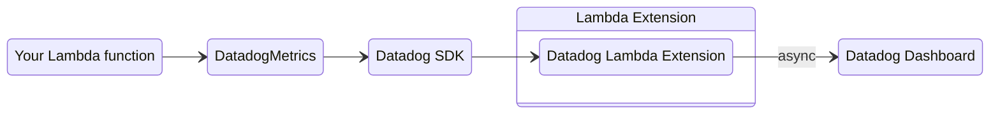

<!-- markdownlint-disable MD013 -->
This observability provider creates custom metrics by flushing metrics to [Datadog Lambda extension](https://docs.datadoghq.com/serverless/installation/python/?tab=datadogcli){target="_blank" rel="nofollow"}, or to standard output via [Datadog Forwarder](https://docs.datadoghq.com/logs/guide/forwarder/?tab=cloudformation){target="_blank" rel="nofollow"}. These metrics can be visualized in the [Datadog console](https://app.datadoghq.com/metric/explore){target="_blank" rel="nofollow"}.
<!-- markdownlint-enable MD013 -->



## Key features

* Flush metrics to Datadog extension or standard output
* Validate against common metric definitions mistakes
* Support to add default tags

## Terminologies

If you're new to Datadog Metrics, there are three terminologies you must be aware of before using this utility:

* **Namespace**. It's the highest level container that will group multiple metrics from multiple services for a given application, for example `ServerlessEcommerce`.
* **Metric**. It's the name of the metric, for example: SuccessfulBooking or UpdatedBooking.
* **Tags**. Metrics metadata in key-value pair format. They help provide contextual information, and filter org organize metrics.

You can read more details in the [Datadog official documentation](https://docs.datadoghq.com/metrics/custom_metrics/){target="_blank" rel="nofollow"}.

## Getting started

???+ tip
    All examples shared in this documentation are available within the [project repository](https://github.com/aws-powertools/powertools-lambda-python/tree/develop/examples){target="_blank" }.

### Install

> **Using Datadog Forwarder?** You can skip this step.

We recommend using [Datadog SDK](https://docs.datadoghq.com/serverless/installation/python/){target="_blank" rel="nofollow"} and Datadog Lambda Extension with this feature for optimal results.

For Datadog SDK, you can add `aws-lambda-powertools[datadog]` as a dependency in your preferred tool, or as a Lambda Layer in the following example:

```yaml hl_lines="15-16 28 32" title="AWS Serverless Application Model (SAM) example"
--8<-- "examples/metrics_datadog/sam/template.yaml"
```

### Creating metrics

You can create metrics using `add_metric`.

By default, we will generate the current timestamp for you. Alternatively, you can use the `timestamp` parameter to set a custom one in epoch time.

=== "add_datadog_metrics.py"

    ```python hl_lines="4 7 9"
    --8<-- "examples/metrics_datadog/src/add_datadog_metrics.py"
    ```

=== "add_metrics_with_timestamp.py"

    ```python hl_lines="11"
    --8<-- "examples/metrics_datadog/src/add_metrics_with_timestamp.py"
    ```

???+ warning "Warning: Do not create metrics outside the handler"
    Metrics added in the global scope will only be added during cold start. Disregard if you that's the intended behavior.

### Adding tags

You can add any number of tags to your metrics via keyword arguments (`key=value`). They are helpful to filter, organize, and aggregate your metrics later.

!!! info "We will emit a warning for tags [beyond the 200 chars limit](https://docs.datadoghq.com/getting_started/tagging/){target="_blank" rel="nofollow"}."

=== "add_metrics_with_tags.py"

    ```python hl_lines="9"
    --8<-- "examples/metrics_datadog/src/add_metrics_with_tags.py"
    ```

### Adding default tags

You can persist tags across Lambda invocations and `DatadogMetrics` instances via `set_default_tags` method, or `default_tags` parameter in the `log_metrics` decorator.

If you'd like to remove them at some point, you can use the `clear_default_tags` method.

???+ note "Metric tag takes precedence over default tags of the same name"
    When adding tags with the same name via `add_metric` and `set_default_tags`, `add_metric` takes precedence.

=== "set_default_tags.py"

    ```python hl_lines="5"
    --8<-- "examples/metrics_datadog/src/set_default_tags.py"
    ```

=== "set_default_tags_log_metrics.py"

    ```python hl_lines="6 9"
    --8<-- "examples/metrics_datadog/src/set_default_tags_log_metrics.py"
    ```

### Flushing metrics

Use `log_metrics` decorator to automatically serialize and flush your metrics (SDK or Forwarder) at the end of your invocation.

This decorator also ensures metrics are flushed in the event of an exception, including warning you in case you forgot to add metrics.

=== "add_metrics.py"

    ```python hl_lines="7"
    --8<-- "examples/metrics_datadog/src/add_metrics_with_tags.py"
    ```

=== "log_metrics_output.json"

    ```json hl_lines="2 6 7"
    --8<-- "examples/metrics_datadog/src/log_metrics_output.json"
    ```

#### Raising SchemaValidationError on empty metrics

Use `raise_on_empty_metrics=True` if you want to ensure at least one metric is always emitted.

```python hl_lines="7" title="Failing fast if no metrics are added"
--8<-- "examples/metrics_datadog/src/raise_on_empty_datadog_metrics.py"
```

???+ tip "Suppressing warning messages on empty metrics"
    If you expect your function to execute without publishing metrics every time, you can suppress the warning with **`warnings.filterwarnings("ignore", "No metrics to publish*")`**.

### Capturing cold start metric

You can optionally capture cold start metrics with `log_metrics` decorator via `capture_cold_start_metric` param.

=== "capture_cold_start_metric.py"

    ```python hl_lines="7"
    --8<-- "examples/metrics_datadog/src/capture_cold_start_datadog_metric.py"
    ```

=== "capture_cold_start_metric_output.json"

    ```json hl_lines="2 6"
    --8<-- "examples/metrics_datadog/src/capture_cold_start_metric_output.json"
    ```

If it's a cold start invocation, this feature will:

* Create a separate Datadog metric solely containing a metric named `ColdStart`
* Add `function_name` metric tag

This has the advantage of keeping cold start metric separate from your application metrics, where you might have unrelated tags.

???+ info
    We do not emit 0 as a value for ColdStart metric for cost reasons. [Let us know](https://github.com/aws-powertools/powertools-lambda-python/issues/new?assignees=&labels=feature-request%2C+triage&template=feature_request.md&title=){target="_blank"} if you'd prefer a flag to override it.

### Environment variables

You can use any of the following environment variables to configure `DatadogMetrics`:

| Setting              | Description                                                                      | Environment variable           | Constructor parameter |
| -------------------- | -------------------------------------------------------------------------------- | ------------------------------ | --------------------- |
| **Metric namespace** | Logical container where all metrics will be placed e.g. `ServerlessAirline`      | `POWERTOOLS_METRICS_NAMESPACE` | `namespace`           |
| **Flush to log**     | Use this when you want to flush metrics to be exported through Datadog Forwarder | `DD_FLUSH_TO_LOG`              | `flush_to_log`        |

## Advanced

### Flushing metrics manually

If you are using the [AWS Lambda Web Adapter](https://github.com/awslabs/aws-lambda-web-adapter){target="_blank"} project, or a middleware with custom metric logic, you can use `flush_metrics()`. This method will serialize, print metrics available to standard output, and clear in-memory metrics data.

???+ warning
    This does not capture Cold Start metrics, and metric data validation still applies.

Contrary to the `log_metrics` decorator, you are now also responsible to flush metrics in the event of an exception.

```python hl_lines="17" title="Manually flushing and clearing metrics from memory"
--8<-- "examples/metrics_datadog/src/flush_datadog_metrics.py"
```

### Integrating with Datadog Forwarder

Use `flush_to_log=True` in `DatadogMetrics` to integrate with the legacy [Datadog Forwarder](https://docs.datadoghq.com/logs/guide/forwarder/?tab=cloudformation){target="_blank" rel="nofollow"}.

This will serialize and flush metrics to standard output.

=== "flush_metrics_to_standard_output.py"

    ```python hl_lines="4"
    --8<-- "examples/metrics_datadog/src/flush_metrics_to_standard_output.py"
    ```

=== "log_metrics_standard_output.json"

    ```json
    --8<-- "examples/metrics_datadog/src/log_metrics_standard_output.json"
    ```

## Testing your code

### Setting environment variables

???+ tip
	Ignore this section, if:

    * You are explicitly setting namespace via `namespace` parameter
    * You're not instantiating `DatadogMetrics` in the global namespace

	For example, `DatadogMetrics(namespace="ServerlessAirline")`

Make sure to set `POWERTOOLS_METRICS_NAMESPACE` before running your tests to prevent failing on `SchemaValidation` exception. You can set it before you run tests or via pytest plugins like [dotenv](https://pypi.org/project/pytest-dotenv/){target="_blank" rel="nofollow"}.

```bash title="Injecting dummy metric namespace before running tests"
--8<-- "examples/metrics_datadog/src/run_tests_env_var.sh"
```

1. **`DD_FLUSH_TO_LOG=True`** makes it easier to test by flushing final metrics to standard output.

### Clearing metrics

`DatadogMetrics` keep metrics in memory across multiple instances. If you need to test this behavior, you can use the following Pytest fixture to ensure metrics are reset incl. cold start:

```python title="Clearing metrics between tests"
--8<-- "examples/metrics_datadog/src/clear_datadog_metrics_in_tests.py"
```

### Functional testing

You can read standard output and assert whether metrics have been flushed. Here's an example using `pytest` with `capsys` built-in fixture:

=== "assert_single_datadog_metric.py"

    ```python hl_lines="7"
    --8<-- "examples/metrics_datadog/src/assert_single_datadog_metric.py"
    ```

=== "add_datadog_metrics.py"

    ```python
    --8<-- "examples/metrics_datadog/src/add_datadog_metrics.py"
    ```

???+ tip
    For more elaborate assertions and comparisons, check out [our functional testing for DatadogMetrics utility.](https://github.com/aws-powertools/powertools-lambda-python/blob/develop/tests/functional/metrics/test_metrics_datadog.py){target="_blank"}
