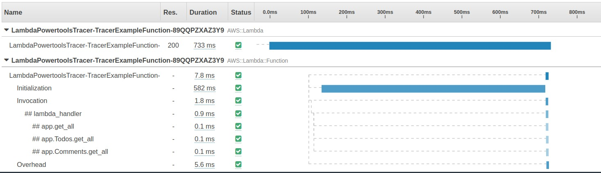

Tracer is an opinionated thin wrapper for [AWS X-Ray Python SDK](https://github.com/aws/aws-xray-sdk-python/).



## Key features

* Auto capture cold start as annotation, and responses or full exceptions as metadata
* Run functions locally with SAM CLI without code change to disable tracing
* Explicitly disable tracing via env var `POWERTOOLS_TRACE_DISABLED="true"`
* Support tracing async methods, generators, and context managers
* Auto patch supported modules by AWS X-Ray

## Getting started

### Permissions

Before your use this utility, your AWS Lambda function [must have permissions](https://docs.aws.amazon.com/lambda/latest/dg/services-xray.html#services-xray-permissions) to send traces to AWS X-Ray.

> Example using AWS Serverless Application Model (SAM)

=== "template.yml"
    ```yaml hl_lines="7 10"
    Resources:
      HelloWorldFunction:
        Type: AWS::Serverless::Function
        Properties:
          Runtime: python3.8
          Tracing: Active
          Environment:
            Variables:
              POWERTOOLS_SERVICE_NAME: example
    ```

### Lambda handler

You can quickly start by importing the `Tracer` class, initialize it outside the Lambda handler, and use `capture_lambda_handler` decorator.

=== "app.py"
	```python hl_lines="1 3 7"
	from aws_lambda_powertools import Tracer

	tracer = Tracer() # Sets service via env var
	# OR tracer = Tracer(service="example")

	@tracer.capture_lambda_handler
	def handler(event, context):
		charge_id = event.get('charge_id')
		payment = collect_payment(charge_id)
		...
	```

When using this `capture_lambda_handler` decorator, Tracer performs these additional tasks to ease operations:

* Creates a `ColdStart` annotation to easily filter traces that have had an initialization overhead
* Captures any response, or full exceptions generated by the handler, and include as tracing metadata

### Annotations & Metadata

**Annotations** are key-values associated with traces and indexed by AWS X-Ray. You can use them to filter traces and to create [Trace Groups](https://aws.amazon.com/about-aws/whats-new/2018/11/aws-xray-adds-the-ability-to-group-traces/) to slice and dice your transactions.

**Metadata** are key-values also associated with traces but not indexed by AWS X-Ray. You can use them to add additional context for an operation using any native object.

=== "Annotations"
	You can add annotations using `put_annotation` method.

    ```python hl_lines="7"
    from aws_lambda_powertools import Tracer
    tracer = Tracer()

    @tracer.capture_lambda_handler
    def handler(event, context):
        ...
        tracer.put_annotation(key="PaymentStatus", value="SUCCESS")
    ```
=== "Metadata"
	You can add metadata using `put_metadata` method.

    ```python hl_lines="8"
    from aws_lambda_powertools import Tracer
    tracer = Tracer()

    @tracer.capture_lambda_handler
    def handler(event, context):
        ...
        ret = some_logic()
        tracer.put_metadata(key="payment_response", value=ret)
    ```

### Synchronous functions

You can trace synchronous functions using the `capture_method` decorator.

!!! warning
    **When `capture_response` is enabled, the function response will be read and serialized as json.**

    The serialization is performed by the aws-xray-sdk which uses the `jsonpickle` module. This can cause
    unintended consequences if there are side effects to recursively reading the returned value, for example if the
    decorated function response contains a file-like object or a <a href="https://botocore.amazonaws.com/v1/documentation/api/latest/reference/response.html#botocore.response.StreamingBody">`StreamingBody`</a> for S3 objects.

```python hl_lines="7 13"
@tracer.capture_method
def collect_payment(charge_id):
    ret = requests.post(PAYMENT_ENDPOINT) # logic
    tracer.put_annotation("PAYMENT_STATUS", "SUCCESS") # custom annotation
    return ret
```

### Asynchronous and generator functions

!!! warning
    **We do not support async Lambda handler** - Lambda handler itself must be synchronous

You can trace asynchronous functions and generator functions (including context managers) using `capture_method`.


=== "Async"
    ```python hl_lines="8"
    import asyncio
    import contextlib
    from aws_lambda_powertools import Tracer

    tracer = Tracer()

    @tracer.capture_method
    async def collect_payment():
        ...
    ```

=== "Context manager"

    ```python hl_lines="7-8"
    import asyncio
    import contextlib
    from aws_lambda_powertools import Tracer

    tracer = Tracer()

    @contextlib.contextmanager
    @tracer.capture_method
    def collect_payment_ctxman():
        yield result
        ...
    ```

=== "Generators"

    ```python hl_lines="9"
    import asyncio
    import contextlib
    from aws_lambda_powertools import Tracer

    tracer = Tracer()

    @tracer.capture_method
    def collect_payment_gen():
        yield result
        ...
    ```

The decorator will detect whether your function is asynchronous, a generator, or a  context manager and adapt its behaviour accordingly.

```python
@tracer.capture_lambda_handler
def handler(evt, ctx):
    asyncio.run(collect_payment())

    with collect_payment_ctxman as result:
        do_something_with(result)

    another_result = list(collect_payment_gen())
```


## Advanced

### Patching modules

Tracer automatically patches all [supported libraries by X-Ray](https://docs.aws.amazon.com/xray/latest/devguide/xray-sdk-python-patching.html) during initialization, by default. Underneath, AWS X-Ray SDK checks whether a supported library has been imported before patching.

If you're looking to shave a few microseconds, or milliseconds depending on your function memory configuration, you can patch specific modules using `patch_modules` param:

```python hl_lines="7"
import boto3
import requests

from aws_lambda_powertools import Tracer

modules_to_be_patched = ["boto3", "requests"]
tracer = Tracer(patch_modules=modules_to_be_patched)
```

### Disabling response auto-capture

> New in 1.9.0

Use **`capture_response=False`** parameter in both `capture_lambda_handler` and `capture_method` decorators to instruct Tracer **not** to serialize function responses as metadata.

!!! info "This is commonly useful in two scenarios"

	1. You might **return sensitive** information you don't want it to be added to your traces
	2. You might manipulate **streaming objects that can be read only once**; this prevents subsequent calls from being empty

=== "sensitive_data_scenario.py"
	```python hl_lines="3 7"
	from aws_lambda_powertools import Tracer

	@tracer.capture_method(capture_response=False)
	def fetch_sensitive_information():
		return "sensitive_information"

	@tracer.capture_lambda_handler(capture_response=False)
	def handler(event, context):
		sensitive_information = fetch_sensitive_information()
	```
=== "streaming_object_scenario.py"
	```python hl_lines="3"
	from aws_lambda_powertools import Tracer

	@tracer.capture_method(capture_response=False)
	def get_s3_object(bucket_name, object_key):
		s3 = boto3.client("s3")
		s3_object = get_object(Bucket=bucket_name, Key=object_key)
		return s3_object
	```

### Disabling exception auto-capture

> New in 1.10.0

Use **`capture_error=False`** parameter in both `capture_lambda_handler` and `capture_method` decorators to instruct Tracer **not** to serialize exceptions as metadata.

!!! info "Commonly useful in one scenario"

	1. You might **return sensitive** information from exceptions, stack traces you might not control

=== "sensitive_data_exception.py"
	```python hl_lines="3 5"
	from aws_lambda_powertools import Tracer

	@tracer.capture_lambda_handler(capture_error=False)
	def handler(event, context):
		raise ValueError("some sensitive info in the stack trace...")
	```

### Tracing aiohttp requests

!!! info
    This snippet assumes you have **aiohttp** as a dependency

You can use `aiohttp_trace_config` function to create a valid [aiohttp trace_config object](https://docs.aiohttp.org/en/stable/tracing_reference.html). This is necessary since X-Ray utilizes aiohttp trace hooks to capture requests end-to-end.

=== "aiohttp_example.py"
	```python hl_lines="5 10"
	import asyncio
	import aiohttp

	from aws_lambda_powertools import Tracer
	from aws_lambda_powertools.tracing import aiohttp_trace_config

	tracer = Tracer()

	async def aiohttp_task():
		async with aiohttp.ClientSession(trace_configs=[aiohttp_trace_config()]) as session:
			async with session.get("https://httpbin.org/json") as resp:
				resp = await resp.json()
				return resp
	```

### Escape hatch mechanism

You can use `tracer.provider` attribute to access all methods provided by AWS X-Ray `xray_recorder` object.

This is useful when you need a feature available in X-Ray that is not available in the Tracer utility, for example [thread-safe](https://github.com/aws/aws-xray-sdk-python/#user-content-trace-threadpoolexecutor), or [context managers](https://github.com/aws/aws-xray-sdk-python/#user-content-start-a-custom-segmentsubsegment).

=== "escape_hatch_context_manager_example.py"
	```python hl_lines="7"
	from aws_lambda_powertools import Tracer

	tracer = Tracer()

	@tracer.capture_lambda_handler
	def handler(event, context):
		with tracer.provider.in_subsegment('## custom subsegment') as subsegment:
			ret = some_work()
			subsegment.put_metadata('response', ret)
	```

### Concurrent asynchronous functions

!!! warning
    [As of now, X-Ray SDK will raise an exception when async functions are run and traced concurrently](https://github.com/aws/aws-xray-sdk-python/issues/164)

A safe workaround mechanism is to use `in_subsegment_async` available via Tracer escape hatch (`tracer.provider`).

=== "concurrent_async_workaround.py"
	```python hl_lines="6 7 12 15 17"
	import asyncio

	from aws_lambda_powertools import Tracer
	tracer = Tracer()

	async def another_async_task():
		async with tracer.provider.in_subsegment_async("## another_async_task") as subsegment:
			subsegment.put_annotation(key="key", value="value")
			subsegment.put_metadata(key="key", value="value", namespace="namespace")
			...

	async def another_async_task_2():
		...

	@tracer.capture_method
	async def collect_payment(charge_id):
		asyncio.gather(another_async_task(), another_async_task_2())
		...
	```

### Reusing Tracer across your code

Tracer keeps a copy of its configuration after the first initialization. This is useful for scenarios where you want to use Tracer in more than one location across your code base.

!!! warning
    When reusing Tracer in Lambda Layers, or in multiple modules, **do not set `auto_patch=False`**, because import order matters.

    This can result in the first Tracer config being inherited by new instances, and their modules not being patched.

=== "handler.py"
	```python hl_lines="2 4 9"
	from aws_lambda_powertools import Tracer
	from payment import collect_payment

	tracer = Tracer(service="payment")

	@tracer.capture_lambda_handler
	def handler(event, context):
		charge_id = event.get('charge_id')
		payment = collect_payment(charge_id)
	```
=== "payment.py"
	A new instance of Tracer will be created but will reuse the previous Tracer instance configuration, similar to a Singleton.

	```python hl_lines="3 5"
	from aws_lambda_powertools import Tracer

	tracer = Tracer(service="payment")

	@tracer.capture_method
    def collect_payment(charge_id: str):
        ...
	```

## Testing your code

You can safely disable Tracer when unit testing your code using `POWERTOOLS_TRACE_DISABLED` environment variable.

```bash
POWERTOOLS_TRACE_DISABLED=1 python -m pytest
```

## Tips

* Use annotations on key operations to slice and dice traces, create unique views, and create metrics from it via Trace Groups
* Use a namespace when adding metadata to group data more easily
* Annotations and metadata are added to the current subsegment opened. If you want them in a specific subsegment, use a [context manager](https://github.com/aws/aws-xray-sdk-python/#start-a-custom-segmentsubsegment) via the escape hatch mechanism
