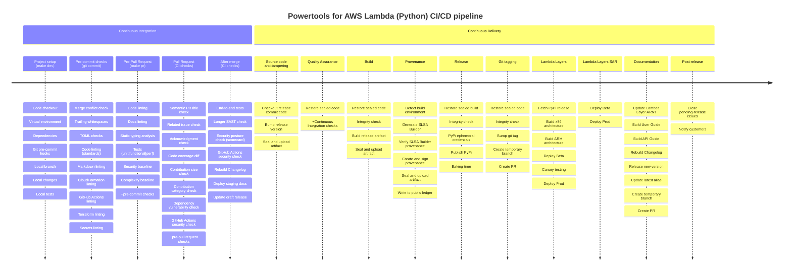

<!-- markdownlint-disable MD041 MD043 -->
<!-- separate file until mkdocs-material supports it: https://github.com/squidfunk/mkdocs-material/discussions/5708 -->

```mermaid
timeline
    title Powertools for AWS Lambda (Python) CI/CD pipeline

    section Continuous Integration
    Project setup <br> (make dev)   : Code checkout
                                    : Virtual environment
                                    : Dependencies
                                    : Git pre-commit hooks
                                    : Local branch
                                    : Local changes
                                    : Local tests

    Pre-commit checks <br> (git commit)     : Merge conflict check
                                            : Trailing whitespaces
                                            : TOML checks
                                            : Code linting (standards)
                                            : Markdown linting
                                            : CloudFormation linting
                                            : GitHub Actions linting
                                            : Terraform linting
                                            : Secrets linting

    Pre-Pull Request <br> (make pr)     : Code linting
                                        : Docs linting
                                        : Static typing analysis
                                        : Tests (unit|functional|perf)
                                        : Security baseline
                                        : Complexity baseline
                                        : +pre-commit checks

    Pull Request <br> (CI checks)   : Semantic PR title check
                                    : Related issue check
                                    : Acknowledgment check
                                    : Code coverage diff
                                    : Contribution size check
                                    : Contribution category check
                                    : Dependency vulnerability check
                                    : GitHub Actions security check
                                    : +pre-pull request checks

    After merge <br> (CI checks)    : End-to-end tests
                                    : Longer SAST check
                                    : Security posture check (scorecard)
                                    : GitHub Actions security check
                                    : Rebuild Changelog
                                    : Deploy staging docs
                                    : Update draft release

    section Continuous Delivery

    Source code anti-tampering  : Checkout release commit code
                                : Bump release version
                                : Seal and upload artifact

    Quality Assurance           : Restore sealed code
                                : +Continuous Integration checks

    Build                       : Restore sealed code
                                : Integrity check
                                : Build release artifact
                                : Seal and upload artifact

    Provenance                  : Detect build environment
                                : Generate SLSA Builder
                                : Verify SLSA Builder provenance
                                : Create and sign provenance
                                : Seal and upload artifact
                                : Write to public ledger

    Release                     : Restore sealed build
                                : Integrity check
                                : PyPi ephemeral credentials
                                : Publish PyPi
                                : Baking time

    Git tagging                 : Restore sealed code
                                : Integrity check
                                : Bump git tag
                                : Create temporary branch
                                : Create PR

    Lambda Layers               : Fetch PyPi release
                                : Build x86 architecture
                                : Build ARM architecture
                                : Deploy Beta
                                : Canary testing
                                : Deploy Prod

    Lambda Layers SAR           : Deploy Beta
                                : Deploy Prod

    Documentation               : Update Lambda Layer ARNs
                                : Build User Guide
                                : Build API Guide
                                : Rebuild Changelog
                                : Release new version
                                : Update latest alias
                                : Create temporary branch
                                : Create PR

    Post-release                : Close pending-release issues
                                : Notify customers
```
