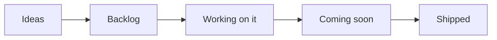
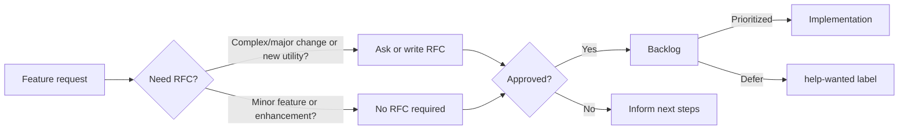

<!-- markdownlint-disable MD043 -->

## Overview

Our public roadmap outlines the high level direction we are working towards, namely [Themes](#themes). We update this document when our priorities change: security and stability is our top priority.

!!! info "For most up-to-date information, see our [board of activities](https://github.com/orgs/aws-powertools/projects/3/views/2?query=is%3Aopen+sort%3Aupdated-desc){target="_blank"}."

## Themes

Operational Excellence is priority number 1. This means bug fixing, stability, security, customer's support, and governance will take precedence above all else.

**What are themes?**

They are key activities maintainers are focusing on. These are updated periodically and you can find the latest [under Themes in our public board](https://github.com/orgs/aws-powertools/projects/3/views/11?query=is%3Aopen+sort%3Aupdated-desc){target="_blank"}.

### Observability providers

We want to extend Tracer, Metrics, and Logger to support any [AWS Lambda certified observability partner](https://go.aws/3HtU6CZ){target="_blank"}, along with OpenTelemetry.

At launch, we will support the top [two most requested observability providers](https://github.com/aws-powertools/powertools-lambda-python/issues/1433). OpenTelemetry will be a fast follow-up as we need to decide on a stable solution to cold start penalty.

**Major updates**

- [x] [Document how customers can use any provider with Logger](https://docs.powertools.aws.dev/lambda/python/latest/core/logger/#observability-providers)
- [x] [Extend Metrics to add support for any Provider](https://github.com/aws-powertools/powertools-lambda-python/pull/2194)
- [ ] [Extend Tracer to add support for any Provider](https://github.com/aws-powertools/powertools-lambda-python/issues/2030)
- [ ] Investigate alternative solution to OpenTelemetry cold start performance

### Sensitive Data Masking

Data Masking will be a new utility to mask/unmask sensitive data using encryption providers. It's the second most voted feature request (behind [Observability Providers](#observability-providers)).

**Major updates**

- [x] [RFC to agree on design and MVP](https://github.com/aws-powertools/powertools-lambda-python/issues/1858)
- [ ] [POC with AWS KMS as the default provider](https://github.com/aws-powertools/powertools-lambda-python/pull/2197)
- [ ] Documentation to guide customers how to bring their own provider (e.g., `ItsDangerous`)

### Revamp Event Handler

Event Handler provides lightweight routing for both [**REST**: Amazon API Gateway, Amazon Elastic Load Balancer and AWS Lambda Function URL](./core/event_handler/api_gateway.md), and [**GraphQL**: AWS AppSync](./core/event_handler/appsync.md).

Based on customers feedback, we want to provide middleware authoring support for cross-cutting concerns. For REST APIs, we are also looking into auto-generate OpenAPI Schemas and a SwaggerUI route. For GraphQL, we are working on supporting batch invocations (N+1 problem) along with partial failure support.

**Major updates**

- [x] [Agree on experience for middleware support](https://github.com/aws-powertools/powertools-lambda-python/issues/953#issuecomment-1450223155)
- [x] [RFC to outline initial thoughts on OpenAPI integration](https://github.com/aws-powertools/powertools-lambda-python/issues/2421)
- [ ] MVP for REST middleware
- [ ] MVP for OpenAPI and SwaggerUI
- [ ] [MVP for AppSync Batch invoke and partial failure support](https://github.com/aws-powertools/powertools-lambda-python/pull/1998)

### Lambda Layer in release notes

We want to publish a JSON with a map of region and Lambda Layer ARN as a GitHub Release Note asset.

As of V2, we prioritize Lambda Layers being available before release notes are out. This is due to X86 and ARM64 compilation for smaller binaries and extra speed.

This means we have room to include a JSON map for Lambda Layers and facilitate automation for customers wanting the latest version as soon as it's available.

**Major updates**

- [x] Create secure mechanism to upload signed assets to GitHub Release Notes
- [ ] Create feature request to agree on JSON structure and asset name

### Open iteration planning

We want to experiment running a bi-weekly audio channel on [Discord](https://discord.gg/B8zZKbbyET){target="_blank" rel="nofollow"} to help us prioritize backlog in real-time. Depending on attendance, we might switch to run an office hours instead.

### Authentication (SigV4)

[During customers interview](https://github.com/aws-powertools/powertools-lambda-python#connect), we hear that signing requests using [AWS SigV4](https://docs.aws.amazon.com/AmazonS3/latest/API/sig-v4-authenticating-requests.html) could be easier.

Since JWT is a close second, this new utility would cover higher level functions to sign and verify requests more easily.

**Major updates**

- [ ] RFC to outline challenges, alternative solutions and desired experience
- [ ] MVP based off RFC

## Roadmap status definition

<i>Visual representation</i>

Within our [public board](https://github.com/orgs/aws-powertools/projects/3/views/1?query=is%3Aopen+sort%3Aupdated-desc){target="_blank"}, you'll see the following values in the `Status` column:

- **Ideas**. Incoming and existing feature requests that are not being actively considered yet. These will be reviewed when bandwidth permits.
- **Backlog**. Accepted feature requests or enhancements that we want to work on.
- **Working on it**. Features or enhancements we're currently either researching or implementing it.
- **Coming soon**. Any feature, enhancement, or bug fixes that have been merged and are coming in the next release.
- **Shipped**. Features or enhancements that are now available in the most recent release.

> Tasks or issues with empty `Status` will be categorized in upcoming review cycles.

## Process

<i>Visual representation</i>

Our end-to-end mechanism follows four major steps:

- **Feature Request**. Ideas start with a [feature request](https://github.com/aws-powertools/powertools-lambda-python/issues/new?assignees=&labels=feature-request%2Ctriage&template=feature_request.yml&title=Feature+request%3A+TITLE){target="_blank"} to outline their use case at a high level. For complex use cases, maintainers might ask for/write a RFC.
    - Maintainers review requests based on [project tenets](index.md#tenets){target="_blank"}, customers reaction (👍), and use cases.
- **Request-for-comments (RFC)**. Design proposals use our [RFC issue template](https://github.com/aws-powertools/powertools-lambda-python/issues/new?assignees=&labels=RFC%2Ctriage&template=rfc.yml&title=RFC%3A+TITLE){target="_blank"} to describe its implementation, challenges, developer experience, dependencies, and alternative solutions.
    - This helps refine the initial idea with community feedback before a decision is made.
- **Decision**. After carefully reviewing and discussing them, maintainers make a final decision on whether to start implementation, defer or reject it, and update everyone with the next steps.
- **Implementation**. For approved features, maintainers give priority to the original authors for implementation unless it is a sensitive task that is best handled by maintainers.

???+ info "See [Maintainers](https://github.com/aws-powertools/powertools-lambda-python/blob/develop/MAINTAINERS.md){target="_blank"} document to understand how we triage issues and pull requests, labels and governance."

## Disclaimer

The Powertools for AWS Lambda (Python) team values feedback and guidance from its community of users, although final decisions on inclusion into the project will be made by AWS.

We determine the high-level direction for our open roadmap based on customer feedback and popularity (👍🏽 and comments), security and operational impacts, and business value. Where features don’t meet our goals and longer-term strategy, we will communicate that clearly and openly as quickly as possible with an explanation of why the decision was made.

## FAQs

**Q: Why did you build this?**

A: We know that our customers are making decisions and plans based on what we are developing, and we want to provide our customers the insights they need to plan.

**Q: Why are there no dates on your roadmap?**

A: Because job zero is security and operational stability, we can't provide specific target dates for features. The roadmap is subject to change at any time, and roadmap issues in this repository do not guarantee a feature will be launched as proposed.

**Q: How can I provide feedback or ask for more information?**

A: For existing features, you can directly comment on issues. For anything else, please open an issue.
