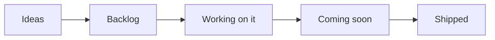
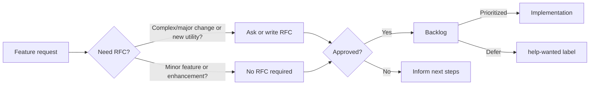

<!-- markdownlint-disable MD043 -->

## Overview

This is our public roadmap that outlines the high level direction we are working towards, namely [Themes](#themes). We update this document when our priorities change: security and stability is our top priority.

[See our latest list of activities »](https://github.com/orgs/awslabs/projects/51/views/1?query=is%3Aopen+sort%3Aupdated-desc){target="_blank"}

## Themes

!!! info "Operational Excellence is priority number 1."

Themes are key activities maintainers are focusing on, besides bug reports. These are updated periodically and you can find the latest [under Epics in our public board](https://github.com/orgs/awslabs/projects/51/views/11?query=is%3Aopen+sort%3Aupdated-desc){target="_blank"}.

### Increased end-to-end coverage

We continue to work on increasing end-to-end coverage for all features. Our main challenge is testing contracts for Lambda Event Sources (Parser, Event Source Data Classes) due to the lack of an official JSON schema.

Some Lambda Event Sources require clusters (e.g., MSK) leading to additional delays of up to 30m in the end-to-end feedback loop. We need a RFC to start discussing viable options, and whether we should publish JSON Schemas from identified contracts.

### Observability providers

We want to extend Tracer, Metrics, and Logger to support any [observability provider](https://github.com/awslabs/aws-lambda-powertools-python/issues/1433). We need a RFC to define a contract and to identify two most requested observability providers that we can work with as an initial step.

### Lambda Layer in release notes

We want to publish a JSON with a map of region and Lambda Layer ARN as a GitHub Release Note asset.

As of V2, we prioritize Lambda Layers being available before release notes are out. This is due to X86 and ARM64 compilation for smaller binaries and extra speed.

This means we have room to include a JSON map for Lambda Layers and facilitate automation for customers wanting the latest version as soon as it's available.

### Strict typing

We want to enable MyPy strict mode against the code base. We need a RFC to identify most critical areas to start, and do so gradually as to not impact new features and enhancements in parallel.

This also means bringing `typing-extensions` as a runtime dependency to ensure complete coverage across all Python versions. Future wise, we might be able to experiment with [MyPyC](https://github.com/mypyc/mypyc) to compile less performing parts of the code base as a C-Extension.

### New utilities

With V2 launched, we want to resume working on new utilities, specifically but not limited to the most commonly asked: **(1)** [Sensitive Data Masking](https://github.com/awslabs/aws-lambda-powertools-python/issues/1173), **(2)** [Integration/End-to-end Testing](https://github.com/awslabs/aws-lambda-powertools-python/issues/1169), and **(3)** [Event Bridge](https://github.com/awslabs/aws-lambda-powertools-python/issues/1168).

### Open iteration planning

We want to experiment running a bi-weekly audio channel on [Discord](https://discord.gg/B8zZKbbyET) to help us prioritize backlog in real-time. Depending on attendance, we might switch to run an office hours instead.

## Roadmap status definition

<i>Visual representation</i>

Within our [public board](https://github.com/orgs/awslabs/projects/51/views/1?query=is%3Aopen+sort%3Aupdated-desc){target="_blank"}, you'll see the following values in the `Status` column:

* **Ideas**. Incoming and existing feature requests that are not being actively considered yet. These will be reviewed when bandwidth permits.
* **Backlog**. Accepted feature requests or enhancements that we want to work on.
* **Working on it**. Features or enhancements we're currently either researching or implementing it.
* **Coming soon**. Any feature, enhancement, or bug fixes that have been merged and are coming in the next release.
* **Shipped**. Features or enhancements that are now available in the most recent release.

> Tasks or issues with empty `Status` will be categorized in upcoming review cycles.

## Process

<i>Visual representation</i>

Our end-to-end mechanism follows four major steps:

* **Feature Request**. Ideas start with a [feature request](https://github.com/awslabs/aws-lambda-powertools-python/issues/new?assignees=&labels=feature-request%2Ctriage&template=feature_request.yml&title=Feature+request%3A+TITLE){target="_blank"} to outline their use case at a high level. For complex use cases, maintainers might ask for/write a RFC.
    * Maintainers review requests based on [project tenets](index.md#tenets){target="_blank"}, customers reaction (👍), and use cases.
* **Request-for-comments (RFC)**. Design proposals use our [RFC issue template](https://github.com/awslabs/aws-lambda-powertools-python/issues/new?assignees=&labels=RFC%2Ctriage&template=rfc.yml&title=RFC%3A+TITLE){target="_blank"} to describe its implementation, challenges, developer experience, dependencies, and alternative solutions.
    * This helps refine the initial idea with community feedback before a decision is made.
* **Decision**. After carefully reviewing and discussing them, maintainers make a final decision on whether to start implementation, defer or reject it, and update everyone with the next steps.
* **Implementation**. For approved features, maintainers give priority to the original authors for implementation unless it is a sensitive task that is best handled by maintainers.

???+ info "See [Maintainers](https://github.com/awslabs/aws-lambda-powertools-python/blob/develop/MAINTAINERS.md) document to understand how we triage issues and pull requests, labels and governance."

## Disclaimer

The AWS Lambda Powertools team values feedback and guidance from its community of users, although final decisions on inclusion into the project will be made by AWS.

We determine the high-level direction for our open roadmap based on customer feedback and popularity (👍🏽 and comments), security and operational impacts, and business value. Where features don’t meet our goals and longer-term strategy, we will communicate that clearly and openly as quickly as possible with an explanation of why the decision was made.

## FAQs

**Q: Why did you build this?**

A: We know that our customers are making decisions and plans based on what we are developing, and we want to provide our customers the insights they need to plan.

**Q: Why are there no dates on your roadmap?**

A: Because job zero is security and operational stability, we can't provide specific target dates for features. The roadmap is subject to change at any time, and roadmap issues in this repository do not guarantee a feature will be launched as proposed.

**Q: How can I provide feedback or ask for more information?**

A: For existing features, you can directly comment on issues. For anything else, please open an issue.
