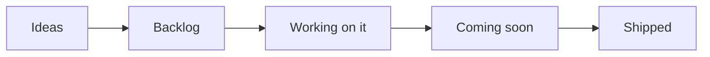
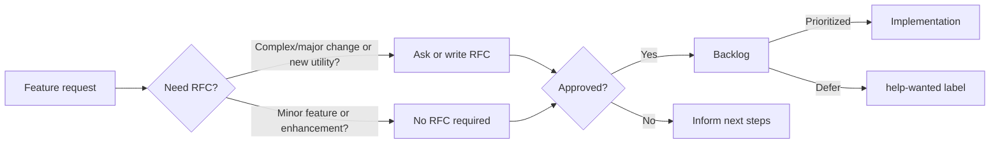

<!-- markdownlint-disable MD043 -->

## Overview

Our public roadmap outlines the high level direction we are working towards. We update this document when our priorities change: security and stability are our top priority.

!!! info "See our [current iteration cycle](https://github.com/orgs/aws-powertools/projects/3/views/14?query=is%3Aopen+sort%3Aupdated-desc){target="_blank"} for the most up-to-date information."

## Key areas

Security and operational excellence take precedence above all else. This means bug fixing, stability, customer's support, and internal compliance may delay one or more key areas below.

### Observability providers

We want to extend Tracer, Metrics, and Logger to support any [AWS Lambda certified observability partner](https://go.aws/3HtU6CZ){target="_blank"}, along with OpenTelemetry.

At launch, we will support Datadog since it's [most requested observability provider](https://github.com/aws-powertools/powertools-lambda-python/issues/1433). OpenTelemetry will be a fast follow-up as we need to decide on a stable solution to cold start penalty.

!!! tip "Help us identify which observability providers we should integrate next. Open [feature request](https://github.com/aws-powertools/powertools-lambda-python/issues/new?assignees=&labels=feature-request%2Ctriage&projects=&template=feature_request.yml&title=Feature+request%3A+TITLE){target="_blank"} or by voting `+1` in existing issues"

**Major updates**

* [x] [Document how customers can use any provider with Logger](https://docs.powertools.aws.dev/lambda/python/latest/core/logger/#observability-providers)
* [x] [Extend Metrics to add support for any Provider](https://github.com/aws-powertools/powertools-lambda-python/pull/2194)
* [ ] [Extend Tracer to add support for any Provider](https://github.com/aws-powertools/powertools-lambda-python/pull/2342#issuecomment-2061734362)
* [ ] Investigate alternative solution to OpenTelemetry cold start performance

### Lambda Layer in GovCloud

We want to investigate security and scaling requirements for these special regions, so they're in sync for every release.

!!! note "Help us prioritize it by reaching out to your AWS representatives or [via email](mailto:aws-powertools-maintainers@amazon.com)."

**Major updates**

* [x] Gather agencies and customers name to prioritize it
* [x] Investigate security requirements for special regions
* [x] Create additional infrastructure for special regions
* [x] AppSec review
* [x] Update CDK Layer construct to include regions
* [x] Distribution sign-off
* [ ] Distribute latest version
* [ ] Update Layer section with new AWS Accounts

### V3

We are in the process of planning the roadmap for v3. As always, [our approach](./versioning.md){target="_blank"} includes providing sufficient advance notice, a comprehensive upgrade guide, and minimizing breaking changes to facilitate a smooth transition (e.g., it took ~7 months from v2 to surpass v1 downloads).

For example, these are on our mind but not settled yet until we have a public tracker to discuss what these means in detail.

* **Parser**: Drop Pydantic v1
* **Parser**: Deserialize Amazon DynamoDB data types automatically (like Event Source Data Classes)
* **Parameters**: Increase default `max_age` for `get_secret`
* **Event Source Data Classes**: Return sane defaults for any property that has `Optional[<type>]` returns
* **Upgrade tool**: Consider building a CST (Concrete Syntax Tree) tool to ease certain upgrade actions like `pyupgrade` and `django-upgrade`
* **Batch**: Stop at first error for Amazon DynamoDB Streams and Amazon Kinesis Data Streams (e.g., `stop_on_failure=True`)

**Major updates**

* [ ] Create an issue to track breaking changes we consider making
* [ ] Create a v3 branch to allow early experimentation
* [ ] Create workflows to allow pre-releases
* [ ] Create a mechanism to keep ideas for breaking change somewhere regardless of v3

### Revamp Event Handler

Event Handler provides lightweight routing for both [**REST**: Amazon API Gateway, Amazon Elastic Load Balancer and AWS Lambda Function URL](./core/event_handler/api_gateway.md), and [**GraphQL**: AWS AppSync](./core/event_handler/appsync.md).

<!-- markdownlint-disable MD013 -->
Based on customers feedback, we want to provide [middleware authoring support](https://docs.powertools.aws.dev/lambda/python/latest/core/event_handler/api_gateway/#middleware) for cross-cutting concerns. For REST APIs, we are also looking into auto-generate [OpenAPI Schemas](https://docs.powertools.aws.dev/lambda/python/latest/core/event_handler/api_gateway/#data-validation) and a [SwaggerUI route](https://docs.powertools.aws.dev/lambda/python/latest/core/event_handler/api_gateway/#enabling-swaggerui). For GraphQL, we are working on supporting batch invocations (N+1 problem) along with partial failure support.
<!-- markdownlint-enable MD013 -->

**Major updates**

* [x] [Agree on experience for middleware support](https://github.com/aws-powertools/powertools-lambda-python/issues/953#issuecomment-1450223155)
* [x] [RFC to outline initial thoughts on OpenAPI integration](https://github.com/aws-powertools/powertools-lambda-python/issues/2421)
* [x] [MVP for REST middleware](./core/event_handler/api_gateway.md#middleware)
* [x] [MVP for OpenAPI and SwaggerUI](https://github.com/aws-powertools/powertools-lambda-python/pull/3109)
* [ ] [MVP for AppSync Batch invoke and partial failure support](https://github.com/aws-powertools/powertools-lambda-python/pull/1998)

### Authentication (SigV4)

[During customers interview](https://github.com/aws-powertools/powertools-lambda-python#connect){target="_blank"}, we hear that signing requests using [AWS SigV4](https://docs.aws.amazon.com/AmazonS3/latest/API/sig-v4-authenticating-requests.html){target="_blank"} could be easier.

Since JWT is a close second, this new utility would cover higher level functions to sign and verify requests more easily.

**Major updates**

* [x] [Issue to outline challenges](https://github.com/aws-powertools/powertools-lambda-python/issues/2493), alternative solutions and desired experience
* [ ] [MVP for AWS SigV4](https://github.com/aws-powertools/powertools-lambda-python/pull/2435)

### Office hours

We heard from [customers](https://github.com/aws-powertools/powertools-lambda-python#connect){target="_blank"} that Powertools for AWS Lambda and its community can move faster than they are able to catch up. While documentation and release notes take these into account, they notice they don't always know advanced tricks, or what other customers tend to do in similar situations.

We want to run a monthly office hours to start addressing that, and learn from customers how they're using Powertools and whether or not they need a closer support.

Timezones being tricky, we plan to experiment with an afternoon slot in Central European that would also cover Middle East, US east coast, and South America. Depending on attendance, we plan to A/B test an Asia friendly one too.

**Major updates**

* [x] Decide whether to use Amazon Chime or Zoom (we had audio setup issues on Discord)
* [ ] Experiment running monthly roadmap review as an open call
    * [ ] Settle on monthly roadmap review agenda
    * [ ] Invite Discord community
    * [ ] Update roadmap page with Discord event

### Enhanced operational metrics

[Through customers interview](https://github.com/aws-powertools/powertools-lambda-python#connect){target="_blank"}, [Discord](https://discord.gg/B8zZKbbyET){target="_blank" rel="nofollow"}, and [1:1 customer enablement](https://github.com/aws-powertools/powertools-lambda-python#connect){target="_blank"}, we noticed customers often create the same set of custom operational metrics.

We want to make this easier by extending certain utilities to accept a `metrics` instance and metrics configuration (what metrics to create). It would be opt-in due to costs associated with creating metrics.

!!! question "Got ideas for custom metrics? Open up a [feature request](https://github.com/aws-powertools/powertools-lambda-python/issues/new?assignees=&labels=feature-request%2Ctriage&projects=&template=feature_request.yml&title=Feature+request%3A+TITLE)"

**Major updates**

* [ ] RFC to outline metrics for Batch (_e.g., Failed items, Batch size_)
* [ ] RFC to outline metrics for Feature flags (_e.g., matched rules_)
* [ ] RFC to outline metrics for Event Handler (_e.g., validation errors_ )
* [ ] RFC to outline metrics for Idempotency (_e.g., cache hit_)

## Roadmap status definition

<i>Visual representation</i>

Within our [public board](https://github.com/orgs/aws-powertools/projects/3/views/1?query=is%3Aopen+sort%3Aupdated-desc){target="_blank"}, you'll see the following values in the `Status` column:

* **Ideas**. Incoming and existing feature requests that are not being actively considered yet. These will be reviewed when bandwidth permits.
* **Backlog**. Accepted feature requests or enhancements that we want to work on.
* **Working on it**. Features or enhancements we're currently either researching or implementing it.
* **Coming soon**. Any feature, enhancement, or bug fixes that have been merged and are coming in the next release.
* **Shipped**. Features or enhancements that are now available in the most recent release.

> Tasks or issues with empty `Status` will be categorized in upcoming review cycles.

## Process

<i>Visual representation</i>

Our end-to-end mechanism follows four major steps:

* **Feature Request**. Ideas start with a [feature request](https://github.com/aws-powertools/powertools-lambda-python/issues/new?assignees=&labels=feature-request%2Ctriage&template=feature_request.yml&title=Feature+request%3A+TITLE){target="_blank"} to outline their use case at a high level. For complex use cases, maintainers might ask for/write a RFC.
    * Maintainers review requests based on [project tenets](index.md#tenets){target="_blank"}, customers reaction (👍), and use cases.
* **Request-for-comments (RFC)**. Design proposals use our [RFC issue template](https://github.com/aws-powertools/powertools-lambda-python/issues/new?assignees=&labels=RFC%2Ctriage&template=rfc.yml&title=RFC%3A+TITLE){target="_blank"} to describe its implementation, challenges, developer experience, dependencies, and alternative solutions.
    * This helps refine the initial idea with community feedback before a decision is made.
* **Decision**. After carefully reviewing and discussing them, maintainers make a final decision on whether to start implementation, defer or reject it, and update everyone with the next steps.
* **Implementation**. For approved features, maintainers give priority to the original authors for implementation unless it is a sensitive task that is best handled by maintainers.

???+ info "See [Maintainers](https://github.com/aws-powertools/powertools-lambda-python/blob/develop/MAINTAINERS.md){target="_blank"} document to understand how we triage issues and pull requests, labels and governance."

## Disclaimer

The Powertools for AWS Lambda (Python) team values feedback and guidance from its community of users, although final decisions on inclusion into the project will be made by AWS.

We determine the high-level direction for our open roadmap based on customer feedback and popularity (👍🏽 and comments), security and operational impacts, and business value. Where features don’t meet our goals and longer-term strategy, we will communicate that clearly and openly as quickly as possible with an explanation of why the decision was made.

## FAQs

**Q: Why did you build this?**

A: We know that our customers are making decisions and plans based on what we are developing, and we want to provide our customers the insights they need to plan.

**Q: Why are there no dates on your roadmap?**

A: Because job zero is security and operational stability, we can't provide specific target dates for features. The roadmap is subject to change at any time, and roadmap issues in this repository do not guarantee a feature will be launched as proposed.

**Q: How can I provide feedback or ask for more information?**

A: For existing features, you can directly comment on issues. For anything else, please open an issue.

## Launched

### Setting Parameters and Secrets

> [Docs](./utilities/parameters.md#setting-parameters)

As of today, the [Parameters](./utilities/parameters.md){target="_blank"} feature is used to retrieve data, not to create or update existing parameters. Based on community feedback, we plan to enhance Parameters to allow set operations.

**Major updates**

* [x] [RFC](https://github.com/aws-powertools/powertools-lambda-python/issues/3040)
* [x] [MVP](https://github.com/aws-powertools/powertools-lambda-python/pull/2858)

### Amazon Bedrock Agent Event Handler

> [Docs](./core/event_handler/bedrock_agents.md)

Based on [customers](https://github.com/aws-powertools/powertools-lambda-python#connect){target="_blank"} at re:Invent 2023, we will add a new Event Handler resolver to improve authoring and maintenance of Amazon Bedrock Agents.

**Major updates**

* [x] [Event Source Data Classes support](https://github.com/aws-powertools/powertools-lambda-python/pull/3262)
* [x] [Pydantic model _(Parser)_ support](https://github.com/aws-powertools/powertools-lambda-python/pull/3286)
* [x] [MVP Event Handler](https://github.com/aws-powertools/powertools-lambda-python/pull/3285)
* [x] [New feature documentation](https://github.com/aws-powertools/powertools-lambda-python/pull/3602)
* [x] [Video to walkthrough](https://docs.powertools.aws.dev/lambda/python/latest/core/event_handler/bedrock_agents/#video-walkthrough) use cases for anyone new to LLM Agents
* [ ] Launch amplifier (_e.g., What's New, Blog post_)

### Sensitive Data Masking

> [Docs](./utilities/data_masking.md)

Data Masking will be a new utility to mask/unmask sensitive data using encryption providers. It's the second most voted feature request (behind [Observability Providers](#observability-providers)).

**Major updates**

* [x] [RFC to agree on design and MVP](https://github.com/aws-powertools/powertools-lambda-python/issues/1858)
* [x] [POC with AWS KMS as the default provider](https://github.com/aws-powertools/powertools-lambda-python/pull/2197)
* [x] User-guide documentation and include when not to use it (e.g., when to use SNS data policy, CloudWatch Logs data policy)
* [x] Decide whether to use Encryption SDK to bring their own provider or a simply a contract (e.g., `ItsDangerous`)

### Deprecate Python 3.7 support

AWS Lambda will officially block updates to Lambda functions using Python 3.7 support. We will drop support as soon as [that is official](https://docs.aws.amazon.com/lambda/latest/dg/lambda-runtimes.html#runtime-support-policy){target="_blank"}.

**Major updates**

* [x] [Drop Python 3.7 support](https://github.com/aws-powertools/powertools-lambda-python/pull/3638)
* [x] [Add documentation banner](https://github.com/aws-powertools/powertools-lambda-python/pull/3618)
* [x] [Publish versioning policy docs](https://github.com/aws-powertools/powertools-lambda-python/pull/3682)

## Dropped

### Lambda Layer in release notes

> **Reason**: We are looking at more accessible alternatives based on customer feedback (e.g., AWS System Manager public parameters)

We want to publish a JSON with a map of region and Lambda Layer ARN as a GitHub Release Note asset.

As of V2, we prioritize Lambda Layers being available before release notes are out. This is due to X86 and ARM64 compilation for smaller binaries and extra speed.

This means we have room to include a JSON map for Lambda Layers and facilitate automation for customers wanting the latest version as soon as it's available.

**Major updates**

* [x] Create secure mechanism to upload signed assets to GitHub Release Notes
* [ ] Create feature request to agree on JSON structure and asset name
