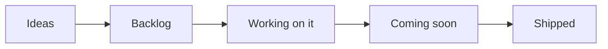
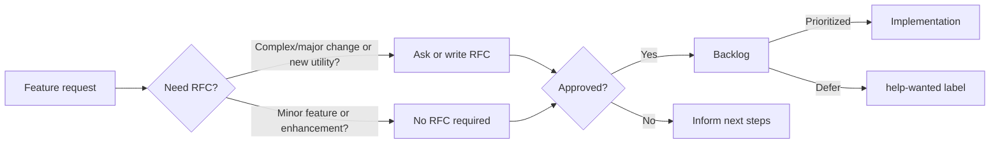

## Overview

???+ info "We are currently paused for new features [until end of July 2022](https://github.com/awslabs/aws-lambda-powertools-python/issues/1009){target="_blank"}."

This is our public roadmap that outlines the high level direction we are working towards, namely [Themes](#themes). We update this document on a periodic basis to reflect any changing priorities - Security and stability is our top priority.

[See our latest list of activities »](https://github.com/orgs/awslabs/projects/51/views/1?query=is%3Aopen+sort%3Aupdated-desc){target="_blank"}

## Themes

Themes are key activities maintainers are focusing on, besides bug reports. These are updated periodically and you can find the latest [under Epics in our public board](https://github.com/orgs/awslabs/projects/51/views/11?query=is%3Aopen+sort%3Aupdated-desc){target="_blank"}.

### Lambda Layers migration

We are migrating our Lambda Layers internal release pipeline towards an AWS CodePipeline based system. This will allow us to more rapidly adopt additional regions, custom builds, and decrease our rollout time to all commercial regions.

### End-to-end testing

We are working on a framework to selectively run end-to-end tests as part of Pull Requests and upon merge. This will increase our confidence in detecting regressions early, and also explore ideas for utilities that can make testing easier for customers.

### Python 3.6 deprecation

We will remove support for Python 3.6 after July 18th, following AWS Lambda [deprecation notice for Python 3.6 runtime](https://docs.aws.amazon.com/lambda/latest/dg/lambda-runtimes.html#runtime-support-policy){target="_blank"}. We will monitor the deprecation notice in the event of any extension.

### Reduce release operational overhead

We are working on a consistent label and automation strategy across all Lambda Powertools projects ([Java](https://awslabs.github.io/aws-lambda-powertools-java/){target="_blank"}, [TypeScript](https://awslabs.github.io/aws-lambda-powertools-typescript/latest/){target="_blank"}). This will be our baseline to automate areas where we don't need human intervention, and reduce our manual effort to areas where clear communication is crucial.

### Revamp roadmap

We are beta testing the [new GitHub Projects Beta](https://github.com/orgs/awslabs/projects/51/views/1?query=is%3Aopen+sort%3Aupdated-desc){target="_blank"} to provide more visibility on our current activities. This also includes new GitHub Issue Forms Beta to streamline feature requests, bug reports, RFCs, etc., including a new mechanism to add external links like `Ask a Question`.

Once complete, we will repurpose our [central roadmap repository](https://github.com/awslabs/aws-lambda-powertools-roadmap){target="_blank"} to provide a landing page for all Powertools languages, including an experiment to better highlight feature parity across them.

## Roadmap status definition

<i>Visual representation</i>

Within our [public board](https://github.com/orgs/awslabs/projects/51/views/1?query=is%3Aopen+sort%3Aupdated-desc){target="_blank"}, you'll see the following values in the `Status` column:

* **Ideas**. Incoming and existing feature requests that are not being actively considered yet. These will be reviewed when bandwidth permits.
* **Backlog**. Accepted feature requests or enhancements that we want to work on.
* **Working on it**. Features or enhancements we're currently either researching or implementing it.
* **Coming soon**. Any feature, enhancement, or bug fixes that have been merged and are coming in the next release.
* **Shipped**. Features or enhancements that are now available in the most recent release.

> Tasks or issues with empty `Status` will be categorized in upcoming review cycles.

## Process

<i>Visual representation</i>

Our end-to-end mechanism follows four major steps:

* **Feature Request**. Ideas start with a [feature request issue template](https://github.com/awslabs/aws-lambda-powertools-python/issues/new?assignees=&labels=feature-request%2Ctriage&template=feature_request.yml&title=Feature+request%3A+TITLE){target="_blank"} to highlight their use case at a high level. Maintainers review each  request based on the **(1)** [project tenets](index.md#tenets){target="_blank"}, **(2)** customers reaction (👍) and use cases, and comment whether we'll need a RFC for further discussion before any work begins.
* **Request-for-comments (RFC)**. Design proposals use our [RFC issue template](https://github.com/awslabs/aws-lambda-powertools-python/issues/new?assignees=&labels=RFC%2Ctriage&template=rfc.yml&title=RFC%3A+TITLE){target="_blank"} to describe its implementation, challenges, developer experience, dependencies, and alternative solutions. This helps refine the initial idea with community feedback before a decision is made.
* **Decision**. After carefully reviewing and discussing them, maintainers make a final decision on whether to start implementation, defer or reject it, and update everyone with the next steps.
* **Implementation**. For approved features, maintainers will build a prototype and invite customers for feedback in the original request. Alternatively, maintainers will proactively use the [help wanted](https://github.com/awslabs/aws-lambda-powertools-python/issues?q=is%3Aissue+is%3Aopen+sort%3Aupdated-desc+label%3A%22help+wanted%22){target="_blank"} tag to signal contributions are welcome to accelerate development.
* **Implementation**. For approved features, maintainers will build a prototype for early feedback, or use [`help wanted`](https://github.com/awslabs/aws-lambda-powertools-python/issues?q=is%3Aissue+is%3Aopen+sort%3Aupdated-desc+label%3A%22help+wanted%22){target="_blank"} label welcoming contributions to accelerate development.

???+ info "Bug reports, documentation improvements, etc. are not covered by this process. See Maintainers process instead (coming soon)."

## Disclaimer

The AWS Lambda Powertools team values feedback and guidance from its community of users, although final decisions on inclusion into the project will be made by AWS. We determine the high-level direction for our open roadmap based on customer feedback and popularity (👍🏽 and comments), security and operational impacts, and business value. Where features don’t meet our goals and longer-term strategy, we will communicate that clearly and openly as quickly as possible with an explanation of why the decision was made.

## FAQs

**Q: Why did you build this?**

A: We know that our customers are making decisions and plans based on what we are developing, and we want to provide our customers the insights they need to plan.

**Q: Why are there no dates on your roadmap?**

A: Because job zero is security and operational stability, we can't provide specific target dates for features. The roadmap is subject to change at any time, and roadmap issues in this repository do not guarantee a feature will be launched as proposed.

**Q: How can I provide feedback or ask for more information?**

A: For existing features, you can directly comment on issues. For anything else, please open an issue.
