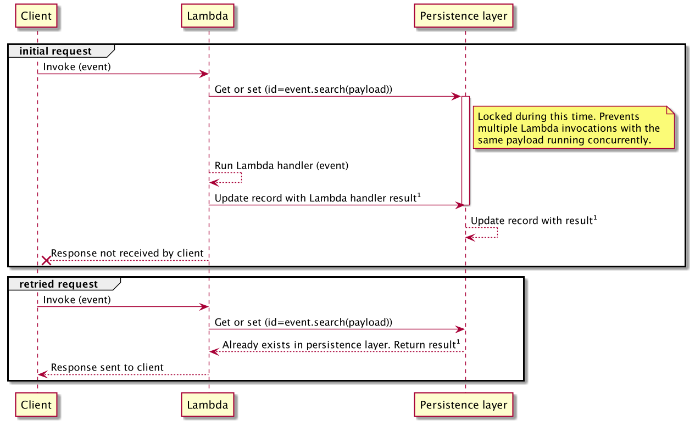
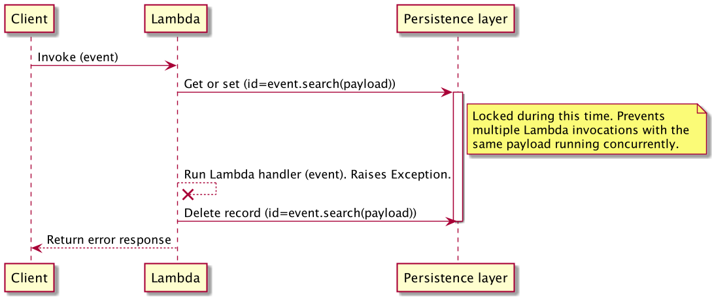

The idempotency utility provides a simple solution to convert your Lambda functions into idempotent operations which
are safe to retry.

## Terminology

The property of idempotency means that an operation does not cause additional side effects if it is called more than
once with the same input parameters.

**Idempotent operations will return the same result when they are called multiple
times with the same parameters**. This makes idempotent operations safe to retry.

**Idempotency key** is a hash representation of either the entire event or a specific configured subset of the event, and invocation results are **JSON serialized** and stored in your persistence storage layer.

## Key features

* Prevent Lambda handler from executing more than once on the same event payload during a time window
* Ensure Lambda handler returns the same result when called with the same payload
* Select a subset of the event as the idempotency key using JMESPath expressions
* Set a time window in which records with the same payload should be considered duplicates

## Getting started

### Required resources

Before getting started, you need to create a persistent storage layer where the idempotency utility can store its state - your lambda functions will need read and write access to it.

As of now, Amazon DynamoDB is the only supported persistent storage layer, so you'll need to create a table first.

**Default table configuration**

If you're not [changing the default configuration for the DynamoDB persistence layer](#dynamodbpersistencelayer), this is the expected default configuration:

Configuration | Value | Notes
------------------------------------------------- | ------------------------------------------------- | -------------------------------------------------
Partition key | `id` |
TTL attribute name | `expiration` | This can only be configured after your table is created if you're using AWS Console

???+ tip "Tip: You can share a single state table for all functions"
    You can reuse the same DynamoDB table to store idempotency state. We add your `function_name` in addition to the idempotency key as a hash key.

```yaml hl_lines="5-13 21-23" title="AWS Serverless Application Model (SAM) example"
Resources:
  IdempotencyTable:
	Type: AWS::DynamoDB::Table
	Properties:
	  AttributeDefinitions:
		-   AttributeName: id
			AttributeType: S
	  KeySchema:
		-   AttributeName: id
			KeyType: HASH
	  TimeToLiveSpecification:
		AttributeName: expiration
		Enabled: true
	  BillingMode: PAY_PER_REQUEST

  HelloWorldFunction:
  Type: AWS::Serverless::Function
  Properties:
	Runtime: python3.8
	...
	Policies:
	  - DynamoDBCrudPolicy:
		  TableName: !Ref IdempotencyTable
```

???+ warning "Warning: Large responses with DynamoDB persistence layer"
    When using this utility with DynamoDB, your function's responses must be [smaller than 400KB](https://docs.aws.amazon.com/amazondynamodb/latest/developerguide/Limits.html#limits-items).

    Larger items cannot be written to DynamoDB and will cause exceptions.

???+ info "Info: DynamoDB"
    Each function invocation will generally make 2 requests to DynamoDB. If the
    result returned by your Lambda is less than 1kb, you can expect 2 WCUs per invocation. For retried invocations, you will
    see 1WCU and 1RCU. Review the [DynamoDB pricing documentation](https://aws.amazon.com/dynamodb/pricing/) to
    estimate the cost.

### Idempotent decorator

You can quickly start by initializing the `DynamoDBPersistenceLayer` class and using it with the `idempotent` decorator on your lambda handler.

=== "app.py"

    ```python hl_lines="1-3 5 7 14"
    from aws_lambda_powertools.utilities.idempotency import (
        DynamoDBPersistenceLayer, idempotent
    )

    persistence_layer = DynamoDBPersistenceLayer(table_name="IdempotencyTable")

    @idempotent(persistence_store=persistence_layer)
    def handler(event, context):
        payment = create_subscription_payment(
            user=event['user'],
            product=event['product_id']
        )
        ...
        return {
            "payment_id": payment.id,
            "message": "success",
            "statusCode": 200,
        }
    ```

=== "Example event"

    ```json
    {
      "username": "xyz",
      "product_id": "123456789"
    }
    ```

### Idempotent_function decorator

Similar to [idempotent decorator](#idempotent-decorator), you can use `idempotent_function` decorator for any synchronous Python function.

When using `idempotent_function`, you must tell us which keyword parameter in your function signature has the data we should use via **`data_keyword_argument`**.

!!! info "We support JSON serializable data, [Python Dataclasses](https://docs.python.org/3.7/library/dataclasses.html){target="_blank"}, [Parser/Pydantic Models](parser.md){target="_blank"}, and our [Event Source Data Classes](./data_classes.md){target="_blank"}."

???+ warning
    Make sure to call your decorated function using keyword arguments

=== "batch_sample.py"

    This example also demonstrates how you can integrate with [Batch utility](batch.md), so you can process each record in an idempotent manner.

    ```python hl_lines="4-5 16 21 29"
    from aws_lambda_powertools.utilities.batch import (BatchProcessor, EventType,
                                                       batch_processor)
    from aws_lambda_powertools.utilities.data_classes.sqs_event import SQSRecord
    from aws_lambda_powertools.utilities.idempotency import (
        DynamoDBPersistenceLayer, IdempotencyConfig, idempotent_function)


    processor = BatchProcessor(event_type=EventType.SQS)
    dynamodb = DynamoDBPersistenceLayer(table_name="idem")
    config =  IdempotencyConfig(
        event_key_jmespath="messageId",  # see Choosing a payload subset section
        use_local_cache=True,
    )


    @idempotent_function(data_keyword_argument="record", config=config, persistence_store=dynamodb)
    def record_handler(record: SQSRecord):
        return {"message": record["body"]}


    @idempotent_function(data_keyword_argument="data", config=config, persistence_store=dynamodb)
    def dummy(arg_one, arg_two, data: dict, **kwargs):
        return {"data": data}


    @batch_processor(record_handler=record_handler, processor=processor)
    def lambda_handler(event, context):
        # `data` parameter must be called as a keyword argument to work
        dummy("hello", "universe", data="test")
        return processor.response()
    ```

=== "Batch event"

    ```json hl_lines="4"
    {
        "Records": [
            {
                "messageId": "059f36b4-87a3-44ab-83d2-661975830a7d",
                "receiptHandle": "AQEBwJnKyrHigUMZj6rYigCgxlaS3SLy0a...",
                "body": "Test message.",
                "attributes": {
                    "ApproximateReceiveCount": "1",
                    "SentTimestamp": "1545082649183",
                    "SenderId": "AIDAIENQZJOLO23YVJ4VO",
                    "ApproximateFirstReceiveTimestamp": "1545082649185"
                },
                "messageAttributes": {
                    "testAttr": {
                    "stringValue": "100",
                    "binaryValue": "base64Str",
                    "dataType": "Number"
                    }
                },
                "md5OfBody": "e4e68fb7bd0e697a0ae8f1bb342846b3",
                "eventSource": "aws:sqs",
                "eventSourceARN": "arn:aws:sqs:us-east-2:123456789012:my-queue",
                "awsRegion": "us-east-2"
            }
        ]
    }
    ```

=== "dataclass_sample.py"

    ```python hl_lines="3-4 23 32"
    from dataclasses import dataclass

    from aws_lambda_powertools.utilities.idempotency import (
        DynamoDBPersistenceLayer, IdempotencyConfig, idempotent_function)

    dynamodb = DynamoDBPersistenceLayer(table_name="idem")
    config =  IdempotencyConfig(
        event_key_jmespath="order_id",  # see Choosing a payload subset section
        use_local_cache=True,
    )

    @dataclass
    class OrderItem:
        sku: str
        description: str

    @dataclass
    class Order:
        item: OrderItem
        order_id: int


    @idempotent_function(data_keyword_argument="order", config=config, persistence_store=dynamodb)
    def process_order(order: Order):
        return f"processed order {order.order_id}"


    order_item = OrderItem(sku="fake", description="sample")
    order = Order(item=order_item, order_id="fake-id")

    # `order` parameter must be called as a keyword argument to work
    process_order(order=order)
    ```

=== "parser_pydantic_sample.py"

    ```python hl_lines="1-2 22 31"
    from aws_lambda_powertools.utilities.idempotency import (
        DynamoDBPersistenceLayer, IdempotencyConfig, idempotent_function)
    from aws_lambda_powertools.utilities.parser import BaseModel

    dynamodb = DynamoDBPersistenceLayer(table_name="idem")
    config =  IdempotencyConfig(
        event_key_jmespath="order_id",  # see Choosing a payload subset section
        use_local_cache=True,
    )


    class OrderItem(BaseModel):
        sku: str
        description: str


    class Order(BaseModel):
        item: OrderItem
        order_id: int


    @idempotent_function(data_keyword_argument="order", config=config, persistence_store=dynamodb)
    def process_order(order: Order):
        return f"processed order {order.order_id}"


    order_item = OrderItem(sku="fake", description="sample")
    order = Order(item=order_item, order_id="fake-id")

    # `order` parameter must be called as a keyword argument to work
    process_order(order=order)
    ```

### Choosing a payload subset for idempotency

???+ tip "Tip: Dealing with always changing payloads"
    When dealing with a more elaborate payload, where parts of the payload always change, you should use **`event_key_jmespath`** parameter.

Use [`IdempotencyConfig`](#customizing-the-default-behavior) to instruct the idempotent decorator to only use a portion of your payload to verify whether a request is idempotent, and therefore it should not be retried.

> **Payment scenario**

In this example, we have a Lambda handler that creates a payment for a user subscribing to a product. We want to ensure that we don't accidentally charge our customer by subscribing them more than once.

Imagine the function executes successfully, but the client never receives the response due to a connection issue. It is safe to retry in this instance, as the idempotent decorator will return a previously saved response.

???+ warning "Warning: Idempotency for JSON payloads"
    The payload extracted by the `event_key_jmespath` is treated as a string by default, so will be sensitive to differences in whitespace even when the JSON payload itself is identical.

    To alter this behaviour, we can use the [JMESPath built-in function](jmespath_functions.md#powertools_json-function) `powertools_json()` to treat the payload as a JSON object (dict) rather than a string.

=== "payment.py"

    ```python hl_lines="2-4 10 12 15 20"
    import json
    from aws_lambda_powertools.utilities.idempotency import (
        IdempotencyConfig, DynamoDBPersistenceLayer, idempotent
    )

    persistence_layer = DynamoDBPersistenceLayer(table_name="IdempotencyTable")

    # Treat everything under the "body" key
    # in the event json object as our payload
    config = IdempotencyConfig(event_key_jmespath="powertools_json(body)")

    @idempotent(config=config, persistence_store=persistence_layer)
    def handler(event, context):
        body = json.loads(event['body'])
        payment = create_subscription_payment(
            user=body['user'],
            product=body['product_id']
        )
        ...
        return {
            "payment_id": payment.id,
            "message": "success",
            "statusCode": 200
        }
    ```

=== "Example event"

    ```json hl_lines="28"
    {
      "version":"2.0",
      "routeKey":"ANY /createpayment",
      "rawPath":"/createpayment",
      "rawQueryString":"",
      "headers": {
        "Header1": "value1",
        "Header2": "value2"
      },
      "requestContext":{
        "accountId":"123456789012",
        "apiId":"api-id",
        "domainName":"id.execute-api.us-east-1.amazonaws.com",
        "domainPrefix":"id",
        "http":{
          "method":"POST",
          "path":"/createpayment",
          "protocol":"HTTP/1.1",
          "sourceIp":"ip",
          "userAgent":"agent"
        },
        "requestId":"id",
        "routeKey":"ANY /createpayment",
        "stage":"$default",
        "time":"10/Feb/2021:13:40:43 +0000",
        "timeEpoch":1612964443723
      },
      "body":"{\"user\":\"xyz\",\"product_id\":\"123456789\"}",
      "isBase64Encoded":false
    }
    ```


### Idempotency request flow

This sequence diagram shows an example flow of what happens in the payment scenario:



The client was successful in receiving the result after the retry. Since the Lambda handler was only executed once, our customer hasn't been charged twice.

???+ note
    Bear in mind that the entire Lambda handler is treated as a single idempotent operation. If your Lambda handler can cause multiple side effects, consider splitting it into separate functions.

### Handling exceptions

If you are using the `idempotent` decorator on your Lambda handler, any unhandled exceptions that are raised during the code execution will cause **the record in the persistence layer to be deleted**.
This means that new invocations will execute your code again despite having the same payload. If you don't want the record to be deleted, you need to catch exceptions within the idempotent function and return a successful response.




If you are using `idempotent_function`, any unhandled exceptions that are raised _inside_ the decorated function will cause the record in the persistence layer to be deleted, and allow the function to be executed again if retried.

If an Exception is raised _outside_ the scope of the decorated function and after your function has been called, the persistent record will not be affected. In this case, idempotency will be maintained for your decorated function. Example:

```python hl_lines="2-4 8-10" title="Exception not affecting idempotency record sample"
def lambda_handler(event, context):
    # If an exception is raised here, no idempotent record will ever get created as the
    # idempotent function does not get called
    do_some_stuff()

    result = call_external_service(data={"user": "user1", "id": 5})

    # This exception will not cause the idempotent record to be deleted, since it
    # happens after the decorated function has been successfully called
    raise Exception


@idempotent_function(data_keyword_argument="data", config=config, persistence_store=dynamodb)
def call_external_service(data: dict, **kwargs):
    result = requests.post('http://example.com', json={"user": data['user'], "transaction_id": data['id']}
    return result.json()
```

???+ warning
    **We will raise `IdempotencyPersistenceLayerError`** if any of the calls to the persistence layer fail unexpectedly.

    As this happens outside the scope of your decorated function, you are not able to catch it if you're using the `idempotent` decorator on your Lambda handler.

### Persistence layers

#### DynamoDBPersistenceLayer

This persistence layer is built-in, and you can either use an existing DynamoDB table or create a new one dedicated for idempotency state (recommended).

```python hl_lines="5-9" title="Customizing DynamoDBPersistenceLayer to suit your table structure"
from aws_lambda_powertools.utilities.idempotency import DynamoDBPersistenceLayer

persistence_layer = DynamoDBPersistenceLayer(
	table_name="IdempotencyTable",
	key_attr="idempotency_key",
	expiry_attr="expires_at",
	status_attr="current_status",
	data_attr="result_data",
	validation_key_attr="validation_key",
)
```

When using DynamoDB as a persistence layer, you can alter the attribute names by passing these parameters when initializing the persistence layer:

Parameter | Required | Default | Description
------------------------------------------------- | ------------------------------------------------- | ------------------------------------------------- | ---------------------------------------------------------------------------------
**table_name** | :heavy_check_mark: | | Table name to store state
**key_attr** |  | `id` | Partition key of the table. Hashed representation of the payload (unless **sort_key_attr** is specified)
**expiry_attr** |  | `expiration` | Unix timestamp of when record expires
**status_attr** |  | `status` | Stores status of the lambda execution during and after invocation
**data_attr** |  | `data`  | Stores results of successfully executed Lambda handlers
**validation_key_attr** |  | `validation` | Hashed representation of the parts of the event used for validation
**sort_key_attr** | | | Sort key of the table (if table is configured with a sort key).
**static_pk_value** | | `idempotency#{LAMBDA_FUNCTION_NAME}` | Static value to use as the partition key. Only used when **sort_key_attr** is set.

## Advanced

### Customizing the default behavior

Idempotent decorator can be further configured with **`IdempotencyConfig`** as seen in the previous example. These are the available options for further configuration

Parameter | Default | Description
------------------------------------------------- | ------------------------------------------------- | ---------------------------------------------------------------------------------
**event_key_jmespath** | `""` | JMESPath expression to extract the idempotency key from the event record using [built-in functions](/utilities/jmespath_functions)
**payload_validation_jmespath** | `""` | JMESPath expression to validate whether certain parameters have changed in the event while the event payload
**raise_on_no_idempotency_key** | `False` | Raise exception if no idempotency key was found in the request
**expires_after_seconds** | 3600 | The number of seconds to wait before a record is expired
**use_local_cache** | `False` | Whether to locally cache idempotency results
**local_cache_max_items** | 256 | Max number of items to store in local cache
**hash_function** | `md5` | Function to use for calculating hashes, as provided by [hashlib](https://docs.python.org/3/library/hashlib.html) in the standard library.

### Handling concurrent executions with the same payload

This utility will raise an **`IdempotencyAlreadyInProgressError`** exception if you receive **multiple invocations with the same payload while the first invocation hasn't completed yet**.

???+ info
    If you receive `IdempotencyAlreadyInProgressError`, you can safely retry the operation.

This is a locking mechanism for correctness. Since we don't know the result from the first invocation yet, we can't safely allow another concurrent execution.

### Using in-memory cache

**By default, in-memory local caching is disabled**, since we don't know how much memory you consume per invocation compared to the maximum configured in your Lambda function.

???+ note "Note: This in-memory cache is local to each Lambda execution environment"
    This means it will be effective in cases where your function's concurrency is low in comparison to the number of "retry" invocations with the same payload, because cache might be empty.

You can enable in-memory caching with the **`use_local_cache`** parameter:

```python hl_lines="8 11" title="Caching idempotent transactions in-memory to prevent multiple calls to storage"
from aws_lambda_powertools.utilities.idempotency import (
	IdempotencyConfig, DynamoDBPersistenceLayer, idempotent
)

persistence_layer = DynamoDBPersistenceLayer(table_name="IdempotencyTable")
config =  IdempotencyConfig(
	event_key_jmespath="body",
	use_local_cache=True,
)

@idempotent(config=config, persistence_store=persistence_layer)
def handler(event, context):
	...
```

When enabled, the default is to cache a maximum of 256 records in each Lambda execution environment - You can change it with the **`local_cache_max_items`** parameter.

### Expiring idempotency records

???+ note
    By default, we expire idempotency records after **an hour** (3600 seconds).

In most cases, it is not desirable to store the idempotency records forever. Rather, you want to guarantee that the same payload won't be executed within a period of time.

You can change this window with the **`expires_after_seconds`** parameter:

```python hl_lines="8 11" title="Adjusting cache TTL"
from aws_lambda_powertools.utilities.idempotency import (
	IdempotencyConfig, DynamoDBPersistenceLayer, idempotent
)

persistence_layer = DynamoDBPersistenceLayer(table_name="IdempotencyTable")
config =  IdempotencyConfig(
	event_key_jmespath="body",
	expires_after_seconds=5*60,  # 5 minutes
)

@idempotent(config=config, persistence_store=persistence_layer)
def handler(event, context):
	...
```

This will mark any records older than 5 minutes as expired, and the lambda handler will be executed as normal if it is invoked with a matching payload.

???+ note "Note: DynamoDB time-to-live field"
    This utility uses **`expiration`** as the TTL field in DynamoDB, as [demonstrated in the SAM example earlier](#required-resources).

### Payload validation

???+ question "Question: What if your function is invoked with the same payload except some outer parameters have changed?"
    Example: A payment transaction for a given productID was requested twice for the same customer, **however the amount to be paid has changed in the second transaction**.

By default, we will return the same result as it returned before, however in this instance it may be misleading; we provide a fail fast payload validation to address this edge case.

With **`payload_validation_jmespath`**, you can provide an additional JMESPath expression to specify which part of the event body should be validated against previous idempotent invocations

=== "app.py"

    ```python hl_lines="7 11 18 25"
    from aws_lambda_powertools.utilities.idempotency import (
        IdempotencyConfig, DynamoDBPersistenceLayer, idempotent
    )

    config = IdempotencyConfig(
        event_key_jmespath="[userDetail, productId]",
        payload_validation_jmespath="amount"
    )
    persistence_layer = DynamoDBPersistenceLayer(table_name="IdempotencyTable")

    @idempotent(config=config, persistence_store=persistence_layer)
    def handler(event, context):
        # Creating a subscription payment is a side
        # effect of calling this function!
        payment = create_subscription_payment(
          user=event['userDetail']['username'],
          product=event['product_id'],
          amount=event['amount']
        )
        ...
        return {
            "message": "success",
            "statusCode": 200,
            "payment_id": payment.id,
            "amount": payment.amount
        }
    ```

=== "Example Event 1"

    ```json hl_lines="8"
    {
        "userDetail": {
            "username": "User1",
            "user_email": "user@example.com"
        },
        "productId": 1500,
        "charge_type": "subscription",
        "amount": 500
    }
    ```

=== "Example Event 2"

    ```json hl_lines="8"
    {
        "userDetail": {
            "username": "User1",
            "user_email": "user@example.com"
        },
        "productId": 1500,
        "charge_type": "subscription",
        "amount": 1
    }
    ```

In this example, the **`userDetail`** and **`productId`** keys are used as the payload to generate the idempotency key, as per **`event_key_jmespath`** parameter.

???+ note
    If we try to send the same request but with a different amount, we will raise **`IdempotencyValidationError`**.

Without payload validation, we would have returned the same result as we did for the initial request. Since we're also returning an amount in the response, this could be quite confusing for the client.

By using **`payload_validation_jmespath="amount"`**, we prevent this potentially confusing behavior and instead raise an Exception.

### Making idempotency key required

If you want to enforce that an idempotency key is required, you can set **`raise_on_no_idempotency_key`** to `True`.

This means that we will raise **`IdempotencyKeyError`** if the evaluation of **`event_key_jmespath`** is `None`.

=== "app.py"

    ```python hl_lines="9-10 13"
    from aws_lambda_powertools.utilities.idempotency import (
        IdempotencyConfig, DynamoDBPersistenceLayer, idempotent
    )

    persistence_layer = DynamoDBPersistenceLayer(table_name="IdempotencyTable")

    # Requires "user"."uid" and "order_id" to be present
    config = IdempotencyConfig(
        event_key_jmespath="[user.uid, order_id]",
        raise_on_no_idempotency_key=True,
    )

    @idempotent(config=config, persistence_store=persistence_layer)
    def handler(event, context):
        pass
    ```

=== "Success Event"

    ```json hl_lines="3 6"
    {
        "user": {
            "uid": "BB0D045C-8878-40C8-889E-38B3CB0A61B1",
            "name": "Foo"
        },
        "order_id": 10000
    }
    ```

=== "Failure Event"

    Notice that `order_id` is now accidentally within `user` key

    ```json hl_lines="3 5"
    {
        "user": {
            "uid": "DE0D000E-1234-10D1-991E-EAC1DD1D52C8",
            "name": "Joe Bloggs",
            "order_id": 10000
        },
    }
    ```

### Customizing boto configuration

The **`boto_config`** and **`boto3_session`** parameters enable you to pass in a custom [botocore config object](https://botocore.amazonaws.com/v1/documentation/api/latest/reference/config.html) or a custom [boto3 session](https://boto3.amazonaws.com/v1/documentation/api/latest/reference/core/session.html) when constructing the persistence store.

=== "Custom session"

    ```python hl_lines="1 6 9 14"
    import boto3
    from aws_lambda_powertools.utilities.idempotency import (
        IdempotencyConfig, DynamoDBPersistenceLayer, idempotent
    )

    boto3_session = boto3.session.Session()
    persistence_layer = DynamoDBPersistenceLayer(
        table_name="IdempotencyTable",
        boto3_session=boto3_session
    )

    config = IdempotencyConfig(event_key_jmespath="body")

    @idempotent(config=config, persistence_store=persistence_layer)
    def handler(event, context):
       ...
    ```
=== "Custom config"

    ```python hl_lines="1 7 10"
    from botocore.config import Config
    from aws_lambda_powertools.utilities.idempotency import (
        IdempotencyConfig, DynamoDBPersistenceLayer, idempotent
    )

    config = IdempotencyConfig(event_key_jmespath="body")
    boto_config = Config()
    persistence_layer = DynamoDBPersistenceLayer(
        table_name="IdempotencyTable",
        boto_config=boto_config
    )

    @idempotent(config=config, persistence_store=persistence_layer)
    def handler(event, context):
       ...
    ```

### Using a DynamoDB table with a composite primary key

When using a composite primary key table (hash+range key), use `sort_key_attr` parameter when initializing your persistence layer.

With this setting, we will save the idempotency key in the sort key instead of the primary key. By default, the primary key will now be set to `idempotency#{LAMBDA_FUNCTION_NAME}`.

You can optionally set a static value for the partition key using the `static_pk_value` parameter.

```python hl_lines="5" title="Reusing a DynamoDB table that uses a composite primary key"
from aws_lambda_powertools.utilities.idempotency import DynamoDBPersistenceLayer, idempotent

persistence_layer = DynamoDBPersistenceLayer(
	table_name="IdempotencyTable",
	sort_key_attr='sort_key')


@idempotent(persistence_store=persistence_layer)
def handler(event, context):
	return {"message": "success": "id": event['body']['id]}
```

The example function above would cause data to be stored in DynamoDB like this:

| id                           | sort_key                         | expiration | status      | data                                |
|------------------------------|----------------------------------|------------|-------------|-------------------------------------|
| idempotency#MyLambdaFunction | 1e956ef7da78d0cb890be999aecc0c9e | 1636549553 | COMPLETED   | {"id": 12391, "message": "success"} |
| idempotency#MyLambdaFunction | 2b2cdb5f86361e97b4383087c1ffdf27 | 1636549571 | COMPLETED   | {"id": 527212, "message": "success"}|
| idempotency#MyLambdaFunction | f091d2527ad1c78f05d54cc3f363be80 | 1636549585 | IN_PROGRESS |                                     |

### Bring your own persistent store

This utility provides an abstract base class (ABC), so that you can implement your choice of persistent storage layer.

You can inherit from the `BasePersistenceLayer` class and implement the abstract methods `_get_record`, `_put_record`,
`_update_record` and `_delete_record`.

```python hl_lines="8-13 57 65 74 96 124" title="Excerpt DynamoDB Persisntence Layer implementation for reference"
import datetime
import logging
from typing import Any, Dict, Optional

import boto3
from botocore.config import Config

from aws_lambda_powertools.utilities.idempotency import BasePersistenceLayer
from aws_lambda_powertools.utilities.idempotency.exceptions import (
	IdempotencyItemAlreadyExistsError,
	IdempotencyItemNotFoundError,
)
from aws_lambda_powertools.utilities.idempotency.persistence.base import DataRecord

logger = logging.getLogger(__name__)


class DynamoDBPersistenceLayer(BasePersistenceLayer):
	def __init__(
		self,
		table_name: str,
		key_attr: str = "id",
		expiry_attr: str = "expiration",
		status_attr: str = "status",
		data_attr: str = "data",
		validation_key_attr: str = "validation",
		boto_config: Optional[Config] = None,
		boto3_session: Optional[boto3.session.Session] = None,
	):
		boto_config = boto_config or Config()
		session = boto3_session or boto3.session.Session()
		self._ddb_resource = session.resource("dynamodb", config=boto_config)
		self.table_name = table_name
		self.table = self._ddb_resource.Table(self.table_name)
		self.key_attr = key_attr
		self.expiry_attr = expiry_attr
		self.status_attr = status_attr
		self.data_attr = data_attr
		self.validation_key_attr = validation_key_attr
		super(DynamoDBPersistenceLayer, self).__init__()

	def _item_to_data_record(self, item: Dict[str, Any]) -> DataRecord:
		"""
		Translate raw item records from DynamoDB to DataRecord

		Parameters
		----------
		item: Dict[str, Union[str, int]]
			Item format from dynamodb response

		Returns
		-------
		DataRecord
			representation of item

		"""
		return DataRecord(
			idempotency_key=item[self.key_attr],
			status=item[self.status_attr],
			expiry_timestamp=item[self.expiry_attr],
			response_data=item.get(self.data_attr),
			payload_hash=item.get(self.validation_key_attr),
		)

	def _get_record(self, idempotency_key) -> DataRecord:
		response = self.table.get_item(Key={self.key_attr: idempotency_key}, ConsistentRead=True)

		try:
			item = response["Item"]
		except KeyError:
			raise IdempotencyItemNotFoundError
		return self._item_to_data_record(item)

	def _put_record(self, data_record: DataRecord) -> None:
		item = {
			self.key_attr: data_record.idempotency_key,
			self.expiry_attr: data_record.expiry_timestamp,
			self.status_attr: data_record.status,
		}

		if self.payload_validation_enabled:
			item[self.validation_key_attr] = data_record.payload_hash

		now = datetime.datetime.now()
		try:
			logger.debug(f"Putting record for idempotency key: {data_record.idempotency_key}")
			self.table.put_item(
				Item=item,
				ConditionExpression=f"attribute_not_exists({self.key_attr}) OR {self.expiry_attr} < :now",
				ExpressionAttributeValues={":now": int(now.timestamp())},
			)
		except self._ddb_resource.meta.client.exceptions.ConditionalCheckFailedException:
			logger.debug(f"Failed to put record for already existing idempotency key: {data_record.idempotency_key}")
			raise IdempotencyItemAlreadyExistsError

	def _update_record(self, data_record: DataRecord):
		logger.debug(f"Updating record for idempotency key: {data_record.idempotency_key}")
		update_expression = "SET #response_data = :response_data, #expiry = :expiry, #status = :status"
		expression_attr_values = {
			":expiry": data_record.expiry_timestamp,
			":response_data": data_record.response_data,
			":status": data_record.status,
		}
		expression_attr_names = {
			"#response_data": self.data_attr,
			"#expiry": self.expiry_attr,
			"#status": self.status_attr,
		}

		if self.payload_validation_enabled:
			update_expression += ", #validation_key = :validation_key"
			expression_attr_values[":validation_key"] = data_record.payload_hash
			expression_attr_names["#validation_key"] = self.validation_key_attr

		kwargs = {
			"Key": {self.key_attr: data_record.idempotency_key},
			"UpdateExpression": update_expression,
			"ExpressionAttributeValues": expression_attr_values,
			"ExpressionAttributeNames": expression_attr_names,
		}

		self.table.update_item(**kwargs)

	def _delete_record(self, data_record: DataRecord) -> None:
		logger.debug(f"Deleting record for idempotency key: {data_record.idempotency_key}")
		self.table.delete_item(Key={self.key_attr: data_record.idempotency_key},)
```

???+ danger
    Pay attention to the documentation for each - you may need to perform additional checks inside these methods to ensure the idempotency guarantees remain intact.

    For example, the `_put_record` method needs to raise an exception if a non-expired record already exists in the data store with a matching key.

## Compatibility with other utilities

### Validation utility

The idempotency utility can be used with the `validator` decorator. Ensure that idempotency is the innermost decorator.

???+ warning
    If you use an envelope with the validator, the event received by the idempotency utility will be the unwrapped
    event - not the "raw" event Lambda was invoked with.

	Make sure to account for this behaviour, if you set the `event_key_jmespath`.

```python hl_lines="9 10" title="Using Idempotency with JSONSchema Validation utility"
from aws_lambda_powertools.utilities.validation import validator, envelopes
from aws_lambda_powertools.utilities.idempotency import (
	IdempotencyConfig, DynamoDBPersistenceLayer, idempotent
)

config = IdempotencyConfig(event_key_jmespath="[message, username]")
persistence_layer = DynamoDBPersistenceLayer(table_name="IdempotencyTable")

@validator(envelope=envelopes.API_GATEWAY_HTTP)
@idempotent(config=config, persistence_store=persistence_layer)
def lambda_handler(event, context):
	cause_some_side_effects(event['username')
	return {"message": event['message'], "statusCode": 200}
```

???+ tip "Tip: JMESPath Powertools functions are also available"
    Built-in functions known in the validation utility like `powertools_json`, `powertools_base64`, `powertools_base64_gzip` are also available to use in this utility.


## Testing your code

The idempotency utility provides several routes to test your code.

### Disabling the idempotency utility
When testing your code, you may wish to disable the idempotency logic altogether and focus on testing your business logic. To do this, you can set the environment variable `POWERTOOLS_IDEMPOTENCY_DISABLED`
with a truthy value. If you prefer setting this for specific tests, and are using Pytest, you can use [monkeypatch](https://docs.pytest.org/en/latest/monkeypatch.html) fixture:

=== "tests.py"

    ```python hl_lines="2 3"
    def test_idempotent_lambda_handler(monkeypatch):
        # Set POWERTOOLS_IDEMPOTENCY_DISABLED before calling decorated functions
        monkeypatch.setenv("POWERTOOLS_IDEMPOTENCY_DISABLED", 1)

        result = handler()
        ...
    ```
=== "app.py"

    ```python
    from aws_lambda_powertools.utilities.idempotency import (
    DynamoDBPersistenceLayer, idempotent
    )

    persistence_layer = DynamoDBPersistenceLayer(table_name="idempotency")

    @idempotent(persistence_store=persistence_layer)
    def handler(event, context):
        print('expensive operation')
        return {
            "payment_id": 12345,
            "message": "success",
            "statusCode": 200,
        }
    ```

### Testing with DynamoDB Local

To test with [DynamoDB Local](https://docs.aws.amazon.com/amazondynamodb/latest/developerguide/DynamoDBLocal.DownloadingAndRunning.html), you can replace the `Table` resource used by the persistence layer with one you create inside your tests. This allows you to set the endpoint_url.

=== "tests.py"

    ```python hl_lines="6 7 8"
    import boto3

    import app

    def test_idempotent_lambda():
        # Create our own Table resource using the endpoint for our DynamoDB Local instance
        resource = boto3.resource("dynamodb", endpoint_url='http://localhost:8000')
        table = resource.Table(app.persistence_layer.table_name)
        app.persistence_layer.table = table

        result = app.handler({'testkey': 'testvalue'}, {})
        assert result['payment_id'] == 12345
    ```

=== "app.py"

    ```python
    from aws_lambda_powertools.utilities.idempotency import (
    DynamoDBPersistenceLayer, idempotent
    )

    persistence_layer = DynamoDBPersistenceLayer(table_name="idempotency")

    @idempotent(persistence_store=persistence_layer)
    def handler(event, context):
        print('expensive operation')
        return {
            "payment_id": 12345,
            "message": "success",
            "statusCode": 200,
        }
    ```

### How do I mock all DynamoDB I/O operations

The idempotency utility lazily creates the dynamodb [Table](https://boto3.amazonaws.com/v1/documentation/api/latest/reference/services/dynamodb.html#table) which it uses to access DynamoDB.
This means it is possible to pass a mocked Table resource, or stub various methods.

=== "tests.py"

    ```python hl_lines="6 7 8 9"
    from unittest.mock import MagicMock

    import app

    def test_idempotent_lambda():
        table = MagicMock()
        app.persistence_layer.table = table
        result = app.handler({'testkey': 'testvalue'}, {})
        table.put_item.assert_called()
        ...
    ```

=== "app.py"

    ```python
    from aws_lambda_powertools.utilities.idempotency import (
    DynamoDBPersistenceLayer, idempotent
    )

    persistence_layer = DynamoDBPersistenceLayer(table_name="idempotency")

    @idempotent(persistence_store=persistence_layer)
    def handler(event, context):
        print('expensive operation')
        return {
            "payment_id": 12345,
            "message": "success",
            "statusCode": 200,
        }
    ```

## Extra resources

If you're interested in a deep dive on how Amazon uses idempotency when building our APIs, check out
[this article](https://aws.amazon.com/builders-library/making-retries-safe-with-idempotent-APIs/).
