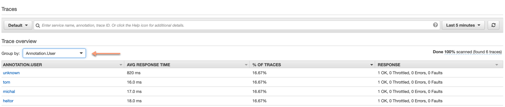
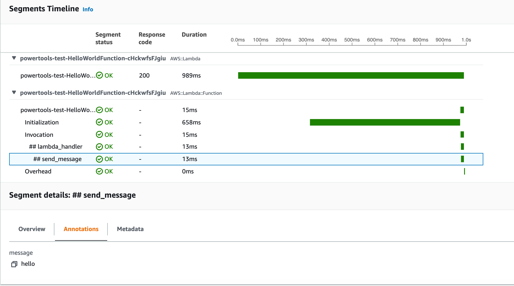
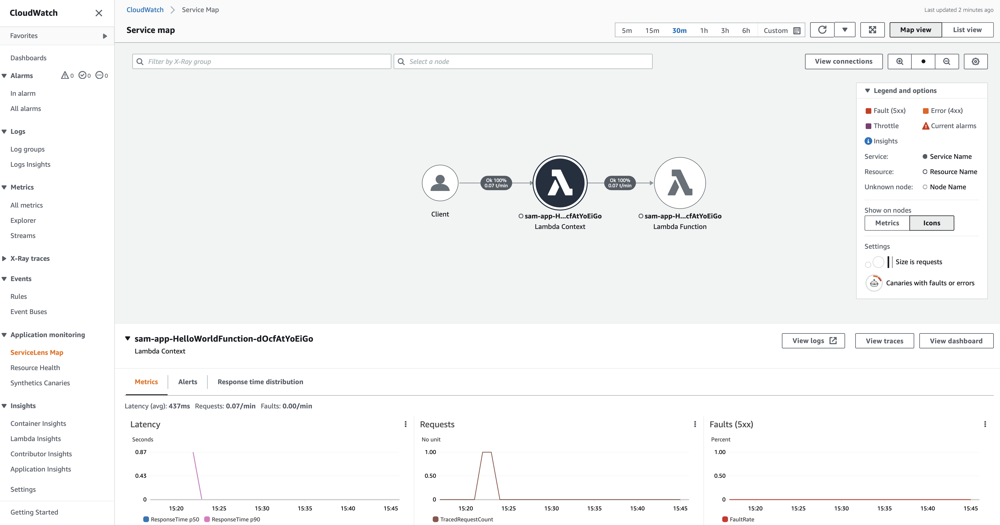
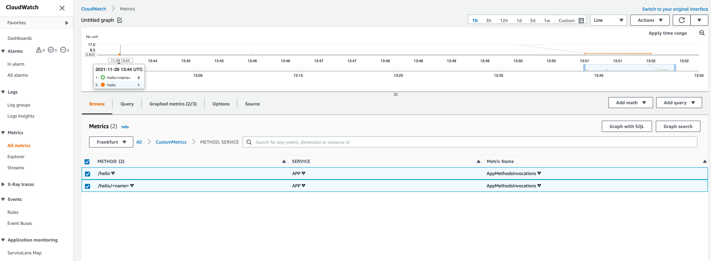

<!-- markdownlint-disable MD043 MD041 -->

This tutorial progressively introduces Powertools for AWS Lambda (Python) core utilities by using one feature at a time.

## Requirements

* [AWS CLI](https://docs.aws.amazon.com/cli/latest/userguide/getting-started-install.html){target="_blank"} and [configured with your credentials](https://docs.aws.amazon.com/serverless-application-model/latest/developerguide/serverless-getting-started-set-up-credentials.html){target="_blank"}.
* [AWS SAM CLI](https://docs.aws.amazon.com/serverless-application-model/latest/developerguide/serverless-sam-cli-install.html){target="_blank"} installed.

## Getting started

Let's clone our sample project before we add one feature at a time.

???+ tip "Tip: Want to skip to the final project?"
    Bootstrap directly via SAM CLI:

    ```shell
    sam init --app-template hello-world-powertools-python --name sam-app --package-type Zip --runtime python3.10 --no-tracing`
    ```

```bash title="Use SAM CLI to initialize the sample project"
sam init --runtime python3.10 --dependency-manager pip --app-template hello-world --name powertools-quickstart
```

### Project structure

As we move forward, we will modify the following files within the `powertools-quickstart` folder:

* **app.py** - Application code.
* **template.yaml** - AWS infrastructure configuration using SAM.
* **requirements.txt** - List of extra Python packages needed.

### Code example

Let's configure our base application to look like the following code snippet.

=== "app.py"

    ```python
    import json


    def hello():
        return {"statusCode": 200, "body": json.dumps({"message": "hello unknown!"})}


    def lambda_handler(event, context):
        return hello()
    ```

=== "template.yaml"

    ```yaml
    AWSTemplateFormatVersion: '2010-09-09'
    Transform: AWS::Serverless-2016-10-31
    Description: Sample SAM Template for powertools-quickstart
    Globals:
        Function:
            Timeout: 3
    Resources:
        HelloWorldFunction:
            Type: AWS::Serverless::Function
            Properties:
                CodeUri: hello_world/
                Handler: app.lambda_handler
                Runtime: python3.9
                Architectures:
                    - x86_64
                Events:
                    HelloWorld:
                        Type: Api
                        Properties:
                            Path: /hello
                            Method: get
    Outputs:
        HelloWorldApi:
            Description: "API Gateway endpoint URL for Prod stage for Hello World function"
            Value: !Sub "https://${ServerlessRestApi}.execute-api.${AWS::Region}.amazonaws.com/Prod/hello/"
    ```
Our Lambda code consists of an entry point function named `lambda_handler`, and a `hello` function.

When API Gateway receives a HTTP GET request on `/hello` route, Lambda will call our `lambda_handler` function, subsequently calling the `hello` function. API Gateway will use this response to return the correct HTTP Status Code and payload back to the caller.

???+ warning
    For simplicity, we do not set up authentication and authorization! You can find more information on how to implement it on [AWS SAM documentation](https://docs.aws.amazon.com/serverless-application-model/latest/developerguide/serverless-controlling-access-to-apis.html){target="_blank"}.

### Run your code

At each point, you have two ways to run your code: locally and within your AWS account.

#### Local test

AWS SAM allows you to execute a serverless application locally by running `sam build && sam local start-api` in your preferred shell.

```bash title="Build and run API Gateway locally"
> sam build && sam local start-api
...
2021-11-26 17:43:08  * Running on http://127.0.0.1:3000/ (Press CTRL+C to quit)
```

As a result, a local API endpoint will be exposed and you can invoke it using your browser, or your preferred HTTP API client e.g., [Postman](https://www.postman.com/downloads/){target="_blank"}, [httpie](https://httpie.io/){target="_blank"}, etc.

```bash title="Invoking our function locally via curl"
> curl http://127.0.0.1:3000/hello
{"message": "hello unknown!"}
```

???+ info
    To learn more about local testing, please visit the [AWS SAM CLI local testing](https://docs.aws.amazon.com/serverless-application-model/latest/developerguide/sam-cli-command-reference-sam-local-start-api.html){target="_blank"} documentation.

#### Live test

First, you need to deploy your application into your AWS Account by issuing `sam build && sam deploy --guided` command. This command builds a ZIP package of your source code, and deploy it to your AWS Account.

```bash title="Build and deploy your serverless application"
> sam build && sam deploy --guided
...
CloudFormation outputs from deployed stack
------------------------------------------------------------------------------------------------------------------------------------------
Outputs
------------------------------------------------------------------------------------------------------------------------------------------
Key                 HelloWorldFunctionIamRole
Description         Implicit IAM Role created for Hello World function
Value               arn:aws:iam::123456789012:role/sam-app-HelloWorldFunctionRole-1T2W3H9LZHGGV

Key                 HelloWorldApi
Description         API Gateway endpoint URL for Prod stage for Hello World function
Value               https://1234567890.execute-api.eu-central-1.amazonaws.com/Prod/hello/

Key                 HelloWorldFunction
Description         Hello World Lambda Function ARN
Value               arn:aws:lambda:eu-central-1:123456789012:function:sam-app-HelloWorldFunction-dOcfAtYoEiGo
------------------------------------------------------------------------------------------------------------------------------------------
Successfully created/updated stack - sam-app in eu-central-1
```

At the end of the deployment, you will find the API endpoint URL within `Outputs` section. You can use this URL to test your serverless application.

```bash title="Invoking our application via API endpoint"
> curl https://1234567890.execute-api.eu-central-1.amazonaws.com/Prod/hello
{"message": "hello unknown!"}%
```

???+ Info
    For more details on AWS SAM deployment mechanism, see [SAM Deploy reference docs](https://docs.aws.amazon.com/serverless-application-model/latest/developerguide/sam-cli-command-reference-sam-deploy.html){target="_blank"}.

## Routing

### Adding a new route

Let's expand our application with a new route - `/hello/{name}`. It will accept an username as a path input and return it in the response.

For this to work, we could create a new Lambda function to handle incoming requests for `/hello/{name}` - It'd look like this:

=== "hello_by_name.py"

    ```python
    import json


    def hello_name(name):
        return {"statusCode": 200, "body": json.dumps({"message": f"hello {name}!"})}


    def lambda_handler(event, context):
        name = event["pathParameters"]["name"]
        return hello_name(name)
    ```

=== "template.yaml"

    ```yaml hl_lines="21-32"
    AWSTemplateFormatVersion: "2010-09-09"
    Transform: AWS::Serverless-2016-10-31
    Description: Sample SAM Template for powertools-quickstart
    Globals:
        Function:
            Timeout: 3
    Resources:
        HelloWorldFunction:
            Type: AWS::Serverless::Function
            Properties:
                CodeUri: hello_world/
                Handler: app.lambda_handler
                Runtime: python3.9
                Events:
                    HelloWorld:
                        Type: Api
                        Properties:
                            Path: /hello
                            Method: get

        HelloWorldByNameFunctionName:
            Type: AWS::Serverless::Function
            Properties:
                CodeUri: hello_world/
                Handler: hello_by_name.lambda_handler
                Runtime: python3.9
                Events:
                    HelloWorldName:
                        Type: Api
                        Properties:
                            Path: /hello/{name}
                            Method: get
    Outputs:
        HelloWorldApi:
            Description: "API Gateway endpoint URL for Prod stage for Hello World function"
            Value: !Sub "https://${ServerlessRestApi}.execute-api.${AWS::Region}.amazonaws.com/Prod/hello/"
    ```

???+ question
    But what happens if your application gets bigger and we need to cover numerous URL paths and HTTP methods for them?

**This would quickly become non-trivial to maintain**. Adding new Lambda function for each path, or multiple if/else to handle several routes & HTTP Methods can be error prone.

### Creating our own router

???+ question
    What if we create a simple router to reduce boilerplate?

We could group similar routes and intents, separate read and write operations resulting in fewer functions. It doesn't address the boilerplate routing code, but maybe it will be easier to add additional URLs.

???+ info "Info: You might be already asking yourself about mono vs micro-functions"
    If you want a more detailed explanation of these two approaches, head over to the [trade-offs on each approach](../core/event_handler/api_gateway/#considerations){target="_blank"} later.

A first attempt at the routing logic might look similar to the following code snippet.

=== "app.py"

    ```python hl_lines="4 9 13 27-29 35-36"
    import json


    def hello_name(event, **kargs):
        username = event["pathParameters"]["name"]
        return {"statusCode": 200, "body": json.dumps({"message": f"hello {username}!"})}


    def hello(**kargs):
        return {"statusCode": 200, "body": json.dumps({"message": "hello unknown!"})}


    class Router:
        def __init__(self):
            self.routes = {}

        def set(self, path, method, handler):
            self.routes[f"{path}-{method}"] = handler

        def get(self, path, method):
            try:
                route = self.routes[f"{path}-{method}"]
            except KeyError:
                raise RuntimeError(f"Cannot route request to the correct method. path={path}, method={method}")
            return route

    router = Router()
    router.set(path="/hello", method="GET", handler=hello)
    router.set(path="/hello/{name}", method="GET", handler=hello_name)


    def lambda_handler(event, context):
        path = event["resource"]
        http_method = event["httpMethod"]
        method = router.get(path=path, method=http_method)
        return method(event=event)
    ```

=== "template.yaml"

    ```yaml hl_lines="15-24"
    AWSTemplateFormatVersion: "2010-09-09"
    Transform: AWS::Serverless-2016-10-31
    Description: Sample SAM Template for powertools-quickstart
    Globals:
        Function:
            Timeout: 3
    Resources:
        HelloWorldFunction:
            Type: AWS::Serverless::Function
            Properties:
                CodeUri: hello_world/
                Handler: app.lambda_handler
                Runtime: python3.9
                Events:
                    HelloWorld:
                        Type: Api
                        Properties:
                            Path: /hello
                            Method: get
                    HelloWorldName:
                        Type: Api
                        Properties:
                            Path: /hello/{name}
                            Method: get
    Outputs:
        HelloWorldApi:
            Description: "API Gateway endpoint URL for Prod stage for Hello World function"
            Value: !Sub "https://${ServerlessRestApi}.execute-api.${AWS::Region}.amazonaws.com/Prod/hello/"
    ```

Let's break this down:

* **L4,9**: We defined two `hello_name` and `hello` functions to handle `/hello/{name}` and `/hello` routes.
* **L13:** We added a `Router` class to map a path, a method, and the function to call.
* **L27-29**: We create a `Router` instance and map both `/hello` and `/hello/{name}`.
* **L35:** We use Router's `get` method to retrieve a reference to the processing method (`hello` or `hello_name`).
* **L36:** Finally, we run this method and send the results back to API Gateway.

This approach simplifies the configuration of our infrastructure since we have added all API Gateway paths in the `HelloWorldFunction` event section.

However, it forces us to understand the internal structure of the API Gateway request events, responses, and it could lead to other errors such as CORS not being handled properly, error handling, etc.

### Simplifying with Event Handler

We can massively simplify cross-cutting concerns while keeping it lightweight by using [Event Handler](../core/event_handler/api_gateway.md){target="_blank"}.

???+ tip
    This is available for both [REST API (API Gateway, ALB)](../core/event_handler/api_gateway.md){target="_blank"} and [GraphQL API (AppSync)](../core/event_handler/appsync.md){target="_blank"}.

Let's include Powertools for AWS Lambda (Python) as a dependency in `requirement.txt`, and use Event Handler to refactor our previous example.

=== "app.py"

    ```python hl_lines="1 3 6 11 17"
    from aws_lambda_powertools.event_handler import APIGatewayRestResolver

    app = APIGatewayRestResolver()


    @app.get("/hello/<name>")
    def hello_name(name):
        return {"message": f"hello {name}!"}


    @app.get("/hello")
    def hello():
        return {"message": "hello unknown!"}


    def lambda_handler(event, context):
        return app.resolve(event, context)
    ```
=== "requirements.txt"

    ```bash
    aws-lambda-powertools[tracer]  # Tracer requires AWS X-Ray SDK dependency
    ```

Use `sam build && sam local start-api` and try run it locally again.

???+ note
    If you're coming from [Flask](https://flask.palletsprojects.com/en/2.0.x/){target="_blank"}, you will be familiar with this experience already. [Event Handler for API Gateway](../core/event_handler/api_gateway.md){target="_blank"} uses `APIGatewayRestResolver` to give a Flask-like experience while staying true to our tenet `Keep it lean`.

We have added the route annotation as the decorator for our methods. It enables us to use the parameters passed in the request directly, and our responses are simply dictionaries.

Lastly, we used `return app.resolve(event, context)` so Event Handler can resolve routes, inject the current request, handle serialization, route validation, etc.

From here, we could handle [404 routes](../core/event_handler/api_gateway.md#handling-not-found-routes){target="_blank"}, [error handling](../core/event_handler/api_gateway.md#exception-handling){target="_blank"}, [access query strings, payload](../core/event_handler/api_gateway.md#accessing-request-details){target="_blank"}, etc.

???+ tip
    If you'd like to learn how python decorators work under the hood, you can follow [Real Python](https://realpython.com/primer-on-python-decorators/){target="_blank"}'s article.

## Structured Logging

Over time, you realize that searching logs as text results in poor observability, it's hard to create metrics from, enumerate common exceptions, etc.

Then, you decided to propose production quality logging capabilities to your Lambda code. You found out that by having logs as `JSON` you can [structure them](https://docs.aws.amazon.com/lambda/latest/operatorguide/parse-logs.html){target="_blank"}, so that you can use any Log Analytics tool out there to quickly analyze them.

This helps not only in searching, but produces consistent logs containing enough context and data to ask arbitrary questions on the status of your system. We can take advantage of CloudWatch Logs and Cloudwatch Insight for this purpose.

### JSON as output

The first option could be to use the standard Python Logger, and use a specialized library like `pythonjsonlogger` to create a JSON Formatter.

=== "app.py"

    ```python hl_lines="4 5 7-12 19 25 30"
    import logging
    import os

    from pythonjsonlogger import jsonlogger
    from aws_lambda_powertools.event_handler import APIGatewayRestResolver

    logger = logging.getLogger("APP")
    logHandler = logging.StreamHandler()
    formatter = jsonlogger.JsonFormatter(fmt="%(asctime)s %(levelname)s %(name)s %(message)s")
    logHandler.setFormatter(formatter)
    logger.addHandler(logHandler)
    logger.setLevel(os.getenv("LOG_LEVEL", "INFO"))

    app = APIGatewayRestResolver()


    @app.get("/hello/<name>")
    def hello_name(name):
        logger.info(f"Request from {name} received")
        return {"message": f"hello {name}!"}


    @app.get("/hello")
    def hello():
        logger.info("Request from unknown received")
        return {"message": "hello unknown!"}


    def lambda_handler(event, context):
        logger.debug(event)
        return app.resolve(event, context)
    ```
=== "requirements.txt"

    ```bash
    aws-lambda-powertools
    python-json-logger
    ```

With just a few lines our logs will now output to `JSON` format. We've taken the following steps to make that work:

* **L7**: Creates an application logger named `APP`.
* **L8-11**: Configures handler and formatter.
* **L12**: Sets the logging level set in the `LOG_LEVEL` environment variable, or `INFO` as a sentinel value.

After that, we use this logger in our application code to record the required information. We see logs structured as follows:

=== "JSON output"

    ```json
    {
        "asctime": "2021-11-22 15:32:02,145",
        "levelname": "INFO",
        "name": "APP",
        "message": "Request from unknown received"
    }
    ```

=== "Normal output"

    ```python
    [INFO]  2021-11-22T15:32:02.145Z        ba3bea3d-fe3a-45db-a2ce-72e813d55b91    Request from unknown received
    ```

So far, so good! We can take a step further now by adding additional context to the logs.

We could start by creating a dictionary with Lambda context information or something from the incoming event, which should always be logged. Additional attributes could be added on every `logger.info` using `extra` keyword like in any standard Python logger.

### Simplifying with Logger

???+ question "Surely this could be easier, right?"
    Yes! Powertools for AWS Lambda (Python) Logger to the rescue :-)

As we already have Powertools for AWS Lambda (Python) as a dependency, we can simply import [Logger](../core/logger.md){target="_blank"}.

```python title="Refactoring with Powertools for AWS Lambda (Python) Logger" hl_lines="1 3 5 12 18 22"
from aws_lambda_powertools import Logger
from aws_lambda_powertools.event_handler import APIGatewayRestResolver
from aws_lambda_powertools.logging import correlation_paths

logger = Logger(service="APP")

app = APIGatewayRestResolver()


@app.get("/hello/<name>")
def hello_name(name):
    logger.info(f"Request from {name} received")
    return {"message": f"hello {name}!"}


@app.get("/hello")
def hello():
    logger.info("Request from unknown received")
    return {"message": "hello unknown!"}


@logger.inject_lambda_context(correlation_id_path=correlation_paths.API_GATEWAY_REST, log_event=True)
def lambda_handler(event, context):
    return app.resolve(event, context)
```

Let's break this down:

* **L5**: We add Powertools for AWS Lambda (Python) Logger; the boilerplate is now done for you. By default, we set `INFO` as the logging level if `LOG_LEVEL` env var isn't set.
* **L22**: We use `logger.inject_lambda_context` decorator to inject key information from Lambda context into every log.
* **L22**: We also instruct Logger to use the incoming API Gateway Request ID as a [correlation id](../core/logger.md##set_correlation_id-method){target="_blank"} automatically.
* **L22**: Since we're in dev, we also use `log_event=True` to automatically log each incoming request for debugging. This can be also set via [environment variables](./index.md#environment-variables){target="_blank"}.

This is how the logs would look like now:

```json title="Our logs are now structured consistently"
{
    "level":"INFO",
    "location":"hello:17",
    "message":"Request from unknown received",
    "timestamp":"2021-10-22 16:29:58,367+0000",
    "service":"APP",
    "cold_start":true,
    "function_name":"HelloWorldFunction",
    "function_memory_size":"256",
    "function_arn":"arn:aws:lambda:us-east-1:123456789012:function:HelloWorldFunction",
    "function_request_id":"d50bb07a-7712-4b2d-9f5d-c837302221a2",
    "correlation_id":"bf9b584c-e5d9-4ad5-af3d-db953f2b10dc"
}
```

We can now search our logs by the request ID to find a specific operation. Additionally, we can also search our logs for function name, Lambda request ID, Lambda function ARN, find out whether an operation was a cold start, etc.

From here, we could [set specific keys](../core/logger.md#append_keys-method){target="_blank"} to add additional contextual information about a given operation, [log exceptions](../core/logger.md#logging-exceptions){target="_blank"} to easily enumerate them later, [sample debug logs](../core/logger.md#sampling-debug-logs){target="_blank"}, etc.

By having structured logs like this, we can easily search and analyse them in [CloudWatch Logs Insight](https://docs.aws.amazon.com/AmazonCloudWatch/latest/logs/AnalyzingLogData.html){target="_blank"}.

=== "CloudWatch Logs Insight Example"


## Tracing

???+ note
    You won't see any traces in AWS X-Ray when executing your function locally.

The next improvement is to add distributed tracing to your stack. Traces help you visualize end-to-end transactions or parts of it to easily debug upstream/downstream anomalies.

Combined with structured logs, it is an important step to be able to observe how your application runs in production.

### Generating traces

[AWS X-Ray](https://aws.amazon.com/xray/){target="_blank"} is the distributed tracing service we're going to use. But how do we generate application traces in the first place?

It's a [two-step process](https://docs.aws.amazon.com/lambda/latest/dg/services-xray.html){target="_blank"}:

1. Enable tracing in your Lambda function.
2. Instrument your application code.

Let's explore how we can instrument our code with [AWS X-Ray SDK](https://docs.aws.amazon.com/xray-sdk-for-python/latest/reference/index.html){target="_blank"}, and then simplify it with [Powertools for AWS Lambda (Python) Tracer](../core/tracer.md){target="_blank"} feature.

=== "app.py"

    ```python hl_lines="1 13 20 27"
    from aws_xray_sdk.core import xray_recorder

    from aws_lambda_powertools import Logger
    from aws_lambda_powertools.event_handler import APIGatewayRestResolver
    from aws_lambda_powertools.logging import correlation_paths

    logger = Logger(service="APP")

    app = APIGatewayRestResolver()


    @app.get("/hello/<name>")
    @xray_recorder.capture('hello_name')
    def hello_name(name):
        logger.info(f"Request from {name} received")
        return {"message": f"hello {name}!"}


    @app.get("/hello")
    @xray_recorder.capture('hello')
    def hello():
        logger.info("Request from unknown received")
        return {"message": "hello unknown!"}


    @logger.inject_lambda_context(correlation_id_path=correlation_paths.API_GATEWAY_REST, log_event=True)
    @xray_recorder.capture('handler')
    def lambda_handler(event, context):
        return app.resolve(event, context)
    ```

=== "template.yaml"

    ```yaml hl_lines="7-8 16"
    AWSTemplateFormatVersion: "2010-09-09"
    Transform: AWS::Serverless-2016-10-31
    Description: Sample SAM Template for powertools-quickstart
    Globals:
        Function:
            Timeout: 3
        Api:
          TracingEnabled: true
    Resources:
        HelloWorldFunction:
            Type: AWS::Serverless::Function
            Properties:
                CodeUri: hello_world/
                Handler: app.lambda_handler
                Runtime: python3.9
                Tracing: Active
                Events:
                    HelloWorld:
                        Type: Api
                        Properties:
                            Path: /hello
                            Method: get
                    HelloWorldName:
                        Type: Api
                        Properties:
                            Path: /hello/{name}
                            Method: get
    Outputs:
        HelloWorldApi:
            Description: "API Gateway endpoint URL for Prod stage for Hello World function"
            Value: !Sub "https://${ServerlessRestApi}.execute-api.${AWS::Region}.amazonaws.com/Prod/hello/"
    ```

=== "requirements.txt"

    ```bash
    aws-lambda-powertools
    aws-xray-sdk
    ```

Let's break it down:

* **L1**: First, we import AWS X-Ray SDK. `xray_recorder` records blocks of code being traced ([subsegment](https://docs.aws.amazon.com/xray/latest/devguide/xray-concepts.html#xray-concepts-subsegments){target="_blank"}). It also sends generated traces to the AWS X-Ray daemon running in the Lambda service who subsequently forwards them to AWS X-Ray service.
* **L13,20,27**: We decorate our function so the SDK traces the end-to-end execution, and the argument names the generated block being traced.

???+ question
    But how do I enable tracing for the Lambda function and what permissions do I need?

We've made the following changes in `template.yaml` for this to work seamless:

* **L7-8**: Enables tracing for Amazon API Gateway.
* **L16**: Enables tracing for our Serverless Function. This will also add a managed IAM Policy named [AWSXRayDaemonWriteAccess](https://console.aws.amazon.com/iam/home#/policies/arn:aws:iam::aws:policy/AWSXRayDaemonWriteAccess){target="_blank"} to allow Lambda to send traces to AWS X-Ray.

You can now build and deploy our updates with `sam build && sam deploy`. Once deployed, try invoking the application via the API endpoint, and visit [AWS X-Ray Console](https://console.aws.amazon.com/xray/home#/traces/){target="_blank"} to see how much progress we've made so far!!


### Enriching our generated traces

What we've done helps bring an initial visibility, but we can do so much more.

???+ question
    You're probably asking yourself at least the following questions:

    * What if I want to search traces by customer name?
    * What about grouping traces with cold starts?
    * Better yet, what if we want to include the request or response of our functions as part of the trace?

Within AWS X-Ray, we can answer these questions by using two features: tracing **Annotations** and **Metadata**.

**Annotations** are simple key-value pairs that are indexed for use with [filter expressions](https://docs.aws.amazon.com/xray/latest/devguide/xray-console-filters.html){target="_blank"}.
**Metadata** are key-value pairs with values of any type, including objects and lists, but that are not indexed.

Let's put them into action.

```python title="Enriching traces with annotations and metadata" hl_lines="10 17-18 26-27 35 37-42 45"
from aws_xray_sdk.core import patch_all, xray_recorder

from aws_lambda_powertools import Logger
from aws_lambda_powertools.event_handler import APIGatewayRestResolver
from aws_lambda_powertools.logging import correlation_paths

logger = Logger(service="APP")

app = APIGatewayRestResolver()
cold_start = True
patch_all()


@app.get("/hello/<name>")
@xray_recorder.capture('hello_name')
def hello_name(name):
    subsegment = xray_recorder.current_subsegment()
    subsegment.put_annotation(key="User", value=name)
    logger.info(f"Request from {name} received")
    return {"message": f"hello {name}!"}


@app.get("/hello")
@xray_recorder.capture('hello')
def hello():
    subsegment = xray_recorder.current_subsegment()
    subsegment.put_annotation(key="User", value="unknown")
    logger.info("Request from unknown received")
    return {"message": "hello unknown!"}


@logger.inject_lambda_context(correlation_id_path=correlation_paths.API_GATEWAY_REST, log_event=True)
@xray_recorder.capture('handler')
def lambda_handler(event, context):
    global cold_start

    subsegment = xray_recorder.current_subsegment()
    if cold_start:
        subsegment.put_annotation(key="ColdStart", value=cold_start)
        cold_start = False
    else:
        subsegment.put_annotation(key="ColdStart", value=cold_start)

    result = app.resolve(event, context)
    subsegment.put_metadata("response", result)

    return result
```

Let's break it down:

* **L10**: We track Lambda cold start by setting global variable outside the handler; this is executed once per sandbox Lambda creates. This information provides an overview of how often the sandbox is reused by Lambda, which directly impacts the performance of each transaction.
* **L17-18**: We use AWS X-Ray SDK to add `User` annotation on `hello_name` subsegment. This will allow us to filter traces using the `User` value.
* **L26-27**: We repeat what we did in L17-18 except we use the value `unknown` since we don't have that information.
* **L35**: We use `global` to modify our global variable defined in the outer scope.
* **37-42**: We add `ColdStart` annotation and flip the value of `cold_start` variable, so that subsequent requests annotates the value `false` when the sandbox is reused.
* **L45**: We include the final response under `response` key as part of the `handler` subsegment.

???+ info
    If you want to understand how the Lambda execution environment (sandbox) works and why cold starts can occur, see this [blog series on Lambda performance](https://aws.amazon.com/blogs/compute/operating-lambda-performance-optimization-part-1/){target="_blank"}.

Repeat the process of building, deploying, and invoking your application via the API endpoint.

Within the [AWS X-Ray Console](https://console.aws.amazon.com/xray/home#/traces/){target="_blank"}, you should now be able to group traces by the `User` and `ColdStart` annotation.



If you choose any of the traces available, try opening the `handler` subsegment and you should see the response of your Lambda function under the `Metadata` tab.


### Simplifying with Tracer

Cross-cutting concerns like filtering traces by Cold Start, including response as well as exceptions as tracing metadata can take a considerable amount of boilerplate.

We can simplify our previous patterns by using [Powertools for AWS Lambda (Python) Tracer](../core/tracer.md){target="_blank"}; a thin wrapper on top of X-Ray SDK.

???+ note
    You can now safely remove `aws-xray-sdk` from `requirements.txt`; keep `aws-lambda-powertools` only.

```python title="Refactoring with Powertools for AWS Lambda (Python) Tracer" hl_lines="1 6 11 13 19 21 27"
from aws_lambda_powertools import Logger, Tracer
from aws_lambda_powertools.event_handler import APIGatewayRestResolver
from aws_lambda_powertools.logging import correlation_paths

logger = Logger(service="APP")
tracer = Tracer(service="APP")
app = APIGatewayRestResolver()


@app.get("/hello/<name>")
@tracer.capture_method
def hello_name(name):
    tracer.put_annotation(key="User", value=name)
    logger.info(f"Request from {name} received")
    return {"message": f"hello {name}!"}


@app.get("/hello")
@tracer.capture_method
def hello():
    tracer.put_annotation(key="User", value="unknown")
    logger.info("Request from unknown received")
    return {"message": "hello unknown!"}


@logger.inject_lambda_context(correlation_id_path=correlation_paths.API_GATEWAY_REST, log_event=True)
@tracer.capture_lambda_handler
def lambda_handler(event, context):
    return app.resolve(event, context)
```

Decorators, annotations and metadata are largely the same, except we now have a much cleaner code as the boilerplate is gone. Here's what's changed compared to AWS X-Ray SDK approach:

* **L6**: We initialize `Tracer` and define the name of our service (`APP`). We automatically run `patch_all` from AWS X-Ray SDK on your behalf. Any previously patched or non-imported library is simply ignored.
* **L11**: We use `@tracer.capture_method` decorator instead of `xray_recorder.capture`. We automatically create a subsegment named after the function name (`## hello_name`), and add the response/exception as tracing metadata.
* **L13**: Putting annotations remain exactly the same UX.
* **L27**: We use `@tracer.lambda_handler` so we automatically add `ColdStart` annotation within Tracer itself. We also add a new `Service` annotation using the value of `Tracer(service="APP")`, so that you can filter traces by the service your function(s) represent.

Another subtle difference is that you can now run your Lambda functions and unit test them locally without having to explicitly disable Tracer.

Powertools for AWS Lambda (Python) optimizes for Lambda compute environment. As such, we add these and other common approaches to accelerate your development, so you don't worry about implementing every cross-cutting concern.

???+ tip
    You can [opt-out some of these behaviours](../core/tracer/#advanced){target="_blank"} like disabling response capturing,  explicitly patching only X modules, etc.

Repeat the process of building, deploying, and invoking your application via the API endpoint. Within the [AWS X-Ray Console](https://console.aws.amazon.com/xray/home#/traces/){target="_blank"}, you should see a similar view:



???+ tip
    Consider using [Amazon CloudWatch ServiceLens view](https://console.aws.amazon.com/cloudwatch/home#servicelens:service-map/map){target="_blank"} as it aggregates AWS X-Ray traces and CloudWatch metrics and logs in one view.

From here, you can browse to specific logs in CloudWatch Logs Insight, Metrics Dashboard or AWS X-Ray traces.



???+ info
    For more information on Amazon CloudWatch ServiceLens, please visit [link](https://docs.aws.amazon.com/AmazonCloudWatch/latest/monitoring/ServiceLens.html){target="_blank"}.

## Custom Metrics

### Creating metrics

Let's add custom metrics to better understand our application and business behavior (e.g. number of reservations, etc.).

By default, AWS Lambda adds [invocation and performance metrics](https://docs.aws.amazon.com/lambda/latest/dg/monitoring-metrics.html#monitoring-metrics-types){target="_blank"}, and Amazon API Gateway adds [latency and some HTTP metrics](https://docs.aws.amazon.com/apigateway/latest/developerguide/api-gateway-metrics-and-dimensions.html#api-gateway-metrics){target="_blank"}.

???+ tip
    You can [optionally enable detailed metrics](https://docs.aws.amazon.com/apigateway/latest/developerguide/api-gateway-metrics-and-dimensions.html#api-gateway-metricdimensions){target="_blank"} per each API route, stage, and method in API Gateway.

Let's expand our application with custom metrics using AWS SDK to see how it works, then let's upgrade it with Powertools for AWS Lambda (Python) :-)

=== "app.py"

    ```python hl_lines="3 10 14 19-47 55 64"
    import os

    import boto3

    from aws_lambda_powertools import Logger, Tracer
    from aws_lambda_powertools.event_handler import APIGatewayRestResolver
    from aws_lambda_powertools.logging import correlation_paths

    cold_start = True
    metric_namespace = "MyApp"

    logger = Logger(service="APP")
    tracer = Tracer(service="APP")
    metrics = boto3.client("cloudwatch")
    app = APIGatewayRestResolver()


    @tracer.capture_method
    def add_greeting_metric(service: str = "APP"):
        function_name = os.getenv("AWS_LAMBDA_FUNCTION_NAME", "undefined")
        service_dimension = {"Name": "service", "Value": service}
        function_dimension = {"Name": "function_name", "Value": function_name}
        is_cold_start = True

        global cold_start
        if cold_start:
            cold_start = False
        else:
            is_cold_start = False

        return metrics.put_metric_data(
            MetricData=[
                {
                    "MetricName": "SuccessfulGreetings",
                    "Dimensions": [service_dimension],
                    "Unit": "Count",
                    "Value": 1,
                },
                {
                    "MetricName": "ColdStart",
                    "Dimensions": [service_dimension, function_dimension],
                    "Unit": "Count",
                    "Value": int(is_cold_start)
                }
            ],
            Namespace=metric_namespace,
        )


    @app.get("/hello/<name>")
    @tracer.capture_method
    def hello_name(name):
        tracer.put_annotation(key="User", value=name)
        logger.info(f"Request from {name} received")
        add_greeting_metric()
        return {"message": f"hello {name}!"}


    @app.get("/hello")
    @tracer.capture_method
    def hello():
        tracer.put_annotation(key="User", value="unknown")
        logger.info("Request from unknown received")
        add_greeting_metric()
        return {"message": "hello unknown!"}


    @logger.inject_lambda_context(correlation_id_path=correlation_paths.API_GATEWAY_REST, log_event=True)
    @tracer.capture_lambda_handler
    def lambda_handler(event, context):
        return app.resolve(event, context)
    ```

=== "template.yaml"

    ```yaml hl_lines="27 28"
    AWSTemplateFormatVersion: "2010-09-09"
    Transform: AWS::Serverless-2016-10-31
    Description: Sample SAM Template for powertools-quickstart
    Globals:
        Function:
            Timeout: 3
    Resources:
        HelloWorldFunction:
            Type: AWS::Serverless::Function
            Properties:
                CodeUri: hello_world/
                Handler: app.lambda_handler
                Runtime: python3.9
                Tracing: Active
                Events:
                    HelloWorld:
                        Type: Api
                        Properties:
                            Path: /hello
                            Method: get
                    HelloWorldName:
                        Type: Api
                        Properties:
                            Path: /hello/{name}
                            Method: get
                Policies:
                    - CloudWatchPutMetricPolicy: {}
    Outputs:
        HelloWorldApi:
            Description: "API Gateway endpoint URL for Prod stage for Hello World function"
            Value: !Sub "https://${ServerlessRestApi}.execute-api.${AWS::Region}.amazonaws.com/Prod/hello/"

    ```

There's a lot going on, let's break this down:

* **L10**: We define a container where all of our application metrics will live `MyApp`, a.k.a [Metrics Namespace](https://docs.aws.amazon.com/AmazonCloudWatch/latest/monitoring/cloudwatch_concepts.html){target="_blank"}.
* **L14**: We initialize a CloudWatch client to send metrics later.
* **L19-47**: We create a custom function to prepare and send `ColdStart` and `SuccessfulGreetings` metrics using CloudWatch expected data structure. We also set [dimensions](https://docs.aws.amazon.com/AmazonCloudWatch/latest/monitoring/cloudwatch_concepts.html#Dimension){target="_blank"} of these metrics.
    * Think of them as metadata to define to slice and dice them later; an unique metric is a combination of metric name + metric dimension(s).
* **L55,64**: We call our custom function to create metrics for every greeting received.

???+ question
    But what permissions do I need to send metrics to CloudWatch?

Within `template.yaml`, we add [CloudWatchPutMetricPolicy](https://docs.aws.amazon.com/serverless-application-model/latest/developerguide/serverless-policy-template-list.html#cloudwatch-put-metric-policy){target="_blank"} policy in SAM.

???+ note "Adding metrics via AWS SDK gives a lot of flexibility at a cost"
    `put_metric_data` is a synchronous call to CloudWatch Metrics API. This means establishing a connection to CloudWatch endpoint, sending metrics payload, and waiting from a response.

    It will be visible in your AWS X-RAY traces as additional external call. Given your architecture scale, this approach might lead to disadvantages such as increased cost of measuring data collection and increased Lambda latency.

### Simplifying with Metrics

[Powertools for AWS Lambda (Python) Metrics](../core/metrics.md){target="_blank} uses [Amazon CloudWatch Embedded Metric Format (EMF)](https://docs.aws.amazon.com/AmazonCloudWatch/latest/monitoring/CloudWatch_Embedded_Metric_Format.html){target="_blank"} to create custom metrics **asynchronously** via a native integration with Lambda.

In general terms, EMF is a specification that expects metrics in a JSON payload within CloudWatch Logs. Lambda ingests all logs emitted by a given function into CloudWatch Logs. CloudWatch automatically looks up for log entries that follow the EMF format and transforms them into a CloudWatch metric.

???+ info
    If you are interested in the details of the EMF mechanism, follow [blog post](https://aws.amazon.com/blogs/mt/enhancing-workload-observability-using-amazon-cloudwatch-embedded-metric-format/){target="_blank"}.

Let's implement that using [Metrics](../core/metrics.md){target="_blank}:

```python title="Refactoring with Powertools for AWS Lambda (Python) Metrics" hl_lines="1 4 9 18 27 33"
from aws_lambda_powertools import Logger, Tracer, Metrics
from aws_lambda_powertools.event_handler import APIGatewayRestResolver
from aws_lambda_powertools.logging import correlation_paths
from aws_lambda_powertools.metrics import MetricUnit


logger = Logger(service="APP")
tracer = Tracer(service="APP")
metrics = Metrics(namespace="MyApp", service="APP")
app = APIGatewayRestResolver()


@app.get("/hello/<name>")
@tracer.capture_method
def hello_name(name):
    tracer.put_annotation(key="User", value=name)
    logger.info(f"Request from {name} received")
    metrics.add_metric(name="SuccessfulGreetings", unit=MetricUnit.Count, value=1)
    return {"message": f"hello {name}!"}


@app.get("/hello")
@tracer.capture_method
def hello():
    tracer.put_annotation(key="User", value="unknown")
    logger.info("Request from unknown received")
    metrics.add_metric(name="SuccessfulGreetings", unit=MetricUnit.Count, value=1)
    return {"message": "hello unknown!"}


@tracer.capture_lambda_handler
@logger.inject_lambda_context(correlation_id_path=correlation_paths.API_GATEWAY_REST, log_event=True)
@metrics.log_metrics(capture_cold_start_metric=True)
def lambda_handler(event, context):
    try:
        return app.resolve(event, context)
    except Exception as e:
        logger.exception(e)
        raise
```

That's a lot less boilerplate code! Let's break this down:

* **L9**: We initialize `Metrics` with our service name (`APP`) and metrics namespace (`MyApp`), reducing the need to add the `service` dimension for every metric and setting the namespace later
* **L18, 27**: We use `add_metric` similarly to our custom function, except we now have an enum `MetricCount` to help us understand which Metric Units we have at our disposal
* **L33**: We use `@metrics.log_metrics` decorator to ensure that our metrics are aligned with the EMF output and validated before-hand, like in case we forget to set namespace, or accidentally use a metric unit as a string that doesn't exist in CloudWatch.
* **L33**: We also use `capture_cold_start_metric=True` so we don't have to handle that logic either. Note that [Metrics](../core/metrics.md){target="_blank"} does not publish a warm invocation metric (ColdStart=0) for cost reasons. As such, treat the absence (sparse metric) as a non-cold start invocation.

Repeat the process of building, deploying, and invoking your application via the API endpoint a few times to generate metrics - [Artillery](https://www.artillery.io/){target="_blank"} and [K6.io](https://k6.io/open-source){target="_blank"} are quick ways to generate some load.

Within [CloudWatch Metrics view](https://console.aws.amazon.com/cloudwatch/home#metricsV2:graph=~()){target="_blank}, you should see `MyApp` custom namespace with your custom metrics there and `SuccessfulGreetings` available to graph.



If you're curious about how the EMF portion of your function logs look like, you can quickly go to [CloudWatch ServiceLens view](https://console.aws.amazon.com/cloudwatch/home#servicelens:service-map/map){target="_blank"}, choose your function and open logs. You will see a similar entry that looks like this:

```json
{
  "_aws": {
    "Timestamp": 1638115724269,
    "CloudWatchMetrics": [
      {
        "Namespace": "CustomMetrics",
        "Dimensions": [
          [
            "method",
            "service"
          ]
        ],
        "Metrics": [
          {
            "Name": "AppMethodsInvocations",
            "Unit": "Count"
          }
        ]
      }
    ]
  },
  "method": "/hello/<name>",
  "service": "APP",
  "AppMethodsInvocations": [
    1
  ]
}
```

## Final considerations

We covered a lot of ground here and we only scratched the surface of the feature set available within Powertools for AWS Lambda (Python).

When it comes to the observability features ([Tracer](../core/tracer.md){target="_blank"}, [Metrics](../core/metrics.md){target="_blank"}, [Logging](../core/logger.md){target="_blank"}), don't stop there! The goal here is to ensure you can ask arbitrary questions to assess your system's health; these features are only part of the wider story!

This requires a change in mindset to ensure operational excellence is part of the software development lifecycle.

???+ tip
    You can find more details on other leading practices described in the [Well-Architected Serverless Lens](https://aws.amazon.com/blogs/aws/new-serverless-lens-in-aws-well-architected-tool/){target="_blank"}.

    Powertools for AWS Lambda (Python) is largely designed to make some of these practices easier to adopt from day 1.

???+ question "Have ideas for other tutorials?"
    You can open up a [documentation issue](https://github.com/aws-powertools/powertools-lambda-python/issues/new?assignees=&labels=documentation&template=documentation-improvements.md&title=Tutorial%20Suggestion){target="_blank"}, or via e-mail [aws-lambda-powertools-feedback@amazon.com](mailto:aws-lambda-powertools-feedback@amazon.com).
