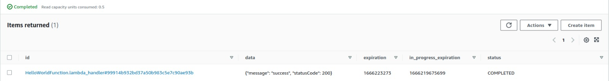

<!-- markdownlint-disable MD043 -->

## End of support v1

!!! warning "On March 31st, 2023, Powertools for AWS Lambda (Python) v1 reached end of support and will no longer receive updates or releases. If you are still using v1, we strongly recommend you to read our upgrade guide and update to the latest version."

Given our commitment to all of our customers using Powertools for AWS Lambda (Python), we will keep [Pypi](https://pypi.org/project/aws-lambda-powertools/){target="_blank"} v1 releases and documentation 1.x versions to prevent any disruption.

## Migrate to v2 from v1

We've made minimal breaking changes to make your transition to v2 as smooth as possible.

### Quick summary

| Area                               | Change                                                                                                                                                                                                  | Code change required | IAM Permissions change required |
| ---------------------------------- | ------------------------------------------------------------------------------------------------------------------------------------------------------------------------------------------------------- | -------------------- | ------------------------------- |
| **Batch**                          | Removed legacy [SQS batch processor](#legacy-sqs-batch-processor) in favour of **`BatchProcessor`**.                                                                                                    | Yes                  | -                               |
| **Environment variables**          | Removed legacy **`POWERTOOLS_EVENT_HANDLER_DEBUG`** in favour of [`POWERTOOLS_DEV`](index.md#optimizing-for-non-production-environments){target="_blank"}.                                              | -                    | -                               |
| **Event Handler**                  | Updated [headers response format](#event-handler-headers-response-format) due to [multi-value headers and cookie support](./core/event_handler/api_gateway.md#fine-grained-responses){target="_blank"}. | Tests only           | -                               |
| **Event Source Data Classes**      | Replaced [DynamoDBStreamEvent](#dynamodbstreamevent-in-event-source-data-classes) `AttributeValue` with native Python types.                                                                            | Yes                  | -                               |
| **Feature Flags** / **Parameters** | Updated [AppConfig API calls](#feature-flags-and-appconfig-parameter-utility) due to **`GetConfiguration`** API deprecation.                                                                            | -                    | Yes                             |
| **Idempotency**                    | Updated [partition key](#idempotency-partition-key-format) to include fully qualified function/method names.                                                                                            | -                    | -                               |

### First Steps

!!! note "All dependencies are optional now. [Tracer](core/tracer.md#install){target="_blank"}, [Validation](./utilities/validation.md#install){target="_blank"}, and [Parser](./utilities/parser.md){target="_blank"} now require additional dependencies."

Before you start, we suggest making a copy of your current working project or create a new branch with git.

1. **Upgrade** Python to at least v3.7
2. **Ensure** you have the latest version via [Lambda Layer or PyPi](index.md#install){target="_blank"}.
3. **Review** the following sections to confirm whether they affect your code

## Legacy SQS Batch Processor

We removed the deprecated `PartialSQSProcessor` class and `sqs_batch_processor` decorator.

You can migrate to `BatchProcessor` with the following changes:

1. If you use **`sqs_batch_decorator`**, change to **`batch_processor`** decorator
2. If you use **`PartialSQSProcessor`**, change to **`BatchProcessor`**
3. [Enable **`ReportBatchItemFailures`** in your Lambda Event Source](../utilities/batch#required-resources){target="_blank"}
4. Change your Lambda Handler to return the new response format

=== "[Before] Decorator"

     ```python hl_lines="1 6"
     from aws_lambda_powertools.utilities.batch import sqs_batch_processor

     def record_handler(record):
         return do_something_with(record["body"])

     @sqs_batch_processor(record_handler=record_handler)
     def lambda_handler(event, context):
         return {"statusCode": 200}
     ```

=== "[After] Decorator"

     ```python hl_lines="3 5 11 13"
     import json

     from aws_lambda_powertools.utilities.batch import BatchProcessor, EventType, batch_processor

     processor = BatchProcessor(event_type=EventType.SQS)


     def record_handler(record):
         return do_something_with(record["body"])

     @batch_processor(record_handler=record_handler, processor=processor)
     def lambda_handler(event, context):
         return processor.response()
     ```

=== "[Before] Context manager"

     ```python hl_lines="1-2 4 14 19"
     from aws_lambda_powertools.utilities.batch import PartialSQSProcessor
     from botocore.config import Config

     config = Config(region_name="us-east-1")

     def record_handler(record):
         return_value = do_something_with(record["body"])
         return return_value


     def lambda_handler(event, context):
         records = event["Records"]

         processor = PartialSQSProcessor(config=config)

         with processor(records, record_handler):
             result = processor.process()

         return result
     ```

=== "[After] Context manager"

    ```python hl_lines="1 11 16"
    from aws_lambda_powertools.utilities.batch import BatchProcessor, EventType, batch_processor


    def record_handler(record):
        return_value = do_something_with(record["body"])
        return return_value

    def lambda_handler(event, context):
        records = event["Records"]

        processor = BatchProcessor(event_type=EventType.SQS)

        with processor(records, record_handler):
            result = processor.process()

        return processor.response()
    ```

## Event Handler headers response format

!!! note "No code changes required"

This only applies if you're using `APIGatewayRestResolver` and asserting custom header values in your tests.

Previously, custom headers were available under `headers` key in the Event Handler response.

```python title="V1 response headers" hl_lines="2"
{
    "headers": {
        "Content-Type": "application/json"
    }
}
```

In V2, we add all headers under `multiValueHeaders` key. This enables seamless support for multi-value headers and cookies in [fine grained responses](./core/event_handler/api_gateway.md#fine-grained-responses){target="_blank"}.

```python title="V2 response headers" hl_lines="2"
{
    "multiValueHeaders": {
        "Content-Type": "application/json"
    }
}
```

## DynamoDBStreamEvent in Event Source Data Classes

!!! info "This also applies if you're using [**DynamoDB BatchProcessor**](https://docs.powertools.aws.dev/lambda/python/latest/utilities/batch/#processing-messages-from-dynamodb){target="_blank"}."

You will now receive native Python types when accessing DynamoDB records via `keys`, `new_image`, and `old_image` attributes in `DynamoDBStreamEvent`.

Previously, you'd receive a `AttributeValue` instance and need to deserialize each item to the type you'd want for convenience, or to the type DynamoDB stored via `get_value` method.

With this change, you can access data deserialized as stored in DynamoDB, and no longer need to recursively deserialize nested objects (Maps) if you had them.

???+ note
    For a lossless conversion of DynamoDB `Number` type, we follow AWS Python SDK (boto3) approach and convert to `Decimal`.

```python hl_lines="15-20 24-25"
from aws_lambda_powertools.utilities.data_classes.dynamo_db_stream_event import (
    DynamoDBStreamEvent,
    DynamoDBRecordEventName
)

def send_to_sqs(data: Dict):
    body = json.dumps(data)
    ...

@event_source(data_class=DynamoDBStreamEvent)
def lambda_handler(event: DynamoDBStreamEvent, context):
    for record in event.records:

        # BEFORE
        new_image: Dict[str, AttributeValue] = record.dynamodb.new_image
        event_type: AttributeValue = new_image["eventType"].get_value
        if event_type == "PENDING":
            # deserialize attribute value into Python native type
            # NOTE: nested objects would need additional logic
            data = {k: v.get_value for k, v in image.items()}
            send_to_sqs(data)

        # AFTER
        new_image: Dict[str, Any] = record.dynamodb.new_image
        if new_image.get("eventType") == "PENDING":
            send_to_sqs(new_image)  # Here new_image is just a Python Dict type

```

## Feature Flags and AppConfig Parameter utility

!!! note "No code changes required"

We replaced `GetConfiguration` API ([now deprecated](https://github.com/aws-powertools/powertools-lambda-python/issues/1506#issuecomment-1266645884){target="_blank"}) with `GetLatestConfiguration` and `StartConfigurationSession`.

As such, you must update your IAM Role permissions to allow the following IAM actions:

* `appconfig:GetLatestConfiguration`
* `appconfig:StartConfigurationSession`

## Idempotency partition key format

!!! note "No code changes required"

We replaced the DynamoDB partition key format to include fully qualified function/method names. This means that recent non-expired idempotent transactions will be ignored.

Previously, we used the function/method name to generate the partition key value.

> e.g. `HelloWorldFunction.lambda_handler#99914b932bd37a50b983c5e7c90ae93b`



In V2, we now distinguish between distinct classes or modules that may have the same function/method name.

[For example](https://github.com/aws-powertools/powertools-lambda-python/issues/1330){target="_blank"}, an ABC or Protocol class may have multiple implementations of `process_payment` method and may have different results.

<!-- After this change, the key is generated using the `module name` + `qualified function name` + `idempotency key`  -->

> e.g. `HelloWorldFunction.app.lambda_handler#99914b932bd37a50b983c5e7c90ae93b`


