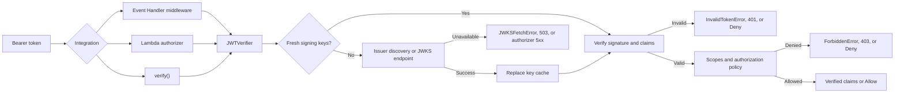

Auth verifies incoming JWT access tokens.
Use it inside a Lambda function or a Lambda authorizer. Prefer an API Gateway managed JWT authorizer when it meets your token profile and deployment requirements.



## Key features

* Verify asymmetric signatures, exact issuer, resource audience, expiration, and additional required claims.
* Coordinate discovery and signing-key refresh across threads with bounded key freshness.
* Protect Event Handler routes and create API Gateway IAM or simple authorizer responses.
* Validate resource-bound Cognito access tokens and combine explicitly trusted issuers.
* Adapt verification to the MCP Python SDK without a Powertools dependency on MCP.

## Terminology

**Access token** is a token issued to authorize calls to a protected resource. An ID token describes authentication to a client application and is not a resource access token.

**Issuer (`iss`)** identifies the trusted authorization server that created the token. Configure its exact HTTPS value.

**Resource audience (`aud`)** identifies the API intended to accept the token. Verifying it prevents a token issued for one resource from being reused at another.

**JSON Web Key Set (JWKS)** contains the public keys used to verify token signatures. Powertools can use a static set, fetch a configured JWKS endpoint, or discover one from the issuer.

**Key ID (`kid`)** identifies a signing key in the JWKS. It is untrusted token input and only selects a key from the configured or discovered trusted key set.

## Choosing an integration

| Integration | Use when | Failure behavior |
| ----------- | -------- | ---------------- |
| API Gateway managed JWT authorizer | Its issuer, audience, scope, and claim features satisfy the API requirements. Powertools Auth is not required. | API Gateway validates the token before invoking Lambda. |
| Event Handler middleware | A Lambda route needs scope checks, custom authorization, or direct control of HTTP responses. | Returns 401, 403, or 503 without running the protected handler. |
| Lambda authorizer | Authorization must run before the backend or be shared by multiple API integrations. | Returns Deny or `isAuthorized=false` for credential and policy failures; JWKS failures surface as an authorizer 5xx. |
| Direct `verify()` | The application owns event parsing and response handling, or the event does not use Event Handler. | Returns verified claims or raises a typed `AuthError`. |

## Getting started

### Install

```shell
pip install "aws-lambda-powertools[jwt]"
```

The optional `jwt` extra includes PyJWT, cryptography, and urllib3. It adds no dependencies to the base installation.
Build cryptography dependencies for your Lambda Python version and architecture; see [cross-platform builds](../build_recipes/cross-platform.md).
The Powertools Layer retains urllib3 from the declared dependency range instead of relying on the runtime's copy.
Applications pinning a different AWS SDK must validate that SDK's urllib3 requirements against the Layer or bundle a compatible dependency set.

### Required resources

Auth requires no additional AWS IAM permissions to verify a token. Remote discovery and JWKS retrieval require DNS resolution and outbound HTTPS connectivity from the Lambda function to the configured identity provider. Static `jwks` performs no network request, but the application owns key rotation.

!!! warning "Lambda functions connected to a VPC"
    A function in private subnets needs a route to its identity provider, such as a NAT gateway for a public endpoint or private network connectivity for an internal endpoint.
    Without it, the first verification and later key refreshes fail with `JWKSFetchError`. See [Connecting outbound traffic to the internet](https://docs.aws.amazon.com/lambda/latest/dg/configuration-vpc-internet.html){target="_blank"}.

### Protect an HTTP route

Create a verifier outside the handler so warm invocations reuse its key cache. Configure an issuer, resource audience, and explicit algorithm allowlist.
Set `ISSUER_URL` and `RESOURCE_URL` to your provider's exact issuer and this API's identifier.

```python title="middleware.py"
--8<-- "examples/auth/jwt/src/middleware.py"
```

`require()` validates the Bearer token and all requested scopes before executing the route. Verified claims are available through `app.context["claims"]`.
Claims remain available while downstream middleware and the handler execute, then are removed even if either raises an exception.
Event Handler clears context after resolving the invocation. The same middleware works with REST API, ALB, and Lambda Function URL resolvers.
Configure CORS preflight and public routes separately.

| Failure | Response | `WWW-Authenticate` |
| ------- | -------- | ------------------ |
| Missing Authorization | 401 | `Bearer` |
| Invalid token or malformed scope claim | 401 | `Bearer error="invalid_token"` |
| Missing required scope | 403 | `Bearer error="insufficient_scope", scope="orders:read"` |
| Additional authorization denied | 403 | None |
| Signing keys unavailable | 503 | None |

### Verify directly

`verify(token)` accepts the token without the `Bearer` prefix and returns a dictionary of verified claims.
It always requires `iss`, `aud`, and `exp`. `required_claims` adds requirements without replacing these baseline checks.

```python
from aws_lambda_powertools import Logger
from aws_lambda_powertools.utilities.auth import JWTVerifier
from aws_lambda_powertools.utilities.auth.jwt.exceptions import InvalidTokenError, JWKSFetchError

logger = Logger()
verifier = JWTVerifier(
    issuer="https://idp.example.com/",
    audience="https://orders.example.com",
    algorithms=["RS256"],
    required_claims=["sub"],
)


def authenticate(token: str) -> dict:
    try:
        return verifier.verify(token)
    except JWKSFetchError as error:
        logger.error("Verification keys unavailable", reason=error.reason.value, retryable=error.retryable)
        raise  # Map to an availability failure, for example HTTP 503.
    except InvalidTokenError:
        raise  # Reject the credential, for example HTTP 401.
```

Absent an explicit `jwks_uri` or static `jwks`, discovery uses the configured issuer's `/.well-known/openid-configuration`.
Discovery must advertise that exact issuer and an HTTPS JWKS URL. URLs supplied by token headers are never used for discovery.
`InvalidTokenError` is a credential failure and retrying the same token will not help. `JWKSFetchError` is a retryable infrastructure failure. Handle it separately so an identity-provider outage does not look like an invalid credential.

## Advanced

### Token profiles and scope checks

The generic profile checks signature, exact issuer, at least one configured audience, and finite numeric `exp`, `nbf`, and `iat` claims when present.
Expiration is required. The default clock allowance is 60 seconds, configurable with `clock_skew_seconds`.
Supported algorithms are RS256/384/512, PS256/384/512, ES256/384/512, ES256K, and EdDSA. HMAC and unsigned JWTs are rejected.
Keys must have a matching `kid`, compatible algorithm and key type, and signing/verification metadata when supplied.

Applications must select access tokens for their resource; the generic profile cannot infer a provider's token purpose.
Configure `expected_claims` and/or `expected_headers` when an issuer can mint other token types with the same audience:

```python
verifier = JWTVerifier(
    issuer="https://idp.example.com/",
    audience="https://orders.example.com",
    algorithms=["RS256"],
    expected_claims={"token_use": "access"},
    expected_headers={"typ": "at+jwt"},
)
```

Use the values defined by your provider; not every provider uses both fields.
These mappings require exact, case-sensitive, nonempty string values. Missing or different values raise `InvalidClaimsError`.
They are copied during construction and checked after signature, issuer, audience, and time validation.
The constraints apply to direct verification, middleware, authorizers, and issuer groups and cannot disable any baseline check.
`required_claims` checks presence only.
Local JWT verification does not check individual-token revocation.

Scopes come from the first present claim in this order: `scope`, `scp`, `scopes`.
A claim can be a space-separated string or a list of strings. A malformed higher-priority claim is rejected without falling back to another claim.
All required scopes must be present.

An optional `authorize` callback receives verified claims and must return `True`:

```python
middleware = verifier.require(
    scopes=["orders:read"],
    authorize=lambda claims: claims.get("tenant") == "example",
)
```

An `on_error` callback receives `AuthErrorContext` with `status_code`, `headers`, `reason`, and `retryable`.
It must return an Event Handler `Response`. Preserve the status and challenge headers when customizing the body.
The reason is an `AuthFailureReason` string enum; `retryable` is true for unavailable JWKS infrastructure and false for credential/policy failures.
The utility does not log failures automatically or add diagnostics to default responses. Applications choose logging, metrics, and sampling:

```python
from aws_lambda_powertools import Logger
from aws_lambda_powertools.event_handler import Response
from aws_lambda_powertools.utilities.auth import AuthErrorContext

logger = Logger()


def on_error(error: AuthErrorContext) -> Response:
    logger.warning("Authorization failed", reason=error.reason.value, retryable=error.retryable)
    return Response(
        status_code=error.status_code,
        content_type="application/json",
        body={"message": "Access denied"},
        headers=error.headers,
    )


middleware = verifier.require(on_error=on_error)
```

The callback replaces the error response; it never invokes the protected handler. Callback exceptions propagate to the application.

### Key freshness, rotation, and outages

| Setting | Default | Behavior |
| ------- | ------- | -------- |
| `timeout_seconds` | 3 | Budget for discovery, JWKS requests, and waiting for another refresh |
| `jwks_max_age_seconds` | 300 | Maximum age of a successfully fetched key set |
| `unknown_kid_cooldown_seconds` | 300 | Minimum interval between fetches triggered by unknown key IDs |

!!! warning "Leave time for Lambda to return an authentication error"
    Set `timeout_seconds` lower than the Lambda function timeout, leaving headroom for initialization and application code. A new Lambda function and the verifier both default to three seconds; using both defaults can cause the runtime to terminate the invocation before `JWKSFetchError` reaches your handler. The included SAM example gives the function a ten-second timeout.

Compatible verifiers in one process share a key-set cache; distinct issuers or cache policies are isolated.
Concurrent misses share a refresh. Expiration requires a fresh key set even when the unknown-key cooldown has not elapsed.
A successful refresh replaces the entire set, including removal of previously trusted keys. No independent parsed-key cache retains removed keys.

A failed refresh backs off for 1, 2, 4, 8, 16, then 30 seconds. During that interval, known keys can still be used within their original maximum age.
Expired keys are never used after a failed refresh. Unknown keys during a cooldown are rejected, so a newly published key may take time to become usable.
Choose freshness and cooldown settings together with your provider's key rotation policy.

Construction performs no network I/O. By default the first verification fetches the keys, adding latency to that invocation.
Calling `prefetch()` at module level moves the first fetch into Lambda INIT, but an identity-provider outage can then fail the cold start.
Prefetch is an explicit option, not a default recommendation; choose based on your latency and availability requirements.
Later rotation, expiration, and outages can still cause network I/O.
Static `jwks` is copied when constructing the verifier and performs no discovery or refresh:

```python
import json

from aws_lambda_powertools.utilities import parameters

key_set = parameters.get_parameter("/orders/jwks", max_age=3600)
verifier = JWTVerifier(
    issuer="https://idp.internal",
    audience="https://orders.internal",
    algorithms=["ES256"],
    jwks=json.loads(key_set),
)
```

Parameters' cache lifetime does not refresh that static snapshot. Recreate the verifier or recycle its execution environment when keys change.
You own static-key rotation and removal.

### Cognito and multiple issuers

```python
cognito = JWTVerifier.cognito(
    user_pool_id="us-east-1_abc123",
    client_id="orders-client",
    audience="https://orders.example.com",
)
combined = JWTVerifier.any_of(verifier, cognito)
```

The Cognito profile requires RS256, `token_use="access"`, the configured `client_id`, and the resource `aud`.
The client must request resource binding. ID tokens and Cognito access tokens without `aud` are rejected.

`any_of()` uses the unverified issuer only to select an explicitly configured verifier, then performs all verification through it.
Unknown issuers trigger no discovery. Duplicate issuer configurations are rejected as ambiguous.
The combined verifier supports `verify()`, `prefetch()`, `require()`, and `authorize()`.

### Lambda authorizers

```python title="authorizer.py"
--8<-- "examples/auth/jwt/src/authorizer/authorizer.py"
```

The helper accepts raw dictionaries or the corresponding Powertools authorizer Data Classes.

| Event | `response_format` | Result |
| ----- | ----------------- | ------ |
| REST API TOKEN or REQUEST | `iam` | Serialized IAM policy |
| HTTP API REQUEST payload 1.0 | `iam` | Serialized IAM policy |
| HTTP API REQUEST payload 2.0 | `iam` | Serialized IAM policy |
| HTTP API REQUEST payload 2.0, simple responses enabled | `simple` | Serialized `isAuthorized` response |

IAM allows require a nonempty string `sub` as principal and cover only the supplied request ARN.
Wildcard, missing, or malformed ARNs raise `ValueError`; the helper cannot construct a request-specific IAM policy without a valid ARN.
Other routes need their own decision.
Invalid tokens and insufficient scopes produce a Deny or `isAuthorized=False`; unavailable signing keys raise `JWKSFetchError`.
For an outage, middleware returns HTTP 503 directly. A Lambda authorizer fails its invocation instead, and API Gateway normally returns a 5xx response.
API callers should treat this as an availability failure rather than repeatedly obtaining new credentials; configure retries and alarms accordingly.

Pass `on_error` to `authorize()` to record a rejection or unavailable keys, as shown in the example above.
It receives an `AuthError` with the same fixed `reason` and `retryable` attributes exposed by middleware.
Its return value is ignored: invalid credentials still deny access, and `JWKSFetchError` still propagates after the callback.
A callback exception fails the invocation. Successful authorizations do not call it. The default response includes neither diagnostic field.

No claims are copied to context by default. `context_claims` copies only selected scalar values, omitting arrays, objects, and nulls.
The name `claims` is reserved in authorizer context.

#### Deployment and Gateway caching

Disable authorizer-result caching to verify each request. This SAM example sets `ReauthorizeEvery: 0` for both REST and HTTP authorizers;
the underlying API Gateway setting is `AuthorizerResultTtlInSeconds: 0`.
The template is under `examples/auth/jwt/templates/`; its `CodeUri` values are relative to that directory.
Authorizer functions build from `src/authorizer/` with the JWT extra. Backends build independently from `src/backend/` with base Powertools only,
so PyJWT and cryptography are not included in the backend artifacts.
HTTP simple responses also require payload version 2.0 and `EnableSimpleResponses: true`.

```yaml title="templates/sam.yaml"
--8<-- "examples/auth/jwt/templates/sam.yaml"
```

If you enable result caching later, a cached decision can outlive the JWT's expiration or a signing key's removal.
The verifier's key-cache settings do not control Gateway's result cache.
HTTP simple responses can apply to multiple routes sharing an identity cache key; include `$context.routeKey` for route-specific decisions.
Route-aware keys still do not recheck an expired token. Cached IAM policies must cover exactly the routes they authorize; this helper deliberately returns one concrete resource.

### Errors and diagnostics

`AuthError` is the base error. `InvalidTokenError` includes `InvalidClaimsError`, `TokenExpiredError`, and `InvalidSignatureError`.
`JWKSFetchError` is separate from invalid-token errors so applications can distinguish unavailable verification infrastructure.
Every error exposes `reason: AuthFailureReason` and `retryable: bool`. `AuthFailureReason` uses `str, Enum` for Python 3.10 compatibility.
Use `.value` for log fields and metric dimensions; do not parse exception messages.

| Reason | Retryable |
| ------ | --------- |
| `missing_token` | false |
| `invalid_token` | false |
| `invalid_claims` | false |
| `token_expired` | false |
| `invalid_signature` | false |
| `insufficient_scope` | false |
| `forbidden` | false |
| `jwks_unavailable` | true |

Retryability identifies failures where retrying after the provider recovers may help; it does not bypass cache backoff or guarantee success.
Reasons and messages are fixed and never contain token data, claims, key IDs, URLs, or provider responses.
Public verification, prefetch, and authorizer operations detach underlying exception causes and contexts.
Log only the fixed diagnostic fields; do not log token dictionaries, request headers, or provider errors.

Outbound token acquisition, opaque-token introspection, delegated token exchange, interactive grants, SigV4, and native async clients are outside this PR.

### MCP Python SDK adapter

The following adapter targets the `MCPServer` interface in MCP Python SDK 2.2.0 (`mcp==2.2.0`),
following the [MCP authorization tutorial](https://modelcontextprotocol.io/docs/2026-07-28/tutorials/security/authorization).
Install that SDK separately. This example requires the Keycloak access-token claim `typ="Bearer"` and maps `azp`, `sub`, and `scope`.
Adapt the expected purpose and claim mapping to your provider and token configuration.

```python
import asyncio

from mcp.server import MCPServer
from mcp.server.auth.provider import AccessToken, TokenVerifier
from mcp.server.auth.settings import AuthSettings
from pydantic import AnyHttpUrl

from aws_lambda_powertools import Logger
from aws_lambda_powertools.utilities.auth import JWTVerifier
from aws_lambda_powertools.utilities.auth.jwt.exceptions import InvalidTokenError, JWKSFetchError

logger = Logger()
RESOURCE_URL = "https://mcp.example.com"
ISSUER_URL = "https://keycloak.example.com/realms/mcp"
verifier = JWTVerifier(
    issuer=ISSUER_URL,
    audience=RESOURCE_URL,
    algorithms=["RS256"],
    required_claims=["azp", "sub", "scope"],
    expected_claims={"typ": "Bearer"},
)


class PowertoolsTokenVerifier(TokenVerifier):
    async def verify_token(self, token: str) -> AccessToken | None:
        try:
            claims = await asyncio.to_thread(verifier.verify, token)
        except JWKSFetchError as error:
            logger.error("Verification keys unavailable", reason=error.reason.value, retryable=error.retryable)
            return None
        except InvalidTokenError:
            return None
        if not all(isinstance(claims[name], str) for name in ("azp", "sub", "scope")):
            return None
        if not claims["azp"] or not claims["sub"]:
            return None
        return AccessToken(
            token=token,
            client_id=claims["azp"],
            subject=claims["sub"],
            scopes=claims["scope"].split(),
            expires_at=claims["exp"],
            resource=RESOURCE_URL,
        )


mcp = MCPServer(
    name="orders",
    token_verifier=PowertoolsTokenVerifier(),
    auth=AuthSettings(
        issuer_url=AnyHttpUrl(ISSUER_URL),
        resource_server_url=AnyHttpUrl(RESOURCE_URL),
        validate_token_resource=True,
        required_scopes=["mcp:tools"],
    ),
)
```

The SDK owns transport, Protected Resource Metadata, and authentication challenges. This adapter maps both invalid tokens and unavailable keys to failed authentication.
The adapter records unavailable keys separately for Lambda-owner alarms and metrics before returning `None`.
A distinct availability response to the API caller requires integration at the SDK transport boundary.
`asyncio.to_thread()` keeps synchronous key fetches off the event loop; cancelling the await does not terminate a running request.

Tools can enforce permissions using the verified SDK access token:

```python
from mcp.server.auth.middleware.auth_context import get_access_token


def require_scope(scope: str):
    caller = get_access_token()
    if caller is None or scope not in caller.scopes:
        raise PermissionError("Required tool permission is missing")
```

Use the targeted SDK's supported tool-error handling for permission failures. Raising `PermissionError` alone does not implement an HTTP challenge or a scope-upgrade flow.
API Gateway authorizers in front of an MCP server also require deployment-specific metadata routes and discovery/challenge behavior;
an authorizer Deny response alone does not implement MCP authorization.

## Testing your code

Use `mock_claims` to test route behavior without cryptography or network calls. Supply an Authorization header so the middleware still exercises credential extraction.

```python
from aws_lambda_powertools.utilities.auth.jwt.testing import mock_claims

from middleware import app, verifier


def test_orders(http_api_event, lambda_context):
    http_api_event["headers"]["authorization"] = "Bearer application-test"
    with mock_claims(verifier, {"sub": "test-user", "scope": "orders:read"}):
        response = app.resolve(http_api_event, lambda_context)
    assert response["statusCode"] == 200
```

The helper restores `verify()` on exit and returns independent copies of the supplied claims.
It deliberately bypasses signature and claim validation. Keep separate tests for real verification, key rotation, and authorization policy.
