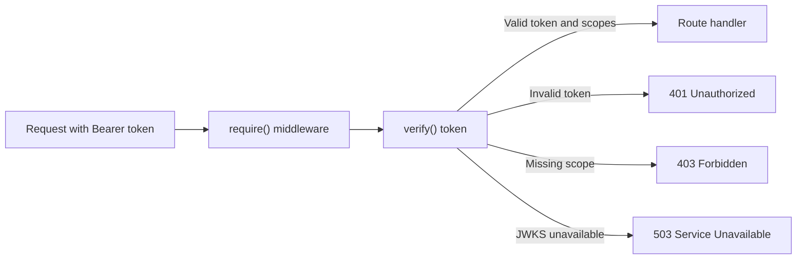

Auth verifies JWT access tokens before your Lambda handler processes a request. `JWTVerifier` contains the validation configuration and signing-key cache. It can create an Event Handler middleware or verify a token directly.



## Key features

* Verify JWT signatures, issuer, audience, expiration, and required claims.
* Protect individual Event Handler routes with scopes and custom authorization.
* Reuse signing keys across warm Lambda invocations and refresh them during rotation.
* Build REST API and HTTP API Lambda authorizer responses.

## Getting started

### Install

```shell
pip install "aws-lambda-powertools[jwt]"
```

The `jwt` extra installs PyJWT, cryptography, and urllib3. Build dependencies for the same Python version and architecture as your Lambda function. See [cross-platform builds](../build_recipes/cross-platform.md).

### Required resources

JWT verification requires no additional IAM permissions. When using issuer discovery or a remote JWKS endpoint, the function needs outbound HTTPS access to the identity provider. A function in private subnets might need a NAT gateway or private connectivity. Static `jwks` does not use the network, but your application is responsible for rotating those keys.

### Protect an HTTP route

Create `JWTVerifier` outside the Lambda handler so warm invocations reuse its signing-key cache. The verifier itself is not middleware. Calling `verifier.require()` creates middleware bound to that verifier and to the requested scopes.

```python title="middleware.py"
--8<-- "examples/auth/jwt/src/middleware.py"
```

Here, `app.get()` registers the middleware only for `GET /orders`. For each matching request, the middleware:

1. Reads the Bearer token from the `Authorization` header.
2. Calls `verifier.verify(token)` to validate the signature and claims.
3. Checks that the token contains `orders:read`.
4. Stores verified claims in `app.context["claims"]` while the route handler runs.

The route handler does not run when authentication or authorization fails.

| Failure | Response |
| ------- | -------- |
| Missing or invalid token | 401 |
| Missing required scope or custom authorization denied | 403 |
| Discovery or JWKS endpoint unavailable | 503 |

Configure public routes and CORS preflight separately.

### Verify a token directly

Use `verify()` when you are not using Event Handler middleware or when your application already owns request parsing. It accepts the encoded JWT without the `Bearer` prefix. It does not read headers or create an HTTP response. On success it returns verified claims; on failure it raises a typed exception.

```python title="direct.py"
--8<-- "examples/auth/jwt/src/direct.py"
```

The middleware created by `require()` uses this same method internally and maps these failures to HTTP responses for you. `verify()` always checks `iss`, `aud`, and `exp`; `required_claims` adds more required claims.

## Advanced

### Customize route authorization

This complete Lambda adds provider-specific token checks, a required scope, a tenant authorization rule, and custom error handling:

```python title="custom_authorization.py"
--8<-- "examples/auth/jwt/src/custom_authorization.py"
```

`expected_claims` must match the access-token profile documented by your identity provider. `authorize` runs only after token verification and scope checks succeed. `on_error` can change the error response and emit logs or metrics, but it never invokes the protected route.

The callback receives stable `reason` and `retryable` fields without token data. Preserve `error.status_code` and `error.headers` unless you intentionally want to change the HTTP contract.

### Key freshness and Lambda timeouts

| Setting | Default | Purpose |
| ------- | ------- | ------- |
| `timeout_seconds` | 3 seconds | Limits discovery and JWKS requests |
| `jwks_max_age_seconds` | 5 minutes | Limits how long fetched keys remain trusted |
| `unknown_kid_cooldown_seconds` | 5 minutes | Limits repeated refreshes for unknown key IDs |

The first verification fetches signing keys unless you provide static `jwks`. Warm invocations reuse the cache. A successful refresh replaces the key set so removed keys are no longer trusted. If refresh fails after the cache expires, verification raises `JWKSFetchError` instead of using stale keys.

!!! warning "Leave time for Lambda to handle the error"
    Set `timeout_seconds` lower than the Lambda function timeout. If both use the three-second default, Lambda can terminate the invocation before your code receives `JWKSFetchError`.

Calling `prefetch()` during module initialization moves the initial network request into Lambda INIT. This can reduce first-request latency, but an identity-provider outage can then fail the cold start.

Static `jwks` avoids network access. Recreate the verifier or execution environment when the configured keys change.

### Cognito

Use the Cognito profile for resource-bound Cognito access tokens:

```python title="cognito.py"
--8<-- "examples/auth/jwt/src/cognito.py"
```

This profile checks RS256, `token_use="access"`, the configured app client ID, and the resource audience. Cognito ID tokens and access tokens without the configured resource audience are rejected.

Use `JWTVerifier.any_of()` when the same Lambda trusts access tokens from multiple configured issuers. Unknown issuers are rejected without discovery.

### Lambda authorizers

Use `authorize()` when API Gateway invokes a dedicated Lambda authorizer:

```python title="authorizer.py"
--8<-- "examples/auth/jwt/src/authorizer/authorizer.py"
```

The helper supports REST API TOKEN and REQUEST events and HTTP API REQUEST payloads. Choose `response_format="iam"` for an IAM policy or `response_format="simple"` for an HTTP API 2.0 simple response.

Invalid tokens and insufficient scopes return Deny or `isAuthorized=false`. If signing keys are unavailable, `JWKSFetchError` fails the authorizer invocation and API Gateway returns a 5xx response. Use `on_error` for logs and metrics; it cannot change the authorization result.

`context_claims` copies only explicitly selected scalar claims into authorizer context. Claims are not copied by default.

The example template disables API Gateway authorizer-result caching so every request is verified:

```yaml title="templates/sam.yaml"
--8<-- "examples/auth/jwt/templates/sam.yaml"
```

If you enable Gateway caching, include all request attributes used by authorization in its identity sources. A cached allow can otherwise apply to another route or outlive the token expiration. This cache is independent of the verifier JWKS cache.

### Errors and diagnostics

`AuthError` is the base exception. Invalid credentials raise `InvalidTokenError` or one of its specific subclasses. Problems retrieving signing keys raise `JWKSFetchError`. Every auth exception provides a stable `reason` and a `retryable` flag.

| Reason | Retryable |
| ------ | --------- |
| `missing_token` | false |
| `invalid_token` | false |
| `invalid_claims` | false |
| `token_expired` | false |
| `invalid_signature` | false |
| `insufficient_scope` | false |
| `forbidden` | false |
| `jwks_unavailable` | true |

Use `reason.value` for log fields and metric dimensions. Do not parse exception messages or log tokens, claims, or request headers. `retryable=true` means a later attempt might succeed after the identity provider recovers; it does not guarantee that retrying will succeed.

## Testing your code

Use `mock_claims` to replace `verifier.verify()` while testing route behavior without cryptography or network calls. Wrap the call to `app.resolve()` in `mock_claims(verifier, claims)` and include an Authorization header so the middleware still exercises credential extraction.

`mock_claims` restores the verifier when the context manager exits and returns an independent copy of the supplied claims. It bypasses signature and claim validation, so keep separate verification tests for the token profiles your application accepts.
