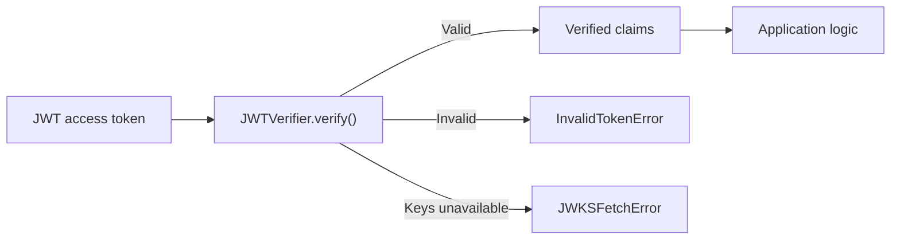

!!! warning "Alpha / experimental"
    This utility ships under the `auth_alpha` namespace while we collect feedback. Its public API may change before GA. Pin your Powertools version before using it in production.

Auth verifies JWT access tokens in any Lambda workload. Use `verify()` directly, create Event Handler middleware with `require()`, or build a Lambda authorizer response with `authorize()`.

For client-credentials tokens used to call a downstream API, see [OAuth2 client (alpha)](oauth2.md).


```mermaid
flowchart LR
    Token["JWT access token"] --> Verify["JWTVerifier.verify()"]
    Verify -->|Valid| Claims["Verified claims"]
    Claims --> Application["Application logic"]
    Verify -->|Invalid| Invalid["InvalidTokenError"]
    Verify -->|Keys unavailable| Unavailable["JWKSFetchError"]
```

## Key features

* Verify JWT signatures, issuer, audience, expiration, and required claims.
* Reuse signing keys across warm Lambda invocations and refresh them during rotation.
* Verify tokens directly in any Lambda event flow.
* Protect Event Handler routes with scopes and custom authorization.
* Build REST API and HTTP API Lambda authorizer responses.

## Getting started

### Install

```shell
pip install "aws-lambda-powertools[jwt]"
```

The `jwt` extra installs PyJWT, cryptography, and urllib3. Build dependencies for the same Python version and architecture as your Lambda function. See [cross-platform builds](../build_recipes/cross-platform.md).

#### Compatibility with boto3

If the function also uses boto3, including through Parameters, install and validate the SDK together with JWT verification:

```shell
pip install "aws-lambda-powertools[jwt,aws-sdk]"
python -m pip check
```

Resolve all function dependencies together, lock their versions, and package boto3, botocore, and urllib3 together. Make a failed `pip check` fail the build.

Packaged urllib3 overrides the runtime copy and can conflict with the runtime's SDK.
Build checks cannot validate dependencies supplied only by the runtime or separate layers. See [AWS packaging guidance](https://docs.aws.amazon.com/lambda/latest/dg/python-package.html#python-package-dependencies).

### Create a verifier

Create the verifier outside the Lambda handler so warm invocations reuse its signing-key cache. Configure the trusted issuer, this workload's audience, and the algorithms accepted from that issuer.

```python title="basic.py"
--8<-- "examples/auth_alpha/jwt/src/basic.py"
```

Replace `token_use` with the access-token marker used by your identity provider. This prevents another JWT type from being accepted only because it has the same audience.

`JWTVerifier` provides the following operations:

| Method | Use when |
| ------ | -------- |
| `verify(token)` | You already have the encoded JWT |
| `verify_authorization_header(value)` | You have a complete HTTP `Authorization` header |
| `require(...)` | You use Powertools Event Handler and want to protect a route |
| `authorize(event, ...)` | The Lambda function is an API Gateway authorizer |
| `prefetch()` | You want to fetch signing keys during Lambda INIT |

### Verify a JWT

`verify()` accepts an encoded JWT without the `Bearer` prefix. It returns verified claims or raises `InvalidTokenError`. If discovery or the JWKS endpoint is unavailable, it raises `JWKSFetchError` instead. Your Lambda decides how those failures map to its event source.

### Required resources

JWT verification requires no additional IAM permissions. Discovery and remote JWKS require outbound HTTPS; private subnets may need NAT or private connectivity.
Static `jwks` avoids network access, but your application must rotate those keys.

### Protect an HTTP route

`verifier.require()` creates Event Handler middleware bound to the verifier and requested scopes. Create the verifier outside the handler to reuse its cache.

```python title="middleware.py"
--8<-- "examples/auth_alpha/jwt/src/middleware.py"
```

Here, `app.get()` registers the middleware only for `GET /orders`. For each matching request, the middleware:

1. Reads the Bearer token from the `Authorization` header.
2. Calls `verifier.verify(token)` to validate the signature and claims.
3. Checks that the token contains `orders:read`.
4. Stores verified claims in `app.context["claims"]` while the route handler runs.

The route handler does not run when authentication or authorization fails.

| Failure | Response |
| ------- | -------- |
| Missing or invalid token | 401 |
| Missing required scope or custom authorization denied | 403 |
| Discovery or JWKS endpoint unavailable | 503 |

Configure public routes and CORS preflight separately.

### Verify an Authorization header

Without middleware, pass the complete `Authorization` header to `verify_authorization_header()`. It validates the Bearer scheme and verifies the extracted JWT:

```python title="direct.py"
--8<-- "examples/auth_alpha/jwt/src/direct.py"
```

Both verification methods require `iss`, `aud`, and `exp`; use `required_claims` to require additional claims.

## Advanced

### Customize route authorization

This complete Lambda adds provider-specific token checks, a required scope, a tenant authorization rule, and custom error handling:

```python title="custom_authorization.py"
--8<-- "examples/auth_alpha/jwt/src/custom_authorization.py"
```

Match `expected_claims` to your provider's access-token profile. `authorize` runs after verification and scope checks.
`on_error` can change the error response or emit logs/metrics, but cannot invoke the protected route.

The callback exposes `reason` and `retryable`, without token data. Preserve `error.status_code` and `error.headers` to retain the HTTP contract.

### Key freshness and Lambda timeouts

| Setting | Default | Purpose |
| ------- | ------- | ------- |
| `timeout_seconds` | 3 seconds | Limits discovery and JWKS requests |
| `jwks_max_age_seconds` | 5 minutes | Limits how long fetched keys remain trusted |
| `unknown_kid_cooldown_seconds` | 5 minutes | Limits repeated refreshes for unknown key IDs |

The first verification fetches keys unless `jwks` is static. Warm invocations reuse them; a refresh replaces the key set, dropping removed keys.
An expired cache with a failed refresh raises `JWKSFetchError`; stale keys are not used.

!!! warning "Leave time for Lambda to handle the error"
    Set `timeout_seconds` lower than the Lambda function timeout. If both use the three-second default, Lambda can terminate the invocation before your code receives `JWKSFetchError`.

Call `prefetch()` after constructing the verifier to retrieve keys during Lambda INIT:

```python title="prefetch.py"
--8<-- "examples/auth_alpha/jwt/src/prefetch.py"
```

Prefetching can reduce first-invocation latency, but a provider outage can fail the cold start. Without it, the first `verify()` fetches keys.

Static `jwks` avoids network access. Recreate the verifier or execution environment when the configured keys change.

### Cognito

Use the Cognito profile for resource-bound Cognito access tokens:

```python title="cognito.py"
--8<-- "examples/auth_alpha/jwt/src/cognito.py"
```

This profile checks RS256, `token_use="access"`, the configured app client ID, and the resource audience. Cognito ID tokens and access tokens without the configured resource audience are rejected.

Use `JWTVerifier.any_of()` when the same Lambda trusts access tokens from multiple configured issuers. Unknown issuers are rejected without discovery.

### Lambda authorizers

Use `authorize()` when API Gateway invokes a dedicated Lambda authorizer:

```python title="authorizer.py"
--8<-- "examples/auth_alpha/jwt/src/authorizer/authorizer.py"
```

The helper supports REST API TOKEN and REQUEST events and HTTP API REQUEST payloads. Choose `response_format="iam"` for an IAM policy or `response_format="simple"` for an HTTP API 2.0 simple response.

Invalid tokens and insufficient scopes return Deny or `isAuthorized=false`. If signing keys are unavailable, `JWKSFetchError` fails the authorizer invocation and API Gateway returns a 5xx response. Use `on_error` for logs and metrics; it cannot change the authorization result.

`context_claims` copies only explicitly selected scalar claims into authorizer context. Claims are not copied by default.

The example template disables API Gateway authorizer-result caching so every request is verified:

```yaml title="templates/sam.yaml"
--8<-- "examples/auth_alpha/jwt/templates/sam.yaml"
```

If enabling Gateway caching, include every authorization input in its identity sources. A cached allow can still outlive JWT expiration until the cache TTL ends.
Keep it disabled when every request must respect token expiration. Gateway caching is independent of the JWKS cache.

### Errors and diagnostics

`AuthError` is the base exception. Invalid credentials raise `InvalidTokenError` or one of its specific subclasses. Problems retrieving signing keys raise `JWKSFetchError`. Every auth exception provides a stable `reason` and a `retryable` flag.

| Reason | Retryable |
| ------ | --------- |
| `missing_token` | false |
| `invalid_token` | false |
| `invalid_claims` | false |
| `token_expired` | false |
| `invalid_signature` | false |
| `insufficient_scope` | false |
| `forbidden` | false |
| `jwks_unavailable` | true |

Log `reason.value` and `retryable`, not exception messages, tokens, claims, or request headers. `retryable=true` means a later attempt might succeed after provider recovery.

## Testing your code

Use `mock_claims` to test the complete middleware Lambda without cryptography or network calls:

```python title="test_middleware.py"
--8<-- "examples/auth_alpha/jwt/tests/test_middleware.py"
```

The test exercises the HTTP event, Bearer extraction, and scope check. `mock_claims` replaces only token verification and restores it on exit.
Keep separate tests for the token profiles your application accepts.
