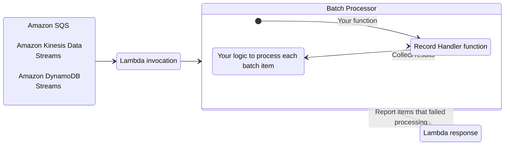
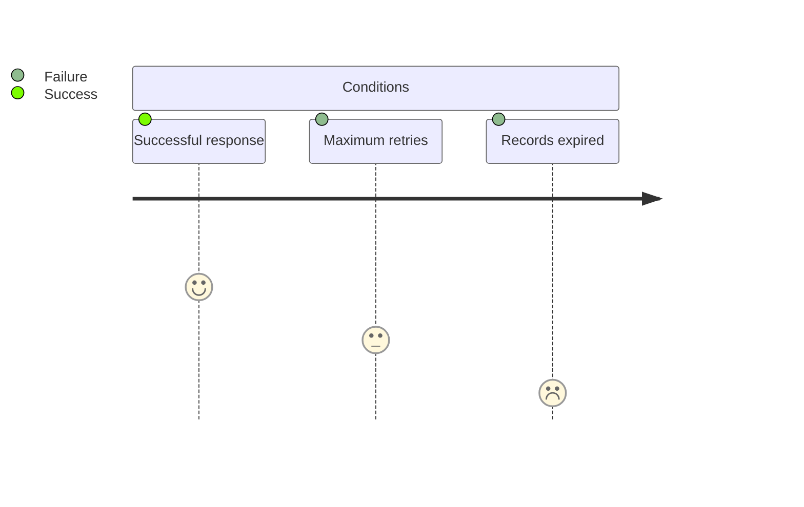
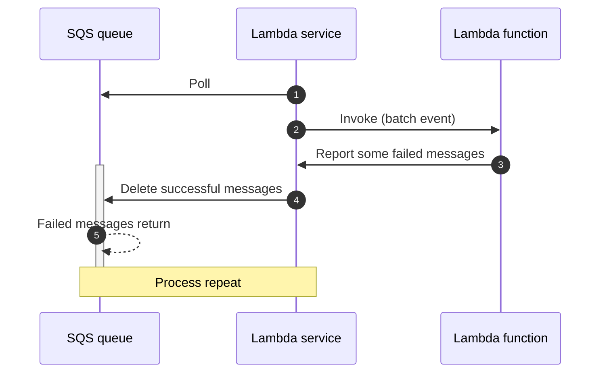
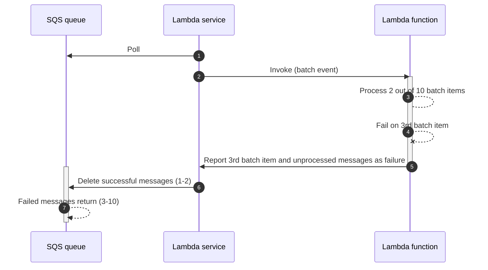
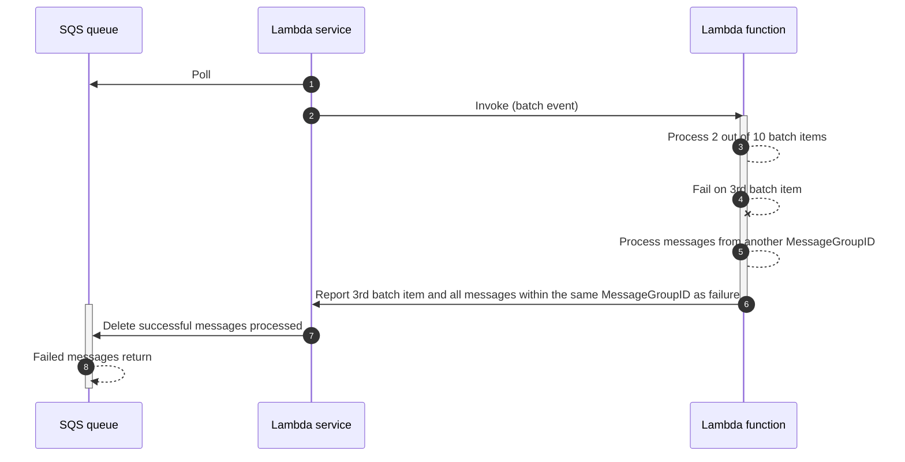
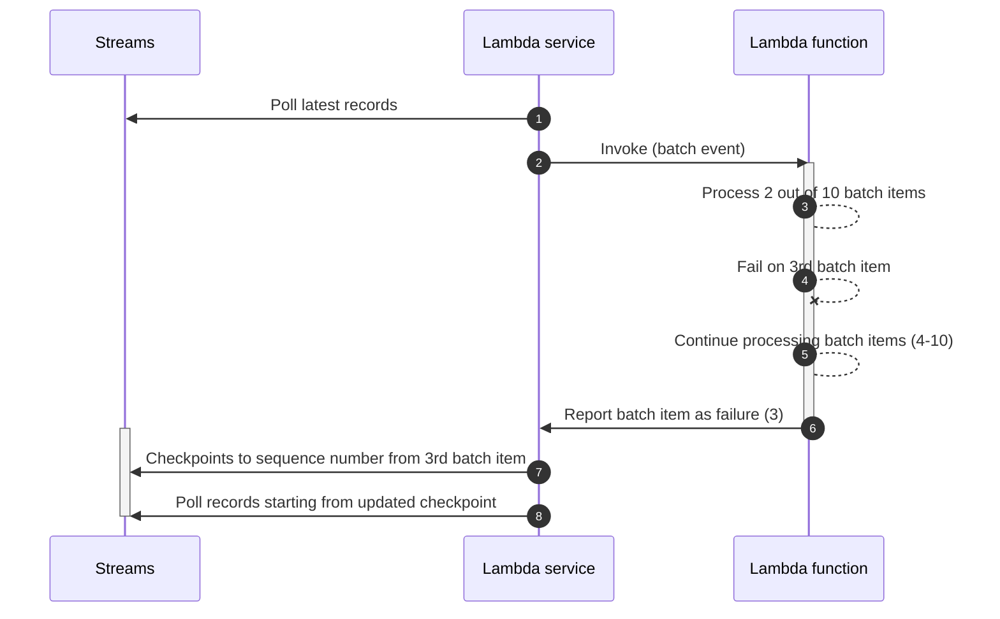
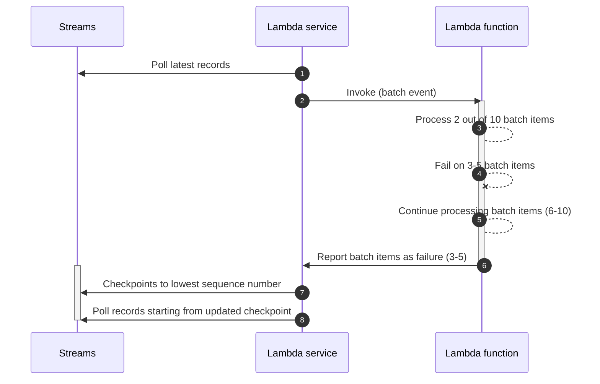
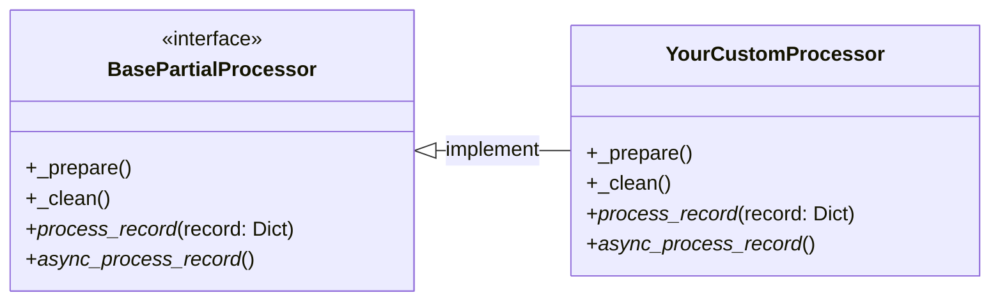

The batch processing utility handles partial failures when processing batches from Amazon SQS, Amazon Kinesis Data Streams, and Amazon DynamoDB Streams.



## Key features

* Reports batch item failures to reduce number of retries for a record upon errors
* Simple interface to process each batch record
* Integrates with [Event Source Data Classes](./data_classes.md){target="_blank} and [Parser (Pydantic)](parser.md){target="_blank} for self-documenting record schema
* Build your own batch processor by extending primitives

## Background

When using SQS, Kinesis Data Streams, or DynamoDB Streams as a Lambda event source, your Lambda functions are triggered with a batch of messages.

If your function fails to process any message from the batch, the entire batch returns to your queue or stream. This same batch is then retried until either condition happens first: **a)** your Lambda function returns a successful response, **b)** record reaches maximum retry attempts, or **c)** records expire.



This behavior changes when you enable Report Batch Item Failures feature in your Lambda function event source configuration:

<!-- markdownlint-disable MD013 -->
* [**SQS queues**](#sqs-standard). Only messages reported as failure will return to the queue for a retry, while successful ones will be deleted.
* [**Kinesis data streams**](#kinesis-and-dynamodb-streams) and [**DynamoDB streams**](#kinesis-and-dynamodb-streams). Single reported failure will use its sequence number as the stream checkpoint. Multiple  reported failures will use the lowest sequence number as checkpoint.

<!-- HTML tags are required in admonition content thus increasing line length beyond our limits -->
<!-- markdownlint-disable MD013 -->
???+ warning "Warning: This utility lowers the chance of processing records more than once; it does not guarantee it"
    We recommend implementing processing logic in an [idempotent manner](idempotency.md){target="_blank"} wherever possible.

    You can find more details on how Lambda works with either [SQS](https://docs.aws.amazon.com/lambda/latest/dg/with-sqs.html){target="_blank"}, [Kinesis](https://docs.aws.amazon.com/lambda/latest/dg/with-kinesis.html){target="_blank"}, or [DynamoDB](https://docs.aws.amazon.com/lambda/latest/dg/with-ddb.html){target="_blank"} in the AWS Documentation.

## Getting started

For this feature to work, you need to **(1)** configure your Lambda function event source to use `ReportBatchItemFailures`, and **(2)** return [a specific response](https://docs.aws.amazon.com/lambda/latest/dg/with-sqs.html#services-sqs-batchfailurereporting){target="_blank" rel="nofollow"} to report which records failed to be processed.

You use your preferred deployment framework to set the correct configuration while this utility handles the correct response to be returned.

### Required resources

The remaining sections of the documentation will rely on these samples. For completeness, this demonstrates IAM permissions and Dead Letter Queue where batch records will be sent after 2 retries were attempted.

!!! note "You do not need any additional IAM permissions to use this utility, except for what each event source requires."

=== "SQS"

    ```yaml title="template.yaml" hl_lines="30-31"
    --8<-- "examples/batch_processing/sam/sqs_batch_processing.yaml"
    ```

=== "Kinesis Data Streams"

    ```yaml title="template.yaml" hl_lines="44-45"
    --8<-- "examples/batch_processing/sam/kinesis_batch_processing.yaml"
    ```

=== "DynamoDB Streams"

    ```yaml title="template.yaml" hl_lines="43-44"
    --8<-- "examples/batch_processing/sam/dynamodb_batch_processing.yaml"
    ```

### Processing messages from SQS

Processing batches from SQS works in three stages:

1. Instantiate **`BatchProcessor`** and choose **`EventType.SQS`** for the event type
2. Define your function to handle each batch record, and use [`SQSRecord`](data_classes.md#sqs){target="_blank"} type annotation for autocompletion
3. Use **`process_partial_response`** to kick off processing

!!! info "This code example uses Tracer and Logger for completion."

=== "Recommended"

    ```python hl_lines="2-7 10 16 24"
    --8<-- "examples/batch_processing/src/getting_started_sqs.py"
    ```

    1.  **Step 1**. Creates a partial failure batch processor for SQS queues. See [partial failure mechanics for details](#partial-failure-mechanics)
    2.  **Step 2**. Defines a function to receive one record at a time from the batch
    3.  **Step 3**. Kicks off processing

=== "As a context manager"

    ```python hl_lines="4-5 8 14 25-26 29"
    --8<-- "examples/batch_processing/src/getting_started_sqs_context_manager.py"
    ```

=== "As a decorator (legacy)"

    ```python hl_lines="4-9 12 18 27 29"
    --8<-- "examples/batch_processing/src/getting_started_sqs_decorator.py"
    ```

=== "Sample response"

    The second record failed to be processed, therefore the processor added its message ID in the response.

    ```json
    --8<-- "examples/batch_processing/src/getting_started_sqs_response.json"
    ```

=== "Sample event"

    ```json
    --8<-- "examples/batch_processing/src/getting_started_sqs_event.json"
    ```

#### FIFO queues

When working with [SQS FIFO queues](https://docs.aws.amazon.com/AWSSimpleQueueService/latest/SQSDeveloperGuide/FIFO-queues.html){target="_blank"}, you should know that a batch may include messages from different group IDs.

By default, we will stop processing at the first failure and mark unprocessed messages as failed to preserve ordering. However, this behavior may not be optimal for customers who wish to proceed with processing messages from a different group ID.

Enable the `skip_group_on_error` option for seamless processing of messages from various group IDs. This setup ensures that messages from a failed group ID are sent back to SQS, enabling uninterrupted processing of messages from the subsequent group ID.

=== "Recommended"

    ```python hl_lines="2-6 9 23"
    --8<-- "examples/batch_processing/src/getting_started_sqs_fifo.py"
    ```

    1.  **Step 1**. Creates a partial failure batch processor for SQS FIFO queues. See [partial failure mechanics for details](#partial-failure-mechanics)

=== "As a context manager"

    ```python hl_lines="4 8"
    --8<-- "examples/batch_processing/src/getting_started_sqs_fifo_context_manager.py"
    ```

=== "As a decorator (legacy)"

    ```python hl_lines="5-6 11 26"
    --8<-- "examples/batch_processing/src/getting_started_sqs_fifo_decorator.py"
    ```

=== "Enabling skip_group_on_error flag"

    ```python hl_lines="2-6 9 23"
    --8<-- "examples/batch_processing/src/getting_started_sqs_fifo_skip_on_error.py"
    ```

### Processing messages from Kinesis

Processing batches from Kinesis works in three stages:

1. Instantiate **`BatchProcessor`** and choose **`EventType.KinesisDataStreams`** for the event type
2. Define your function to handle each batch record, and use [`KinesisStreamRecord`](data_classes.md#kinesis-streams){target="_blank"} type annotation for autocompletion
3. Use **`process_partial_response`** to kick off processing

!!! info "This code example uses Tracer and Logger for completion."

=== "Recommended"

    ```python hl_lines="2-9 12 18 27"
    --8<-- "examples/batch_processing/src/getting_started_kinesis.py"
    ```

    1.  **Step 1**. Creates a partial failure batch processor for Kinesis Data Streams. See [partial failure mechanics for details](#partial-failure-mechanics)

=== "As a context manager"

    ```python hl_lines="3-5 8 14 23-25 28"
    --8<-- "examples/batch_processing/src/getting_started_kinesis_context_manager.py"
    ```

=== "As a decorator (legacy)"

    ```python hl_lines="2-9 12 18 26"
    --8<-- "examples/batch_processing/src/getting_started_kinesis_decorator.py"
    ```

=== "Sample response"

    The second record failed to be processed, therefore the processor added its sequence number in the response.

    ```json
    --8<-- "examples/batch_processing/src/getting_started_kinesis_response.json"
    ```

=== "Sample event"

    ```json
    --8<-- "examples/batch_processing/src/getting_started_kinesis_event.json"
    ```

### Processing messages from DynamoDB

Processing batches from DynamoDB Streams works in three stages:

1. Instantiate **`BatchProcessor`** and choose **`EventType.DynamoDBStreams`** for the event type
2. Define your function to handle each batch record, and use [`DynamoDBRecord`](data_classes.md#dynamodb-streams){target="_blank"} type annotation for autocompletion
3. Use **`process_partial_response`** to kick off processing

!!! info "This code example uses Tracer and Logger for completion."

=== "Recommended"

    ```python hl_lines="4-11 14 20 32"
    --8<-- "examples/batch_processing/src/getting_started_dynamodb.py"
    ```

    1.  **Step 1**. Creates a partial failure batch processor for DynamoDB Streams. See [partial failure mechanics for details](#partial-failure-mechanics)

=== "As a context manager"

    ```python hl_lines="5-7 10 16 28-30 33"
    --8<-- "examples/batch_processing/src/getting_started_dynamodb_context_manager.py"
    ```

=== "As a decorator (legacy)"

    ```python hl_lines="4-11 14 20 31"
    --8<-- "examples/batch_processing/src/getting_started_dynamodb_decorator.py"
    ```

=== "Sample response"

    The second record failed to be processed, therefore the processor added its sequence number in the response.

    ```json
    --8<-- "examples/batch_processing/src/getting_started_dynamodb_response.json"
    ```

=== "Sample event"

    ```json
    --8<-- "examples/batch_processing/src/getting_started_dynamodb_event.json"
    ```

### Error handling

By default, we catch any exception raised by your record handler function. This allows us to **(1)** continue processing the batch, **(2)** collect each batch item that failed processing, and **(3)** return the appropriate  response correctly without failing your Lambda function execution.

=== "Sample error handling with custom exception"

    ```python title="" hl_lines="24"
    --8<-- "examples/batch_processing/src/getting_started_error_handling.py"
    ```

    1. Any exception works here. See [extending BatchProcessor section, if you want to override this behavior.](#extending-batchprocessor)

    2. Exceptions raised in `record_handler` will propagate to `process_partial_response`. <br/><br/> We catch them and include each failed batch item identifier in the response dictionary (see `Sample response` tab).

=== "Sample response"

    ```json
    --8<-- "examples/batch_processing/src/getting_started_sqs_response.json"
    ```

### Partial failure mechanics

All batch items will be passed to the record handler for processing, even if exceptions are thrown - Here's the behavior after completing the batch:

* **All records successfully processed**. We will return an empty list of item failures `{'batchItemFailures': []}`
* **Partial success with some exceptions**. We will return a list of all item IDs/sequence numbers that failed processing
* **All records failed to be processed**. We will raise `BatchProcessingError` exception with a list of all exceptions raised when processing

The following sequence diagrams explain how each Batch processor behaves under different scenarios.

#### SQS Standard

> Read more about [Batch Failure Reporting feature in AWS Lambda](https://docs.aws.amazon.com/lambda/latest/dg/with-sqs.html#services-sqs-batchfailurereporting){target="_blank"}.

Sequence diagram to explain how [`BatchProcessor` works](#processing-messages-from-sqs) with SQS Standard queues.

<center>

<i>SQS mechanism with Batch Item Failures</i>
</center>

#### SQS FIFO

> Read more about [Batch Failure Reporting feature in AWS Lambda](https://docs.aws.amazon.com/lambda/latest/dg/with-sqs.html#services-sqs-batchfailurereporting){target="_blank"}.

Sequence diagram to explain how [`SqsFifoPartialProcessor` works](#fifo-queues) with SQS FIFO queues without `skip_group_on_error` flag.

<center>

<i>SQS FIFO mechanism with Batch Item Failures</i>
</center>

Sequence diagram to explain how [`SqsFifoPartialProcessor` works](#fifo-queues) with SQS FIFO queues with `skip_group_on_error` flag.

<center>

<i>SQS FIFO mechanism with Batch Item Failures</i>
</center>

#### Kinesis and DynamoDB Streams

> Read more about [Batch Failure Reporting feature](https://docs.aws.amazon.com/lambda/latest/dg/with-kinesis.html#services-kinesis-batchfailurereporting){target="_blank"}.

Sequence diagram to explain how `BatchProcessor` works with both [Kinesis Data Streams](#processing-messages-from-kinesis) and [DynamoDB Streams](#processing-messages-from-dynamodb).

For brevity, we will use `Streams` to refer to either services. For theory on stream checkpoints, see this [blog post](https://aws.amazon.com/blogs/compute/optimizing-batch-processing-with-custom-checkpoints-in-aws-lambda/){target="_blank"}

<center>

<i>Kinesis and DynamoDB streams mechanism with single batch item failure</i>
</center>

The behavior changes slightly when there are multiple item failures. Stream checkpoint is updated to the lowest sequence number reported.

!!! important "Note that the batch item sequence number could be different from batch item number in the illustration."

<center>

<i>Kinesis and DynamoDB streams mechanism with multiple batch item failures</i>
</center>

### Processing messages asynchronously

> New to AsyncIO? Read this [comprehensive guide first](https://realpython.com/async-io-python/){target="_blank" rel="nofollow"}.

You can use `AsyncBatchProcessor` class and `async_process_partial_response` function to process messages concurrently.

???+ question "When is this useful?"
    Your use case might be able to process multiple records at the same time without conflicting with one another.

    For example, imagine you need to process multiple loyalty points and incrementally save them in the database. While you await the database to confirm your records are saved, you could start processing another request concurrently.

    The reason this is not the default behaviour is that not all use cases can handle concurrency safely (e.g., loyalty points must be updated in order).

```python hl_lines="3 11 14 24-26" title="High-concurrency with AsyncBatchProcessor"
--8<-- "examples/batch_processing/src/getting_started_async.py"
```

???+ warning "Using tracer?"
    `AsyncBatchProcessor` uses `asyncio.gather`. This might cause [side effects and reach trace limits at high concurrency](../core/tracer.md#concurrent-asynchronous-functions){target="_blank"}.

## Advanced

### Pydantic integration

You can bring your own Pydantic models via **`model`** parameter when inheriting from **`SqsRecordModel`**, **`KinesisDataStreamRecord`**, or **`DynamoDBStreamRecordModel`**

Inheritance is importance because we need to access message IDs and sequence numbers from these records in the event of failure. Mypy is fully integrated with this utility, so it should identify whether you're passing the incorrect Model.

=== "SQS"

    ```python hl_lines="8 17 21 27 35"
    --8<-- "examples/batch_processing/src/pydantic_sqs.py"
    ```

=== "SQS - Sample Event "

    ```json hl_lines="6 22"
    --8<-- "examples/batch_processing/src/pydantic_sqs_event.json"
    ```

=== "Kinesis Data Streams"

    ```python hl_lines="9 10 20 28 34 42"
    --8<-- "examples/batch_processing/src/pydantic_kinesis.py"
    ```

=== "Kinesis - Sample Event "

    ```json hl_lines="8 24"
    --8<-- "examples/batch_processing/src/pydantic_kinesis_event.json"
    ```

=== "DynamoDB Streams"

    ```python hl_lines="14-15 24 34 39 43 49 58"
    --8<-- "examples/batch_processing/src/pydantic_dynamodb.py"
    ```

=== "DynamoDB - Sample Event "

    ```json hl_lines="13-15 36-38"
    --8<-- "examples/batch_processing/src/pydantic_dynamodb_event.json"
    ```

### Accessing processed messages

Use the context manager to access a list of all returned values from your `record_handler` function.

* **When successful**. We include a tuple with **1/** `success`, **2/** the result of `record_handler`, and **3/** the batch item
* **When failed**. We include a tuple with **1/** `fail`, **2/** exception as a string, and **3/** the batch item serialized as Event Source Data Class or Pydantic model.

!!! note "If a Pydantic model fails validation early, we serialize its failure record as Event Source Data Class to be able to collect message ID/sequence numbers etc."

=== "Accessing raw processed messages"

    ```python hl_lines="29-36"
    --8<-- "examples/batch_processing/src/context_manager_access.py"
    ```

    1. Context manager requires the records list. This is typically handled by `process_partial_response`.
    2. Cause contains `exception` str if failed, or `success` otherwise.

=== "Sample processed messages"

    ```python
    --8<-- "examples/batch_processing/src/context_manager_access_output.txt"
    ```

    1. Sample exception could have raised from within `record_handler` function.

=== "Sample processed messages (Pydantic)"

    ```python
    --8<-- "examples/batch_processing/src/context_manager_access_output_pydantic.txt"
    ```

    1.  Sample when a model fails validation early. <br/><br/> Batch item (3rd item) is serialized to the respective Event Source Data Class event type.
    2.  Sample when model validated successfully but another exception was raised during processing.

### Accessing Lambda Context

Within your `record_handler` function, you might need access to the Lambda context to determine how much time you have left before your function times out.

We can automatically inject the [Lambda context](https://docs.aws.amazon.com/lambda/latest/dg/python-context.html){target="_blank" rel="nofollow"} into your `record_handler` if your function signature has a parameter named `lambda_context`. When using a context manager, you also need to pass the Lambda context object like in the example below.

=== "Recommended"

    ```python hl_lines="18 27"
    --8<-- "examples/batch_processing/src/advanced_accessing_lambda_context.py"
    ```

=== "As a decorator (legacy)"

    ```python hl_lines="18 26"
    --8<-- "examples/batch_processing/src/advanced_accessing_lambda_context_decorator.py"
    ```

=== "As a context manager"

    ```python hl_lines="14 24"
    --8<-- "examples/batch_processing/src/advanced_accessing_lambda_context_manager.py"
    ```

### Extending BatchProcessor

You might want to bring custom logic to the existing `BatchProcessor` to slightly override how we handle successes and failures.

For these scenarios, you can subclass `BatchProcessor` and quickly override `success_handler` and `failure_handler` methods:

* **`success_handler()`** is called for each successfully processed record
* **`failure_handler()`** is called for each failed record

???+ note
    These functions have a common `record` argument. For backward compatibility reasons, their type is not the same:

    - `success_handler`: `record` type is `dict[str, Any]`, the raw record data.
    - `failure_handler`: `record` type can be an Event Source Data Class or your [Pydantic model](#pydantic-integration). During Pydantic validation errors, we fall back and serialize `record` to Event Source Data Class to not break the processing pipeline.

Let's suppose you'd like to add metrics to track successes and failures of your batch records.

```python hl_lines="8-10 18-25 28 44" title="Extending failure handling mechanism in BatchProcessor"
--8<-- "examples/batch_processing/src/extending_processor_handlers.py"
```

### Create your own partial processor

You can create your own partial batch processor from scratch by inheriting the `BasePartialProcessor` class, and implementing `_prepare()`, `_clean()`, `_process_record()` and `_async_process_record()`.

<!-- markdownlint-disable MD031 MD040 -->
<center>

<i>Visual representation to bring your own processor</i>
</center>

* **`_process_record()`** – handles all processing logic for each individual message of a batch, including calling the `record_handler` (self.handler)
* **`_prepare()`** – called once as part of the processor initialization
* **`_clean()`** – teardown logic called once after `_process_record` completes
* **`_async_process_record()`** – If you need to implement asynchronous logic, use this method, otherwise define it in your class with empty logic

You can then use this class as a context manager, or pass it to `batch_processor` to use as a decorator on your Lambda handler function.

```python hl_lines="9-11 19 33 39 46 57 62 66 74" title="Creating a custom batch processor"
--8<-- "examples/batch_processing/src/custom_partial_processor.py"
```

### Caveats

#### Tracer response auto-capture for large batch sizes

When using Tracer to capture responses for each batch record processing, you might exceed 64K of tracing data depending on what you return from your `record_handler` function, or how big is your batch size.

If that's the case, you can configure [Tracer to disable response auto-capturing](../core/tracer.md#disabling-response-auto-capture){target="_blank"}.

```python hl_lines="17" title="Disabling Tracer response auto-capturing"
--8<-- "examples/batch_processing/src/disable_tracing.py"
```

## Testing your code

As there is no external calls, you can unit test your code with `BatchProcessor` quite easily.

**Example**:

Given a SQS batch where the first batch record succeeds and the second fails processing, we should have a single item reported in the function response.

=== "getting_started_with_test.py"

    ```python
    --8<-- "examples/batch_processing/src/getting_started_with_test.py"
    ```

=== "getting_started_with_test_app.py"

    ```python
    --8<-- "examples/batch_processing/src/getting_started_with_test_app.py"
    ```

=== "Sample SQS event"

    ```json title="events/sqs_event.json"
    --8<-- "examples/batch_processing/src/getting_started_sqs_event.json"
    ```

## FAQ

### Choosing between method and context manager

Use context manager when you want access to the processed messages or handle `BatchProcessingError` exception when all records within the batch fail to be processed.

### What's the difference between the decorator and process_partial_response functions?

`batch_processor` and `async_batch_processor` decorators are now considered legacy. Historically, they were kept due to backwards compatibility and to minimize code changes between V1 and V2.

As 2.12.0, `process_partial_response` and `async_process_partial_response` are the recommended instead. It reduces boilerplate, smaller memory/CPU cycles, and it makes it less error prone - e.g., decorators required an additional return.

### Integrating exception handling with Sentry.io

When using Sentry.io for error monitoring, you can override `failure_handler` to capture each processing exception with Sentry SDK:

> Credits to [Charles-Axel Dein](https://github.com/aws-powertools/powertools-lambda-python/issues/293#issuecomment-781961732){target="_blank"}

```python hl_lines="1 7-8" title="Integrating error tracking with Sentry.io"
--8<-- "examples/batch_processing/src/sentry_error_tracking.py"
```
