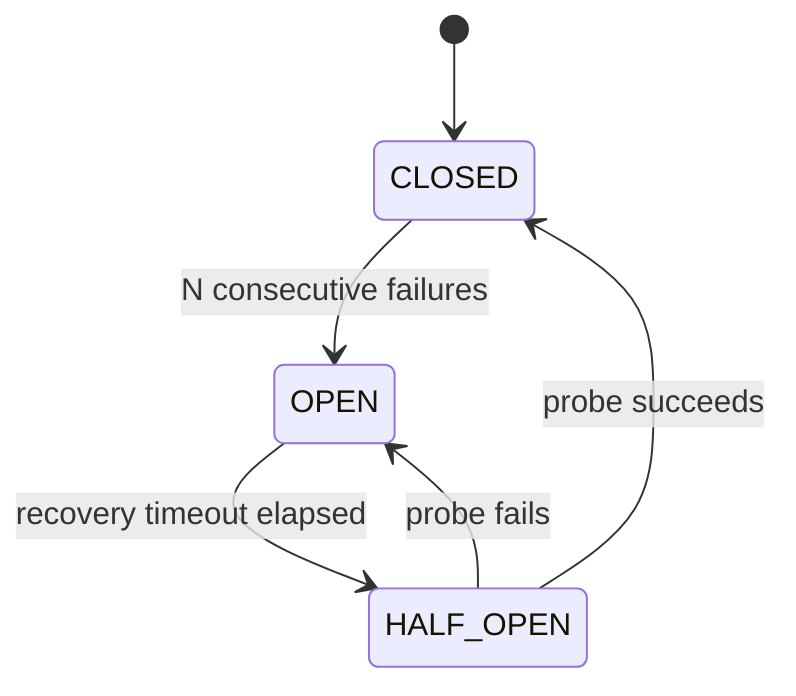

<!-- markdownlint-disable MD051 -->

!!! warning "Alpha / experimental"
    This utility ships under the **`circuit_breaker_alpha`** namespace while we collect
    feedback. The public API may change in a backwards-incompatible way before it is
    promoted to GA, at which point the import path becomes `circuit_breaker`. Pin your
    Powertools version and follow the tracking discussion before relying on it in
    production.

The circuit breaker utility stops sending traffic to an unhealthy downstream dependency, giving it room to recover while you decide what happens to the rejected requests.

## Key features

* Stops calling an unhealthy downstream after a configurable number of consecutive failures
* Hands rejected requests to an `on_circuit_open` callback so you decide what happens next (buffer, drop, return a cached value)
* Tests recovery with an explicit half-open probe rather than blindly retrying everything at once
* Shares circuit state across execution environments via Amazon DynamoDB
* Keeps the healthy path write-free: failures are counted in memory and only persisted on a state transition

## Terminology

**Circuit** is a named guard around a single downstream dependency. Each `name` is an independent circuit.

**State** is the circuit's current mode: `CLOSED` (normal), `OPEN` (downstream considered unhealthy, calls skipped), or `HALF_OPEN` (testing recovery).

**Persistence layer** is the shared storage that holds each circuit's state so every execution environment agrees on whether a circuit is open.

**Recovery timeout** is how long a circuit stays open before allowing a half-open probe.

<center>


<i>Circuit breaker state transitions</i>
</center>

## Getting started

We use Amazon DynamoDB as the persistence layer in this documentation.

### IAM Permissions

When using Amazon DynamoDB as the persistence layer, you will need the following IAM permissions:

| IAM Permission                       | Operation                                               |
| ------------------------------------ | ------------------------------------------------------- |
| **`dynamodb:GetItem`**{: .copyMe}    | Read shared circuit state                               |
| **`dynamodb:PutItem`**{: .copyMe}    | Persist an opened circuit and elect the half-open probe |
| **`dynamodb:UpdateItem`**{: .copyMe} | Close or reopen a circuit after a probe                 |

### Required resources

To start, you'll need:

<!-- markdownlint-disable MD030 -->

<div class="grid cards" markdown>
*   **Persistent storage**

    ---

    [Amazon DynamoDB](#dynamodb-table)

*   **AWS Lambda function**

    ---

    With permissions to read and write your persistent storage

</div>

<!-- markdownlint-enable MD030 -->

#### DynamoDB table

Unless you're looking to [customize each attribute](#customizing-the-dynamodb-table), you only need the following:

| Configuration      | Value        | Notes                                                        |
| ------------------ | ------------ | ------------------------------------------------------------ |
| Partition key      | `id`         | Holds the circuit name                                       |
| TTL attribute name | `expiration` | Using AWS Console? This is configurable after table creation |

You **can** use a single DynamoDB table for all your circuits.

##### DynamoDB IaC example

=== "AWS Serverless Application Model (SAM) example"

    ```yaml hl_lines="3-15 24-29 32-33"
    --8<-- "examples/circuit_breaker_alpha/templates/sam.yaml"
    ```

### Circuit breaker in action

The common case is the `@circuit_breaker` decorator wrapping the function that makes the downstream call. With no `config`, sensible defaults apply (open after 5 consecutive failures, probe after 30 seconds, close after 3 probe successes, count any exception as a failure).

=== "getting_started_with_circuit_breaker.py"

    ```python hl_lines="3-6 9 19 27"
    --8<-- "examples/circuit_breaker_alpha/src/getting_started_with_circuit_breaker.py"
    ```

!!! note "Wrap the downstream call, not the whole handler"
    The circuit protects a single dependency. If you decorate a handler that parses the
    event, validates, and calls two backends, a parsing bug would trip a circuit named
    after a backend that is perfectly healthy. Decorate the handler directly only when
    the handler **is** the downstream call (a thin pass-through).

### What the decorated function returns

There is no wrapper type to inspect. The contract is:

| Circuit state                         | Result                                                                 |
| ------------------------------------- | ---------------------------------------------------------------------- |
| **Closed**                            | The protected function's return value                                  |
| **Open**, `on_circuit_open` set       | Whatever the callback returns                                          |
| **Open**, no callback                 | Raises `CircuitBreakerOpenError` (with the `CircuitInfo` attached)     |

## Handling an open circuit

### With a callback

Register an `on_circuit_open` callback to decide what happens to a rejected request. The callback receives the same arguments the protected function was called with (positional arguments stay positional, keyword arguments stay keyword), plus a trailing `circuit` keyword argument carrying a `CircuitInfo` snapshot. Its return value becomes the result of the call.

=== "working_with_callback.py"

    ```python hl_lines="6 24-28 31-35"
    --8<-- "examples/circuit_breaker_alpha/src/working_with_callback.py"
    ```

!!! info "Why a callback instead of built-in S3/SQS sinks?"
    A managed sink would have to own client setup, payload-size handling, retries, and
    IAM, and it would leak *where* the payload landed back to the caller. A one-line
    callback does the same thing with full control and no lock-in, so the utility stays
    out of your way.

### Without a callback

If no callback is registered, an open circuit raises `CircuitBreakerOpenError`. Catch it to decide how to respond. The exception carries a `circuit` attribute (`CircuitInfo`) so you can inspect why the request was rejected.

=== "working_without_callback.py"

    ```python hl_lines="5 16-22 38-43"
    --8<-- "examples/circuit_breaker_alpha/src/working_without_callback.py"
    ```

## Configuration

All options live on `CircuitBreakerConfig`. Every value has a default, so `CircuitBreakerConfig()` is a valid production configuration.

| Parameter                 | Default | Description                                                                                       |
| ------------------------- | ------- | ------------------------------------------------------------------------------------------------- |
| **`failure_threshold`**   | `5`     | Consecutive failures that trip a closed circuit to open                                           |
| **`recovery_timeout`**    | `30`    | Seconds the circuit stays open before a half-open probe                                           |
| **`success_threshold`**   | `3`     | Consecutive probe successes required to close a half-open circuit                                 |
| **`handled_exceptions`**  | `None`  | Allowlist: only these exception types count as failures. Mutually exclusive with the denylist     |
| **`ignored_exceptions`**  | `None`  | Denylist: every exception counts as a failure except these. Mutually exclusive with the allowlist |
| **`local_cache_max_age`** | `5`     | Seconds a circuit's state is cached per environment before a read-through                         |

### Choosing which exceptions count as a failure

By default, **any exception** counts as a failure. But not every error means the downstream is unhealthy: a `400` is the caller's fault, a `503` is not. Scope it from either side:

* **`handled_exceptions`** (allowlist): only these count. Everything else propagates without affecting the circuit.
* **`ignored_exceptions`** (denylist): everything counts except these.

Passing both raises `CircuitBreakerConfigError`. An exception that doesn't count is re-raised to the caller untouched.

## Advanced

### How recovery works

After `recovery_timeout` seconds, the circuit moves to `HALF_OPEN` and a **single** execution environment is elected (via a conditional DynamoDB write) to run a probe. If `success_threshold` consecutive probes succeed, the circuit closes; a single failing probe reopens it. This avoids a thundering herd of every environment hammering a recovering backend at once.

### State coordination across environments

The consecutive-failure counter lives in memory per execution environment, so a healthy circuit performs **no writes**. Only when an environment reaches `failure_threshold` does it persist `OPEN`. The shared state is cached locally for `local_cache_max_age` seconds to avoid a read per invocation. A cache miss (cold start or expired entry) forces a read-through before routing.

!!! note "Fail-open by design"
    If the persistence store cannot be reached when reading state, the circuit is treated
    as **closed**. A circuit breaker should never become the outage it is meant to prevent.

### Observability with metrics

Register an `on_transition` hook to be notified whenever the circuit changes state (open, probe, close, reopen). The hook fires **only on transitions**, never on the per-invocation hot path, so it is a safe place to emit a CloudWatch metric without giving up the write-free healthy path. It receives a single `CircuitTransition` (`circuit_name`, `from_state`, `to_state`, `opened_at`).

=== "working_with_metrics.py"

    ```python hl_lines="3 12-21 26"
    --8<-- "examples/circuit_breaker_alpha/src/working_with_metrics.py"
    ```

Any exception raised inside the hook is swallowed and logged, so a misbehaving metric call can never break the protected request.

!!! warning "`failure_count` is a trip-time snapshot, not a running total"
    The `failure_count` on `CircuitInfo` is the number of *consecutive* failures the
    environment that tripped the circuit had counted at the moment it opened. Because the
    failure counter lives in memory per execution environment (keeping the healthy path
    write-free), it is **not** a fleet-wide total and reads `0` in states reached without a
    fresh trip (such as `HALF_OPEN`). For failure **volume**, emit a metric from your own
    code or the `on_transition` hook rather than reading this field.

### Disabling the circuit breaker

Set **`POWERTOOLS_CIRCUIT_BREAKER_DISABLED`**{: .copyMe} to a truthy value to bypass the circuit entirely and always call the protected function. This is intended for **development environments only** and emits a warning.

### Customizing the DynamoDB table

`CircuitBreakerDynamoDBPersistence` accepts attribute-name overrides (`key_attr`, `state_attr`, `failure_count_attr`, `opened_at_attr`, `half_open_owner_attr`, `expiry_attr`) and the usual boto3 escape hatches (`boto3_session`, `boto3_client`, `boto_config`) for reusing an existing table layout or client.

## Testing your code

When unit testing the function a circuit protects, set `POWERTOOLS_CIRCUIT_BREAKER_DISABLED=true` to bypass the circuit and persistence layer entirely, so your tests exercise the business logic without needing DynamoDB.

```bash title="Disabling circuit breaker for tests"
POWERTOOLS_CIRCUIT_BREAKER_DISABLED=true python -m pytest
```
