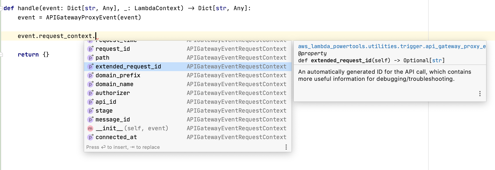

<!-- markdownlint-disable MD043 -->

Event Source Data Classes utility provides classes self-describing Lambda event sources.

## Key features

* Type hinting and code completion for common event types
* Helper functions for decoding/deserializing nested fields
* Docstrings for fields contained in event schemas

**Background**

When authoring Lambda functions, you often need to understand the schema of the event dictionary which is passed to the
handler. There are several common event types which follow a specific schema, depending on the service triggering the
Lambda function.

## Getting started

### Utilizing the data classes

The classes are initialized by passing in the Lambda event object into the constructor of the appropriate data class or
by using the `event_source` decorator.

For example, if your Lambda function is being triggered by an API Gateway proxy integration, you can use the
`APIGatewayProxyEvent` class.

=== "app.py"

    ```python hl_lines="1 4"
    from aws_lambda_powertools.utilities.data_classes import APIGatewayProxyEvent

    def lambda_handler(event: dict, context):
        event = APIGatewayProxyEvent(event)
        if 'helloworld' in event.path and event.http_method == 'GET':
            do_something_with(event.body, user)
    ```

Same example as above, but using the `event_source` decorator

=== "app.py"

    ```python hl_lines="1 3"
    from aws_lambda_powertools.utilities.data_classes import event_source, APIGatewayProxyEvent

    @event_source(data_class=APIGatewayProxyEvent)
    def lambda_handler(event: APIGatewayProxyEvent, context):
        if 'helloworld' in event.path and event.http_method == 'GET':
            do_something_with(event.body, user)
    ```

Log Data Event for Troubleshooting

=== "app.py"

    ```python hl_lines="4 8"
    from aws_lambda_powertools.utilities.data_classes import event_source, APIGatewayProxyEvent
    from aws_lambda_powertools.logging.logger import Logger

    logger = Logger(service="hello_logs", level="DEBUG")

    @event_source(data_class=APIGatewayProxyEvent)
    def lambda_handler(event: APIGatewayProxyEvent, context):
        logger.debug(event)
    ```

**Autocomplete with self-documented properties and methods**



## Supported event sources

| Event Source                                                              | Data_class                                         |
| ------------------------------------------------------------------------- | -------------------------------------------------- |
| [Active MQ](#active-mq)                                                   | `ActiveMQEvent`                                    |
| [API Gateway Authorizer](#api-gateway-authorizer)                         | `APIGatewayAuthorizerRequestEvent`                 |
| [API Gateway Authorizer V2](#api-gateway-authorizer-v2)                   | `APIGatewayAuthorizerEventV2`                      |
| [API Gateway Proxy](#api-gateway-proxy)                                   | `APIGatewayProxyEvent`                             |
| [API Gateway Proxy V2](#api-gateway-proxy-v2)                             | `APIGatewayProxyEventV2`                           |
| [Application Load Balancer](#application-load-balancer)                   | `ALBEvent`                                         |
| [AppSync Authorizer](#appsync-authorizer)                                 | `AppSyncAuthorizerEvent`                           |
| [AppSync Resolver](#appsync-resolver)                                     | `AppSyncResolverEvent`                             |
| [AWS Config Rule](#aws-config-rule)                                       | `AWSConfigRuleEvent`                               |
| [CloudWatch Dashboard Custom Widget](#cloudwatch-dashboard-custom-widget) | `CloudWatchDashboardCustomWidgetEvent`             |
| [CloudWatch Logs](#cloudwatch-logs)                                       | `CloudWatchLogsEvent`                              |
| [CodePipeline Job Event](#codepipeline-job)                               | `CodePipelineJobEvent`                             |
| [Cognito User Pool](#cognito-user-pool)                                   | Multiple available under `cognito_user_pool_event` |
| [Connect Contact Flow](#connect-contact-flow)                             | `ConnectContactFlowEvent`                          |
| [DynamoDB streams](#dynamodb-streams)                                     | `DynamoDBStreamEvent`, `DynamoDBRecordEventName`   |
| [EventBridge](#eventbridge)                                               | `EventBridgeEvent`                                 |
| [Kafka](#kafka)                                                           | `KafkaEvent`                                       |
| [Kinesis Data Stream](#kinesis-streams)                                   | `KinesisStreamEvent`                               |
| [Kinesis Firehose Delivery Stream](#kinesis-firehose-delivery-stream)     | `KinesisFirehoseEvent`                             |
| [Lambda Function URL](#lambda-function-url)                               | `LambdaFunctionUrlEvent`                           |
| [Rabbit MQ](#rabbit-mq)                                                   | `RabbitMQEvent`                                    |
| [S3](#s3)                                                                 | `S3Event`                                          |
| [S3 Object Lambda](#s3-object-lambda)                                     | `S3ObjectLambdaEvent`                              |
| [S3 EventBridge Notification](#s3-eventbridge-notification)               | `S3EventBridgeNotificationEvent`                   |
| [SES](#ses)                                                               | `SESEvent`                                         |
| [SNS](#sns)                                                               | `SNSEvent`                                         |
| [SQS](#sqs)                                                               | `SQSEvent`                                         |
| [VPC Lattice](#vpc-lattice)                                               | `VPCLatticeEvent`                                  |

???+ info
    The examples provided below are far from exhaustive - the data classes themselves are designed to provide a form of
    documentation inherently (via autocompletion, types and docstrings).

### Active MQ

It is used for [Active MQ payloads](https://docs.aws.amazon.com/lambda/latest/dg/with-mq.html){target="_blank"}, also see
the [AWS blog post](https://aws.amazon.com/blogs/compute/using-amazon-mq-as-an-event-source-for-aws-lambda/){target="_blank"}
for more details.

=== "app.py"

    ```python hl_lines="4-5 9-10"
    from typing import Dict

    from aws_lambda_powertools import Logger
    from aws_lambda_powertools.utilities.data_classes import event_source
    from aws_lambda_powertools.utilities.data_classes.active_mq_event import ActiveMQEvent

    logger = Logger()

    @event_source(data_class=ActiveMQEvent)
    def lambda_handler(event: ActiveMQEvent, context):
        for message in event.messages:
            logger.debug(f"MessageID: {message.message_id}")
            data: Dict = message.json_data
            logger.debug("Process json in base64 encoded data str", data)
    ```

### API Gateway Authorizer

> New in 1.20.0

It is used for [API Gateway Rest API Lambda Authorizer payload](https://docs.aws.amazon.com/apigateway/latest/developerguide/apigateway-use-lambda-authorizer.html){target="_blank"}.

Use **`APIGatewayAuthorizerRequestEvent`** for type `REQUEST` and **`APIGatewayAuthorizerTokenEvent`** for type `TOKEN`.

=== "app_type_request.py"

    This example uses the `APIGatewayAuthorizerResponse` to decline a given request if the user is not found.

    When the user is found, it includes the user details in the request context that will be available to the back-end, and returns a full access policy for admin users.

    ```python hl_lines="2-6 29 36-42 47 49"
    from aws_lambda_powertools.utilities.data_classes import event_source
    from aws_lambda_powertools.utilities.data_classes.api_gateway_authorizer_event import (
        DENY_ALL_RESPONSE,
        APIGatewayAuthorizerRequestEvent,
        APIGatewayAuthorizerResponse,
        HttpVerb,
    )
    from secrets import compare_digest


    def get_user_by_token(token):
        if compare_digest(token, "admin-foo"):
            return {"id": 0, "name": "Admin", "isAdmin": True}
        elif compare_digest(token, "regular-foo"):
            return {"id": 1, "name": "Joe"}
        else:
            return None


    @event_source(data_class=APIGatewayAuthorizerRequestEvent)
    def handler(event: APIGatewayAuthorizerRequestEvent, context):
        user = get_user_by_token(event.get_header_value("Authorization"))

        if user is None:
            # No user was found
            # to return 401 - `{"message":"Unauthorized"}`, but pollutes lambda error count metrics
            # raise Exception("Unauthorized")
            # to return 403 - `{"message":"Forbidden"}`
            return DENY_ALL_RESPONSE

        # parse the `methodArn` as an `APIGatewayRouteArn`
        arn = event.parsed_arn

        # Create the response builder from parts of the `methodArn`
        # and set the logged in user id and context
        policy = APIGatewayAuthorizerResponse(
            principal_id=user["id"],
            context=user,
            region=arn.region,
            aws_account_id=arn.aws_account_id,
            api_id=arn.api_id,
            stage=arn.stage,
        )

        # Conditional IAM Policy
        if user.get("isAdmin", False):
            policy.allow_all_routes()
        else:
            policy.allow_route(HttpVerb.GET, "/user-profile")

        return policy.asdict()
    ```
=== "app_type_token.py"

    ```python hl_lines="2-5 12-18 21 23-24"
    from aws_lambda_powertools.utilities.data_classes import event_source
    from aws_lambda_powertools.utilities.data_classes.api_gateway_authorizer_event import (
        APIGatewayAuthorizerTokenEvent,
        APIGatewayAuthorizerResponse,
    )


    @event_source(data_class=APIGatewayAuthorizerTokenEvent)
    def handler(event: APIGatewayAuthorizerTokenEvent, context):
        arn = event.parsed_arn

        policy = APIGatewayAuthorizerResponse(
            principal_id="user",
            region=arn.region,
            aws_account_id=arn.aws_account_id,
            api_id=arn.api_id,
            stage=arn.stage
        )

        if event.authorization_token == "42":
            policy.allow_all_routes()
        else:
            policy.deny_all_routes()
        return policy.asdict()
    ```

### API Gateway Authorizer V2

> New in 1.20.0

It is used for [API Gateway HTTP API Lambda Authorizer payload version 2](https://docs.aws.amazon.com/apigateway/latest/developerguide/http-api-lambda-authorizer.html){target="_blank"}.
See also [this blog post](https://aws.amazon.com/blogs/compute/introducing-iam-and-lambda-authorizers-for-amazon-api-gateway-http-apis/){target="_blank"} for more details.

=== "app.py"

    This example looks up user details via `x-token` header. It uses `APIGatewayAuthorizerResponseV2` to return a deny policy when user is not found or authorized.

    ```python hl_lines="2-5 21 24"
    from aws_lambda_powertools.utilities.data_classes import event_source
    from aws_lambda_powertools.utilities.data_classes.api_gateway_authorizer_event import (
        APIGatewayAuthorizerEventV2,
        APIGatewayAuthorizerResponseV2,
    )
    from secrets import compare_digest


    def get_user_by_token(token):
        if compare_digest(token, "Foo"):
            return {"name": "Foo"}
        return None


    @event_source(data_class=APIGatewayAuthorizerEventV2)
    def handler(event: APIGatewayAuthorizerEventV2, context):
        user = get_user_by_token(event.get_header_value("x-token"))

        if user is None:
            # No user was found, so we return not authorized
            return APIGatewayAuthorizerResponseV2().asdict()

        # Found the user and setting the details in the context
        return APIGatewayAuthorizerResponseV2(authorize=True, context=user).asdict()
    ```

### API Gateway Proxy

It is used for either API Gateway REST API or HTTP API using v1 proxy event.

=== "app.py"

    ```python
    from aws_lambda_powertools.utilities.data_classes import event_source, APIGatewayProxyEvent

    @event_source(data_class=APIGatewayProxyEvent)
    def lambda_handler(event: APIGatewayProxyEvent, context):
        if "helloworld" in event.path and event.http_method == "GET":
            request_context = event.request_context
            identity = request_context.identity
            user = identity.user
            do_something_with(event.json_body, user)
    ```

### API Gateway Proxy V2

It is used for HTTP API using v2 proxy event.

=== "app.py"

    ```python
    from aws_lambda_powertools.utilities.data_classes import event_source, APIGatewayProxyEventV2

    @event_source(data_class=APIGatewayProxyEventV2)
    def lambda_handler(event: APIGatewayProxyEventV2, context):
        if "helloworld" in event.path and event.http_method == "POST":
            do_something_with(event.json_body, event.query_string_parameters)
    ```

### Application Load Balancer

Is it used for Application load balancer event.

=== "app.py"

    ```python
    from aws_lambda_powertools.utilities.data_classes import event_source, ALBEvent

    @event_source(data_class=ALBEvent)
    def lambda_handler(event: ALBEvent, context):
        if "helloworld" in event.path and event.http_method == "POST":
            do_something_with(event.json_body, event.query_string_parameters)
    ```

### AppSync Authorizer

> New in 1.20.0

Used when building an [AWS_LAMBDA Authorization](https://docs.aws.amazon.com/appsync/latest/devguide/security-authz.html#aws-lambda-authorization){target="_blank"} with AppSync.
See blog post [Introducing Lambda authorization for AWS AppSync GraphQL APIs](https://aws.amazon.com/blogs/mobile/appsync-lambda-auth/){target="_blank"}
or read the Amplify documentation on using [AWS Lambda for authorization](https://docs.amplify.aws/lib/graphqlapi/authz/q/platform/js#aws-lambda){target="_blank"} with AppSync.

In this example extract the `requestId` as the `correlation_id` for logging, used `@event_source` decorator and builds the AppSync authorizer using the `AppSyncAuthorizerResponse` helper.

=== "app.py"

    ```python
    from typing import Dict

    from aws_lambda_powertools.logging import correlation_paths
    from aws_lambda_powertools.logging.logger import Logger
    from aws_lambda_powertools.utilities.data_classes.appsync_authorizer_event import (
        AppSyncAuthorizerEvent,
        AppSyncAuthorizerResponse,
    )
    from aws_lambda_powertools.utilities.data_classes.event_source import event_source

    logger = Logger()


    def get_user_by_token(token: str):
        """Look a user by token"""
        ...


    @logger.inject_lambda_context(correlation_id_path=correlation_paths.APPSYNC_AUTHORIZER)
    @event_source(data_class=AppSyncAuthorizerEvent)
    def lambda_handler(event: AppSyncAuthorizerEvent, context) -> Dict:
        user = get_user_by_token(event.authorization_token)

        if not user:
            # No user found, return not authorized
            return AppSyncAuthorizerResponse().asdict()

        return AppSyncAuthorizerResponse(
            authorize=True,
            resolver_context={"id": user.id},
            # Only allow admins to delete events
            deny_fields=None if user.is_admin else ["Mutation.deleteEvent"],
        ).asdict()
    ```

### AppSync Resolver

> New in 1.12.0

Used when building Lambda GraphQL Resolvers with [Amplify GraphQL Transform Library](https://docs.amplify.aws/cli/graphql-transformer/function){target="_blank"} (`@function`),
and [AppSync Direct Lambda Resolvers](https://aws.amazon.com/blogs/mobile/appsync-direct-lambda/){target="_blank"}.

In this example, we also use the new Logger `correlation_id` and built-in `correlation_paths` to extract, if available, X-Ray Trace ID in AppSync request headers:

=== "app.py"

    ```python hl_lines="2-5 12 14 19 21 29-30"
    from aws_lambda_powertools.logging import Logger, correlation_paths
    from aws_lambda_powertools.utilities.data_classes.appsync_resolver_event import (
        AppSyncResolverEvent,
        AppSyncIdentityCognito
    )

    logger = Logger()

    def get_locations(name: str = None, size: int = 0, page: int = 0):
        """Your resolver logic here"""

    @logger.inject_lambda_context(correlation_id_path=correlation_paths.APPSYNC_RESOLVER)
    def lambda_handler(event, context):
        event: AppSyncResolverEvent = AppSyncResolverEvent(event)

        # Case insensitive look up of request headers
        x_forwarded_for = event.get_header_value("x-forwarded-for")

        # Support for AppSyncIdentityCognito or AppSyncIdentityIAM identity types
        assert isinstance(event.identity, AppSyncIdentityCognito)
        identity: AppSyncIdentityCognito = event.identity

        # Logging with correlation_id
        logger.debug({
            "x-forwarded-for": x_forwarded_for,
            "username": identity.username
        })

        if event.type_name == "Merchant" and event.field_name == "locations":
            return get_locations(**event.arguments)

        raise ValueError(f"Unsupported field resolver: {event.field_name}")

    ```

=== "Example AppSync Event"

    ```json hl_lines="2-8 14 19 20"
    {
      "typeName": "Merchant",
      "fieldName": "locations",
      "arguments": {
        "page": 2,
        "size": 1,
        "name": "value"
      },
      "identity": {
        "claims": {
          "iat": 1615366261
          ...
        },
        "username": "mike",
        ...
      },
      "request": {
        "headers": {
          "x-amzn-trace-id": "Root=1-60488877-0b0c4e6727ab2a1c545babd0",
          "x-forwarded-for": "127.0.0.1"
          ...
        }
      },
      ...
    }
    ```

=== "Example CloudWatch Log"

    ```json hl_lines="5 6 16"
    {
        "level":"DEBUG",
        "location":"lambda_handler:22",
        "message":{
            "x-forwarded-for":"127.0.0.1",
            "username":"mike"
        },
        "timestamp":"2021-03-10 12:38:40,062",
        "service":"service_undefined",
        "sampling_rate":0.0,
        "cold_start":true,
        "function_name":"func_name",
        "function_memory_size":512,
        "function_arn":"func_arn",
        "function_request_id":"6735a29c-c000-4ae3-94e6-1f1c934f7f94",
        "correlation_id":"Root=1-60488877-0b0c4e6727ab2a1c545babd0"
    }
    ```

### AWS Config Rule

=== "aws_config_rule.py"
    ```python hl_lines="3 11"
    --8<-- "examples/event_sources/src/aws_config_rule.py"
    ```

=== "Event - ItemChanged"
    ```json
    --8<-- "examples/event_sources/src/aws_config_rule_item_changed.json"
    ```
=== "Event - Oversized"
    ```json
    --8<-- "examples/event_sources/src/aws_config_rule_oversized.json"
    ```
=== "Event - ScheduledNotification"
    ```json
    --8<-- "examples/event_sources/src/aws_config_rule_scheduled.json"
    ```

### CloudWatch Dashboard Custom Widget

=== "app.py"

    ```python
    from aws_lambda_powertools.utilities.data_classes import event_source, CloudWatchDashboardCustomWidgetEvent

    const DOCS = `
    ## Echo
    A simple echo script. Anything passed in \`\`\`echo\`\`\` parameter is returned as the content of custom widget.

    ### Widget parameters
    | Param    | Description              |
    | -------- | ------------------------ |
    | **echo** | The content to echo back |

    ### Example parameters
    \`\`\` yaml
    echo: <h1>Hello world</h1>
    \`\`\`
    `

    @event_source(data_class=CloudWatchDashboardCustomWidgetEvent)
    def lambda_handler(event: CloudWatchDashboardCustomWidgetEvent, context):

        if event.describe:
            return DOCS

        # You can directly return HTML or JSON content
        # Alternatively, you can return markdown that will be rendered by CloudWatch
        echo = event.widget_context.params["echo"]
        return { "markdown": f"# {echo}" }
    ```

### CloudWatch Logs

CloudWatch Logs events by default are compressed and base64 encoded. You can use the helper function provided to decode,
decompress and parse json data from the event.

=== "app.py"

    ```python
    from aws_lambda_powertools.utilities.data_classes import event_source, CloudWatchLogsEvent
    from aws_lambda_powertools.utilities.data_classes.cloud_watch_logs_event import CloudWatchLogsDecodedData

    @event_source(data_class=CloudWatchLogsEvent)
    def lambda_handler(event: CloudWatchLogsEvent, context):
        decompressed_log: CloudWatchLogsDecodedData = event.parse_logs_data()
        log_events = decompressed_log.log_events
        for event in log_events:
            do_something_with(event.timestamp, event.message)
    ```

#### Kinesis integration

[When streaming CloudWatch Logs to a Kinesis Data Stream](https://aws.amazon.com/premiumsupport/knowledge-center/streaming-cloudwatch-logs/){target="_blank"} (cross-account or not), you can use `extract_cloudwatch_logs_from_event` to decode, decompress and extract logs as `CloudWatchLogsDecodedData` to ease log processing.

=== "app.py"

    ```python hl_lines="5-6 11"
    from typing import List

    from aws_lambda_powertools.utilities.data_classes import event_source
    from aws_lambda_powertools.utilities.data_classes.cloud_watch_logs_event import CloudWatchLogsDecodedData
    from aws_lambda_powertools.utilities.data_classes.kinesis_stream_event import (
        KinesisStreamEvent, extract_cloudwatch_logs_from_event)


    @event_source(data_class=KinesisStreamEvent)
    def simple_handler(event: KinesisStreamEvent, context):
        logs: List[CloudWatchLogsDecodedData] = extract_cloudwatch_logs_from_event(event)
        for log in logs:
            if log.message_type == "DATA_MESSAGE":
                return "success"
        return "nothing to be processed"
    ```

Alternatively, you can use `extract_cloudwatch_logs_from_record` to seamless integrate with the [Batch utility](./batch.md){target="_blank"} for more robust log processing.

=== "app.py"

    ```python hl_lines="3-4 10"
    from aws_lambda_powertools.utilities.batch import (BatchProcessor, EventType,
                                                       batch_processor)
    from aws_lambda_powertools.utilities.data_classes.kinesis_stream_event import (
        KinesisStreamRecord, extract_cloudwatch_logs_from_record)

    processor = BatchProcessor(event_type=EventType.KinesisDataStreams)


    def record_handler(record: KinesisStreamRecord):
        log = extract_cloudwatch_logs_from_record(record)
        return log.message_type == "DATA_MESSAGE"


    @batch_processor(record_handler=record_handler, processor=processor)
    def lambda_handler(event, context):
        return processor.response()
    ```

### CodePipeline Job

Data classes and utility functions to help create continuous delivery pipelines tasks with AWS Lambda

=== "app.py"

    ```python
    from aws_lambda_powertools import Logger
    from aws_lambda_powertools.utilities.data_classes import event_source, CodePipelineJobEvent

    logger = Logger()

    @event_source(data_class=CodePipelineJobEvent)
    def lambda_handler(event, context):
        """The Lambda function handler

        If a continuing job then checks the CloudFormation stack status
        and updates the job accordingly.

        If a new job then kick of an update or creation of the target
        CloudFormation stack.
        """

        # Extract the Job ID
        job_id = event.get_id

        # Extract the params
        params: dict = event.decoded_user_parameters
        stack = params["stack"]
        artifact_name = params["artifact"]
        template_file = params["file"]

        try:
            if event.data.continuation_token:
                # If we're continuing then the create/update has already been triggered
                # we just need to check if it has finished.
                check_stack_update_status(job_id, stack)
            else:
                template = event.get_artifact(artifact_name, template_file)
                # Kick off a stack update or create
                start_update_or_create(job_id, stack, template)
        except Exception as e:
            # If any other exceptions which we didn't expect are raised
            # then fail the job and log the exception message.
            logger.exception("Function failed due to exception.")
            put_job_failure(job_id, "Function exception: " + str(e))

        logger.debug("Function complete.")
        return "Complete."
    ```

### Cognito User Pool

Cognito User Pools have several [different Lambda trigger sources](https://docs.aws.amazon.com/cognito/latest/developerguide/cognito-user-identity-pools-working-with-aws-lambda-triggers.html#cognito-user-identity-pools-working-with-aws-lambda-trigger-sources){target="_blank"}, all of which map to a different data class, which
can be imported from `aws_lambda_powertools.data_classes.cognito_user_pool_event`:

| Trigger/Event Source  | Data Class                                                                     |
| --------------------- | ------------------------------------------------------------------------------ |
| Custom message event  | `data_classes.cognito_user_pool_event.CustomMessageTriggerEvent`               |
| Post authentication   | `data_classes.cognito_user_pool_event.PostAuthenticationTriggerEvent`          |
| Post confirmation     | `data_classes.cognito_user_pool_event.PostConfirmationTriggerEvent`            |
| Pre authentication    | `data_classes.cognito_user_pool_event.PreAuthenticationTriggerEvent`           |
| Pre sign-up           | `data_classes.cognito_user_pool_event.PreSignUpTriggerEvent`                   |
| Pre token generation  | `data_classes.cognito_user_pool_event.PreTokenGenerationTriggerEvent`          |
| User migration        | `data_classes.cognito_user_pool_event.UserMigrationTriggerEvent`               |
| Define Auth Challenge | `data_classes.cognito_user_pool_event.DefineAuthChallengeTriggerEvent`         |
| Create Auth Challenge | `data_classes.cognito_user_pool_event.CreateAuthChallengeTriggerEvent`         |
| Verify Auth Challenge | `data_classes.cognito_user_pool_event.VerifyAuthChallengeResponseTriggerEvent` |

#### Post Confirmation Example

=== "app.py"

    ```python
    from aws_lambda_powertools.utilities.data_classes.cognito_user_pool_event import PostConfirmationTriggerEvent

    def lambda_handler(event, context):
        event: PostConfirmationTriggerEvent = PostConfirmationTriggerEvent(event)

        user_attributes = event.request.user_attributes
        do_something_with(user_attributes)
    ```

#### Define Auth Challenge Example

???+ note
    In this example we are modifying the wrapped dict response fields, so we need to return the json serializable wrapped event in `event.raw_event`.

This example is based on the AWS Cognito docs for [Define Auth Challenge Lambda Trigger](https://docs.aws.amazon.com/cognito/latest/developerguide/user-pool-lambda-define-auth-challenge.html){target="_blank"}.

=== "app.py"

    ```python
    from aws_lambda_powertools.utilities.data_classes.cognito_user_pool_event import DefineAuthChallengeTriggerEvent

    def handler(event: dict, context) -> dict:
        event: DefineAuthChallengeTriggerEvent = DefineAuthChallengeTriggerEvent(event)
        if (
            len(event.request.session) == 1
            and event.request.session[0].challenge_name == "SRP_A"
        ):
            event.response.issue_tokens = False
            event.response.fail_authentication = False
            event.response.challenge_name = "PASSWORD_VERIFIER"
        elif (
            len(event.request.session) == 2
            and event.request.session[1].challenge_name == "PASSWORD_VERIFIER"
            and event.request.session[1].challenge_result
        ):
            event.response.issue_tokens = False
            event.response.fail_authentication = False
            event.response.challenge_name = "CUSTOM_CHALLENGE"
        elif (
            len(event.request.session) == 3
            and event.request.session[2].challenge_name == "CUSTOM_CHALLENGE"
            and event.request.session[2].challenge_result
        ):
            event.response.issue_tokens = True
            event.response.fail_authentication = False
        else:
            event.response.issue_tokens = False
            event.response.fail_authentication = True

        return event.raw_event
    ```
=== "SPR_A response"

    ```json hl_lines="25-27"
    {
        "version": "1",
        "region": "us-east-1",
        "userPoolId": "us-east-1_example",
        "userName": "UserName",
        "callerContext": {
            "awsSdkVersion": "awsSdkVersion",
            "clientId": "clientId"
        },
        "triggerSource": "DefineAuthChallenge_Authentication",
        "request": {
            "userAttributes": {
                "sub": "4A709A36-7D63-4785-829D-4198EF10EBDA",
                "email_verified": "true",
                "name": "First Last",
                "email": "define-auth@mail.com"
            },
            "session": [
                {
                    "challengeName": "SRP_A",
                    "challengeResult": true
                }
            ]
        },
        "response": {
            "issueTokens": false,
            "failAuthentication": false,
            "challengeName": "PASSWORD_VERIFIER"
        }
    }
    ```
=== "PASSWORD_VERIFIER success response"

    ```json hl_lines="30-32"
    {
        "version": "1",
        "region": "us-east-1",
        "userPoolId": "us-east-1_example",
        "userName": "UserName",
        "callerContext": {
            "awsSdkVersion": "awsSdkVersion",
            "clientId": "clientId"
        },
        "triggerSource": "DefineAuthChallenge_Authentication",
        "request": {
            "userAttributes": {
                "sub": "4A709A36-7D63-4785-829D-4198EF10EBDA",
                "email_verified": "true",
                "name": "First Last",
                "email": "define-auth@mail.com"
            },
            "session": [
                {
                    "challengeName": "SRP_A",
                    "challengeResult": true
                },
                {
                    "challengeName": "PASSWORD_VERIFIER",
                    "challengeResult": true
                }
            ]
        },
        "response": {
            "issueTokens": false,
            "failAuthentication": false,
            "challengeName": "CUSTOM_CHALLENGE"
        }
    }

    ```
=== "CUSTOM_CHALLENGE success response"

    ```json hl_lines="34 35"
    {
        "version": "1",
        "region": "us-east-1",
        "userPoolId": "us-east-1_example",
        "userName": "UserName",
        "callerContext": {
            "awsSdkVersion": "awsSdkVersion",
            "clientId": "clientId"
        },
        "triggerSource": "DefineAuthChallenge_Authentication",
        "request": {
            "userAttributes": {
                "sub": "4A709A36-7D63-4785-829D-4198EF10EBDA",
                "email_verified": "true",
                "name": "First Last",
                "email": "define-auth@mail.com"
            },
            "session": [
                {
                    "challengeName": "SRP_A",
                    "challengeResult": true
                },
                {
                    "challengeName": "PASSWORD_VERIFIER",
                    "challengeResult": true
                },
                {
                    "challengeName": "CUSTOM_CHALLENGE",
                    "challengeResult": true
                }
            ]
        },
        "response": {
            "issueTokens": true,
            "failAuthentication": false
        }
    }
    ```

#### Create Auth Challenge Example

This example is based on the AWS Cognito docs for [Create Auth Challenge Lambda Trigger](https://docs.aws.amazon.com/cognito/latest/developerguide/user-pool-lambda-create-auth-challenge.html){target="_blank"}.

=== "app.py"

    ```python
    from aws_lambda_powertools.utilities.data_classes import event_source
    from aws_lambda_powertools.utilities.data_classes.cognito_user_pool_event import CreateAuthChallengeTriggerEvent

    @event_source(data_class=CreateAuthChallengeTriggerEvent)
    def handler(event: CreateAuthChallengeTriggerEvent, context) -> dict:
        if event.request.challenge_name == "CUSTOM_CHALLENGE":
            event.response.public_challenge_parameters = {"captchaUrl": "url/123.jpg"}
            event.response.private_challenge_parameters = {"answer": "5"}
            event.response.challenge_metadata = "CAPTCHA_CHALLENGE"
        return event.raw_event
    ```

#### Verify Auth Challenge Response Example

This example is based on the AWS Cognito docs for [Verify Auth Challenge Response Lambda Trigger](https://docs.aws.amazon.com/cognito/latest/developerguide/user-pool-lambda-verify-auth-challenge-response.html){target="_blank"}.

=== "app.py"

    ```python
    from aws_lambda_powertools.utilities.data_classes import event_source
    from aws_lambda_powertools.utilities.data_classes.cognito_user_pool_event import VerifyAuthChallengeResponseTriggerEvent

    @event_source(data_class=VerifyAuthChallengeResponseTriggerEvent)
    def handler(event: VerifyAuthChallengeResponseTriggerEvent, context) -> dict:
        event.response.answer_correct = (
            event.request.private_challenge_parameters.get("answer") == event.request.challenge_answer
        )
        return event.raw_event
    ```

### Connect Contact Flow

> New in 1.11.0

=== "app.py"

    ```python
    from aws_lambda_powertools.utilities.data_classes.connect_contact_flow_event import (
        ConnectContactFlowChannel,
        ConnectContactFlowEndpointType,
        ConnectContactFlowEvent,
        ConnectContactFlowInitiationMethod,
    )

    def lambda_handler(event, context):
        event: ConnectContactFlowEvent = ConnectContactFlowEvent(event)
        assert event.contact_data.attributes == {"Language": "en-US"}
        assert event.contact_data.channel == ConnectContactFlowChannel.VOICE
        assert event.contact_data.customer_endpoint.endpoint_type == ConnectContactFlowEndpointType.TELEPHONE_NUMBER
        assert event.contact_data.initiation_method == ConnectContactFlowInitiationMethod.API
    ```

### DynamoDB Streams

The DynamoDB data class utility provides the base class for `DynamoDBStreamEvent`, as well as enums for stream view type (`StreamViewType`) and event type.
(`DynamoDBRecordEventName`).
The class automatically deserializes DynamoDB types into their equivalent Python types.

=== "app.py"

    ```python
    from aws_lambda_powertools.utilities.data_classes.dynamo_db_stream_event import (
        DynamoDBStreamEvent,
        DynamoDBRecordEventName
    )

    def lambda_handler(event, context):
        event: DynamoDBStreamEvent = DynamoDBStreamEvent(event)

        # Multiple records can be delivered in a single event
        for record in event.records:
            if record.event_name == DynamoDBRecordEventName.MODIFY:
                do_something_with(record.dynamodb.new_image)
                do_something_with(record.dynamodb.old_image)
    ```

=== "multiple_records_types.py"

    ```python
    from aws_lambda_powertools.utilities.data_classes import event_source, DynamoDBStreamEvent
    from aws_lambda_powertools.utilities.typing import LambdaContext


    @event_source(data_class=DynamoDBStreamEvent)
    def lambda_handler(event: DynamoDBStreamEvent, context: LambdaContext):
        for record in event.records:
            # {"N": "123.45"} => Decimal("123.45")
            key: str = record.dynamodb.keys["id"]
            print(key)
    ```

### EventBridge

=== "app.py"

    ```python
    from aws_lambda_powertools.utilities.data_classes import event_source, EventBridgeEvent

    @event_source(data_class=EventBridgeEvent)
    def lambda_handler(event: EventBridgeEvent, context):
        do_something_with(event.detail)

    ```

### Kafka

This example is based on the AWS docs for [Amazon MSK](https://docs.aws.amazon.com/lambda/latest/dg/with-msk.html){target="_blank"} and [self-managed Apache Kafka](https://docs.aws.amazon.com/lambda/latest/dg/with-kafka.html){target="_blank"}.

=== "app.py"

    ```python
    from aws_lambda_powertools.utilities.data_classes import event_source, KafkaEvent

    @event_source(data_class=KafkaEvent)
    def lambda_handler(event: KafkaEvent, context):
        for record in event.records:
            do_something_with(record.decoded_key, record.json_value)

    ```

### Kinesis streams

Kinesis events by default contain base64 encoded data. You can use the helper function to access the data either as json
or plain text, depending on the original payload.

=== "app.py"

    ```python
    from aws_lambda_powertools.utilities.data_classes import event_source, KinesisStreamEvent

    @event_source(data_class=KinesisStreamEvent)
    def lambda_handler(event: KinesisStreamEvent, context):
        kinesis_record = next(event.records).kinesis

        # if data was delivered as text
        data = kinesis_record.data_as_text()

        # if data was delivered as json
        data = kinesis_record.data_as_json()

        do_something_with(data)
    ```

### Kinesis Firehose delivery stream

Kinesis Firehose Data Transformation can use a Lambda Function to modify the records
inline, and re-emit them back to the Delivery Stream.

Similar to Kinesis Data Streams, the events contain base64 encoded data. You can use the helper
function to access the data either as json or plain text, depending on the original payload.

=== "app.py"

    ```python
    --8<-- "examples/event_sources/src/kinesis_firehose_delivery_stream.py"
    ```

### Lambda Function URL

=== "app.py"

    ```python
    from aws_lambda_powertools.utilities.data_classes import event_source, LambdaFunctionUrlEvent

    @event_source(data_class=LambdaFunctionUrlEvent)
    def lambda_handler(event: LambdaFunctionUrlEvent, context):
        do_something_with(event.body)
    ```

### Rabbit MQ

It is used for [Rabbit MQ payloads](https://docs.aws.amazon.com/lambda/latest/dg/with-mq.html){target="_blank"}, also see
the [blog post](https://aws.amazon.com/blogs/compute/using-amazon-mq-for-rabbitmq-as-an-event-source-for-lambda/){target="_blank"}
for more details.

=== "app.py"

    ```python hl_lines="4-5 9-10"
    from typing import Dict

    from aws_lambda_powertools import Logger
    from aws_lambda_powertools.utilities.data_classes import event_source
    from aws_lambda_powertools.utilities.data_classes.rabbit_mq_event import RabbitMQEvent

    logger = Logger()

    @event_source(data_class=RabbitMQEvent)
    def lambda_handler(event: RabbitMQEvent, context):
        for queue_name, messages in event.rmq_messages_by_queue.items():
            logger.debug(f"Messages for queue: {queue_name}")
            for message in messages:
                logger.debug(f"MessageID: {message.basic_properties.message_id}")
                data: Dict = message.json_data
                logger.debug("Process json in base64 encoded data str", data)
    ```

### S3

=== "app.py"

    ```python
    from urllib.parse import unquote_plus
    from aws_lambda_powertools.utilities.data_classes import event_source, S3Event

    @event_source(data_class=S3Event)
    def lambda_handler(event: S3Event, context):
        bucket_name = event.bucket_name

        # Multiple records can be delivered in a single event
        for record in event.records:
            object_key = unquote_plus(record.s3.get_object.key)

            do_something_with(f"{bucket_name}/{object_key}")
    ```

### S3 Object Lambda

This example is based on the AWS Blog post [Introducing Amazon S3 Object Lambda – Use Your Code to Process Data as It Is Being Retrieved from S3](https://aws.amazon.com/blogs/aws/introducing-amazon-s3-object-lambda-use-your-code-to-process-data-as-it-is-being-retrieved-from-s3/){target="_blank"}.

=== "app.py"

    ```python  hl_lines="5-6 12 14"
    import boto3
    import requests

    from aws_lambda_powertools import Logger
    from aws_lambda_powertools.logging.correlation_paths import S3_OBJECT_LAMBDA
    from aws_lambda_powertools.utilities.data_classes.s3_object_event import S3ObjectLambdaEvent

    logger = Logger()
    session = boto3.Session()
    s3 = session.client("s3")

    @logger.inject_lambda_context(correlation_id_path=S3_OBJECT_LAMBDA, log_event=True)
    def lambda_handler(event, context):
        event = S3ObjectLambdaEvent(event)

        # Get object from S3
        response = requests.get(event.input_s3_url)
        original_object = response.content.decode("utf-8")

        # Make changes to the object about to be returned
        transformed_object = original_object.upper()

        # Write object back to S3 Object Lambda
        s3.write_get_object_response(
            Body=transformed_object, RequestRoute=event.request_route, RequestToken=event.request_token
        )

        return {"status_code": 200}
    ```

### S3 EventBridge Notification

=== "app.py"

    ```python
    from aws_lambda_powertools.utilities.data_classes import event_source, S3EventBridgeNotificationEvent

    @event_source(data_class=S3EventBridgeNotificationEvent)
    def lambda_handler(event: S3EventBridgeNotificationEvent, context):
        bucket_name = event.detail.bucket.name
        file_key = event.detail.object.key
    ```

### SES

=== "app.py"

    ```python
    from aws_lambda_powertools.utilities.data_classes import event_source, SESEvent

    @event_source(data_class=SESEvent)
    def lambda_handler(event: SESEvent, context):
        # Multiple records can be delivered in a single event
        for record in event.records:
            mail = record.ses.mail
            common_headers = mail.common_headers

            do_something_with(common_headers.to, common_headers.subject)
    ```

### SNS

=== "app.py"

    ```python
    from aws_lambda_powertools.utilities.data_classes import event_source, SNSEvent

    @event_source(data_class=SNSEvent)
    def lambda_handler(event: SNSEvent, context):
        # Multiple records can be delivered in a single event
        for record in event.records:
            message = record.sns.message
            subject = record.sns.subject

            do_something_with(subject, message)
    ```

### SQS

=== "app.py"

    ```python
    from aws_lambda_powertools.utilities.data_classes import event_source, SQSEvent

    @event_source(data_class=SQSEvent)
    def lambda_handler(event: SQSEvent, context):
        # Multiple records can be delivered in a single event
        for record in event.records:
            do_something_with(record.body)
    ```

### VPC Lattice

You can register your Lambda functions as targets within an Amazon VPC Lattice service network. By doing this, your Lambda function becomes a service within the network, and clients that have access to the VPC Lattice service network can call your service.

[Click here](https://docs.aws.amazon.com/lambda/latest/dg/services-vpc-lattice.html){target="_blank"} for more information about using AWS Lambda with Amazon VPC Lattice.

=== "app.py"

    ```python hl_lines="2 8"
    --8<-- "examples/event_sources/src/vpc_lattice.py"
    ```

=== "Lattice Example Event"

    ```json
    --8<-- "examples/event_sources/src/vpc_lattice_payload.json"
    ```

## Advanced

### Debugging

Alternatively, you can print out the fields to obtain more information. All classes come with a `__str__` method that generates a dictionary string which can be quite useful for debugging.

However, certain events may contain sensitive fields such as `secret_access_key` and `session_token`, which are labeled as `[SENSITIVE]` to prevent any accidental disclosure of confidential information.

!!! warning "If we fail to deserialize a field value (e.g., JSON), they will appear as `[Cannot be deserialized]`"

=== "debugging.py"
    ```python hl_lines="9"
    --8<-- "examples/event_sources/src/debugging.py"
    ```

=== "debugging_event.json"
    ```json hl_lines="28 29"
    --8<-- "examples/event_sources/src/debugging_event.json"
    ```
=== "debugging_output.json"
    ```json hl_lines="16 17 18"
    --8<-- "examples/event_sources/src/debugging_output.json"
    ```
    ```
