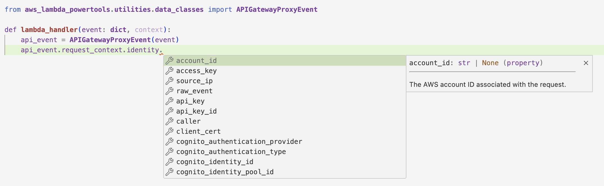

<!-- markdownlint-disable MD043 -->

Event Source Data Classes provides self-describing and strongly-typed classes for various AWS Lambda event sources.

## Key features

* Type hinting and code completion for common event types
* Helper functions for decoding/deserializing nested fields
* Docstrings for fields contained in event schemas
* Standardized attribute-based access to event properties

## Getting started

???+ tip
    All examples shared in this documentation are available within the [project repository](https://github.com/aws-powertools/powertools-lambda-python/tree/develop/examples){target="_blank"}.

There are two ways to use Event Source Data Classes in your Lambda functions.

**Method 1: Direct Initialization**

You can initialize the appropriate data class by passing the Lambda event object to its constructor.

=== "getting_started_data_classes.py"

    ```python hl_lines="1 4"
    --8<-- "examples/event_sources/src/getting_started_data_classes.py"
    ```

=== "apigw_event.json"

    ```json hl_lines="3-4"
    --8<-- "examples/event_sources/events/apigw_event.json"
    ```

**Method 2: Using the event_source Decorator**

Alternatively, you can use the `event_source` decorator to automatically parse the event.

=== "apigw_proxy_decorator.py"

    ```python hl_lines="1 3"
    --8<-- "examples/event_sources/src/apigw_proxy_decorator.py"
    ```

=== "apigw_event.json"

    ```json hl_lines="3-4"
    --8<-- "examples/event_sources/events/apigw_event.json"
    ```

### Autocomplete with self-documented properties and methods

Event Source Data Classes has the ability to leverage IDE autocompletion and inline documentation.
When using the APIGatewayProxyEvent class, for example, the IDE will offer autocomplete suggestions for various properties and methods.



## Supported event sources

Each event source is linked to its corresponding GitHub file with the full set of properties, methods, and docstrings specific to each event type.

| Event Source | Data_class | Properties |
|--------------|------------|------------|
| [Active MQ](#active-mq) | `ActiveMQEvent` | [Github](https://github.com/aws-powertools/powertools-lambda-python/blob/develop/aws_lambda_powertools/utilities/data_classes/active_mq_event.py) |
| [API Gateway Authorizer](#api-gateway-authorizer) | `APIGatewayAuthorizerRequestEvent` | [Github](https://github.com/aws-powertools/powertools-lambda-python/blob/develop/aws_lambda_powertools/utilities/data_classes/api_gateway_authorizer_event.py) |
| [API Gateway Authorizer V2](#api-gateway-authorizer-v2) | `APIGatewayAuthorizerEventV2` | [Github](https://github.com/aws-powertools/powertools-lambda-python/blob/develop/aws_lambda_powertools/utilities/data_classes/api_gateway_authorizer_event.py) |
| [API Gateway Proxy](#api-gateway-proxy) | `APIGatewayProxyEvent` | [Github](https://github.com/aws-powertools/powertools-lambda-python/blob/develop/aws_lambda_powertools/utilities/data_classes/api_gateway_proxy_event.py) |
| [API Gateway Proxy V2](#api-gateway-proxy-v2) | `APIGatewayProxyEventV2` | [Github](https://github.com/aws-powertools/powertools-lambda-python/blob/develop/aws_lambda_powertools/utilities/data_classes/api_gateway_proxy_event.py) |
| [Application Load Balancer](#application-load-balancer) | `ALBEvent` | [Github](https://github.com/aws-powertools/powertools-lambda-python/blob/develop/aws_lambda_powertools/utilities/data_classes/alb_event.py) |
| [AppSync Authorizer](#appsync-authorizer) | `AppSyncAuthorizerEvent` | [Github](https://github.com/aws-powertools/powertools-lambda-python/blob/develop/aws_lambda_powertools/utilities/data_classes/appsync_authorizer_event.py) |
| [AppSync Resolver](#appsync-resolver) | `AppSyncResolverEvent` | [Github](https://github.com/aws-powertools/powertools-lambda-python/blob/develop/aws_lambda_powertools/utilities/data_classes/appsync_resolver_event.py) |
| [AWS Config Rule](#aws-config-rule) | `AWSConfigRuleEvent` | [Github](https://github.com/aws-powertools/powertools-lambda-python/blob/develop/aws_lambda_powertools/utilities/data_classes/aws_config_rule_event.py) |
| [Bedrock Agent](#bedrock-agent) | `BedrockAgent` | [Github](https://github.com/aws-powertools/powertools-lambda-python/blob/develop/aws_lambda_powertools/utilities/data_classes/bedrock_agent_event.py) |
| [CloudFormation Custom Resource](#cloudformation-custom-resource) | `CloudFormationCustomResourceEvent` | [Github](https://github.com/aws-powertools/powertools-lambda-python/blob/develop/aws_lambda_powertools/utilities/data_classes/cloudformation_custom_resource_event.py) |
| [CloudWatch Alarm State Change Action](#cloudwatch-alarm-state-change-action) | `CloudWatchAlarmEvent` | [Github](https://github.com/aws-powertools/powertools-lambda-python/blob/develop/aws_lambda_powertools/utilities/data_classes/cloud_watch_alarm_event.py) |
| [CloudWatch Dashboard Custom Widget](#cloudwatch-dashboard-custom-widget) | `CloudWatchDashboardCustomWidgetEvent` | [Github](https://github.com/aws-powertools/powertools-lambda-python/blob/develop/aws_lambda_powertools/utilities/data_classes/cloud_watch_custom_widget_event.py) |
| [CloudWatch Logs](#cloudwatch-logs) | `CloudWatchLogsEvent` | [Github](https://github.com/aws-powertools/powertools-lambda-python/blob/develop/aws_lambda_powertools/utilities/data_classes/cloud_watch_logs_event.py) |
| [CodeDeploy Lifecycle Hook](#codedeploy-lifecycle-hook) | `CodeDeployLifecycleHookEvent` | [Github](https://github.com/aws-powertools/powertools-lambda-python/blob/develop/aws_lambda_powertools/utilities/data_classes/code_deploy_lifecycle_hook_event.py) |
| [CodePipeline Job Event](#codepipeline-job) | `CodePipelineJobEvent` | [Github](https://github.com/aws-powertools/powertools-lambda-python/blob/develop/aws_lambda_powertools/utilities/data_classes/code_pipeline_job_event.py) |
| [Cognito User Pool](#cognito-user-pool) | Multiple available under `cognito_user_pool_event` | [Github](https://github.com/aws-powertools/powertools-lambda-python/blob/develop/aws_lambda_powertools/utilities/data_classes/cognito_user_pool_event.py) |
| [Connect Contact Flow](#connect-contact-flow) | `ConnectContactFlowEvent` | [Github](https://github.com/aws-powertools/powertools-lambda-python/blob/develop/aws_lambda_powertools/utilities/data_classes/connect_contact_flow_event.py) |
| [DynamoDB streams](#dynamodb-streams) | `DynamoDBStreamEvent`, `DynamoDBRecordEventName` | [Github](https://github.com/aws-powertools/powertools-lambda-python/blob/develop/aws_lambda_powertools/utilities/data_classes/dynamo_db_stream_event.py) |
| [EventBridge](#eventbridge) | `EventBridgeEvent` | [Github](https://github.com/aws-powertools/powertools-lambda-python/blob/develop/aws_lambda_powertools/utilities/data_classes/event_bridge_event.py) |
| [Kafka](#kafka) | `KafkaEvent` | [Github](https://github.com/aws-powertools/powertools-lambda-python/blob/develop/aws_lambda_powertools/utilities/data_classes/kafka_event.py) |
| [Kinesis Data Stream](#kinesis-streams) | `KinesisStreamEvent` | [Github](https://github.com/aws-powertools/powertools-lambda-python/blob/develop/aws_lambda_powertools/utilities/data_classes/kinesis_stream_event.py) |
| [Kinesis Firehose Delivery Stream](#kinesis-firehose-delivery-stream) | `KinesisFirehoseEvent` | [Github](https://github.com/aws-powertools/powertools-lambda-python/blob/develop/aws_lambda_powertools/utilities/data_classes/kinesis_firehose_event.py) |
| [Lambda Function URL](#lambda-function-url) | `LambdaFunctionUrlEvent` | [Github](https://github.com/aws-powertools/powertools-lambda-python/blob/develop/aws_lambda_powertools/utilities/data_classes/lambda_function_url_event.py) |
| [Rabbit MQ](#rabbit-mq) | `RabbitMQEvent` | [Github](https://github.com/aws-powertools/powertools-lambda-python/blob/develop/aws_lambda_powertools/utilities/data_classes/rabbit_mq_event.py) |
| [S3](#s3) | `S3Event` | [Github](https://github.com/aws-powertools/powertools-lambda-python/blob/develop/aws_lambda_powertools/utilities/data_classes/s3_event.py) |
| [S3 Batch Operations](#s3-batch-operations) | `S3BatchOperationEvent` | [Github](https://github.com/aws-powertools/powertools-lambda-python/blob/develop/aws_lambda_powertools/utilities/data_classes/s3_batch_operation_event.py) |
| [S3 Object Lambda](#s3-object-lambda) | `S3ObjectLambdaEvent` | [Github](https://github.com/aws-powertools/powertools-lambda-python/blob/develop/aws_lambda_powertools/utilities/data_classes/s3_object_event.py) |
| [S3 EventBridge Notification](#s3-eventbridge-notification) | `S3EventBridgeNotificationEvent` | [Github](https://github.com/aws-powertools/powertools-lambda-python/blob/develop/aws_lambda_powertools/utilities/data_classes/s3_event.py) |
| [SES](#ses) | `SESEvent` | [Github](https://github.com/aws-powertools/powertools-lambda-python/blob/develop/aws_lambda_powertools/utilities/data_classes/ses_event.py) |
| [SNS](#sns) | `SNSEvent` | [Github](https://github.com/aws-powertools/powertools-lambda-python/blob/develop/aws_lambda_powertools/utilities/data_classes/sns_event.py) |
| [SQS](#sqs) | `SQSEvent` | [Github](https://github.com/aws-powertools/powertools-lambda-python/blob/develop/aws_lambda_powertools/utilities/data_classes/sqs_event.py) |
| [VPC Lattice V2](#vpc-lattice-v2) | `VPCLatticeV2Event` | [Github](https://github.com/aws-powertools/powertools-lambda-python/blob/develop/aws_lambda_powertools/utilities/data_classes/vpc_lattice.py) |
| [VPC Lattice V1](#vpc-lattice-v1) | `VPCLatticeEvent` | [Github](https://github.com/aws-powertools/powertools-lambda-python/blob/develop/aws_lambda_powertools/utilities/data_classes/vpc_lattice.py) |

???+ info
    The examples showcase a subset of Event Source Data Classes capabilities - for comprehensive details, leverage your IDE's
    autocompletion, refer to type hints and docstrings, and explore the [full API reference](https://docs.powertools.aws.dev/lambda/python/latest/api/utilities/data_classes/) for complete property listings of each event source.

### Active MQ

It is used for [Active MQ payloads](https://docs.aws.amazon.com/lambda/latest/dg/with-mq.html){target="_blank"}, also see
the [AWS blog post](https://aws.amazon.com/blogs/compute/using-amazon-mq-as-an-event-source-for-aws-lambda/){target="_blank"}
for more details.

=== "active_mq_example.py"

    ```python hl_lines="2 8"
    --8<-- "examples/event_sources/src/active_mq_example.py"
    ```

=== "active_mq_event.json"

    ```json hl_lines="6 9 18 21"
    --8<-- "examples/event_sources/events/active_mq_event_example.json"
    ```

### API Gateway Authorizer

It is used for [API Gateway Rest API Lambda Authorizer payload](https://docs.aws.amazon.com/apigateway/latest/developerguide/apigateway-use-lambda-authorizer.html){target="_blank"}.

Use **`APIGatewayAuthorizerRequestEvent`** for type `REQUEST` and **`APIGatewayAuthorizerTokenEvent`** for type `TOKEN`.

=== "apigw_type_request.py"

    ```python hl_lines="2-4 7"
    --8<-- "examples/event_sources/src/apigw_authorizer_request.py"
    ```

=== "apiGatewayAuthorizerRequestEvent.json"

    ```json hl_lines="3 11"
    --8<-- "examples/event_sources/events/apiGatewayAuthorizerRequestEvent.json"
    ```

=== "apigw_type_token.py"

    ```python hl_lines="2-4 7"
    --8<-- "examples/event_sources/src/apigw_authorizer_token.py"
    ```

=== "apiGatewayAuthorizerTokentEvent.json"

    ```json hl_lines="2 3"
    --8<-- "examples/event_sources/events/apiGatewayAuthorizerTokenEvent.json"
    ```

### API Gateway Authorizer V2

It is used for [API Gateway HTTP API Lambda Authorizer payload version 2](https://docs.aws.amazon.com/apigateway/latest/developerguide/http-api-lambda-authorizer.html){target="_blank"}.
See also [this blog post](https://aws.amazon.com/blogs/compute/introducing-iam-and-lambda-authorizers-for-amazon-api-gateway-http-apis/){target="_blank"} for more details.

=== "apigw_auth_v2.py"

    ```python hl_lines="2-4 15"
    --8<-- "examples/event_sources/src/apigw_auth_v2.py"
    ```

=== "apiGatewayAuthorizerV2Event.json"

    ```json
    --8<-- "examples/event_sources/events/apiGatewayAuthorizerV2Event.json"
    ```

### API Gateway Proxy

It is used for either API Gateway REST API or HTTP API using v1 proxy event.

=== "apigw_proxy_decorator.py"

    ```python hl_lines="1 3"
    --8<-- "examples/event_sources/src/apigw_proxy_decorator.py"
    ```

=== "apiGatewayProxyEvent.json"

    ```json hl_lines="3 4"
    --8<-- "examples/event_sources/events/apigw_event.json"
    ```

### API Gateway Proxy V2

It is used for HTTP API using v2 proxy event.

=== "apigw_proxy_v2.py"

    ```python hl_lines="1 3"
    --8<-- "examples/event_sources/src/apigw_proxy_v2.py"
    ```

=== "apiGatewayProxyEvent.json"

    ```json
    --8<-- "examples/event_sources/events/apiGatewayProxyV2Event.json"
    ```

### Application Load Balancer

Is it used for [Application load balancer](https://docs.aws.amazon.com/elasticloadbalancing/latest/application/introduction.html) event.

=== "albEvent.py"

    ```python hl_lines="1 3"
    --8<-- "examples/event_sources/src/albEvent.py"
    ```

=== "albEvent.json"

    ```json hl_lines="7 8"
    --8<-- "examples/event_sources/events/albEvent.json"
    ```

### AppSync Authorizer

Used when building an [AWS_LAMBDA Authorization](https://docs.aws.amazon.com/appsync/latest/devguide/security-authz.html#aws-lambda-authorization){target="_blank"} with AppSync.
See blog post [Introducing Lambda authorization for AWS AppSync GraphQL APIs](https://aws.amazon.com/blogs/mobile/appsync-lambda-auth/){target="_blank"}
or read the Amplify documentation on using [AWS Lambda for authorization](https://docs.amplify.aws/lib/graphqlapi/authz/q/platform/js#aws-lambda){target="_blank"} with AppSync.

=== "appSyncAuthorizer.py"

    ```python hl_lines="5-7 20"
    --8<-- "examples/event_sources/src/appSyncAuthorizer.py"
    ```

=== "appSyncAuthorizerEvent.json"

    ```json
    --8<-- "examples/event_sources/events/appSyncAuthorizerEvent.json"
    ```

### AppSync Resolver

Used when building Lambda GraphQL Resolvers with [Amplify GraphQL Transform Library](https://docs.amplify.aws/cli/graphql-transformer/function){target="_blank"} (`@function`),
and [AppSync Direct Lambda Resolvers](https://aws.amazon.com/blogs/mobile/appsync-direct-lambda/){target="_blank"}.

The example serves as an AppSync resolver for the `locations` field of the `Merchant` type. It uses the `@event_source` decorator to parse the AppSync event, handles pagination and filtering for locations, and demonstrates `AppSyncIdentityCognito`.

=== "appSyncResolver.py"

    ```python hl_lines="2-4 8"
    --8<-- "examples/event_sources/src/appSyncResolver.py"
    ```

=== "appSyncResolverEvent.json"

    ```json
    --8<-- "examples/event_sources/events/appSyncResolverEvent.json"
    ```

### AWS Config Rule

The example utilizes AWSConfigRuleEvent to parse the incoming event. The function logs the message type of the invoking event and returns a simple success response. The example event receives a Scheduled Event Notification, but could also be ItemChanged and Oversized.

=== "aws_config_rule.py"
    ```python hl_lines="3 11"
    --8<-- "examples/event_sources/src/aws_config_rule.py"
    ```

=== "Event - ScheduledNotification"
    ```json
    --8<-- "examples/event_sources/src/aws_config_rule_scheduled.json"
    ```

### Bedrock Agent

The example handles [Bedrock Agent event](https://aws.amazon.com/bedrock/agents/) with `BedrockAgentEvent` to parse the incoming event. The function logs the action group and input text, then returns a structured response compatible with Bedrock Agent's expected format, including a mock response body.

=== "bedrock_agent.py"

    ```python hl_lines="2 6"
    --8<-- "examples/event_sources/src/bedrock_agent.py"
    ```

=== "bedrockAgentEvent.json"
    ```json
    --8<-- "examples/event_sources/events/bedrockAgentEvent.json"
    ```

### CloudFormation Custom Resource

The example focuses on the `Create` request type, generating a unique physical resource ID and logging the process. The function is structured to potentially handle `Update` and `Delete` operations as well.

=== "cloudformation_custom_resource_handler.py"

    ```python hl_lines="2-3 10 14 19"
    --8<-- "examples/event_sources/src/cloudformation_custom_resource_handler.py"
    ```

=== "cloudformationCustomResourceCreate.json"
    ```json
    --8<-- "examples/event_sources/events/cloudformationCustomResourceCreate.json"
    ```

### CloudWatch Dashboard Custom Widget

Thie example for `CloudWatchDashboardCustomWidgetEvent` logs the dashboard name, extracts key information like widget ID and time range, and returns a formatted response with a title and markdown content. Read more about [custom widgets for Cloudwatch dashboard](https://docs.aws.amazon.com/AmazonCloudWatch/latest/monitoring/add_custom_widget_samples.html).

=== "cloudWatchDashboard.py"

    ```python hl_lines="2 6"
    --8<-- "examples/event_sources/src/cloudWatchDashboard.py"
    ```

=== "cloudWatchDashboardEvent.json"
    ```json
    --8<-- "examples/event_sources/events/cloudWatchDashboardEvent.json"
    ```

### CloudWatch Alarm State Change Action

[CloudWatch supports Lambda as an alarm state change action](https://docs.aws.amazon.com/AmazonCloudWatch/latest/monitoring/AlarmThatSendsEmail.html#alarms-and-actions){target="_blank"}.
You can use the `CloudWathAlarmEvent` data class to access the fields containing such data as alarm information, current state, and previous state.

=== "cloudwatch_alarm_event.py"

    ```python hl_lines="2 8"
    --8<-- "examples/event_sources/src/cloudwatch_alarm_event.py"
    ```

=== "cloudWatchAlarmEventSingleMetric.json"
    ```json
    --8<-- "examples/event_sources/events/cloudWatchAlarmEventSingleMetric.json"
    ```

### CloudWatch Logs

CloudWatch Logs events by default are compressed and base64 encoded. You can use the helper function provided to decode,
decompress and parse json data from the event.

=== "cloudwatch_logs.py"

    ```python hl_lines="2-3 7"
    --8<-- "examples/event_sources/src/cloudwatch_logs.py"
    ```

=== "cloudWatchLogEvent.json"
    ```json
    --8<-- "examples/event_sources/events/cloudWatchLogEvent.json"
    ```

#### Kinesis integration

[When streaming CloudWatch Logs to a Kinesis Data Stream](https://aws.amazon.com/premiumsupport/knowledge-center/streaming-cloudwatch-logs/){target="_blank"} (cross-account or not), you can use `extract_cloudwatch_logs_from_event` to decode, decompress and extract logs as `CloudWatchLogsDecodedData` to ease log processing.

=== "kinesisStreamCloudWatchLogs.py"

    ```python hl_lines="4-6 8"
    --8<-- "examples/event_sources/src/kinesisStreamCloudWatchLogs.py"
    ```

=== "kinesisStreamCloudWatchLogsEvent.json"
    ```json
    --8<-- "examples/event_sources/events/kinesisStreamCloudWatchLogsEvent.json"
    ```

Alternatively, you can use `extract_cloudwatch_logs_from_record` to seamless integrate with the [Batch utility](./batch.md){target="_blank"} for more robust log processing.

=== "kinesis_batch_example.py"

    ```python hl_lines="7-9 15"
    --8<-- "examples/event_sources/src/kinesis_batch_example.py"
    ```

=== "kinesisStreamCloudWatchLogsEvent.json"
    ```json
    --8<-- "examples/event_sources/events/kinesisStreamCloudWatchLogsEvent.json"
    ```

### CodeDeploy LifeCycle Hook

CodeDeploy triggers Lambdas with this event when defined in
[AppSpec definitions](https://docs.aws.amazon.com/codedeploy/latest/userguide/reference-appspec-file-structure-hooks.html)
to test applications at different stages of deployment.

=== "app.py"
    ```python
    from aws_lambda_powertools import Logger
    from aws_lambda_powertools.utilities.data_classes import (
        event_source,
        CodeDeployLifecycleHookEvent,
    )

    logger = Logger()

    def lambda_handler(
        event: CodeDeployLifecycleHookEvent, context: LambdaContext
    ) -> None:
        deployment_id = event.deployment_id
        lifecycle_event_hook_execution_id = event.lifecycle_event_hook_execution_id
    ```

### CodePipeline Job

Data classes and utility functions to help create continuous delivery pipelines tasks with AWS Lambda

=== "app.py"

    ```python
    from aws_lambda_powertools import Logger
    from aws_lambda_powertools.utilities.data_classes import event_source, CodePipelineJobEvent

    logger = Logger()

    @event_source(data_class=CodePipelineJobEvent)
    def lambda_handler(event, context):
        """The Lambda function handler

        If a continuing job then checks the CloudFormation stack status
        and updates the job accordingly.

        If a new job then kick of an update or creation of the target
        CloudFormation stack.
        """

        # Extract the Job ID
        job_id = event.get_id

        # Extract the params
        params: dict = event.decoded_user_parameters
        stack = params["stack"]
        artifact_name = params["artifact"]
        template_file = params["file"]

        try:
            if event.data.continuation_token:
                # If we're continuing then the create/update has already been triggered
                # we just need to check if it has finished.
                check_stack_update_status(job_id, stack)
            else:
                template = event.get_artifact(artifact_name, template_file)
                # Kick off a stack update or create
                start_update_or_create(job_id, stack, template)
        except Exception as e:
            # If any other exceptions which we didn't expect are raised
            # then fail the job and log the exception message.
            logger.exception("Function failed due to exception.")
            put_job_failure(job_id, "Function exception: " + str(e))

        logger.debug("Function complete.")
        return "Complete."
    ```

### Cognito User Pool

Cognito User Pools have several [different Lambda trigger sources](https://docs.aws.amazon.com/cognito/latest/developerguide/cognito-user-identity-pools-working-with-aws-lambda-triggers.html#cognito-user-identity-pools-working-with-aws-lambda-trigger-sources){target="_blank"}, all of which map to a different data class, which
can be imported from `aws_lambda_powertools.data_classes.cognito_user_pool_event`:

| Trigger/Event Source    | Data Class                                                                     |
| ---------------------   | ------------------------------------------------------------------------------ |
| Custom message event    | `data_classes.cognito_user_pool_event.CustomMessageTriggerEvent`               |
| Post authentication     | `data_classes.cognito_user_pool_event.PostAuthenticationTriggerEvent`          |
| Post confirmation       | `data_classes.cognito_user_pool_event.PostConfirmationTriggerEvent`            |
| Pre authentication      | `data_classes.cognito_user_pool_event.PreAuthenticationTriggerEvent`           |
| Pre sign-up             | `data_classes.cognito_user_pool_event.PreSignUpTriggerEvent`                   |
| Pre token generation    | `data_classes.cognito_user_pool_event.PreTokenGenerationTriggerEvent`          |
| Pre token generation V2 | `data_classes.cognito_user_pool_event.PreTokenGenerationV2TriggerEvent`        |
| User migration          | `data_classes.cognito_user_pool_event.UserMigrationTriggerEvent`               |
| Define Auth Challenge   | `data_classes.cognito_user_pool_event.DefineAuthChallengeTriggerEvent`         |
| Create Auth Challenge   | `data_classes.cognito_user_pool_event.CreateAuthChallengeTriggerEvent`         |
| Verify Auth Challenge   | `data_classes.cognito_user_pool_event.VerifyAuthChallengeResponseTriggerEvent` |
| Custom Email Sender     | `data_classes.cognito_user_pool_event.CustomEmailSenderTriggerEvent`           |
| Custom SMS Sender       | `data_classes.cognito_user_pool_event.CustomSMSSenderTriggerEvent`             |

#### Post Confirmation Example

=== "app.py"

    ```python
    from aws_lambda_powertools.utilities.data_classes.cognito_user_pool_event import PostConfirmationTriggerEvent

    def lambda_handler(event, context):
        event: PostConfirmationTriggerEvent = PostConfirmationTriggerEvent(event)

        user_attributes = event.request.user_attributes
        do_something_with(user_attributes)
    ```

#### Define Auth Challenge Example

???+ note
    In this example we are modifying the wrapped dict response fields, so we need to return the json serializable wrapped event in `event.raw_event`.

This example is based on the AWS Cognito docs for [Define Auth Challenge Lambda Trigger](https://docs.aws.amazon.com/cognito/latest/developerguide/user-pool-lambda-define-auth-challenge.html){target="_blank"}.

=== "app.py"

    ```python
    from aws_lambda_powertools.utilities.data_classes.cognito_user_pool_event import DefineAuthChallengeTriggerEvent

    def handler(event: dict, context) -> dict:
        event: DefineAuthChallengeTriggerEvent = DefineAuthChallengeTriggerEvent(event)
        if (
            len(event.request.session) == 1
            and event.request.session[0].challenge_name == "SRP_A"
        ):
            event.response.issue_tokens = False
            event.response.fail_authentication = False
            event.response.challenge_name = "PASSWORD_VERIFIER"
        elif (
            len(event.request.session) == 2
            and event.request.session[1].challenge_name == "PASSWORD_VERIFIER"
            and event.request.session[1].challenge_result
        ):
            event.response.issue_tokens = False
            event.response.fail_authentication = False
            event.response.challenge_name = "CUSTOM_CHALLENGE"
        elif (
            len(event.request.session) == 3
            and event.request.session[2].challenge_name == "CUSTOM_CHALLENGE"
            and event.request.session[2].challenge_result
        ):
            event.response.issue_tokens = True
            event.response.fail_authentication = False
        else:
            event.response.issue_tokens = False
            event.response.fail_authentication = True

        return event.raw_event
    ```
=== "SPR_A response"

    ```json hl_lines="25-27"
    {
        "version": "1",
        "region": "us-east-1",
        "userPoolId": "us-east-1_example",
        "userName": "UserName",
        "callerContext": {
            "awsSdkVersion": "awsSdkVersion",
            "clientId": "clientId"
        },
        "triggerSource": "DefineAuthChallenge_Authentication",
        "request": {
            "userAttributes": {
                "sub": "4A709A36-7D63-4785-829D-4198EF10EBDA",
                "email_verified": "true",
                "name": "First Last",
                "email": "define-auth@mail.com"
            },
            "session": [
                {
                    "challengeName": "SRP_A",
                    "challengeResult": true
                }
            ]
        },
        "response": {
            "issueTokens": false,
            "failAuthentication": false,
            "challengeName": "PASSWORD_VERIFIER"
        }
    }
    ```
=== "PASSWORD_VERIFIER success response"

    ```json hl_lines="30-32"
    {
        "version": "1",
        "region": "us-east-1",
        "userPoolId": "us-east-1_example",
        "userName": "UserName",
        "callerContext": {
            "awsSdkVersion": "awsSdkVersion",
            "clientId": "clientId"
        },
        "triggerSource": "DefineAuthChallenge_Authentication",
        "request": {
            "userAttributes": {
                "sub": "4A709A36-7D63-4785-829D-4198EF10EBDA",
                "email_verified": "true",
                "name": "First Last",
                "email": "define-auth@mail.com"
            },
            "session": [
                {
                    "challengeName": "SRP_A",
                    "challengeResult": true
                },
                {
                    "challengeName": "PASSWORD_VERIFIER",
                    "challengeResult": true
                }
            ]
        },
        "response": {
            "issueTokens": false,
            "failAuthentication": false,
            "challengeName": "CUSTOM_CHALLENGE"
        }
    }

    ```
=== "CUSTOM_CHALLENGE success response"

    ```json hl_lines="34 35"
    {
        "version": "1",
        "region": "us-east-1",
        "userPoolId": "us-east-1_example",
        "userName": "UserName",
        "callerContext": {
            "awsSdkVersion": "awsSdkVersion",
            "clientId": "clientId"
        },
        "triggerSource": "DefineAuthChallenge_Authentication",
        "request": {
            "userAttributes": {
                "sub": "4A709A36-7D63-4785-829D-4198EF10EBDA",
                "email_verified": "true",
                "name": "First Last",
                "email": "define-auth@mail.com"
            },
            "session": [
                {
                    "challengeName": "SRP_A",
                    "challengeResult": true
                },
                {
                    "challengeName": "PASSWORD_VERIFIER",
                    "challengeResult": true
                },
                {
                    "challengeName": "CUSTOM_CHALLENGE",
                    "challengeResult": true
                }
            ]
        },
        "response": {
            "issueTokens": true,
            "failAuthentication": false
        }
    }
    ```

#### Create Auth Challenge Example

This example is based on the AWS Cognito docs for [Create Auth Challenge Lambda Trigger](https://docs.aws.amazon.com/cognito/latest/developerguide/user-pool-lambda-create-auth-challenge.html){target="_blank"}.

=== "app.py"

    ```python
    from aws_lambda_powertools.utilities.data_classes import event_source
    from aws_lambda_powertools.utilities.data_classes.cognito_user_pool_event import CreateAuthChallengeTriggerEvent

    @event_source(data_class=CreateAuthChallengeTriggerEvent)
    def handler(event: CreateAuthChallengeTriggerEvent, context) -> dict:
        if event.request.challenge_name == "CUSTOM_CHALLENGE":
            event.response.public_challenge_parameters = {"captchaUrl": "url/123.jpg"}
            event.response.private_challenge_parameters = {"answer": "5"}
            event.response.challenge_metadata = "CAPTCHA_CHALLENGE"
        return event.raw_event
    ```

#### Verify Auth Challenge Response Example

This example is based on the AWS Cognito docs for [Verify Auth Challenge Response Lambda Trigger](https://docs.aws.amazon.com/cognito/latest/developerguide/user-pool-lambda-verify-auth-challenge-response.html){target="_blank"}.

=== "app.py"

    ```python
    from aws_lambda_powertools.utilities.data_classes import event_source
    from aws_lambda_powertools.utilities.data_classes.cognito_user_pool_event import VerifyAuthChallengeResponseTriggerEvent

    @event_source(data_class=VerifyAuthChallengeResponseTriggerEvent)
    def handler(event: VerifyAuthChallengeResponseTriggerEvent, context) -> dict:
        event.response.answer_correct = (
            event.request.private_challenge_parameters.get("answer") == event.request.challenge_answer
        )
        return event.raw_event
    ```

### Connect Contact Flow

> New in 1.11.0

=== "app.py"

    ```python
    from aws_lambda_powertools.utilities.data_classes.connect_contact_flow_event import (
        ConnectContactFlowChannel,
        ConnectContactFlowEndpointType,
        ConnectContactFlowEvent,
        ConnectContactFlowInitiationMethod,
    )

    def lambda_handler(event, context):
        event: ConnectContactFlowEvent = ConnectContactFlowEvent(event)
        assert event.contact_data.attributes == {"Language": "en-US"}
        assert event.contact_data.channel == ConnectContactFlowChannel.VOICE
        assert event.contact_data.customer_endpoint.endpoint_type == ConnectContactFlowEndpointType.TELEPHONE_NUMBER
        assert event.contact_data.initiation_method == ConnectContactFlowInitiationMethod.API
    ```

### DynamoDB Streams

The DynamoDB data class utility provides the base class for `DynamoDBStreamEvent`, as well as enums for stream view type (`StreamViewType`) and event type.
(`DynamoDBRecordEventName`).
The class automatically deserializes DynamoDB types into their equivalent Python types.

=== "app.py"

    ```python
    from aws_lambda_powertools.utilities.data_classes.dynamo_db_stream_event import (
        DynamoDBStreamEvent,
        DynamoDBRecordEventName
    )

    def lambda_handler(event, context):
        event: DynamoDBStreamEvent = DynamoDBStreamEvent(event)

        # Multiple records can be delivered in a single event
        for record in event.records:
            if record.event_name == DynamoDBRecordEventName.MODIFY:
                do_something_with(record.dynamodb.new_image)
                do_something_with(record.dynamodb.old_image)
    ```

=== "multiple_records_types.py"

    ```python
    from aws_lambda_powertools.utilities.data_classes import event_source, DynamoDBStreamEvent
    from aws_lambda_powertools.utilities.typing import LambdaContext


    @event_source(data_class=DynamoDBStreamEvent)
    def lambda_handler(event: DynamoDBStreamEvent, context: LambdaContext):
        for record in event.records:
            # {"N": "123.45"} => Decimal("123.45")
            key: str = record.dynamodb.keys["id"]
            print(key)
    ```

### EventBridge

=== "app.py"

    ```python
    from aws_lambda_powertools.utilities.data_classes import event_source, EventBridgeEvent

    @event_source(data_class=EventBridgeEvent)
    def lambda_handler(event: EventBridgeEvent, context):
        do_something_with(event.detail)

    ```

### Kafka

This example is based on the AWS docs for [Amazon MSK](https://docs.aws.amazon.com/lambda/latest/dg/with-msk.html){target="_blank"} and [self-managed Apache Kafka](https://docs.aws.amazon.com/lambda/latest/dg/with-kafka.html){target="_blank"}.

=== "app.py"

    ```python
    from aws_lambda_powertools.utilities.data_classes import event_source, KafkaEvent

    @event_source(data_class=KafkaEvent)
    def lambda_handler(event: KafkaEvent, context):
        for record in event.records:
            do_something_with(record.decoded_key, record.json_value)

    ```

### Kinesis streams

Kinesis events by default contain base64 encoded data. You can use the helper function to access the data either as json
or plain text, depending on the original payload.

=== "app.py"

    ```python
    from aws_lambda_powertools.utilities.data_classes import event_source, KinesisStreamEvent

    @event_source(data_class=KinesisStreamEvent)
    def lambda_handler(event: KinesisStreamEvent, context):
        kinesis_record = next(event.records).kinesis

        # if data was delivered as text
        data = kinesis_record.data_as_text()

        # if data was delivered as json
        data = kinesis_record.data_as_json()

        do_something_with(data)
    ```

### Kinesis Firehose delivery stream

When using Kinesis Firehose, you can use a Lambda function to [perform data transformation](https://docs.aws.amazon.com/firehose/latest/dev/data-transformation.html){target="_blank"}. For each transformed record, you can choose to either:

* **A)** Put them back to the delivery stream (default)
* **B)** Drop them so consumers don't receive them (e.g., data validation)
* **C)** Indicate a record failed data transformation and should be retried

To do that, you can use `KinesisFirehoseDataTransformationResponse` class along with helper functions to make it easier to decode and encode base64 data in the stream.

=== "Transforming streaming records"

    ```python hl_lines="2-3 12 28"
    --8<-- "examples/event_sources/src/kinesis_firehose_delivery_stream.py"
    ```

    1. **Ingesting JSON payloads?** <br><br> Use `record.data_as_json` to easily deserialize them.
    2. For your convenience, `base64_from_json` serializes a dict to JSON, then encode as base64 data.

=== "Dropping invalid records"

    ```python hl_lines="5-6 16 34"
    --8<-- "examples/event_sources/src/kinesis_firehose_response_drop.py"
    ```

    1. This exception would be generated from `record.data_as_json` if invalid payload.

=== "Indicating a processing failure"

    ```python hl_lines="2-3 33"
    --8<-- "examples/event_sources/src/kinesis_firehose_response_exception.py"
    ```

    1. This record will now be sent to your [S3 bucket in the `processing-failed` folder](https://docs.aws.amazon.com/firehose/latest/dev/data-transformation.html#data-transformation-failure-handling){target="_blank"}.

### Lambda Function URL

=== "app.py"

    ```python
    from aws_lambda_powertools.utilities.data_classes import event_source, LambdaFunctionUrlEvent

    @event_source(data_class=LambdaFunctionUrlEvent)
    def lambda_handler(event: LambdaFunctionUrlEvent, context):
        do_something_with(event.body)
    ```

### Rabbit MQ

It is used for [Rabbit MQ payloads](https://docs.aws.amazon.com/lambda/latest/dg/with-mq.html){target="_blank"}, also see
the [blog post](https://aws.amazon.com/blogs/compute/using-amazon-mq-for-rabbitmq-as-an-event-source-for-lambda/){target="_blank"}
for more details.

=== "app.py"

    ```python hl_lines="4-5 9-10"
    from typing import Dict

    from aws_lambda_powertools import Logger
    from aws_lambda_powertools.utilities.data_classes import event_source
    from aws_lambda_powertools.utilities.data_classes.rabbit_mq_event import RabbitMQEvent

    logger = Logger()

    @event_source(data_class=RabbitMQEvent)
    def lambda_handler(event: RabbitMQEvent, context):
        for queue_name, messages in event.rmq_messages_by_queue.items():
            logger.debug(f"Messages for queue: {queue_name}")
            for message in messages:
                logger.debug(f"MessageID: {message.basic_properties.message_id}")
                data: Dict = message.json_data
                logger.debug("Process json in base64 encoded data str", data)
    ```

### S3

=== "app.py"

    ```python
    from urllib.parse import unquote_plus
    from aws_lambda_powertools.utilities.data_classes import event_source, S3Event

    @event_source(data_class=S3Event)
    def lambda_handler(event: S3Event, context):
        bucket_name = event.bucket_name

        # Multiple records can be delivered in a single event
        for record in event.records:
            object_key = unquote_plus(record.s3.get_object.key)

            do_something_with(f"{bucket_name}/{object_key}")
    ```

### S3 Batch Operations

This example is based on the AWS S3 Batch Operations documentation [Example Lambda function for S3 Batch Operations](https://docs.aws.amazon.com/AmazonS3/latest/userguide/batch-ops-invoke-lambda.html){target="_blank"}.

=== "app.py"

    ```python hl_lines="4 8 10 20 25 27 29 33"
    --8<-- "examples/event_sources/src/s3_batch_operation.py"
    ```

### S3 Object Lambda

This example is based on the AWS Blog post [Introducing Amazon S3 Object Lambda – Use Your Code to Process Data as It Is Being Retrieved from S3](https://aws.amazon.com/blogs/aws/introducing-amazon-s3-object-lambda-use-your-code-to-process-data-as-it-is-being-retrieved-from-s3/){target="_blank"}.

=== "app.py"

    ```python  hl_lines="5-6 12 14"
    import boto3
    import requests

    from aws_lambda_powertools import Logger
    from aws_lambda_powertools.logging.correlation_paths import S3_OBJECT_LAMBDA
    from aws_lambda_powertools.utilities.data_classes.s3_object_event import S3ObjectLambdaEvent

    logger = Logger()
    session = boto3.session.Session()
    s3 = session.client("s3")

    @logger.inject_lambda_context(correlation_id_path=S3_OBJECT_LAMBDA, log_event=True)
    def lambda_handler(event, context):
        event = S3ObjectLambdaEvent(event)

        # Get object from S3
        response = requests.get(event.input_s3_url)
        original_object = response.content.decode("utf-8")

        # Make changes to the object about to be returned
        transformed_object = original_object.upper()

        # Write object back to S3 Object Lambda
        s3.write_get_object_response(
            Body=transformed_object, RequestRoute=event.request_route, RequestToken=event.request_token
        )

        return {"status_code": 200}
    ```

### S3 EventBridge Notification

=== "app.py"

    ```python
    from aws_lambda_powertools.utilities.data_classes import event_source, S3EventBridgeNotificationEvent

    @event_source(data_class=S3EventBridgeNotificationEvent)
    def lambda_handler(event: S3EventBridgeNotificationEvent, context):
        bucket_name = event.detail.bucket.name
        file_key = event.detail.object.key
    ```

### Secrets Manager

AWS Secrets Manager rotation uses an AWS Lambda function to update the secret. [Click here](https://docs.aws.amazon.com/secretsmanager/latest/userguide/rotating-secrets.html){target="_blank"} for more information about rotating AWS Secrets Manager secrets.

=== "app.py"

    ```python hl_lines="2 7 11"
    --8<-- "examples/event_sources/src/secrets_manager.py"
    ```

=== "Secrets Manager Example Event"

    ```json
    --8<-- "tests/events/secretsManagerEvent.json"
    ```

### SES

=== "app.py"

    ```python
    from aws_lambda_powertools.utilities.data_classes import event_source, SESEvent

    @event_source(data_class=SESEvent)
    def lambda_handler(event: SESEvent, context):
        # Multiple records can be delivered in a single event
        for record in event.records:
            mail = record.ses.mail
            common_headers = mail.common_headers

            do_something_with(common_headers.to, common_headers.subject)
    ```

### SNS

=== "app.py"

    ```python
    from aws_lambda_powertools.utilities.data_classes import event_source, SNSEvent

    @event_source(data_class=SNSEvent)
    def lambda_handler(event: SNSEvent, context):
        # Multiple records can be delivered in a single event
        for record in event.records:
            message = record.sns.message
            subject = record.sns.subject

            do_something_with(subject, message)
    ```

### SQS

=== "app.py"

    ```python
    from aws_lambda_powertools.utilities.data_classes import event_source, SQSEvent

    @event_source(data_class=SQSEvent)
    def lambda_handler(event: SQSEvent, context):
        # Multiple records can be delivered in a single event
        for record in event.records:
            do_something_with(record.body)
    ```

### VPC Lattice V2

You can register your Lambda functions as targets within an Amazon VPC Lattice service network. By doing this, your Lambda function becomes a service within the network, and clients that have access to the VPC Lattice service network can call your service using [Payload V2](https://docs.aws.amazon.com/lambda/latest/dg/services-vpc-lattice.html#vpc-lattice-receiving-events){target="_blank"}.

[Click here](https://docs.aws.amazon.com/lambda/latest/dg/services-vpc-lattice.html){target="_blank"} for more information about using AWS Lambda with Amazon VPC Lattice.

=== "app.py"

    ```python hl_lines="2 8"
    --8<-- "examples/event_sources/src/vpc_lattice_v2.py"
    ```

=== "Lattice Example Event"

    ```json
    --8<-- "examples/event_sources/src/vpc_lattice_v2_payload.json"
    ```

### VPC Lattice V1

You can register your Lambda functions as targets within an Amazon VPC Lattice service network. By doing this, your Lambda function becomes a service within the network, and clients that have access to the VPC Lattice service network can call your service.

[Click here](https://docs.aws.amazon.com/lambda/latest/dg/services-vpc-lattice.html){target="_blank"} for more information about using AWS Lambda with Amazon VPC Lattice.

=== "app.py"

    ```python hl_lines="2 8"
    --8<-- "examples/event_sources/src/vpc_lattice.py"
    ```

=== "Lattice Example Event"

    ```json
    --8<-- "examples/event_sources/src/vpc_lattice_payload.json"
    ```

## Advanced

### Debugging

Alternatively, you can print out the fields to obtain more information. All classes come with a `__str__` method that generates a dictionary string which can be quite useful for debugging.

However, certain events may contain sensitive fields such as `secret_access_key` and `session_token`, which are labeled as `[SENSITIVE]` to prevent any accidental disclosure of confidential information.

!!! warning "If we fail to deserialize a field value (e.g., JSON), they will appear as `[Cannot be deserialized]`"

=== "debugging.py"
    ```python hl_lines="9"
    --8<-- "examples/event_sources/src/debugging.py"
    ```

=== "debugging_event.json"
    ```json hl_lines="28 29"
    --8<-- "examples/event_sources/src/debugging_event.json"
    ```
=== "debugging_output.json"
    ```json hl_lines="16 17 18"
    --8<-- "examples/event_sources/src/debugging_output.json"
    ```
    ```
