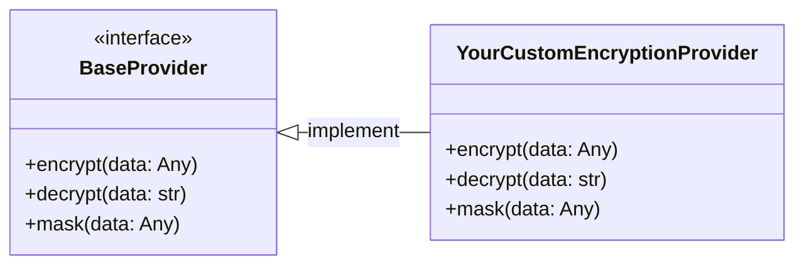

<!-- markdownlint-disable MD051 -->

The data masking utility provides a simple solution to conceal incoming data so that sensitive information is not passed downstream or logged.

## Key features

* Mask data irreversibly without having to install any encryption library.
* Out of the box integration with the [AWS Encryption SDK](https://docs.aws.amazon.com/encryption-sdk/latest/developer-guide/introduction.html){target="_blank" rel="nofollow"} to easily encrypt and decrypt data.
* Install any encryption provider and connect it with our new Data Masker class to easily mask, encrypt, and decrypt data.

## Terminology

Mask: This refers to concealing or partially replacing sensitive information with a non-sensitive placeholder or mask. The key characteristic of this operation is that it is irreversible, meaning the original sensitive data cannot be retrieved from the masked data. Masking is commonly applied when displaying data to users or for anonymizing data in non-reversible scenarios. For example, display the last four digits of a credit card number as "**** **** **** 1234".

Encrypt: This is the process of transforming plaintext data into a ciphertext format using an encryption algorithm and a cryptographic key. Encryption is a reversible process, meaning the original data can be retrieved (decrypted) using the appropriate decryption key. You can use this, for instance, to encrypt any PII (personally identifiable information) of your customers and make sure only the people with the right permissions are allowed to decrypt and view the plaintext PII data, in accordance with GDPR.

Decrypt: This is the process of reversing the encryption process, converting ciphertext back into its original plaintext using a decryption algorithm and the correct decryption key that only authorized personnel should have access to.

## Getting started

### IAM Permissions

If using the AWS Encryption SDK, your Lambda function IAM Role must have `kms:Decrypt` and `kms:GenerateDataKey` IAM permissions.

If using any other encryption provider, make sure to have the permissions for your role that it requires.

If not using any encryption services and just masking data, your Lambda does not need any additional permissions to use this utility.

### Required resources

If using the AWS Encryption SDK, you must have an AWS KMS key with full read/write permissions. You can create one and learn more on the [AWS KMS console](https://us-east-1.console.aws.amazon.com/kms/home?region=us-east-1#/kms/home){target="_blank" rel="nofollow"}.

If using any other encryption provider, you must have the resources required for that provider.

## Using the utility

### Masking data

You can mask data without having to install any encryption library.

=== "getting_started_mask_data.py"
    ```python hl_lines="1 6 21 35 44"
    --8<-- "examples/data_masking/src/getting_started_mask_data.py"
    ```

### Encryting and decrypting data

In order to encrypt data, you must use either our out-of-the-box integration with the AWS Encryption SDK, or install another encryption provider of your own. You can still use the masking feature while using any encryption provider.

=== "getting_started_encrypt_data.py"
    ```python hl_lines="3-4 6 23-26 40 54 63 77 80 94"
    --8<-- "examples/data_masking/src/getting_started_encrypt_data.py"
    ```

## Advanced

### Adjusting configurations for AWS Encryption SDK

You have the option to modify some of the configurations we have set as defaults when connecting to the AWS Encryption SDK. You can find and modify these values at `utilities/data_masking/constants.py`.

The `CACHE_CAPACITY` value is currently set at `100`. This value represents the maximum number of entries that can be retained in the local cryptographic materials cache. Please see the [AWS Encryption SDK documentation](https://aws-encryption-sdk-python.readthedocs.io/en/latest/generated/aws_encryption_sdk.caches.local.html){target="_blank" rel="nofollow"} for more information.

The `MAX_CACHE_AGE_SECONDS` value is currently set at `300`. It represents the maximum time (in seconds) that a cache entry may be kept in the cache.

The `MAX_MESSAGES_ENCRYPTED` value is currently set at `200`. It represents the maximum number of messages that may be encrypted under a cache entry. Please see the [AWS Encryption SDK documentation](https://aws-encryption-sdk-python.readthedocs.io/en/latest/generated/aws_encryption_sdk.materials_managers.caching.html#module-aws_encryption_sdk.materials_managers.caching){target="_blank" rel="nofollow"} for more information about this and `MAX_CACHE_AGE_SECONDS`.


### Create your own encryption provider

You can create your own custom encryption provider by inheriting the `BaseProvider` class, and implementing the `encrypt()` and `decrypt()` methods, and optionally the `mask()` method. You can also either use your own data serializer and deserializer by passing the `BaseProvider` class a `json_serializer` and `json_deserializer` argument, or you can use the default.

<!-- markdownlint-disable MD031 MD040 -->
<center>

<i>Visual representation to bring your own encryption provider</i>
</center>

* **`encrypt()`** – handles all logic for how to encrypt any data
* **`decrypt()`** – handles all logic for how to decrypt encrypted data
* **`mask()`** – handles all logic for how to irreversably mask data (optional)

You can then use this custom encryption provider class as the `provider` argument when creating a new `DataMasking` instance to use the encryption and decryption algorithms of the encryption library you have chosen.

Here is an example of implementing a custom encryption using an external encryption library like [ItsDangerous](https://itsdangerous.palletsprojects.com/en/2.1.x/){target="_blank" rel="nofollow"}, a widely popular encryption library.

=== "working_with_own_provider.py"
    ```python hl_lines="1-2 19-22 36 50 59 73 76 90"
    --8<-- "examples/data_masking/src/working_with_own_provider.py"
    ```

=== "custom_provider.py"
    ```python hl_lines="1 3 6 8 11 16"
    --8<-- "examples/data_masking/src/custom_provider.py"
    ```

## Testing your code

For unit testing your applications, you can mock the calls to the data masking utility to avoid calling AWS APIs. This can be achieved in a number of ways - in this example, we use the pytest monkeypatch fixture to patch the `data_masking.decrypt` method.

=== "test_single_mock.py"
    ```python hl_lines="4 8"
    --8<-- "examples/data_masking/tests/test_single_mock.py"
    ```

=== "single_mock.py"
    ```python
    --8<-- "examples/data_masking/tests/src/single_mock.py"
    ```

If we need to use this pattern across multiple tests, we can avoid repetition by refactoring to use our own pytest fixture:

=== "test_with_fixture.py"
    ```python hl_lines="5 10"
    --8<-- "examples/data_masking/tests/test_with_fixture.py"
    ```
