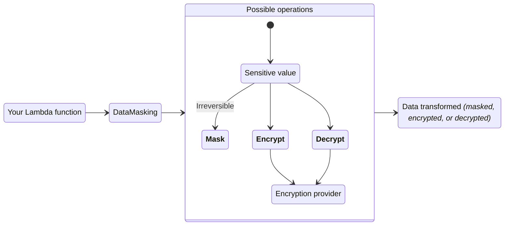
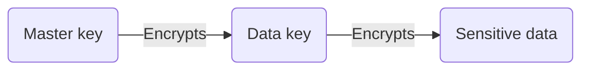

<!-- markdownlint-disable MD051 -->

The data masking utility can encrypt, decrypt, or irreversibly mask sensitive information to protect data confidentiality.



## Key features

* Encrypt, decrypt, or irreversibly mask data with ease
* Remove sensitive information in one or more fields within nested data
* Seamless integration with [AWS Encryption SDK](https://docs.aws.amazon.com/encryption-sdk/latest/developer-guide/introduction.html){target="_blank"} for industry and AWS security best practices

## Terminology

**Masking** replaces sensitive information **irreversibly** with a non-sensitive placeholder _(`*****`)_. It replaces data in-memory, hence why being irreversible.

**Encrypting** transforms plaintext into ciphertext using an encryption algorithm and a cryptographic key. It allows you to encrypt any sensitive data, so only allowed personnel to decrypt it.

**Decrypting** transforms ciphertext back into plaintext using a decryption algorithm and the correct decryption key.

**Encryption context** is a non-secret `key:value` data used for authentication like `tenant_id:<id>`. This adds extra security and confirms encrypted data relationship with a context.

**Envelope encryption** uses two different keys to encrypt data safely: master and data key. The data key encrypts the plaintext, and the master key encrypts the data key. It simplifies key management _(you own the master key)_, isolates compromises to data key, and scales better with large data volumes.

<center>

<i>Envelope encryption visualized.</i>
</center>

## Getting started

???+ tip
    All examples shared in this documentation are available within the [project repository](https://github.com/aws-powertools/powertools-lambda-python/tree/develop/examples){target="_blank"}.

### Install

!!! note "This is not necessary if you're installing Powertools for AWS Lambda (Python) via [Lambda Layer/SAR](../index.md#lambda-layer){target="_blank"}"

Add `aws-lambda-powertools[datamasking-aws-sdk]` as a dependency in your preferred tool: _e.g._, _requirements.txt_, _pyproject.toml_. This will install the [AWS Encryption SDK](https://docs.aws.amazon.com/encryption-sdk/latest/developer-guide/introduction.html){target="_blank"}.

<!-- markdownlint-disable MD013 -->
AWS Encryption SDK contains non-Python dependencies. This means you should use [AWS SAM CLI](https://docs.aws.amazon.com/serverless-application-model/latest/developerguide/using-sam-cli-build.html#using-sam-cli-build-options-container){target="_blank"} or [official build container images](https://gallery.ecr.aws/search?searchTerm=sam%2Fbuild-python&popularRegistries=amazon){target="_blank"} when building your application for AWS Lambda. Local development should work as expected.
<!-- markdownlint-enable MD013 -->

### Required resources

!!! info "By default, we use Amazon Key Management Service (KMS) for encryption and decryption operations."

Before you start, you will need a KMS key to encrypt and decrypt your data. Your Lambda function will need read and write access to it.

=== "AWS Serverless Application Model (SAM) example"
    ```yaml hl_lines="16 24 35 59-60 66-67"
    --8<-- "examples/data_masking/sam/template.yaml"
    ```

#### Using AWS Encryption SDK

To use the AWS Encryption SDK, your Lambda function IAM Role must have the `kms:Decrypt` and `kms:GenerateDataKey` IAM permissions.

When using AWS Encryption SDK with AWS KMS keys for data encryption and decryption, it's important to be aware that configuring additional permissions in the KMS Key Policy may be necessary. Learn more about KMS Key Policies [here](https://docs.aws.amazon.com/kms/latest/developerguide/key-policies.html){target="_blank"}.

=== "data_masking_function_example.py"
    ```python hl_lines="8 20-22"
    --8<-- "examples/data_masking/src/data_masking_function_example.py"
    ```

=== "input.json"
    ```json
    --8<-- "examples/data_masking/src/large_data_input.json"
    ```

=== "output.json"
    ```json
    --8<-- "examples/data_masking/src/data_masking_function_example_output.json"
    ```

### Working with nested data

!!! info "In Q1 2024, we plan to introduce support for Pydantic models, Dataclasses, and standard Python classes."

#### JSON
<!-- markdownlint-disable MD013 -->
When using the data masking utility with dictionaries or JSON strings, you can provide a list of keys to obfuscate the corresponding values to the `fields` parameter. You can select values of nested keys by using dot notation. The `fields` parameter only supports selecting values using basic dot notation and does not provide support for wildcards or any other matching expressions.

If a `fields` parameter is provided along with a dictionary as the input data, then the rest of content of the dictionary will remain unchanged, and only the values corresponding to the keys given will be masked (or encrypted/decrypted). However, if there were any non-string keys in the original dictionary, they will be transformed into strings while perserving their original content.

If a `fields` parameter is provided while the input data is a JSON string, the returned data structure will be a Python dictionary. The values corresponding to the keys given in the `fields` parameter will be accordingly obfuscated, and the content of everything else in the returned object will remain the same as the input data.

<!-- markdownlint-enable MD013 -->

If `fields` is not provided, the entire data object will be masked (or encrypted/decrypted).

<!-- markdownlint-disable MD013 -->
???+ note
    If you're using our example [AWS Serverless Application Model (SAM) template](#using-a-custom-encryption-provider), you will notice we have configured the Lambda function to use a memory size of 1024 MB. We compared the performances of Lambda functions of several different memory sizes and concluded 1024 MB was the most optimal size for this feature. For more information, you can see the full reports of our [load tests](https://github.com/aws-powertools/powertools-lambda-python/pull/2197#issuecomment-1730571597) and [traces](https://github.com/aws-powertools/powertools-lambda-python/pull/2197#issuecomment-1732060923).
<!-- markdownlint-enable MD013 -->

### Masking data

You can mask data without having to install any encryption library. Masking data will result in the loss of its original type, and the masked data will always be represented as a string.

=== "getting_started_mask_data.py"
    ```python hl_lines="4 8 16"
    --8<-- "examples/data_masking/src/getting_started_mask_data.py"
    ```

=== "input.json"
    ```json
    --8<-- "examples/data_masking/src/generic_data_input.json"
    ```

=== "output.json"
    ```json hl_lines="5 7 12"
    --8<-- "examples/data_masking/src/mask_data_output.json"
    ```

### Encryting data

To encrypt data, utilize our built-in integration with the AWS Encryption SDK. Encrypting data will temporarily result in the loss of the original data type, as it transforms into a [ciphertext](https://en.wikipedia.org/wiki/Ciphertext){target="_blank" rel="nofollow"} string.

To encrypt your data, you'll need a valid and symmetric [AWS KMS](https://docs.aws.amazon.com/kms/latest/developerguide/data-protection.html){target="_blank"} key.

=== "getting_started_encrypt_data.py"
    ```python hl_lines="5-6 12-13 22"
    --8<-- "examples/data_masking/src/getting_started_encrypt_data.py"
    ```

=== "input.json"
    ```json hl_lines="7-9 14"
    --8<-- "examples/data_masking/src/generic_data_input.json"
    ```

=== "output.json"
    ```json hl_lines="5-7 12"
    --8<-- "examples/data_masking/src/encrypt_data_output.json"
    ```

### Decrypting data

To decrypt data, use the appropriate key to transform ciphertext back into plaintext. Upon decryption, the data will return to its original type.

Decrypting a ciphertext string will transform the data to its original type.

=== "input.json"
    ```json hl_lines="5-7 12"
    --8<-- "examples/data_masking/src/encrypt_data_output.json"
    ```

=== "getting_started_encrypt_data.py"
    ```python hl_lines="3-4 12-13 17"
    --8<-- "examples/data_masking/src/getting_started_encrypt_data.py"
    ```

=== "output.json"
    ```json hl_lines="5-7 12-17"
    --8<-- "examples/data_masking/src/decrypt_data_output.json"
    ```

## Advanced

### Providers

#### AWS Encryption SDK

You have the option to modify some of the configurations we have set as defaults when connecting to the AWS Encryption SDK. You can find and modify the following values when initializing the `AwsEncryptionSdkProvider`.

| Parameter                  | Required | Default               | Description                                                                                   |
| -------------------------- | -------- | --------------------- | --------------------------------------------------------------------------------------------- |
| **local_cache_capacity**   |          | `100`                 | The maximum number of entries that can be retained in the local cryptographic materials cache |
| **max_cache_age_seconds**  |          | `300`                 | The maximum time (in seconds) that a cache entry may be kept in the cache                     |
| **max_messages_encrypted** |          | `4294967296`          | The maximum number of messages that may be encrypted under a cache entry                      |
| **max_bytes_encrypted**    |          | `9223372036854775807` | The maximum number of bytes that may be encrypted under a cache entry                         |

For more information about the parameters for this provider, please see the [AWS Encryption SDK documentation](https://aws-encryption-sdk-python.readthedocs.io/en/latest/generated/aws_encryption_sdk.materials_managers.caching.html#aws_encryption_sdk.materials_managers.caching.CachingCryptoMaterialsManager){target="_blank" rel="nofollow"}.

#### Creating your own provider

!!! info "In Q1 2024, we plan to add support for bringing your own encryption provider."

### Data masking request flow

The following sequence diagrams explain how `DataMasking` behaves under different scenarios.

#### Mask operation

Masking operations occur in-memory and we cannot recover the original value.

<center>

<i>Simple masking operation</i>
</center>

#### Encrypt operation with Encryption SDK (KMS)

We call KMS to generate an unique data key that can be used for multiple `encrypt` operation in-memory. It improves performance, cost and prevent throttling.

To make this operation simpler to visualize, we keep caching details in a [separate sequence diagram](#caching-encrypt-operations-with-encryption-sdk). Caching is enabled by default.

<center>

<i>Encrypting operation using envelope encryption.</i>
</center>

#### Decrypt operation with Encryption SDK (KMS)

We call KMS to decrypt the encrypted data key available in the encrypted message. If successful, we run authentication _(context)_ and integrity checks (_algorithm, data key length, etc_) to confirm its proceedings.

Lastly, we decrypt the original encrypted data, throw away the decrypted data key for security reasons, and return the original plaintext data.

<center>

<i>Decrypting operation using envelope encryption.</i>
</center>

#### Caching encrypt operations with Encryption SDK

Without caching, every `encrypt()` operation would generate a new data key. It significantly increases latency and cost for ephemeral and short running environments like Lambda.

With caching, we balance ephemeral Lambda environment performance characteristics with adjustable thresholds to meet your security needs.

!!! info "Data key recycling"
    We request a new data key when a cached data key exceeds any of the following security thresholds:

    1. **Max age in seconds**
    2. **Max number of encrypted messages**
    3. **Max bytes encrypted** across all operations

<center>

<i>Caching data keys during encrypt operation.</i>
</center>

## Testing your code

For unit testing your applications, you can mock the calls to the data masking utility to avoid calling AWS APIs. This can be achieved in a number of ways - in this example, we use the pytest monkeypatch fixture to patch the `data_masking.decrypt` method.

=== "test_single_mock.py"
    ```python hl_lines="4 8"
    --8<-- "examples/data_masking/tests/test_data_masking_single_mock.py"
    ```

=== "single_mock.py"
    ```python
    --8<-- "examples/data_masking/tests/src/single_mock.py"
    ```

If we need to use this pattern across multiple tests, we can avoid repetition by refactoring to use our own pytest fixture:

=== "test_with_fixture.py"
    ```python hl_lines="5 10"
    --8<-- "examples/data_masking/tests/test_data_masking_with_fixture.py"
    ```
