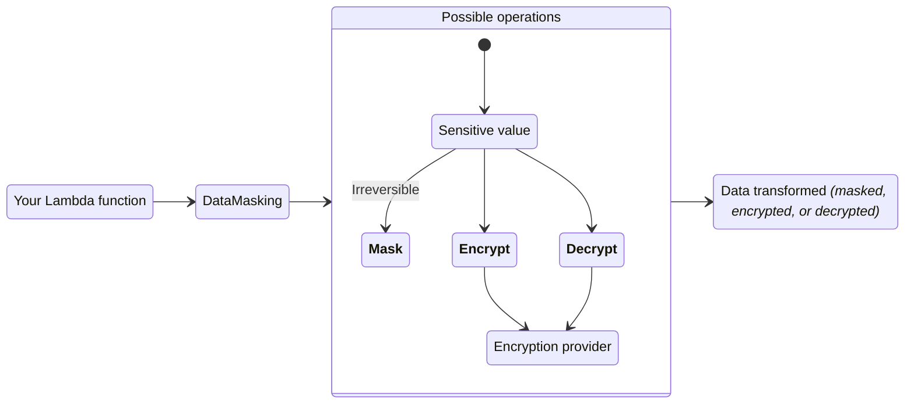
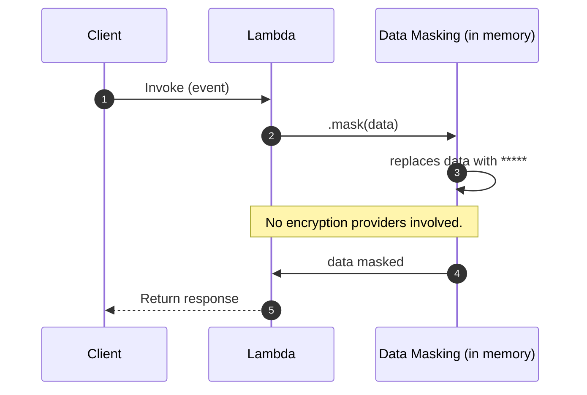
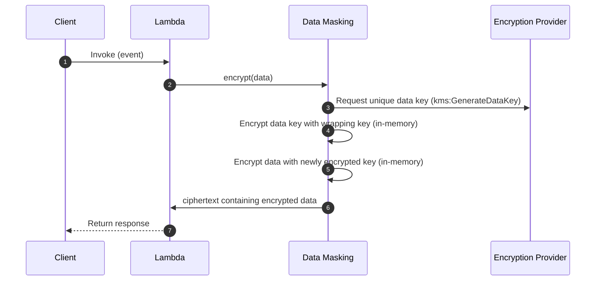

<!-- markdownlint-disable MD051 -->

The data masking utility can encrypt, decrypt, or irreversibly mask sensitive information to protect data confidentiality.



## Key features

* Encrypt, decrypt, or irreversibly mask data with ease
* Remove sensitive information in one or more fields within nested data
* Seamless integration with [AWS Encryption SDK](https://docs.aws.amazon.com/encryption-sdk/latest/developer-guide/introduction.html){target="_blank"} for industry and AWS security best practices

## Terminology

**Masking** replaces sensitive information **irreversibly** with a non-sensitive placeholder _(`*****`)_. Data is replaced in-memory hence why being irreversible.

**Encrypting** transforms plaintext into ciphertext using an encryption algorithm and a cryptographic key. This allows you to encrypt any PII (personally identifiable information) to ensure only authorized personnel can decrypt it.

**Decrypting** transforms ciphertext back into plaintext using a decryption algorithm and the correct decryption key.

## Getting started

### Install

Before you start, you need to create a KMS key to encrypt and decrypt your data - your Lambda function will need read and write access to it.

!!! note "If your Lambda function only masks data without utilizing any encryption services, it requires no additional permissions or library to use this utility."

### Required resources

=== "AWS Serverless Application Model (SAM) example"
    ```yaml hl_lines="16 30 54-55"
    --8<-- "examples/data_masking/sam/template.yaml"
    ```

#### Using AWS Encryption SDK

To use the AWS Encryption SDK, your Lambda function IAM Role must have the `kms:Decrypt` and `kms:GenerateDataKey` IAM permissions.

When using AWS Encryption SDK with AWS KMS keys for data encryption and decryption, it's important to be aware that configuring additional permissions in the KMS Key Policy may be necessary. Learn more about KMS Key Policies [here](https://docs.aws.amazon.com/kms/latest/developerguide/key-policies.html){target="_blank"}.

=== "data_masking_function_example.py"
    ```python hl_lines="8 20-22"
    --8<-- "examples/data_masking/src/data_masking_function_example.py"
    ```

=== "input.json"
    ```json
    --8<-- "examples/data_masking/src/large_data_input.json"
    ```

=== "output.json"
    ```json
    --8<-- "examples/data_masking/src/data_masking_function_example_output.json"
    ```

### Working with nested data

!!! info "In Q1 2024, we plan to introduce support for Pydantic models, Dataclasses, and standard Python classes."

#### JSON
<!-- markdownlint-disable MD013 -->
When using the data masking utility with dictionaries or JSON strings, you can provide a list of keys to obfuscate the corresponding values to the `fields` parameter. You can select values of nested keys by using dot notation. The `fields` parameter only supports selecting values using basic dot notation and does not provide support for wildcards or any other matching expressions. If a `fields` parameter is provided, then the rest of the dictionary or JSON string will remain unchanged, and only the values corresponding to the keys given will be masked (or encrypted/decrypted).
<!-- markdownlint-enable MD013 -->

If `fields` is not provided, the entire data object will be masked (or encrypted/decrypted).

<!-- markdownlint-disable MD013 -->
???+ note
    If you're using our example [AWS Serverless Application Model (SAM) template](#using-a-custom-encryption-provider), you will notice we have configured the Lambda function to use a memory size of 1024 MB. We compared the performances of Lambda functions of several different memory sizes and concluded 1024 MB was the most optimal size for this feature. For more information, you can see the full reports of our [load tests](https://github.com/aws-powertools/powertools-lambda-python/pull/2197#issuecomment-1730571597) and [traces](https://github.com/aws-powertools/powertools-lambda-python/pull/2197#issuecomment-1732060923).
<!-- markdownlint-enable MD013 -->

### Masking data

You can mask data without having to install any encryption library. Masking data will result in the loss of its original type, and the masked data will always be represented as a string.

=== "input.json"
    ```json
    --8<-- "examples/data_masking/src/generic_data_input.json"
    ```

=== "getting_started_mask_data.py"
    ```python hl_lines="1 6 10"
    --8<-- "examples/data_masking/src/getting_started_mask_data.py"
    ```

=== "output.json"
    ```json hl_lines="5 7 12"
    --8<-- "examples/data_masking/src/mask_data_output.json"
    ```

### Encryting data

In order to encrypt data, you must use either our out-of-the-box integration with the AWS Encryption SDK, or install another encryption provider of your own. Encrypting data will temporarily result in the loss of the data's original type, as the encrypted data will be represented as a string while it is in ciphertext form. After decryption, the data will regain its original type.

You can still use the masking feature while using any encryption provider.

=== "input.json"
    ```json
    --8<-- "examples/data_masking/src/generic_data_input.json"
    ```

=== "getting_started_encrypt_data.py"
    ```python hl_lines="3-4 12-13 15"
    --8<-- "examples/data_masking/src/getting_started_encrypt_data.py"
    ```

=== "output.json"
    ```json hl_lines="5-7 12"
    --8<-- "examples/data_masking/src/encrypt_data_output.json"
    ```

### Decrypting data

To decrypt data, use the appropriate key to transform ciphertext back into plaintext. Upon decryption, the data will return to its original type.

Decrypting a ciphertext string will transform the data to its original type.

=== "input.json"
    ```json hl_lines="5-7 12"
    --8<-- "examples/data_masking/src/encrypt_data_output.json"
    ```

=== "getting_started_encrypt_data.py"
    ```python hl_lines="3-4 12-13 17"
    --8<-- "examples/data_masking/src/getting_started_encrypt_data.py"
    ```

=== "output.json"
    ```json hl_lines="5-7 12-17"
    --8<-- "examples/data_masking/src/decrypt_data_output.json"
    ```

## Advanced

### Providers

#### AWS Encryption SDK

You have the option to modify some of the configurations we have set as defaults when connecting to the AWS Encryption SDK. You can find and modify the following values when initializing the `AwsEncryptionSdkProvider`.

| Parameter                  | Required | Default | Description                                                                                   |
| -------------------------- | -------- | ------- | --------------------------------------------------------------------------------------------- |
| **local_cache_capacity**   |          | `100`   | The maximum number of entries that can be retained in the local cryptographic materials cache |
| **max_cache_age_seconds**  |          | `300`   | The maximum time (in seconds) that a cache entry may be kept in the cache                     |
| **max_messages_encrypted** |          | `200`   | The maximum number of messages that may be encrypted under a cache entry                      |

For more information about the parameters for this provider, please see the [AWS Encryption SDK documentation](https://aws-encryption-sdk-python.readthedocs.io/en/latest/generated/aws_encryption_sdk.materials_managers.caching.html#aws_encryption_sdk.materials_managers.caching.CachingCryptoMaterialsManager){target="_blank" rel="nofollow"}.

#### Creating your own provider

!!! info "In Q1 2024, we plan to add support for bringing your own encryption provider."

### Data masking request flow

The following sequence diagrams explain how `DataMasking` behaves under different scenarios.

#### Mask operation

Masking operations occur in-memory and we cannot recover the original value.

<center>

<i>Simple masking operation</i>
</center>

#### Encrypt operation with Encryption SDK (KMS)

We call KMS to generate an unique data key once. It allows us to encrypt this key in-memory, and use it for multiple operations to improve performance and prevent throttling.

> This is known as [envelope encryption](https://docs.aws.amazon.com/kms/latest/developerguide/concepts.html#enveloping){target="_blank"}.

<center>

<i>Encrypting operation using envelope encryption.</i>
</center>

## Testing your code

For unit testing your applications, you can mock the calls to the data masking utility to avoid calling AWS APIs. This can be achieved in a number of ways - in this example, we use the pytest monkeypatch fixture to patch the `data_masking.decrypt` method.

=== "test_single_mock.py"
    ```python hl_lines="4 8"
    --8<-- "examples/data_masking/tests/test_data_masking_single_mock.py"
    ```

=== "single_mock.py"
    ```python
    --8<-- "examples/data_masking/tests/src/single_mock.py"
    ```

If we need to use this pattern across multiple tests, we can avoid repetition by refactoring to use our own pytest fixture:

=== "test_with_fixture.py"
    ```python hl_lines="5 10"
    --8<-- "examples/data_masking/tests/test_data_masking_with_fixture.py"
    ```
