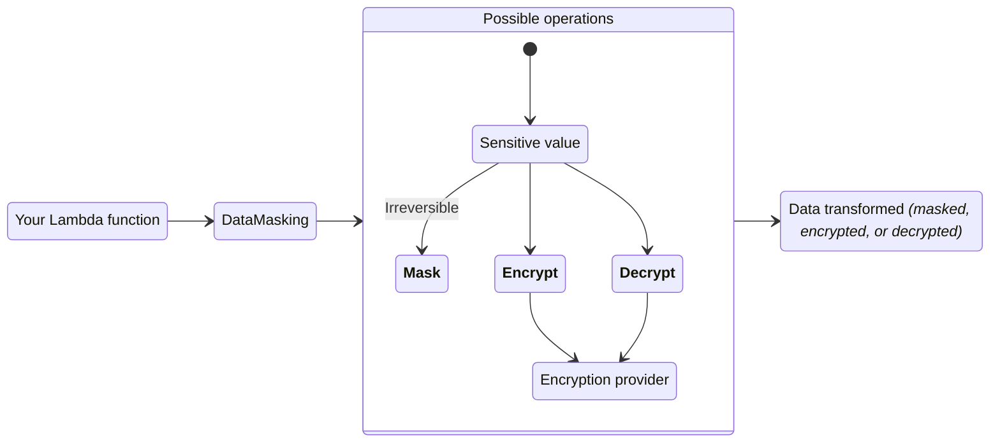

<!-- markdownlint-disable MD051 -->

The data masking utility can encrypt, decrypt, or irreversibly mask sensitive information to protect data confidentiality.



## Key features

* Mask, encrypt, or decrypt data in one or multiple fields
* Out of the box integration with the [AWS Encryption SDK](https://docs.aws.amazon.com/encryption-sdk/latest/developer-guide/introduction.html){target="_blank" rel="nofollow"} to easily encrypt and decrypt data.
* Install any encryption provider and connect it with our new Data Masker class to easily mask, encrypt, and decrypt data.

## Terminology

**Masking** replaces sensitive information **irreversibly** with a non-sensitive placeholder. For example, display the last four digits of a credit card number as `"**** **** **** 1234"`.

**Encrypting** transforms plaintext into ciphertext using an encryption algorithm and a cryptographic key. Encryption can be reversed with the correct decryption key. This allows you to encrypt any PII (personally identifiable information) and make sure only the users with appropirate permissions can decrypt it to view the plaintext.

**Decrypting** reverses the encryption process, converting ciphertext back into its original plaintext using a decryption algorithm and the correct decryption key.

## Getting started

### Install

If not using any encryption services and only masking data, your Lambda function does not need any additional permissions or resources to use this utility.

#### Using AWS Encryption SDK

To use the AWS Encryption SDK, your Lambda function IAM Role must have the `kms:Decrypt` and `kms:GenerateDataKey` IAM permissions.

You must also have an AWS KMS key with full read/write permissions. You can create one and learn more on the [AWS KMS console](https://us-east-1.console.aws.amazon.com/kms/home?region=us-east-1#/kms/home){target="_blank" rel="nofollow"}.

### Working with nested data

#### JSON

When using the data masking utility with dictionaries or JSON strings, you can provide a list of keys to obfuscate the corresponding values. If no fields are provided, the entire data object will be masked or encrypted. You can select values of nested keys by using dot notation.

<!-- markdownlint-disable MD013 -->
???+ note
    If you're using our example [AWS Serverless Application Model (SAM) template](#using-a-custom-encryption-provider), you will notice we have configured the Lambda function to use a memory size of 1024 MB. We compared the performances of Lambda functions of several different memory sizes and concluded 1024 MB was the most optimal size for this feature. For more information, you can see the full reports of our [load tests](https://github.com/aws-powertools/powertools-lambda-python/pull/2197#issuecomment-1730571597) and [traces](https://github.com/aws-powertools/powertools-lambda-python/pull/2197#issuecomment-1732060923).
<!-- markdownlint-enable MD013 -->

=== "AWS Serverless Application Model (SAM) example"
    ```yaml hl_lines="11-23 30 33-39 46"
    --8<-- "examples/data_masking/sam/template.yaml"
    ```

=== "input.json"
    ```json
    --8<-- "examples/data_masking/src/large_data_input.json"
    ```

=== "data_masking_function_example.py"
    ```python hl_lines="8 20-22"
    --8<-- "examples/data_masking/src/data_masking_function_example.py"
    ```

=== "output.json"
    ```json
    --8<-- "examples/data_masking/src/data_masking_function_example_output.json"
    ```

### Masking data

You can mask data without having to install any encryption library.

=== "input.json"
    ```json
    --8<-- "examples/data_masking/src/generic_data_input.json"
    ```

=== "getting_started_mask_data.py"
    ```python hl_lines="1 6 10"
    --8<-- "examples/data_masking/src/getting_started_mask_data.py"
    ```

=== "output.json"
    ```json hl_lines="5 7 12"
    --8<-- "examples/data_masking/src/mask_data_output.json"
    ```

### Encryting and decrypting data

In order to encrypt data, you must use either our out-of-the-box integration with the AWS Encryption SDK, or install another encryption provider of your own. You can still use the masking feature while using any encryption provider.

=== "input.json"
    ```json
    --8<-- "examples/data_masking/src/generic_data_input.json"
    ```

=== "getting_started_encrypt_data.py"
    ```python hl_lines="3-4 12-13"
    --8<-- "examples/data_masking/src/getting_started_encrypt_data.py"
    ```

=== "encrypted_output.json"
    ```json hl_lines="5-7 12"
    --8<-- "examples/data_masking/src/encrypt_data_output.json"
    ```

=== "decrypted_output.json"
    ```json hl_lines="5-7 12-17"
    --8<-- "examples/data_masking/src/decrypt_data_output.json"
    ```

## Advanced

### Adjusting configurations for AWS Encryption SDK

You have the option to modify some of the configurations we have set as defaults when connecting to the AWS Encryption SDK. You can find and modify the following values in `utilities/data_masking/provider/kms/aws_encryption_sdk.py`.

#### Caching

<!-- markdownlint-disable MD013 -->
The `CACHE_CAPACITY` value is currently set to `100`. This value represents the maximum number of entries that can be retained in the local cryptographic materials cache. Please see the [AWS Encryption SDK documentation](https://aws-encryption-sdk-python.readthedocs.io/en/latest/generated/aws_encryption_sdk.caches.local.html){target="_blank" rel="nofollow"} for more information.

The `MAX_CACHE_AGE_SECONDS` value is currently set to `300`. This represents the maximum time (in seconds) that a cache entry may be kept in the cache. Please see the [AWS Encryption SDK documentation](https://aws-encryption-sdk-python.readthedocs.io/en/latest/generated/aws_encryption_sdk.materials_managers.caching.html#module-aws_encryption_sdk.materials_managers.caching){target="_blank" rel="nofollow"} for more information about this.
<!-- markdownlint-enable MD013 -->

#### Limit messages

<!-- markdownlint-disable MD013 -->
The `MAX_MESSAGES_ENCRYPTED` value is currently set to `200`. This represents the maximum number of messages that may be encrypted under a cache entry. Please see the [AWS Encryption SDK documentation](https://aws-encryption-sdk-python.readthedocs.io/en/latest/generated/aws_encryption_sdk.materials_managers.caching.html#module-aws_encryption_sdk.materials_managers.caching){target="_blank" rel="nofollow"} for more information about this.
<!-- markdownlint-enable MD013 -->

### Creating your own provider

!!! info "In Q1 2024, we will implement support for bringing your own encryption provider."

## Testing your code

For unit testing your applications, you can mock the calls to the data masking utility to avoid calling AWS APIs. This can be achieved in a number of ways - in this example, we use the pytest monkeypatch fixture to patch the `data_masking.decrypt` method.

=== "test_single_mock.py"
    ```python hl_lines="4 8"
    --8<-- "examples/data_masking/tests/test_data_masking_single_mock.py"
    ```

=== "single_mock.py"
    ```python
    --8<-- "examples/data_masking/tests/src/single_mock.py"
    ```

If we need to use this pattern across multiple tests, we can avoid repetition by refactoring to use our own pytest fixture:

=== "test_with_fixture.py"
    ```python hl_lines="5 10"
    --8<-- "examples/data_masking/tests/test_data_masking_with_fixture.py"
    ```
