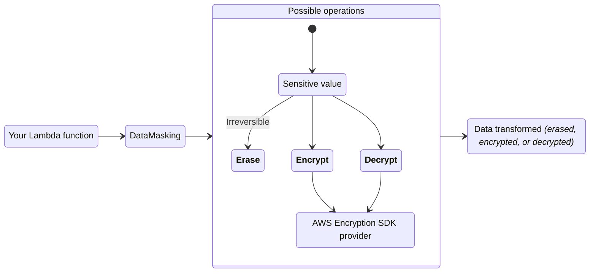
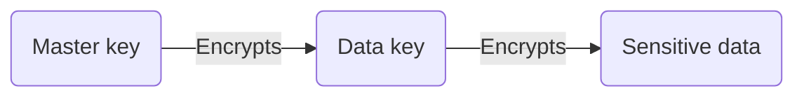
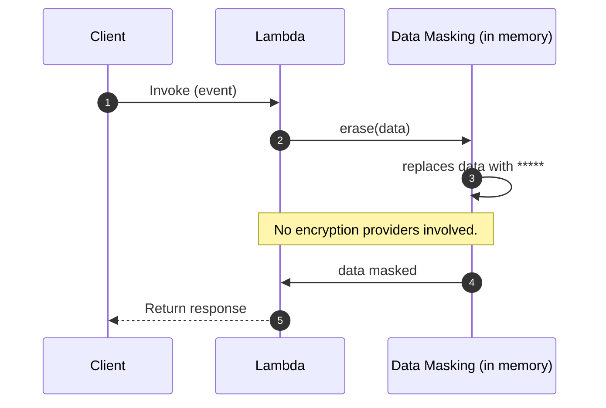
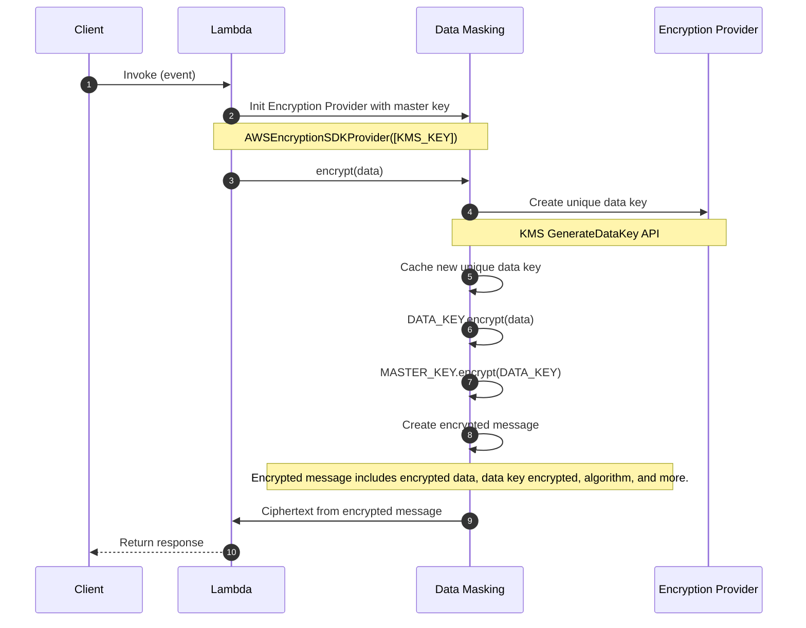
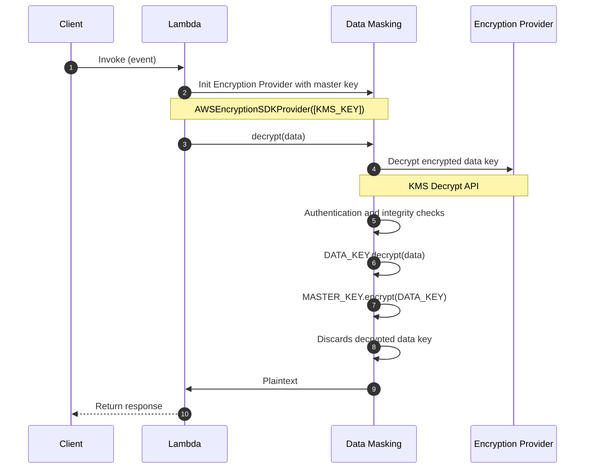
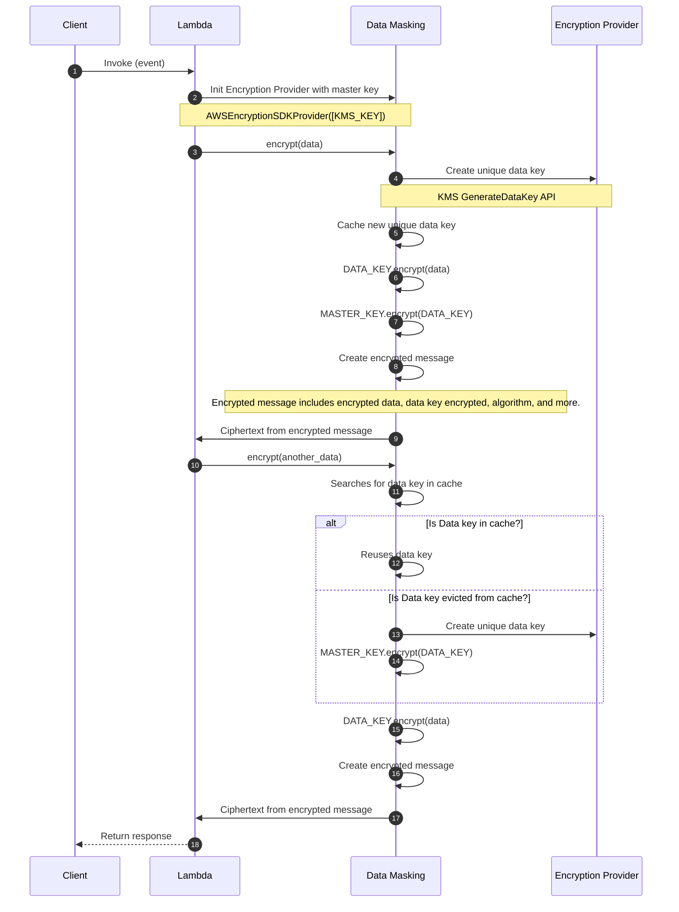

<!-- markdownlint-disable MD051 -->

The data masking utility can encrypt, decrypt, or irreversibly erase sensitive information to protect data confidentiality.



## Key features

* Encrypt, decrypt, or irreversibly erase data with ease
* Erase sensitive information in one or more fields within nested data
* Seamless integration with [AWS Encryption SDK](https://docs.aws.amazon.com/encryption-sdk/latest/developer-guide/introduction.html){target="_blank"} for industry and AWS security best practices

## Terminology

**Erasing** replaces sensitive information **irreversibly** with a non-sensitive placeholder _(`*****`)_. This operation replaces data in-memory, making it a one-way action.

**Encrypting** transforms plaintext into ciphertext using an encryption algorithm and a cryptographic key. It allows you to encrypt any sensitive data, so only allowed personnel to decrypt it. Learn more about encryption [here](https://aws.amazon.com/blogs/security/importance-of-encryption-and-how-aws-can-help/){target="_blank"}.

**Decrypting** transforms ciphertext back into plaintext using a decryption algorithm and the correct decryption key.

**Encryption context** is a non-secret `key=value` data used for authentication like `tenant_id:<id>`. This adds extra security and confirms encrypted data relationship with a context.

**[Encrypted message](https://docs.aws.amazon.com/encryption-sdk/latest/developer-guide/message-format.html){target="_blank"}** is a portable data structure that includes encrypted data along with copies of the encrypted data key. It includes everything Encryption SDK needs to validate authenticity, integrity, and to decrypt with the right master key.

<!-- markdownlint-disable MD013 -->
**[Envelope encryption](https://docs.aws.amazon.com/encryption-sdk/latest/developer-guide/concepts.html#envelope-encryption){target="_blank"}** uses two different keys to encrypt data safely: master and data key. The data key encrypts the plaintext, and the master key encrypts the data key. It simplifies key management _(you own the master key)_, isolates compromises to data key, and scales better with large data volumes.
<!-- markdownlint-enable MD013 -->

<center>

<i>Envelope encryption visualized.</i>
</center>

## Getting started

???+ tip
    All examples shared in this documentation are available within the [project repository](https://github.com/aws-powertools/powertools-lambda-python/tree/develop/examples){target="_blank"}.

### Install

!!! note "This is not necessary if you're installing Powertools for AWS Lambda (Python) via [Lambda Layer/SAR](../index.md#lambda-layer){target="_blank"}"

Add `aws-lambda-powertools[datamasking-aws-sdk]` as a dependency in your preferred tool: _e.g._, _requirements.txt_, _pyproject.toml_. This will install the [AWS Encryption SDK](https://docs.aws.amazon.com/encryption-sdk/latest/developer-guide/introduction.html){target="_blank"}.

<!-- markdownlint-disable MD013 -->
AWS Encryption SDK contains non-Python dependencies. This means you should use [AWS SAM CLI](https://docs.aws.amazon.com/serverless-application-model/latest/developerguide/using-sam-cli-build.html#using-sam-cli-build-options-container){target="_blank"} or [official build container images](https://gallery.ecr.aws/search?searchTerm=sam%2Fbuild-python&popularRegistries=amazon){target="_blank"} when building your application for AWS Lambda. Local development should work as expected.
<!-- markdownlint-enable MD013 -->

### Required resources

!!! info "By default, we use Amazon Key Management Service (KMS) for encryption and decryption operations."

Before you start, you will need a KMS symmetric key to encrypt and decrypt your data. Your Lambda function will need read and write access to it.

**NOTE**. We recommend setting a minimum of 1024MB of memory _(CPU intensive)_, and separate Lambda functions for encrypt and decrypt. For more information, you can see the full reports of our [load tests](https://github.com/aws-powertools/powertools-lambda-python/pull/2197#issuecomment-1730571597){target="_blank"} and [traces](https://github.com/aws-powertools/powertools-lambda-python/pull/2197#issuecomment-1732060923){target="_blank"}.

=== "AWS Serverless Application Model (SAM) example"
    ```yaml hl_lines="15 29 41 61 66-67"
    --8<-- "examples/data_masking/sam/template.yaml"
    ```

    1. [Key policy examples using IAM Roles](https://docs.aws.amazon.com/kms/latest/developerguide/key-policy-default.html#key-policy-default-allow-administrators){target="_blank"}
    2. [SAM generated CloudFormation Resources](https://docs.aws.amazon.com/serverless-application-model/latest/developerguide/sam-specification-generated-resources-function.html#sam-specification-generated-resources-function-not-role){target="_blank"}

### Erasing data

Erasing will remove the original data and replace it with a `*****`. This means you cannot recover erased data, and the data type will change to `str` for all data unless the data to be erased is of an Iterable type (`list`, `tuple`, `set`), in which case the method will return a new object of the same type as the input data but with each element replaced by the string `*****`.

=== "getting_started_erase_data.py"
    ```python hl_lines="4 8 17"
    --8<-- "examples/data_masking/src/getting_started_erase_data.py"
    ```

    1. See [working with nested data](#working-with-nested-data) to learn more about the `fields` parameter. </br></br>If we omit `fields` parameter, the entire dictionary will be erased with `*****`.

=== "generic_data_input.json"
    ```json hl_lines="7 9 14"
    --8<-- "examples/data_masking/src/generic_data_input.json"
    ```

=== "getting_started_erase_data_output.json"
    ```json hl_lines="5 7 12"
    --8<-- "examples/data_masking/src/getting_started_erase_data_output.json"
    ```

### Encrypting data

???+ note "About static typing and encryption"
    Encrypting data may lead to a different data type, as it always transforms into a string _(`<ciphertext>`)_.

To encrypt, you will need an [encryption provider](#providers). Here, we will use `AWSEncryptionSDKProvider`.

Under the hood, we delegate a [number of operations](#encrypt-operation-with-encryption-sdk-kms) to AWS Encryption SDK to authenticate, create a portable encryption message, and actual data encryption.

=== "getting_started_encrypt_data.py"

    ```python hl_lines="6-8 14-15 26"
    --8<-- "examples/data_masking/src/getting_started_encrypt_data.py"
    ```

    1. You can use more than one KMS Key for higher availability but increased latency. </br></br>Encryption SDK will ensure the data key is encrypted with both keys.

=== "generic_data_input.json"
    ```json hl_lines="7-9 14"
    --8<-- "examples/data_masking/src/generic_data_input.json"
    ```

=== "encrypt_data_output.json"
    ```json hl_lines="5-7 12"
    --8<-- "examples/data_masking/src/encrypt_data_output.json"
    ```

### Decrypting data

???+ note "About static typing and decryption"
    Decrypting data may lead to a different data type, as encrypted data is always a string _(`<ciphertext>`)_.

To decrypt, you will need an [encryption provider](#providers). Here, we will use `AWSEncryptionSDKProvider`.

Under the hood, we delegate a [number of operations](#decrypt-operation-with-encryption-sdk-kms) to AWS Encryption SDK to verify authentication, integrity, and actual ciphertext decryption.

=== "getting_started_decrypt_data.py"

    **NOTE**. Decryption only works with KMS Key ARN.

    ```python hl_lines="6-7 12-13 24"
    --8<-- "examples/data_masking/src/getting_started_decrypt_data.py"
    ```

    1. Note that KMS key alias or key ID won't work.
    2. You can use more than one KMS Key for higher availability but increased latency. </br></br>Encryption SDK will call `Decrypt` API with all master keys when trying to decrypt the data key.

=== "encrypt_data_output.json"

    ```json hl_lines="5-7 12"
    --8<-- "examples/data_masking/src/encrypt_data_output.json"
    ```

=== "getting_started_decrypt_data_output.json"

    ```json hl_lines="5-7 12-17"
    --8<-- "examples/data_masking/src/getting_started_decrypt_data_output.json"
    ```

### Encryption context for integrity and authenticity

For a stronger security posture, you can add metadata to each encryption operation, and verify them during decryption. This is known as additional authenticated data (AAD). These are non-sensitive data that can help protect authenticity and integrity of your encrypted data, and even help to prevent a [confused deputy](https://docs.aws.amazon.com/IAM/latest/UserGuide/confused-deputy.html) situation.

???+ danger "Important considerations you should know"
    1. **Exact match verification on decrypt**. Be careful using random data like `timestamps` as encryption context if you can't provide them on decrypt.
    2. **Only `string` values are supported**. We will raise `DataMaskingUnsupportedTypeError` for non-string values.
    3. **Use non-sensitive data only**. When using KMS, encryption context is available as plaintext in AWS CloudTrail, unless you [intentionally disabled KMS events](https://docs.aws.amazon.com/kms/latest/developerguide/logging-using-cloudtrail.html#filtering-kms-events){target="_blank"}.

=== "getting_started_encryption_context.py"

    ```python hl_lines="26-28"
    --8<-- "examples/data_masking/src/getting_started_encryption_context.py"
    ```

    1. They must match on `decrypt()` otherwise the operation will fail with `DataMaskingContextMismatchError`.

=== "getting_started_decryption_context.py"

    ```python hl_lines="26-28"
    --8<-- "examples/data_masking/src/getting_started_decryption_context.py"
    ```

    1. They must match otherwise the operation will fail with `DataMaskingContextMismatchError`.

### Choosing parts of your data

!!! note "We support `JSON` data types only - see [data serialization for more details](#data-serialization-and-preservation)."

???+ note "Current limitations"
    1. The `fields` parameter is currently only available to use with the `erase` method, with the potential for it to be added to the `encrypt` and `decrypt` methods in the future.

You can use the `fields` parameter with the dot notation `.` to choose one or more parts of your data to `erase`. This is useful when you want to keep data structure intact except the confidential fields.

When `fields` is present, `erase` behaves differently:

| Operation | Behavior                                                    | Example                 | Result                      |
| --------- | ----------------------------------------------------------- | ----------------------- | ------------------------------- |
| `erase`    | Replace data while keeping collections type intact.         | `{"cards": ["a", "b"]}` | `{"cards": ["*****", "*****"]}` |

Here are common scenarios to best visualize how to use `fields`.

=== "Top keys only"

    You want to erase data in the `card_number` field.

    === "Data"

        > Expression: `data_masker.erase(data, fields=["card_number"])`

        ```json hl_lines="4"
        --8<-- "examples/data_masking/src/choosing_payload_top_keys.json"
        ```

    === "Result"

        ```json hl_lines="4"
        --8<-- "examples/data_masking/src/choosing_payload_top_keys_output.json"
        ```

=== "Nested key"

    You want to erase data in the `postcode` field.

    === "Data"

        > Expression: `data_masker.erase(data, fields=["address.postcode"])`

        ```json hl_lines="6"
        --8<-- "examples/data_masking/src/choosing_payload_nested_key.json"
        ```

    === "Result"

        ```json hl_lines="6"
        --8<-- "examples/data_masking/src/choosing_payload_nested_key_output.json"
        ```

=== "Multiple keys"

    You want to erase data in both `postcode` and `street` fields.

    === "Data"

        > Expression: `data_masker.erase(data, fields=["address.postcode", "address.street"])`

        ```json hl_lines="6-7"
        --8<-- "examples/data_masking/src/choosing_payload_multiple_keys.json"
        ```

    === "Result"

        ```json hl_lines="6-7"
        --8<-- "examples/data_masking/src/choosing_payload_multiple_keys_output.json"
        ```

=== "All key items"

    You want to erase data under `address` field.

    === "Data"

        > Expression: `data_masker.erase(data, fields=["address"])`

        ```json hl_lines="6-17"
        --8<-- "examples/data_masking/src/choosing_payload_all_nested_keys.json"
        ```

    === "Result"

        ```json hl_lines="6-7"
        --8<-- "examples/data_masking/src/choosing_payload_all_nested_keys_output.json"
        ```

=== "Complex nested key"

    You want to erase data under `name` field.

    === "Data"

        > Expression: `data_masker.erase(data, fields=["category..name"])`

        ```json hl_lines="6"
        --8<-- "examples/data_masking/src/choosing_payload_complex_nested_keys.json"
        ```

    === "Result"

        ```json hl_lines="6"
        --8<-- "examples/data_masking/src/choosing_payload_complex_nested_keys_output.json"
        ```

=== "All fields in a list"

    You want to erase data under `street` field located at the any index of the address list.

    === "Data"

        > Expression: `data_masker.erase(data, fields=["address[*].street"])`

        ```json hl_lines="8 12"
        --8<-- "examples/data_masking/src/choosing_payload_list_all_index.json"
        ```

    === "Result"

        ```json hl_lines="8 12"
        --8<-- "examples/data_masking/src/choosing_payload_list_all_index_output.json"
        ```

=== "Slicing a list"

    You want to erase data by slicing a list.

    === "Data"

        > Expression: `data_masker.erase(data, fields=["address[-1].street"])`

        ```json hl_lines="16"
        --8<-- "examples/data_masking/src/choosing_payload_list_slice.json"
        ```

    === "Result"

        ```json hl_lines="16"
        --8<-- "examples/data_masking/src/choosing_payload_list_slice_output.json"
        ```

=== "Complex expressions"

    You want to erase data by finding for a field with conditional expression.

    === "Data"

        > Expression: `data_masker.erase(data, fields=["$.address[?(@.postcode > 12000)]"])`

        > `$`: Represents the root of the JSON structure.

        > `.address`: Selects the "address" property within the JSON structure.

        > `(@.postcode > 12000)`: Specifies the condition that elements should meet. It selects elements where the value of the `postcode` property is `greater than 12000`.

        ```json hl_lines="8 12"
        --8<-- "examples/data_masking/src/choosing_payload_complex_search.json"
        ```

    === "Result"

        ```json hl_lines="8 12"
        --8<-- "examples/data_masking/src/choosing_payload_complex_search_output.json"
        ```

For comprehensive guidance on using JSONPath syntax, please refer to the official documentation available at [jsonpath-ng](https://github.com/h2non/jsonpath-ng#jsonpath-syntax){target="_blank" rel="nofollow"}

#### JSON

We also support data in JSON string format as input. We automatically deserialize it, then handle each field operation as expected.

Note that the return will be a deserialized JSON and your desired fields updated.

=== "Data"

    Expression: `data_masker.erase(data, fields=["card_number", "address.postcode"])`

    ```json
    --8<-- "examples/data_masking/src/choosing_payload_simple_json.json"
    ```

=== "Result"

    ```json
    --8<-- "examples/data_masking/src/choosing_payload_simple_json_output.json"
    ```

## Advanced

### Data serialization

???+ note "Current limitations"
    1. Python classes, `Dataclasses`, and `Pydantic models` are not supported yet.

Before we traverse the data structure, we perform two important operations on input data:

1. If `JSON string`, **deserialize** using default or provided deserializer.
2. If `dictionary`, **normalize** into `JSON` to prevent traversing unsupported data types.

When decrypting, we revert the operation to restore the original data structure.

For compatibility or performance, you can optionally pass your own JSON serializer and deserializer to replace `json.dumps` and `json.loads` respectively:

=== "advanced_custom_serializer.py"

    ```python hl_lines="17-18"
    --8<-- "examples/data_masking/src/advanced_custom_serializer.py"
    ```

### Providers

#### AWS Encryption SDK

You can modify the following values when initializing the `AWSEncryptionSDKProvider` to best accommodate your security and performance thresholds.

| Parameter                  | Default               | Description                                                                                   |
| -------------------------- | --------------------- | --------------------------------------------------------------------------------------------- |
| **local_cache_capacity**   | `100`                 | The maximum number of entries that can be retained in the local cryptographic materials cache |
| **max_cache_age_seconds**  | `300`                 | The maximum time (in seconds) that a cache entry may be kept in the cache                     |
| **max_messages_encrypted** | `4294967296`          | The maximum number of messages that may be encrypted under a cache entry                      |
| **max_bytes_encrypted**    | `9223372036854775807` | The maximum number of bytes that may be encrypted under a cache entry                         |

**Changing the default algorithm**

The AWS Encryption SDK defaults to using the `AES_256_GCM_HKDF_SHA512_COMMIT_KEY_ECDSA_P384` algorithm for encrypting your Data Key. If you want, you have the flexibility to customize and choose a different encryption algorithm.

=== "changing_default_algorithm.py"

    ```python hl_lines="5 26"
    --8<-- "examples/data_masking/src/changing_default_algorithm.py"
    ```

### Data masking request flow

The following sequence diagrams explain how `DataMasking` behaves under different scenarios.

#### Erase operation

Erasing operations occur in-memory and we cannot recover the original value.

<center>

<i>Simple masking operation</i>
</center>

#### Encrypt operation with Encryption SDK (KMS)

We call KMS to generate an unique data key that can be used for multiple `encrypt` operation in-memory. It improves performance, cost and prevent throttling.

To make this operation simpler to visualize, we keep caching details in a [separate sequence diagram](#caching-encrypt-operations-with-encryption-sdk). Caching is enabled by default.

<center>

<i>Encrypting operation using envelope encryption.</i>
</center>

#### Decrypt operation with Encryption SDK (KMS)

We call KMS to decrypt the encrypted data key available in the encrypted message. If successful, we run authentication _(context)_ and integrity checks (_algorithm, data key length, etc_) to confirm its proceedings.

Lastly, we decrypt the original encrypted data, throw away the decrypted data key for security reasons, and return the original plaintext data.

<center>

<i>Decrypting operation using envelope encryption.</i>
</center>

#### Caching encrypt operations with Encryption SDK

Without caching, every `encrypt()` operation would generate a new data key. It significantly increases latency and cost for ephemeral and short running environments like Lambda.

With caching, we balance ephemeral Lambda environment performance characteristics with [adjustable thresholds](#aws-encryption-sdk) to meet your security needs.

!!! info "Data key recycling"
    We request a new data key when a cached data key exceeds any of the following security thresholds:

    1. **Max age in seconds**
    2. **Max number of encrypted messages**
    3. **Max bytes encrypted** across all operations

<center>

<i>Caching data keys during encrypt operation.</i>
</center>

## Testing your code

### Testing erase operation

Testing your code with a simple erase operation

=== "test_lambda_mask.py"
    ```python hl_lines="22"
    --8<-- "examples/data_masking/tests/test_lambda_mask.py"
    ```

=== "lambda_mask.py"
    ```python hl_lines="3 12"
    --8<-- "examples/data_masking/tests/lambda_mask.py"
    ```
