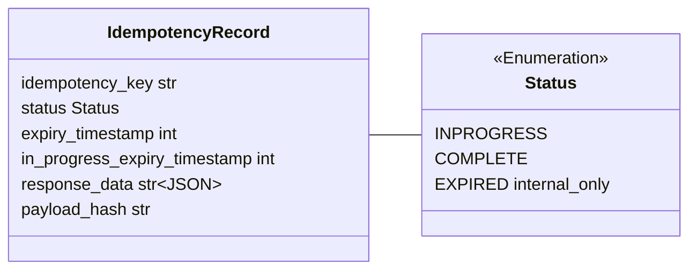
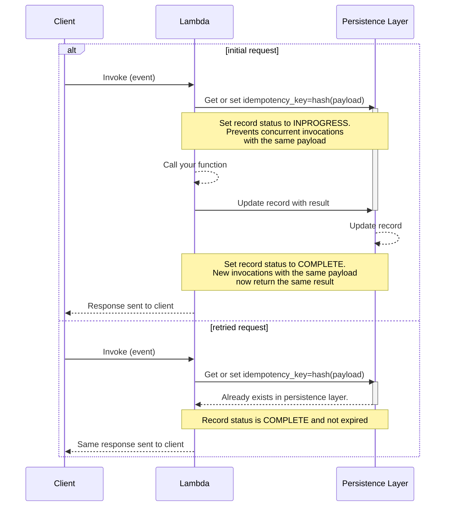
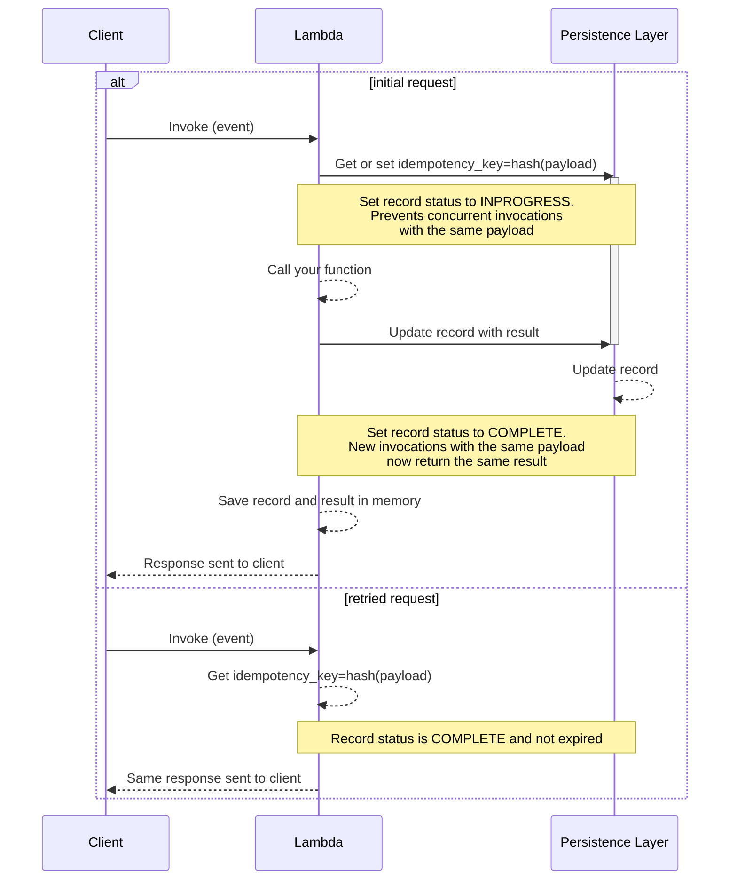
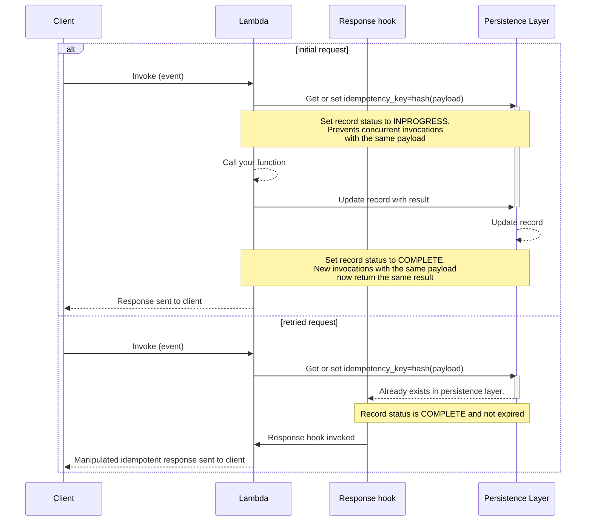
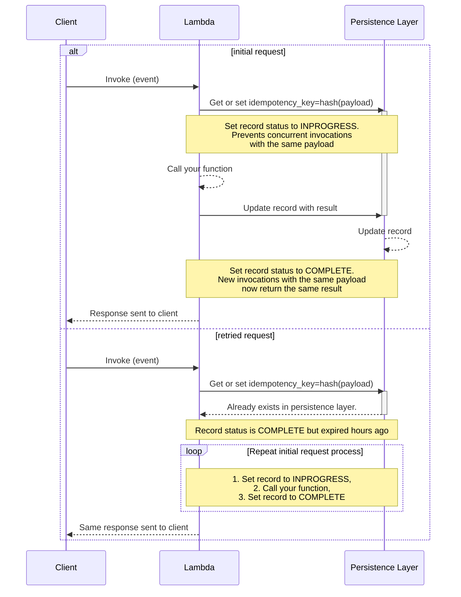
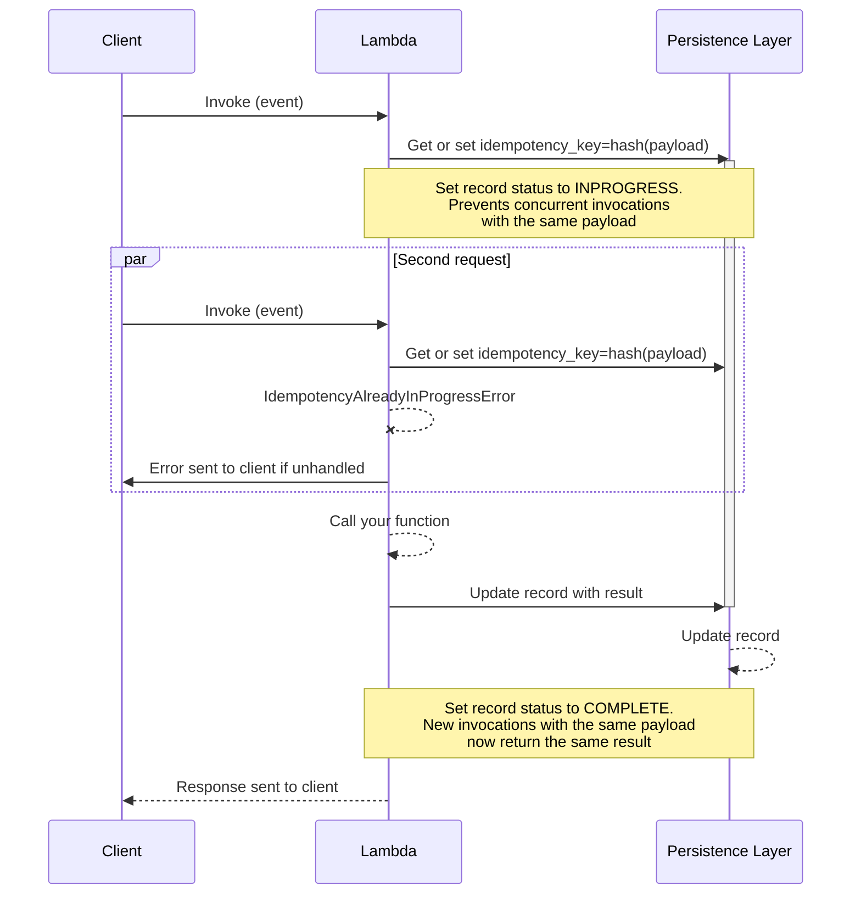
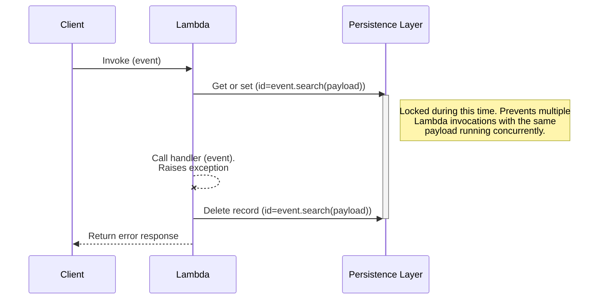
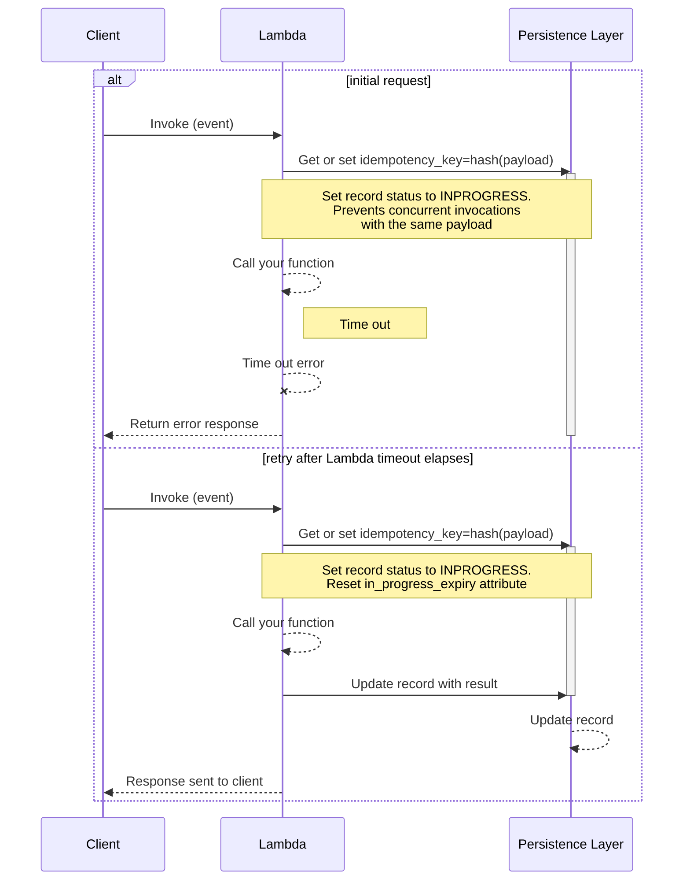
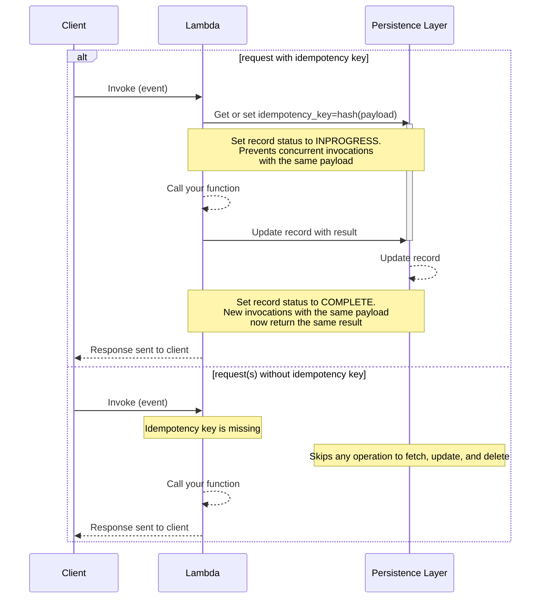
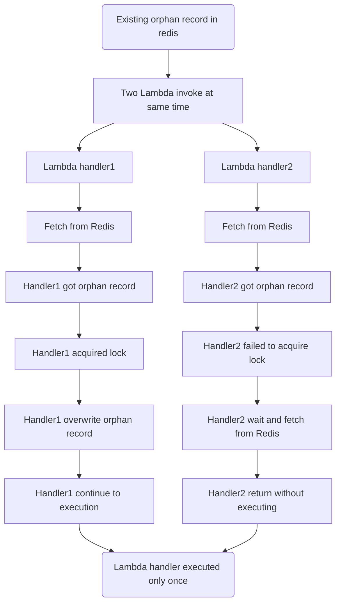

<!-- markdownlint-disable MD051 -->

The idempotency utility allows you to retry operations within a time window with the same input, producing the same output.

## Key features

* Produces the previous successful result when a function is called repeatedly with the same idempotency key
* Choose your idempotency key from one or more fields, or entire payload
* Safeguard concurrent requests, timeouts, missing idempotency keys, and payload tampering
* Support for Amazon DynamoDB, Redis, bring your own persistence layer, and in-memory caching

## Terminology

The property of idempotency means that an operation does not cause additional side effects if it is called more than once with the same input parameters.

**Idempotency key** is a combination of **(a)** Lambda function name, **(b)** fully qualified name of your function, and **(c)** a hash of the entire payload or part(s) of the payload you specify.

**Idempotent request** is an operation with the same input previously processed that is not expired in your persistent storage or in-memory cache.

**Persistence layer** is a storage we use to create, read, expire, and delete idempotency records.

**Idempotency record** is the data representation of an idempotent request saved in the persistent layer and in its various status. We use it to coordinate  whether **(a)** a request is idempotent, **(b)** it's not expired, **(c)** JSON response to return, and more.

<center>


<i>Idempotency record representation</i>
</center>

## Getting started

We use Amazon DynamoDB as the default persistence layer in the documentation. If you prefer Redis, you can learn more from [this section](#redis-database).

### IAM Permissions

When using Amazon DynamoDB as the persistence layer, you will need the following IAM permissions:

| IAM Permission                       | Operation                                                                |
| ------------------------------------ | ------------------------------------------------------------------------ |
| **`dynamodb:GetItem`**{: .copyMe}    | Retrieve idempotent record _(strong consistency)_                        |
| **`dynamodb:PutItem`**{: .copyMe}    | New idempotent records, replace expired idempotent records               |
| **`dynamodb:UpdateItem`**{: .copyMe} | Complete idempotency transaction, and/or update idempotent records state |
| **`dynamodb:DeleteItem`**{: .copyMe} | Delete idempotent records for unsuccessful idempotency transactions      |

**First time setting it up?**

We provide Infrastrucure as Code examples with [AWS Serverless Application Model (SAM)](#aws-serverless-application-model-sam-example), [AWS Cloud Development Kit (CDK)](#aws-cloud-development-kit-cdk), and [Terraform](#terraform) with the required permissions.

### Required resources

To start, you'll need:

<!-- markdownlint-disable MD030 -->

<div class="grid cards" markdown>
*   :octicons-database-16:{ .lg .middle } __Persistent storage__

    ---

    [Amazon DynamoDB](#dynamodb-table) or [Redis](#redis-database)

*   :simple-awslambda:{ .lg .middle } **AWS Lambda function**

    ---

    With permissions to use your persistent storage

</div>

<!-- markdownlint-enable MD030 -->

#### DynamoDB table

!!! tip "You can share a single state table for all functions"

Unless you're looking to use an [existing table or customize each attribute](#dynamodbpersistencelayer), you only need the following:

| Configuration      | Value        | Notes                                                                                    |
| ------------------ | ------------ | ---------------------------------------------------------------------------------------- |
| Partition key      | `id`         | Format: <br> `{lambda_fn_name}.{module_name}.{fn_qualified_name}#{idempotency_key_hash}` |
| TTL attribute name | `expiration` | Using AWS Console? This is configurable after table creation                             |

Note that `fn_qualified_name` means the [qualified name for classes and functions](https://peps.python.org/pep-3155/){target="_blank" rel="nofollow"} defined in PEP-3155.

##### DynamoDB IaC examples

=== "AWS Serverless Application Model (SAM) example"

    ```yaml hl_lines="6-14 24-31"
    --8<-- "examples/idempotency/templates/sam.yaml"
    ```
=== "AWS Cloud Development Kit (CDK)"

    ```python hl_lines="10 13 16 19-21"
    --8<-- "examples/idempotency/templates/cdk.py"
    ```

=== "Terraform"

    ```terraform hl_lines="14-26 64-70"
    --8<-- "examples/idempotency/templates/terraform.tf"
    ```
`

##### Limitations

* **DynamoDB restricts [item sizes to 400KB](https://docs.aws.amazon.com/amazondynamodb/latest/developerguide/Limits.html#limits-items){target="_blank"}**. This means that if your annotated function's response must be smaller than 400KB, otherwise your function will fail. Consider [Redis](#redis-database) as an alternative.

* **Expect 2 WCU per non-idempotent call**. During the first invocation, we use `PutItem` for locking and `UpdateItem` for completion. Consider reviewing [DynamoDB pricing documentation](https://aws.amazon.com/dynamodb/pricing/){target="_blank"} to estimate cost.

* **Old boto3 versions can increase costs**. For cost optimization, we use a conditional `PutItem` to always lock a new idempotency record. If locking fails, it means we already have an idempotency record saving us an additional `GetItem` call. However, this is only supported in boto3 `1.26.194` and higher _([June 30th 2023](https://aws.amazon.com/about-aws/whats-new/2023/06/amazon-dynamodb-cost-failed-conditional-writes/){target="_blank"})_.

#### Redis database

We recommend you start with a Redis compatible management services such as [Amazon ElastiCache for Redis](https://aws.amazon.com/elasticache/redis/){target="_blank"} or [Amazon MemoryDB for Redis](https://aws.amazon.com/memorydb/){target="_blank"}.

In both services, you'll need to configure [VPC access](https://docs.aws.amazon.com/lambda/latest/dg/configuration-vpc.html){target="_blank"} to your AWS Lambda.

##### Redis IaC examples

=== "AWS CloudFormation example"

    !!! tip inline end "Prefer AWS Console/CLI?"

        Follow the official tutorials for [Amazon ElastiCache for Redis](https://docs.aws.amazon.com/AmazonElastiCache/latest/red-ug/LambdaRedis.html) or [Amazon MemoryDB for Redis](https://aws.amazon.com/blogs/database/access-amazon-memorydb-for-redis-from-aws-lambda/)

    ```yaml hl_lines="5 21"
    --8<-- "examples/idempotency/templates/cfn_redis_serverless.yaml"
    ```

    1. Replace the Security Group ID and Subnet ID to match your VPC settings.
    2. Replace the Security Group ID and Subnet ID to match your VPC settings.

Once setup, you can find a quick start and advanced examples for Redis in [the persistent layers section](#redispersistencelayer).

<!-- markdownlint-enable MD013 -->

### Idempotent decorator

For simple use cases, you can use the `idempotent` decorator on your Lambda handler function.

It will treat the entire event as an idempotency key. That is, the same event will return the previously stored result within a [configurable time window](#adjusting-expiration-window) _(1 hour, by default)_.

=== "Idempotent decorator"

    !!! tip "You can also choose [one or more fields](#choosing-a-payload-subset) as an idempotency key."

    ```python title="getting_started_with_idempotency.py" hl_lines="5-8 12 25"
    --8<-- "examples/idempotency/src/getting_started_with_idempotency.py"
    ```

=== "Sample event"

    ```json title="getting_started_with_idempotency_payload.json"
    --8<-- "examples/idempotency/src/getting_started_with_idempotency_payload.json"
    ```

### Idempotent_function decorator

For full flexibility, you can use the `idempotent_function` decorator for any synchronous Python function.

When using this decorator, you **must** call your decorated function using keyword arguments.

You can use `data_keyword_argument` to tell us the argument to extract an idempotency key.  We support JSON serializable data, [Dataclasses](https://docs.python.org/3.12/library/dataclasses.html){target="_blank" rel="nofollow"}, Pydantic Models, and [Event Source Data Classes](./data_classes.md){target="_blank"}

=== "Using Dataclasses"

    ```python title="working_with_idempotent_function_dataclass.py" hl_lines="4-8 12 28 41"
    --8<-- "examples/idempotency/src/working_with_idempotent_function_dataclass.py"
    ```

    1. Notice how **`data_keyword_argument`** matches the name of the parameter.
    <br><br> This allows us to extract one or all fields as idempotency key.
    2. Different from `idempotent` decorator, we must explicitly register the Lambda context to [protect against timeouts](#lambda-timeouts).

=== "Using Pydantic"

    ```python title="working_with_idempotent_function_pydantic.py" hl_lines="3-7 12 26 37"
    --8<-- "examples/idempotency/src/working_with_idempotent_function_pydantic.py"
    ```

#### Output serialization

By default, `idempotent_function` serializes, stores, and returns your annotated function's result as a JSON object. You can change this behavior using `output_serializer` parameter.

The output serializer supports any JSON serializable data, **Python Dataclasses** and **Pydantic Models**.

!!! info "When using the `output_serializer` parameter, the data will continue to be stored in your persistent storage as a JSON string."

=== "Pydantic"

    Use `PydanticSerializer` to automatically serialize what's retrieved from the persistent storage based on the return type annotated.

    === "Inferring via the return type"

        ```python hl_lines="8 27 35 38 48"
        --8<-- "examples/idempotency/src/working_with_pydantic_deduced_output_serializer.py"
        ```

        1. We'll use `OrderOutput` to instantiate a new object using the data retrieved from persistent storage as input. <br><br> This ensures the return of the function is not impacted when `@idempotent_function` is used.

    === "Explicit model type"

        Alternatively, you can provide an explicit model as an input to `PydanticSerializer`.

        ```python hl_lines="8 27 35 35 47"
        --8<-- "examples/idempotency/src/working_with_pydantic_explicitly_output_serializer.py"
        ```

=== "Dataclasses"

     Use `DataclassSerializer` to automatically serialize what's retrieved from the persistent storage based on the return type annotated.

    === "Inferring via the return type"

        ```python hl_lines="9 30 38 41 51"
        --8<-- "examples/idempotency/src/working_with_dataclass_deduced_output_serializer.py"
        ```

        1. We'll use `OrderOutput` to instantiate a new object using the data retrieved from persistent storage as input. <br><br> This ensures the return of the function is not impacted when `@idempotent_function` is used.

    === "Explicit model type"

        Alternatively, you can provide an explicit model as an input to `DataclassSerializer`.

        ```python hl_lines="8 30 38 40 50"
        --8<-- "examples/idempotency/src/working_with_dataclass_explicitly_output_serializer.py"
        ```

=== "Any type"

    Use `CustomDictSerializer` to have full control over the serialization process for any type. It expects two functions:

    * **to_dict**. Function to convert any type to a JSON serializable dictionary before it saves into the persistent storage.
    * **from_dict**. Function to convert from a dictionary retrieved from persistent storage and serialize in its original form.

    ```python hl_lines="9 34 38 42 52 54 64"
    --8<-- "examples/idempotency/src/working_with_idempotent_function_custom_output_serializer.py"
    ```

    1. This function does the following <br><br>**1**. Receives the return from `process_order`<br> **2**. Converts to dictionary before it can be saved into the persistent storage.
    2. This function does the following <br><br>**1**. Receives the dictionary saved into the persistent storage <br>**1** Serializes to `OrderOutput` before `@idempotent` returns back to the caller.
    3. This serializer receives both functions so it knows who to call when to serialize to and from dictionary.

### Using in-memory cache

!!! note "In-memory cache is local to each Lambda execution environment."

You can enable caching with the `use_local_cache` parameter in `IdempotencyConfig`. When enabled, you can adjust cache capacity _(256)_ with `local_cache_max_items`.

By default, caching is disabled since we don't know how big your response could be in relation to your configured memory size.

=== "Enabling cache"

    ```python hl_lines="15"
    --8<-- "examples/idempotency/src/working_with_local_cache.py"
    ```

    1. You can adjust cache capacity with [`local_cache_max_items`](#customizing-the-default-behavior) parameter.

=== "Sample event"

    ```json
    --8<-- "examples/idempotency/src/working_with_local_cache_payload.json"
    ```

### Choosing a payload subset

???+ tip "Tip: Dealing with always changing payloads"
    When dealing with a more elaborate payload, where parts of the payload always change, you should use **`event_key_jmespath`** parameter.

Use **`event_key_jmespath`** parameter in [`IdempotencyConfig`](#customizing-the-default-behavior) to select one or more payload parts as your idempotency key.

> **Example scenario**

In this example, we have a Lambda handler that creates a payment for a user subscribing to a product. We want to ensure that we don't accidentally charge our customer by subscribing them more than once.

Imagine the function runs successfully, but the client never receives the response due to a connection issue. It is safe to immediately retry in this instance, as the idempotent decorator will return a previously saved response.

We want to use `user_id` and `product_id` fields as our idempotency key. **If we were** to treat the entire request as our idempotency key, a simple HTTP header change would cause our function to run again.

???+ tip "Deserializing JSON strings in payloads for increased accuracy."
    The payload extracted by the `event_key_jmespath` is treated as a string by default.
    This means there could be differences in whitespace even when the JSON payload itself is identical.

    To alter this behaviour, we can use the [JMESPath built-in function](jmespath_functions.md#powertools_json-function){target="_blank"} `powertools_json()` to treat the payload as a JSON object (dict) rather than a string.

=== "Payment function"

    ```python hl_lines="6-10 18 31"
    --8<-- "examples/idempotency/src/working_with_payload_subset.py"
    ```

=== "Sample event"

    ```json hl_lines="28"
    --8<-- "examples/idempotency/src/working_with_payload_subset_payload.json"
    ```

### Adjusting expiration window

!!! note "By default, we expire idempotency records after **an hour** (3600 seconds). After that, a transaction with the same payload [will not be considered idempotent](#expired-idempotency-records)."

You can change this expiration window with the **`expires_after_seconds`** parameter. There is no limit on how long this expiration window can be set to.

=== "Adjusting expiration window"

    ```python hl_lines="14"
    --8<-- "examples/idempotency/src/working_with_record_expiration.py"
    ```

=== "Sample event"

    ```json
    --8<-- "examples/idempotency/src/working_with_record_expiration_payload.json"
    ```

???+ important "Idempotency record expiration vs DynamoDB time-to-live (TTL)"
    [DynamoDB TTL is a feature](https://docs.aws.amazon.com/amazondynamodb/latest/developerguide/howitworks-ttl.html){target="_blank"} to remove items after a certain period of time, it may occur within 48 hours of expiration.

    We don't rely on DynamoDB or any persistence storage layer to determine whether a record is expired to avoid eventual inconsistency states.

    Instead, Idempotency records saved in the storage layer contain timestamps that can be verified upon retrieval and double checked within Idempotency feature.

    **Why?**

    A record might still be valid (`COMPLETE`) when we retrieved, but in some rare cases it might expire a second later. A record could also be [cached in memory](#using-in-memory-cache). You might also want to have idempotent transactions that should expire in seconds.

### Lambda timeouts

!!! note "You can skip this section if you are using the [`@idempotent` decorator](#idempotent-decorator)"

By default, we protect against [concurrent executions](#handling-concurrent-executions-with-the-same-payload) with the same payload using a locking mechanism. However, if your Lambda function times out before completing the first invocation it will only accept the same request when the [idempotency record expire](#adjusting-expiration-window).

To prevent extended failures, use **`register_lambda_context`** function from your idempotency config to calculate and include the remaining invocation time in your idempotency record.

```python title="working_with_lambda_timeout.py" hl_lines="14 23"
--8<-- "examples/idempotency/src/working_with_lambda_timeout.py"
```

???+ example "Mechanics"
    If a second invocation happens **after** this timestamp, and the record is marked as `INPROGRESS`, we will run the invocation again as if it was in the `EXPIRED` state.

    This means that if an invocation expired during execution, it will be quickly executed again on the next retry.

### Handling exceptions

There are two failure modes that can cause new invocations to execute your code again despite having the same payload:

* **Unhandled exception**. We catch them to delete the idempotency record to prevent inconsistencies, then propagate them.
* **Persistent layer errors**. We raise **`IdempotencyPersistenceLayerError`** for any persistence layer errors _e.g., remove idempotency record_.

If an exception is handled or raised **outside** your decorated function, then idempotency will be maintained.

```python title="working_with_exceptions.py" hl_lines="21 32 38"
--8<-- "examples/idempotency/src/working_with_exceptions.py"
```

### Persistence layers

#### DynamoDBPersistenceLayer

This persistence layer is built-in, allowing you to use an existing DynamoDB table or create a new one dedicated to idempotency state (recommended).

```python title="customize_persistence_layer.py" hl_lines="10-18"
--8<-- "examples/idempotency/src/customize_persistence_layer.py"
```

##### Using a composite primary key

Use `sort_key_attr` parameter when your table is configured with a composite primary key _(hash+range key)_.

When enabled, we will save the idempotency key in the sort key instead. By default, the primary key will now be set to `idempotency#{LAMBDA_FUNCTION_NAME}`.

You can optionally set a static value for the partition key using the `static_pk_value` parameter.

=== "Reusing a DynamoDB table that uses a composite primary key"

    ```python hl_lines="10"
    --8<-- "examples/idempotency/src/working_with_composite_key.py"
    ```

=== "Sample Event"

    ```json
    --8<-- "examples/idempotency/src/working_with_composite_key_payload.json"
    ```

??? note "Click to expand and learn how table items would look like"

    | id                           | sort_key                         | expiration | status      | data                                      |
    | ---------------------------- | -------------------------------- | ---------- | ----------- | ----------------------------------------- |
    | idempotency#MyLambdaFunction | 1e956ef7da78d0cb890be999aecc0c9e | 1636549553 | COMPLETED   | {"user_id": 12391, "message": "success"}  |
    | idempotency#MyLambdaFunction | 2b2cdb5f86361e97b4383087c1ffdf27 | 1636549571 | COMPLETED   | {"user_id": 527212, "message": "success"} |
    | idempotency#MyLambdaFunction | f091d2527ad1c78f05d54cc3f363be80 | 1636549585 | IN_PROGRESS |                                           |

##### DynamoDB attributes

You can customize the attribute names during initialization:

| Parameter                   | Required           | Default                              | Description                                                                                              |
| --------------------------- | ------------------ | ------------------------------------ | -------------------------------------------------------------------------------------------------------- |
| **table_name**              | :heavy_check_mark: |                                      | Table name to store state                                                                                |
| **key_attr**                |                    | `id`                                 | Partition key of the table. Hashed representation of the payload (unless **sort_key_attr** is specified) |
| **expiry_attr**             |                    | `expiration`                         | Unix timestamp of when record expires                                                                    |
| **in_progress_expiry_attr** |                    | `in_progress_expiration`             | Unix timestamp of when record expires while in progress (in case of the invocation times out)            |
| **status_attr**             |                    | `status`                             | Stores status of the lambda execution during and after invocation                                        |
| **data_attr**               |                    | `data`                               | Stores results of successfully executed Lambda handlers                                                  |
| **validation_key_attr**     |                    | `validation`                         | Hashed representation of the parts of the event used for validation                                      |
| **sort_key_attr**           |                    |                                      | Sort key of the table (if table is configured with a sort key).                                          |
| **static_pk_value**         |                    | `idempotency#{LAMBDA_FUNCTION_NAME}` | Static value to use as the partition key. Only used when **sort_key_attr** is set.                       |

#### RedisPersistenceLayer

!!! info "We recommend Redis version 7 or higher for optimal performance."

For simple setups, initialize `RedisCachePersistenceLayer` with your Redis endpoint and port to connect.

For security, we enforce SSL connections by default; to disable it, set `ssl=False`.

=== "Redis quick start"
    ```python title="getting_started_with_idempotency_redis_config.py" hl_lines="8-10 14 27"
    --8<-- "examples/idempotency/src/getting_started_with_idempotency_redis_config.py"
    ```

=== "Using an existing Redis client"
    ```python title="getting_started_with_idempotency_redis_client.py" hl_lines="5 10-11 16 24 38"
    --8<-- "examples/idempotency/src/getting_started_with_idempotency_redis_client.py"
    ```

=== "Sample event"

    ```json title="getting_started_with_idempotency_payload.json"
    --8<-- "examples/idempotency/src/getting_started_with_idempotency_payload.json"
    ```

##### Redis SSL connections

We recommend using AWS Secrets Manager to store and rotate certificates safely, and the [Parameters feature](./parameters.md){target="_blank"} to fetch and cache optimally.

For advanced configurations, we recommend using an existing Redis client for optimal compatibility like SSL certificates and timeout.

=== "Advanced configuration using AWS Secrets"
    ```python title="using_redis_client_with_aws_secrets.py" hl_lines="9-11 13 15 25"
    --8<-- "examples/idempotency/src/using_redis_client_with_aws_secrets.py"
    ```

    1. JSON stored:
    ```json
    {
    "REDIS_ENDPOINT": "127.0.0.1",
    "REDIS_PORT": "6379",
    "REDIS_PASSWORD": "redis-secret"
    }
    ```

=== "Advanced configuration with local certificates"
    ```python title="using_redis_client_with_local_certs.py" hl_lines="14 25-27"
    --8<-- "examples/idempotency/src/using_redis_client_with_local_certs.py"
    ```

    1. JSON stored:
    ```json
    {
    "REDIS_ENDPOINT": "127.0.0.1",
    "REDIS_PORT": "6379",
    "REDIS_PASSWORD": "redis-secret"
    }
    ```
    2. redis_user.crt file stored in the "certs" directory of your Lambda function
    3. redis_user_private.key file stored in the "certs" directory of your Lambda function
    4. redis_ca.pem file stored in the "certs" directory of your Lambda function

##### Redis attributes

You can customize the attribute names during initialization:

| Parameter                   | Required | Default                  | Description                                                                                   |
| --------------------------- | -------- | ------------------------ | --------------------------------------------------------------------------------------------- |
| **in_progress_expiry_attr** |          | `in_progress_expiration` | Unix timestamp of when record expires while in progress (in case of the invocation times out) |
| **status_attr**             |          | `status`                 | Stores status of the Lambda execution during and after invocation                             |
| **data_attr**               |          | `data`                   | Stores results of successfully executed Lambda handlers                                       |
| **validation_key_attr**     |          | `validation`             | Hashed representation of the parts of the event used for validation                           |

```python title="customize_persistence_layer_redis.py" hl_lines="15-18"
--8<-- "examples/idempotency/src/customize_persistence_layer_redis.py"
```

### Common use cases

#### Batch processing

You can can easily integrate with [Batch](batch.md){target="_blank"} using the [idempotent_function decorator](#idempotent_function-decorator) to handle idempotency per message/record in a given batch.

???+ "Choosing an unique batch record attribute"
    In this example, we choose `messageId` as our idempotency key since we know it'll be unique.

    Depending on your use case, it might be more accurate [to choose another field](#choosing-a-payload-subset) your producer intentionally set to define uniqueness.

=== "Integration with Batch Processor"

    ```python title="integrate_idempotency_with_batch_processor.py" hl_lines="3 16 19 25 27"
    --8<-- "examples/idempotency/src/integrate_idempotency_with_batch_processor.py"
    ```

=== "Sample event"

    ```json title="integrate_idempotency_with_batch_processor_payload.json" hl_lines="4"
    --8<-- "examples/idempotency/src/integrate_idempotency_with_batch_processor_payload.json"
    ```

### Idempotency request flow

The following sequence diagrams explain how the Idempotency feature behaves under different scenarios.

#### Successful request

<center>

<i>Idempotent successful request</i>
</center>

#### Successful request with cache enabled

!!! note "[In-memory cache is disabled by default](#using-in-memory-cache)."

<center>

<i>Idempotent successful request cached</i>
</center>

#### Successful request with response_hook configured

<center>

<i>Successful idempotent request with a response hook</i>
</center>

#### Expired idempotency records

<center>

<i>Previous Idempotent request expired</i>
</center>

#### Concurrent identical in-flight requests

<center>

<i>Concurrent identical in-flight requests</i>
</center>

#### Unhandled exception

<center>

<i>Idempotent sequence exception</i>
</center>

#### Lambda request timeout

<center>

<i>Idempotent request during and after Lambda timeouts</i>
</center>

#### Optional idempotency key

<center>

<i>Optional idempotency key</i>
</center>

#### Race condition with Redis

<center>

<i>Race condition with Redis</i>
</center>

## Advanced

### Customizing the default behavior

You can override and further extend idempotency behavior via **`IdempotencyConfig`** with the following options:

| Parameter                       | Default | Description                                                                                                                                                                                                                                |
| ------------------------------- | ------- | ------------------------------------------------------------------------------------------------------------------------------------------------------------------------------------------------------------------------------------------ |
| **event_key_jmespath**          | `""`    | JMESPath expression to extract the idempotency key from the event record using [built-in functions](./jmespath_functions.md#built-in-jmespath-functions){target="_blank"}                                                                  |
| **payload_validation_jmespath** | `""`    | JMESPath expression to validate whether certain parameters have changed in the event while the event payload _e.g., payload tampering._                                                                                                    |
| **raise_on_no_idempotency_key** | `False` | Raise exception if no idempotency key was found in the request                                                                                                                                                                             |
| **expires_after_seconds**       | 3600    | The number of seconds to wait before a record is expired, allowing a new transaction with the same idempotency key                                                                                                                         |
| **use_local_cache**             | `False` | Whether to cache idempotency results in-memory to save on persistence storage latency and costs                                                                                                                                            |
| **local_cache_max_items**       | 256     | Max number of items to store in local cache                                                                                                                                                                                                |
| **hash_function**               | `md5`   | Function to use for calculating hashes, as provided by [hashlib](https://docs.python.org/3/library/hashlib.html){target="_blank" rel="nofollow"} in the standard library.                                                                  |
| **response_hook**               | `None`  | Function to use for processing the stored Idempotent response. This function hook is called when an existing idempotent response is found. See [Manipulating The Idempotent Response](idempotency.md#manipulating-the-idempotent-response) |

### Handling concurrent executions with the same payload

This utility will raise an **`IdempotencyAlreadyInProgressError`** exception if you receive **multiple invocations with the same payload while the first invocation hasn't completed yet**.

???+ info
    If you receive `IdempotencyAlreadyInProgressError`, you can safely retry the operation.

This is a locking mechanism for correctness. Since we don't know the result from the first invocation yet, we can't safely allow another concurrent execution.

### Payload validation

???+ question "Question: What if your function is invoked with the same payload except some outer parameters have changed?"
    Example: A payment transaction for a given productID was requested twice for the same customer, **however the amount to be paid has changed in the second transaction**.

By default, we will return the same result as it returned before, however in this instance it may be misleading; we provide a fail fast payload validation to address this edge case.

With **`payload_validation_jmespath`**, you can provide an additional JMESPath expression to specify which part of the event body should be validated against previous idempotent invocations

=== "Payload validation"

    ```python hl_lines="20 29 36"
    --8<-- "examples/idempotency/src/working_with_validation_payload.py"
    ```

=== "Sample event 1"

    ```json hl_lines="2 5"
    --8<-- "examples/idempotency/src/working_with_validation_payload_payload1.json"
    ```

=== "Sample event 2"

    ```json hl_lines="2 5"
    --8<-- "examples/idempotency/src/working_with_validation_payload_payload2.json"
    ```

In this example, the **`user_id`** and **`product_id`** keys are used as the payload to generate the idempotency key, as per **`event_key_jmespath`** parameter.

???+ note
    If we try to send the same request but with a different amount, we will raise **`IdempotencyValidationError`**.

Without payload validation, we would have returned the same result as we did for the initial request. Since we're also returning an amount in the response, this could be quite confusing for the client.

By using **`payload_validation_jmespath="amount"`**, we prevent this potentially confusing behavior and instead raise an Exception.

### Making idempotency key required

If you want to enforce that an idempotency key is required, you can set **`raise_on_no_idempotency_key`** to `True`.

This means that we will raise **`IdempotencyKeyError`** if the evaluation of **`event_key_jmespath`** is `None`.

???+ warning
    To prevent errors, transactions will not be treated as idempotent if **`raise_on_no_idempotency_key`** is set to `False` and the evaluation of **`event_key_jmespath`** is `None`. Therefore, no data will be fetched, stored, or deleted in the idempotency storage layer.

=== "Idempotency key required"

    ```python hl_lines="14"
    --8<-- "examples/idempotency/src/working_with_idempotency_key_required.py"
    ```

=== "Success Event"

    ```json hl_lines="3 6"
    --8<-- "examples/idempotency/src/working_with_idempotency_key_required_payload_success.json"
    ```

=== "Failure Event"

    ```json hl_lines="3 5"
    --8<-- "examples/idempotency/src/working_with_idempotency_key_required_payload_error.json"
    ```

### Customizing boto configuration
<!-- markdownlint-disable-next-line MD013 -->
The **`boto_config`** and **`boto3_session`** parameters enable you to pass in a custom [botocore config object](https://botocore.amazonaws.com/v1/documentation/api/latest/reference/config.html){target="_blank"} or a custom [boto3 session](https://boto3.amazonaws.com/v1/documentation/api/latest/reference/core/session.html){target="_blank"} when constructing the persistence store.

=== "Custom session"

    ```python hl_lines="3 13 16"
    --8<-- "examples/idempotency/src/working_with_custom_session.py"
    ```

=== "Custom config"

    ```python hl_lines="3 13 16"
    --8<-- "examples/idempotency/src/working_with_custom_config.py"
    ```

=== "Sample Event"

    ```json
    --8<-- "examples/idempotency/src/working_with_custom_config_payload.json"
    ```

### Bring your own persistent store

This utility provides an abstract base class (ABC), so that you can implement your choice of persistent storage layer.

You can create your own persistent store from scratch by inheriting the `BasePersistenceLayer` class, and implementing `_get_record()`, `_put_record()`, `_update_record()` and `_delete_record()`.

* **`_get_record()`** – Retrieves an item from the persistence store using an idempotency key and returns it as a `DataRecord` instance.
* **`_put_record()`** – Adds a `DataRecord` to the persistence store if it doesn't already exist with that key. Raises an `ItemAlreadyExists` exception if a non-expired entry already exists.
* **`_update_record()`** – Updates an item in the persistence store.
* **`_delete_record()`** – Removes an item from the persistence store.

```python title="bring_your_own_persistent_store.py" hl_lines="8 18 65 74 96 124"
--8<-- "examples/idempotency/src/bring_your_own_persistent_store.py"
```

???+ danger
    Pay attention to the documentation for each - you may need to perform additional checks inside these methods to ensure the idempotency guarantees remain intact.

    For example, the `_put_record` method needs to raise an exception if a non-expired record already exists in the data store with a matching key.

### Manipulating the Idempotent Response

You can set up a `response_hook` in the `IdempotentConfig` class to manipulate the returned data when an operation is idempotent. The hook function will be called with the current deserialized response object and the Idempotency record.

=== "Using an Idempotent Response Hook"

    ```python hl_lines="20 22 28 36"
    --8<-- "examples/idempotency/src/working_with_response_hook.py"
    ```

=== "Sample event"

    ```json
    --8<-- "examples/idempotency/src/working_with_response_hook_payload.json"
    ```

???+ info "Info: Using custom de-serialization?"

    The response_hook is called after the custom de-serialization so the payload you process will be the de-serialized version.

#### Being a good citizen

When using response hooks to manipulate returned data from idempotent operations, it's important to follow best practices to avoid introducing complexity or issues. Keep these guidelines in mind:

1. **Response hook works exclusively when operations are idempotent.** The hook will not be called when an operation is not idempotent, or when the idempotent logic fails.

2. **Catch and Handle Exceptions.** Your response hook code should catch and handle any exceptions that may arise from your logic. Unhandled exceptions will cause the Lambda function to fail unexpectedly.

3. **Keep Hook Logic Simple** Response hooks should consist of minimal and straightforward logic for manipulating response data. Avoid complex conditional branching and aim for hooks that are easy to reason about.

## Compatibility with other utilities

### JSON Schema Validation

The idempotency utility can be used with the `validator` decorator. Ensure that idempotency is the innermost decorator.

???+ warning
    If you use an envelope with the validator, the event received by the idempotency utility will be the unwrapped
    event - not the "raw" event Lambda was invoked with.

	Make sure to account for this behavior, if you set the `event_key_jmespath`.

=== "Using Idempotency with validation utility"

    ```python hl_lines="16"
    --8<-- "examples/idempotency/src/integrate_idempotency_with_validator.py"
    ```

=== "Sample Event"

    ```json hl_lines="60"
    --8<-- "examples/idempotency/src/integrate_idempotency_with_validator_payload.json"
    ```

???+ tip "Tip: JMESPath Powertools for AWS Lambda (Python) functions are also available"
    Built-in functions known in the validation utility like `powertools_json`, `powertools_base64`, `powertools_base64_gzip` are also available to use in this utility.

### Tracer

The idempotency utility can be used with the `tracer` decorator. Ensure that idempotency is the innermost decorator.

#### First execution

During the first execution with a payload, Lambda performs a `PutItem` followed by an `UpdateItem` operation to persist the record in DynamoDB.


#### Subsequent executions

On subsequent executions with the same payload, Lambda optimistically tries to save the record in DynamoDB. If the record already exists, DynamoDB returns the item.

Explore how to handle conditional write errors in high-concurrency scenarios with DynamoDB in this [blog post](https://aws.amazon.com/pt/blogs/database/handle-conditional-write-errors-in-high-concurrency-scenarios-with-amazon-dynamodb/){target="_blank"}.


## Testing your code

The idempotency utility provides several routes to test your code.

### Disabling the idempotency utility

When testing your code, you may wish to disable the idempotency logic altogether and focus on testing your business logic. To do this, you can set the environment variable `POWERTOOLS_IDEMPOTENCY_DISABLED`
with a truthy value. If you prefer setting this for specific tests, and are using Pytest, you can use [monkeypatch](https://docs.pytest.org/en/latest/monkeypatch.html){target="_blank" rel="nofollow"} fixture:

=== "test_disabling_idempotency_utility.py"

    ```python hl_lines="3 4 23 24"
    --8<-- "examples/idempotency/tests/test_disabling_idempotency_utility.py"
    ```

=== "app_test_disabling_idempotency_utility.py"

    ```python hl_lines="10"
    --8<-- "examples/idempotency/tests/app_test_disabling_idempotency_utility.py"
    ```

### Testing with DynamoDB Local

To test with [DynamoDB Local](https://docs.aws.amazon.com/amazondynamodb/latest/developerguide/DynamoDBLocal.DownloadingAndRunning.html){target="_blank"}, you can replace the `DynamoDB client` used by the persistence layer with one you create inside your tests. This allows you to set the endpoint_url.

=== "test_with_dynamodb_local.py"

    ```python hl_lines="3-5 25 26"
    --8<-- "examples/idempotency/tests/test_with_dynamodb_local.py"
    ```

=== "app_test_dynamodb_local.py"

    ```python hl_lines="10"
    --8<-- "examples/idempotency/tests/app_test_dynamodb_local.py"
    ```

### How do I mock all DynamoDB I/O operations

The idempotency utility lazily creates the dynamodb [Table](https://boto3.amazonaws.com/v1/documentation/api/latest/reference/services/dynamodb.html#table){target="_blank"} which it uses to access DynamoDB.
This means it is possible to pass a mocked Table resource, or stub various methods.

=== "test_with_io_operations.py"

    ```python hl_lines="4 5 24 25 27"
    --8<-- "examples/idempotency/tests/test_with_io_operations.py"
    ```

=== "app_test_io_operations.py"

    ```python hl_lines="10"
    --8<-- "examples/idempotency/tests/app_test_io_operations.py"
    ```

### Testing with Redis

To test locally, you can either utilize [fakeredis-py](https://github.com/cunla/fakeredis-py) for a simulated Redis environment or refer to the [MockRedis](https://github.com/aws-powertools/powertools-lambda-python/blob/ba6532a1c73e20fdaee88c5795fd40e978553e14/tests/functional/idempotency/persistence/test_redis_layer.py#L34-L66) class used in our tests to mock Redis operations.

=== "test_with_mock_redis.py"

    ```python hl_lines="2 3 29 31"
    --8<-- "examples/idempotency/tests/test_with_mock_redis.py"
    ```

=== "mock_redis.py"

    ```python
    --8<-- "examples/idempotency/tests/mock_redis.py"
    ```

If you want to set up a real Redis client for integration testing, you can reference the code provided below.

=== "test_with_real_redis.py"

    ```python hl_lines="3 4 29 38"
    --8<-- "examples/idempotency/tests/test_with_real_redis.py"
    ```

=== "Makefile"

    ```bash
    test-idempotency-redis: # (1)!
    	docker run --name test-idempotency-redis -d -p 63005:6379 redis
    	pytest test_with_real_redis.py;docker stop test-idempotency-redis;docker rm test-idempotency-redis
    ```

    1. Use this script to setup a temp Redis docker and auto remove it upon completion

## Extra resources

If you're interested in a deep dive on how Amazon uses idempotency when building our APIs, check out
[this article](https://aws.amazon.com/builders-library/making-retries-safe-with-idempotent-APIs/){target="_blank"}.
