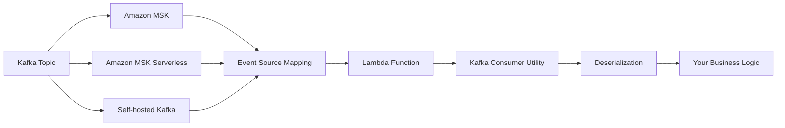
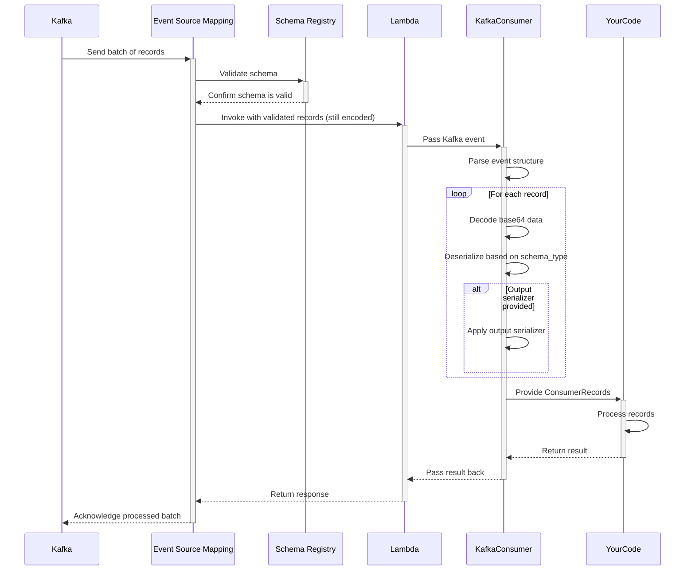
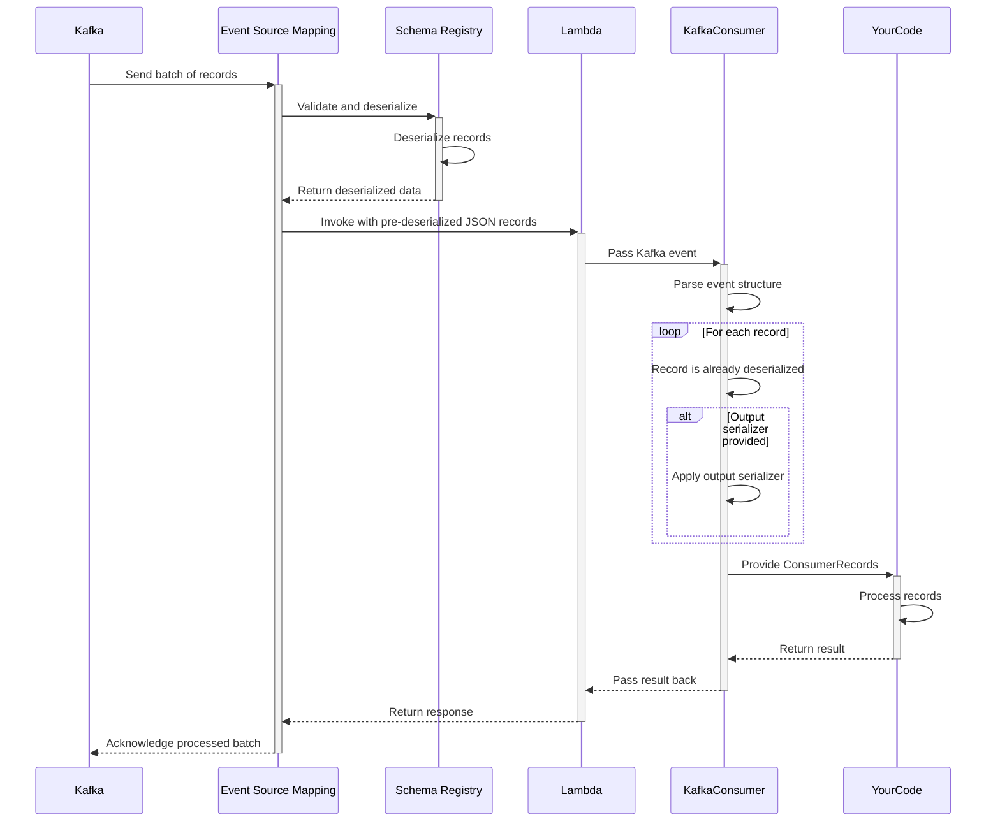
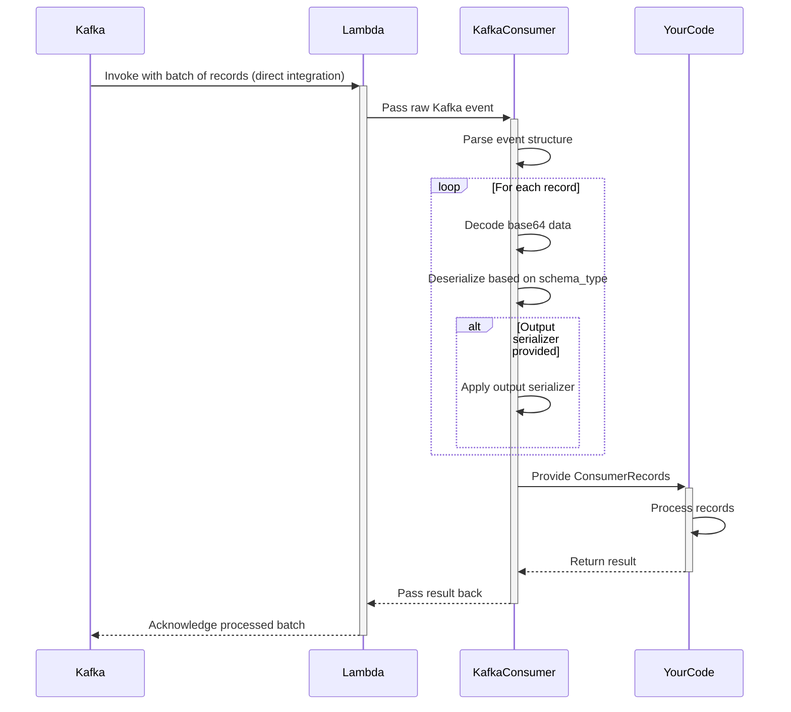

<!-- markdownlint-disable MD043 -->

The Kafka Consumer utility transparently handles message deserialization, provides an intuitive developer experience, and integrates seamlessly with the rest of the Powertools for AWS Lambda ecosystem.



## Key features

* Automatic deserialization of Kafka messages (JSON, Avro, and Protocol Buffers)
* Simplified event record handling with intuitive interface
* Support for key and value deserialization
* Support for custom output serializers (e.g., dataclasses, Pydantic models)
* Support for ESM with and without Schema Registry integration
* Proper error handling for deserialization issues

## Terminology

**Event Source Mapping (ESM)**  A Lambda feature that reads from streaming sources (like Kafka) and invokes your Lambda function. It manages polling, batching, and error handling automatically, eliminating the need for consumer management code.

**Record Key and Value** A Kafka messages contain two important parts: an optional key that determines the partition and a value containing the actual message data. Both are base64-encoded in Lambda events and can be independently deserialized.

**Deserialization** Is the process of converting binary data (base64-encoded in Lambda events) into usable Python objects according to a specific format like JSON, Avro, or Protocol Buffers. Powertools handles this conversion automatically.

**SchemaConfig class** Contains parameters that tell Powertools how to interpret message data, including the format type (JSON, Avro, Protocol Buffers) and optional schema definitions needed for binary formats.

**Output Serializer** A Pydantic model, Python dataclass, or any custom class that helps structure data for your business logic.

**Schema Registry** Is a centralized service that stores and validates schemas, ensuring producers and consumers maintain compatibility when message formats evolve over time.

## Moving from traditional Kafka consumers

Lambda processes Kafka messages as discrete events rather than continuous streams, requiring a different approach to consumer development that Powertools for AWS helps standardize.

| Aspect | Traditional Kafka Consumers | Lambda Kafka Consumer |
|--------|----------------------------|----------------------|
| **Model** | Pull-based (you poll for messages) | Push-based (Lambda invoked with messages) |
| **Scaling** | Manual scaling configuration | Automatic scaling to partition count |
| **State** | Long-running application with state | Stateless, ephemeral executions |
| **Offsets** | Manual offset management | Automatic offset commitment |
| **Schema Validation** | Client-side schema validation | Optional Schema Registry integration with Event Source Mapping |
| **Error Handling** | Per-message retry control | Batch-level retry policies |

## Getting started

### Installation

Install the Powertools for AWS Lambda package with the appropriate extras for your use case:

```bash
# Basic installation - includes JSON support
pip install aws-lambda-powertools

# For processing Avro messages
pip install 'aws-lambda-powertools[kafka-consumer-avro]'

# For working with Protocol Buffers
pip install 'aws-lambda-powertools[kafka-consumer-protobuf]'
```

### Required resources

To use the Kafka consumer utility, you need an AWS Lambda function configured with a Kafka event source. This can be Amazon MSK, MSK Serverless, or a self-hosted Kafka cluster.

=== "getting_started_with_msk.yaml"

    ```yaml
    AWSTemplateFormatVersion: '2010-09-09'
    Transform: AWS::Serverless-2016-10-31
    Resources:
      KafkaConsumerFunction:
        Type: AWS::Serverless::Function
        Properties:
          Handler: app.lambda_handler
          Runtime: python3.13
          Timeout: 30
          Events:
            MSKEvent:
              Type: MSK
              Properties:
                StartingPosition: LATEST
                Stream: !GetAtt MyMSKCluster.Arn
                Topics:
                  - my-topic-1
                  - my-topic-2
          Policies:
            - AWSLambdaMSKExecutionRole
    ```

### Using ESM with Schema Registry

The Event Source Mapping configuration determines which mode is used. With `JSON`, Lambda converts all messages to JSON before invoking your function. With `SOURCE` mode, Lambda preserves the original format, requiring you function to handle the appropriate deserialization.

Powertools for AWS supports both Schema Registry integration modes in your Event Source Mapping configuration.

### Processing Kafka events

The Kafka consumer utility transforms raw Lambda Kafka events into an intuitive format for processing. To handle messages effectively, you'll need to configure a schema that matches your data format.

???+ tip "Using Avro is recommended"
    We recommend Avro for production Kafka implementations due to its schema evolution capabilities, compact binary format, and integration with Schema Registry. This offers better type safety and forward/backward compatibility compared to JSON.

=== "Avro Messages"

    ```python title="getting_started_with_avro.py"
    --8<-- "examples/kafka/consumer/src/getting_started_with_avro.py"
    ```

=== "Protocol Buffers"

    ```python title="getting_started_with_protobuf.py"
    --8<-- "examples/kafka/consumer/src/getting_started_with_protobuf.py"
    ```

=== "JSON Messages"

    ```python title="getting_started_with_json.py"
    --8<-- "examples/kafka/consumer/src/getting_started_with_json.py"
    ```

### Deserializing keys and values

The `@kafka_consumer` decorator can deserialize both keys and values independently based on your schema configuration. This flexibility allows you to work with different data formats in the same message.

=== "Key and Value Deserialization"

    ```python title="working_with_key_and_value.py"
    --8<-- "examples/kafka/consumer/src/working_with_key_and_value.py"
    ```

=== "Value-Only Deserialization"

    ```python title="working_with_value_only.py"
    --8<-- "examples/kafka/consumer/src/working_with_value_only.py"
    ```

### Handling primitive types

When working with primitive data types (strings, integers, etc.) rather than structured objects, you can simplify your configuration by omitting the schema specification for that component. Powertools for AWS will deserialize the value always as a string.

???+ tip "Common pattern: Keys with primitive values"
    Using primitive types (strings, integers) as Kafka message keys is a common pattern for partitioning and identifying messages. Powertools automatically handles these primitive keys without requiring special configuration, making it easy to implement this popular design pattern.

=== "Primitive key"

    ```python title="working_with_primitive_key.py"
    --8<-- "examples/kafka/consumer/src/working_with_primitive_key.py"
    ```

=== "Primitive key and value"

    ```python title="working_with_primitive_key_and_value.py"
    --8<-- "examples/kafka/consumer/src/working_with_primitive_key_and_value.py"
    ```

### Message format support and comparison

The Kafka consumer utility supports multiple serialization formats to match your existing Kafka implementation. Choose the format that best suits your needs based on performance, schema evolution requirements, and ecosystem compatibility.

???+ tip "Selecting the right format"
    For new applications, consider Avro or Protocol Buffers over JSON. Both provide schema validation, evolution support, and significantly better performance with smaller message sizes. Avro is particularly well-suited for Kafka due to its built-in schema evolution capabilities.

=== "Supported Formats"

    | Format | Schema Type | Description | Required Parameters |
    |--------|-------------|-------------|---------------------|
    | **JSON** | `"JSON"` | Human-readable text format | None |
    | **Avro** | `"AVRO"` | Compact binary format with schema | `value_schema` (Avro schema string) |
    | **Protocol Buffers** | `"PROTOBUF"` | Efficient binary format | `value_schema` (Proto message class) |

=== "Format Comparison"

    | Feature | JSON | Avro | Protocol Buffers |
    |---------|------|------|-----------------|
    | **Schema Definition** | Optional | Required JSON schema | Required .proto file |
    | **Schema Evolution** | None | Strong support | Strong support |
    | **Size Efficiency** | Low | High | Highest |
    | **Processing Speed** | Slower | Fast | Fastest |
    | **Human Readability** | High | Low | Low |
    | **Implementation Complexity** | Low | Medium | Medium |
    | **Additional Dependencies** | None | `avro` package | `protobuf` package |

Choose the serialization format that best fits your needs:

* **JSON**: Best for simplicity and when schema flexibility is important
* **Avro**: Best for systems with evolving schemas and when compatibility is critical
* **Protocol Buffers**: Best for performance-critical systems with structured data

## Advanced

### Accessing record metadata

Each Kafka record contains important metadata that you can access alongside the deserialized message content. This metadata helps with message processing, troubleshooting, and implementing advanced patterns like exactly-once processing.

=== "Working with Record Metadata"

    ```python
    from aws_lambda_powertools.utilities.kafka import kafka_consumer
    from aws_lambda_powertools.utilities.kafka.consumer_records import ConsumerRecords
    from aws_lambda_powertools.utilities.kafka.schema_config import SchemaConfig

    # Define Avro schema
    avro_schema = """
    {
        "type": "record",
        "name": "Customer",
        "fields": [
            {"name": "customer_id", "type": "string"},
            {"name": "name", "type": "string"},
            {"name": "email", "type": "string"},
            {"name": "order_total", "type": "double"}
        ]
    }
    """

    schema_config = SchemaConfig(
        value_schema_type="AVRO",
        value_schema=avro_schema
    )

    @kafka_consumer(schema_config=schema_config)
    def lambda_handler(event: ConsumerRecords, context):
        for record in event.records:
            # Log record coordinates for tracing
            print(f"Processing message from topic '{record.topic}'")
            print(f"  Partition: {record.partition}, Offset: {record.offset}")
            print(f"  Produced at: {record.timestamp}")

            # Process message headers
            if record.headers:
                for header in record.headers:
                    print(f"  Header: {header['key']} = {header['value']}")

            # Access the Avro deserialized message content
            customer = record.value
            print(f"Processing order for: {customer['name']}")
            print(f"Order total: ${customer['order_total']}")

            # For debugging, you can access the original raw data
            # print(f"Raw message: {record.raw_value}")

        return {"statusCode": 200}
    ```

#### Available metadata properties

| Property | Description | Example Use Case |
|----------|-------------|-----------------|
| `topic` | Topic name the record was published to | Routing logic in multi-topic consumers |
| `partition` | Kafka partition number | Tracking message distribution |
| `offset` | Position in the partition | De-duplication, exactly-once processing |
| `timestamp` | Unix timestamp when record was created | Event timing analysis |
| `timestamp_type` | Timestamp type (CREATE_TIME or LOG_APPEND_TIME) | Data lineage verification |
| `headers` | Key-value pairs attached to the message | Cross-cutting concerns like correlation IDs |
| `key` | Deserialized message key | Customer ID or entity identifier |
| `value` | Deserialized message content | The actual business data |
| `original_value` | Base64-encoded original message value | Debugging or custom deserialization |
| `original_key` | Base64-encoded original message key | Debugging or custom deserialization |

### Custom output serializers

Transform deserialized data into your preferred object types using output serializers. This can help you integrate Kafka data with your domain models and application architecture, providing type hints, validation, and structured data access.

???+ tip "Choosing the right output serializer"
    - **Pydantic models** offer robust data validation at runtime and excellent IDE support
    - **Dataclasses** provide lightweight type hints with better performance than Pydantic
    - **Custom classes** give complete flexibility for complex transformations and business logic

=== "Pydantic Models"

    ```python
    from pydantic import BaseModel, Field, EmailStr
    from aws_lambda_powertools.utilities.kafka import kafka_consumer
    from aws_lambda_powertools.utilities.kafka.schema_config import SchemaConfig

    # Define Pydantic model for strong validation
    class Customer(BaseModel):
        id: str
        name: str
        email: EmailStr
        tier: str = Field(pattern=r'^(standard|premium|enterprise)$')
        loyalty_points: int = Field(ge=0)

        def is_premium(self) -> bool:
            return self.tier in ("premium", "enterprise")

    # Configure with Avro schema and Pydantic output
    schema_config = SchemaConfig(
        value_schema_type="JSON",
        value_output_serializer=Customer
    )

    @kafka_consumer(schema_config=schema_config)
    def lambda_handler(event, context):
        for record in event.records:
            # record.value is now a validated Customer instance
            customer = record.value

            # Access model properties and methods
            if customer.is_premium():
                print(f"Processing premium customer: {customer.name}")
                apply_premium_benefits(customer)

        return {"statusCode": 200}
    ```

=== "Python Dataclasses"

    ```python
    from dataclasses import dataclass
    from datetime import datetime
    from typing import List, Optional
    from aws_lambda_powertools.utilities.kafka import kafka_consumer
    from aws_lambda_powertools.utilities.kafka.schema_config import SchemaConfig

    # Define dataclasses for type hints and structure
    @dataclass
    class OrderItem:
        product_id: str
        quantity: int
        unit_price: float

    @dataclass
    class Order:
        order_id: str
        customer_id: str
        items: List[OrderItem]
        created_at: datetime
        shipped_at: Optional[datetime] = None

        @property
        def total(self) -> float:
            return sum(item.quantity * item.unit_price for item in self.items)

    # Helper function to convert timestamps to datetime objects
    def order_converter(data):
        # Convert timestamps to datetime objects
        data['created_at'] = datetime.fromtimestamp(data['created_at']/1000)
        if data.get('shipped_at'):
            data['shipped_at'] = datetime.fromtimestamp(data['shipped_at']/1000)

        # Convert order items
        data['items'] = [OrderItem(**item) for item in data['items']]
        return Order(**data)

    schema_config = SchemaConfig(
        value_schema_type="JSON",
        value_output_serializer=order_converter
    )

    @kafka_consumer(schema_config=schema_config)
    def lambda_handler(event, context):
        for record in event.records:
            # record.value is now an Order object
            order = record.value

            print(f"Processing order {order.order_id} with {len(order.items)} items")
            print(f"Order total: ${order.total:.2f}")

        return {"statusCode": 200}
    ```

=== "Custom Class"

    ```python
    from aws_lambda_powertools.utilities.kafka import kafka_consumer
    from aws_lambda_powertools.utilities.kafka.schema_config import SchemaConfig

    # Custom class with business logic
    class EnrichmentProcessor:
        def __init__(self, data):
            self.user_id = data['user_id']
            self.name = data['name']
            self.preferences = data.get('preferences', {})
            self._raw_data = data  # Keep original data
            self._enriched = False
            self._recommendations = None

        def enrich(self, recommendation_service):
            """Enrich user data with recommendations"""
            if not self._enriched:
                self._recommendations = recommendation_service.get_for_user(self.user_id)
                self._enriched = True
            return self

        @property
        def recommendations(self):
            if not self._enriched:
                raise ValueError("Must call enrich() before accessing recommendations")
            return self._recommendations

    # Configure with custom processor
    schema_config = SchemaConfig(
        value_schema_type="JSON",
        value_output_serializer=EnrichmentProcessor
    )

    @kafka_consumer(schema_config=schema_config)
    def lambda_handler(event, context):
        # Initialize services
        recommendation_service = RecommendationService()

        for record in event.records:
            # record.value is now an EnrichmentProcessor
            processor = record.value

            # Use the processor's methods for business logic
            enriched = processor.enrich(recommendation_service)

            # Access computed properties
            print(f"User: {enriched.name}")
            print(f"Top recommendation: {enriched.recommendations[0]['title']}")

        return {"statusCode": 200}
    ```

### Error handling

Handle errors gracefully when processing Kafka messages to ensure your application maintains resilience and provides clear diagnostic information. The Kafka consumer utility provides specific exception types to help you identify and handle deserialization issues effectively.

=== "Basic Error Handling"

    ```python
    from aws_lambda_powertools.utilities.kafka import kafka_consumer
    from aws_lambda_powertools.utilities.kafka.exceptions import KafkaConsumerDeserializationError
    from aws_lambda_powertools import Logger

    logger = Logger()

    @kafka_consumer(schema_config=schema_config)
    def lambda_handler(event, context):
        successful_records = 0
        failed_records = 0

        for record in event.records:
            try:
                # Process each record individually to isolate failures
                process_customer_data(record.value)
                successful_records += 1

            except KafkaConsumerDeserializationError as e:
                failed_records += 1
                logger.error(
                    "Failed to deserialize Kafka message",
                    extra={
                        "topic": record.topic,
                        "partition": record.partition,
                        "offset": record.offset,
                        "error": str(e)
                    }
                )
                # Optionally send to DLQ or error topic

            except Exception as e:
                failed_records += 1
                logger.error(
                    "Error processing Kafka message",
                    extra={
                        "error": str(e),
                        "topic": record.topic
                    }
                )

        return {
            "statusCode": 200,
            "body": f"Processed {successful_records} records successfully, {failed_records} failed"
        }
    ```

=== "Handling Schema Errors"

    ```python
    from aws_lambda_powertools.utilities.kafka import kafka_consumer
    from aws_lambda_powertools.utilities.kafka.exceptions import (
        KafkaConsumerDeserializationError,
        KafkaConsumerAvroSchemaParserError
    )
    from aws_lambda_powertools import Logger, Metrics
    from aws_lambda_powertools.metrics import MetricUnit

    logger = Logger()
    metrics = Metrics()

    @kafka_consumer(schema_config=schema_config)
    def lambda_handler(event, context):
        metrics.add_metric(name="TotalRecords", unit=MetricUnit.Count, value=len(event.records))

        for record in event.records:
            try:
                order = record.value
                process_order(order)
                metrics.add_metric(name="ProcessedRecords", unit=MetricUnit.Count, value=1)

            except KafkaConsumerAvroSchemaParserError as e:
                logger.critical(
                    "Invalid Avro schema configuration",
                    extra={"error": str(e)}
                )
                metrics.add_metric(name="SchemaErrors", unit=MetricUnit.Count, value=1)
                # This requires fixing the schema - might want to raise to stop processing
                raise

            except KafkaConsumerDeserializationError as e:
                logger.warning(
                    "Message format doesn't match schema",
                    extra={
                        "topic": record.topic,
                        "error": str(e),
                        "raw_data_sample": str(record.raw_value)[:100] + "..." if len(record.raw_value) > 100 else record.raw_value
                    }
                )
                metrics.add_metric(name="DeserializationErrors", unit=MetricUnit.Count, value=1)
                # Send to dead-letter queue for analysis
                send_to_dlq(record)

        return {"statusCode": 200, "metrics": metrics.serialize_metric_set()}
    ```

#### Exception types

| Exception | Description | Common Causes |
|-----------|-------------|---------------|
| `KafkaConsumerDeserializationError` | Raised when message deserialization fails | Corrupted message data, schema mismatch, or wrong schema type configuration |
| `KafkaConsumerAvroSchemaParserError` | Raised when parsing Avro schema definition fails | Syntax errors in schema JSON, invalid field types, or malformed schema |
| `KafkaConsumerMissingSchemaError` | Raised when a required schema is not provided | Missing schema for AVRO or PROTOBUF formats (required parameter) |
| `KafkaConsumerOutputSerializerError` | Raised when output serializer fails | Error in custom serializer function, incompatible data, or validation failures in Pydantic models |

### Integrating with Idempotency

When processing Kafka messages in Lambda, failed batches can result in message reprocessing. The idempotency utility prevents duplicate processing by tracking which messages have already been handled, ensuring each message is processed exactly once.

The Idempotency utility automatically stores the result of each successful operation, returning the cached result if the same message is processed again, which prevents potentially harmful duplicate operations like double-charging customers or double-counting metrics.

=== "Idempotent Kafka Processing"

    ```python
    from aws_lambda_powertools import Logger
    from aws_lambda_powertools.utilities.idempotency import (
        idempotent_function,
        DynamoDBPersistenceLayer,
        IdempotencyConfig
    )
    from aws_lambda_powertools.utilities.kafka import kafka_consumer
    from aws_lambda_powertools.utilities.kafka.schema_config import SchemaConfig
    from aws_lambda_powertools.utilities.kafka.consumer_records import ConsumerRecords

    # Configure persistence layer for idempotency
    persistence_layer = DynamoDBPersistenceLayer(table_name="IdempotencyTable")
    logger = Logger()

    # Configure Kafka schema
    avro_schema = """
    {
        "type": "record",
        "name": "Payment",
        "fields": [
            {"name": "payment_id", "type": "string"},
            {"name": "customer_id", "type": "string"},
            {"name": "amount", "type": "double"},
            {"name": "status", "type": "string"}
        ]
    }
    """

    schema_config = SchemaConfig(
        value_schema_type="AVRO",
        value_schema=avro_schema
    )

    @kafka_consumer(schema_config=schema_config)
    def lambda_handler(event: ConsumerRecords, context):
        for record in event.records:
            # Process each message with idempotency protection
            process_payment(
                payment=record.value,
                topic=record.topic,
                partition=record.partition,
                offset=record.offset
            )

        return {"statusCode": 200}

    @idempotent_function(
        data_keyword_argument="payment",
        config=IdempotencyConfig(
            event_key_jmespath="topic & '-' & partition & '-' & offset"
        ),
        persistence_store=persistence_layer
    )
    def process_payment(payment, topic, partition, offset):
        """Process a payment exactly once"""
        logger.info(f"Processing payment {payment['payment_id']} from {topic}-{partition}-{offset}")

        # Execute payment logic
        payment_service.process(
            payment_id=payment['payment_id'],
            customer_id=payment['customer_id'],
            amount=payment['amount']
        )

        return {"success": True, "payment_id": payment['payment_id']}
    ```

TIP: By using the Kafka record's unique coordinates (topic, partition, offset) as the idempotency key, you ensure that even if a batch fails and Lambda retries the messages, each message will be processed exactly once.

### Best practices

#### Handling large messages

When processing large Kafka messages in Lambda, be mindful of memory limitations. Although the Kafka consumer utility optimizes memory usage, large deserialized messages can still exhaust Lambda's resources.

=== "Handling Large Messages"

    ```python
    from aws_lambda_powertools.utilities.kafka import kafka_consumer
    from aws_lambda_powertools import Logger

    logger = Logger()

    @kafka_consumer(schema_config=schema_config)
    def lambda_handler(event, context):
        for record in event.records:
            # Example: Handle large product catalog updates differently
            if record.topic == "product-catalog" and len(record.raw_value) > 3_000_000:
                logger.info(f"Detected large product catalog update ({len(record.raw_value)} bytes)")

                # Example: Extract S3 reference from message
                catalog_ref = record.value.get("s3_reference")
                logger.info(f"Processing catalog from S3: {catalog_ref}")

                # Process via S3 reference instead of direct message content
                result = process_catalog_from_s3(
                    bucket=catalog_ref["bucket"],
                    key=catalog_ref["key"]
                )
                logger.info(f"Processed {result['product_count']} products from S3")
            else:
                # Regular processing for standard-sized messages
                process_standard_message(record.value)

        return {"statusCode": 200}
    ```

For large messages, consider these proven approaches:

* **Store the data**: use Amazon S3 and include only the S3 reference in your Kafka message
* **Split large payloads**: use multiple smaller messages with sequence identifiers
* **Increase memory** Increase your Lambda function's memory allocation, which also increases CPU capacity

#### Batch size configuration

The number of Kafka records processed per Lambda invocation is controlled by your Event Source Mapping configuration. Properly sized batches optimize cost and performance.

=== "Batch size configuration"
    ```yaml
    Resources:
    OrderProcessingFunction:
        Type: AWS::Serverless::Function
        Properties:
        Handler: app.lambda_handler
        Runtime: python3.9
        Events:
            KafkaEvent:
            Type: MSK
            Properties:
                Stream: !GetAtt OrdersMSKCluster.Arn
                Topics:
                - order-events
                - payment-events
                # Configuration for optimal throughput/latency balance
                BatchSize: 100
                MaximumBatchingWindowInSeconds: 5
                StartingPosition: LATEST
                # Enable partial batch success reporting
                FunctionResponseTypes:
                - ReportBatchItemFailures
    ```

Different workloads benefit from different batch configurations:

* **High-volume, simple processing**: Use larger batches (100-500 records) with short timeout
* **Complex processing with database operations**: Use smaller batches (10-50 records)
* **Mixed message sizes**: Set appropriate batching window (1-5 seconds) to handle variability

#### Cross-language compatibility

When using binary serialization formats across multiple programming languages, ensure consistent schema handling to prevent deserialization failures.

=== "Using Java naming convention"

    ```python
    # Example: Processing Java-produced Avro messages in Python
    from aws_lambda_powertools.utilities.kafka import kafka_consumer
    from aws_lambda_powertools.utilities.kafka.schema_config import SchemaConfig

    # Define schema that matches Java producer
    avro_schema = """
    {
        "namespace": "com.example.orders",
        "type": "record",
        "name": "OrderEvent",
        "fields": [
            {"name": "orderId", "type": "string"},
            {"name": "customerId", "type": "string"},
            {"name": "totalAmount", "type": "double"},
            {"name": "orderDate", "type": "long", "logicalType": "timestamp-millis"}
        ]
    }
    """

    # Configure schema with field name normalization for Python style
    class OrderProcessor:
        def __init__(self, data):
            # Convert Java camelCase to Python snake_case
            self.order_id = data["orderId"]
            self.customer_id = data["customerId"]
            self.total_amount = data["totalAmount"]
            # Convert Java timestamp to Python datetime
            self.order_date = datetime.fromtimestamp(data["orderDate"]/1000)

    schema_config = SchemaConfig(
        value_schema_type="AVRO",
        value_schema=avro_schema,
        value_output_serializer=OrderProcessor
    )

    @kafka_consumer(schema_config=schema_config)
    def lambda_handler(event, context):
        for record in event.records:
            order = record.value  # OrderProcessor instance
            print(f"Processing order {order.order_id} from {order.order_date}")
    ```

Common cross-language challenges to address:

* **Field naming conventions**: camelCase in Java vs snake_case in Python
* **Date/time**: representation differences
* **Numeric precision handling**: especially decimals

### Troubleshooting common errors

### Troubleshooting

#### Deserialization failures

When encountering deserialization errors with your Kafka messages, follow this systematic troubleshooting approach to identify and resolve the root cause.

First, check that your schema definition exactly matches the message format. Even minor discrepancies can cause deserialization failures, especially with binary formats like Avro and Protocol Buffers.

For binary messages that fail to deserialize, examine the raw encoded data:

```python
# DO NOT include this code in production handlers
# For troubleshooting purposes only
import base64

raw_bytes = base64.b64decode(record.raw_value)
print(f"Message size: {len(raw_bytes)} bytes")
print(f"First 50 bytes (hex): {raw_bytes[:50].hex()}")
```

#### Schema compatibility issues

Schema compatibility issues often manifest as successful connections but failed deserialization. Common causes include:

* **Schema evolution without backward compatibility**: New producer schema is incompatible with consumer schema
* **Field type mismatches**: For example, a field changed from string to integer across systems
* **Missing required fields**: Fields required by the consumer schema but absent in the message
* **Default value discrepancies**: Different handling of default values between languages

When using Schema Registry, verify schema compatibility rules are properly configured for your topics and that all applications use the same registry.

#### Memory and timeout optimization

Lambda functions processing Kafka messages may encounter resource constraints, particularly with large batches or complex processing logic.

For memory errors:

* Increase Lambda memory allocation, which also provides more CPU resources
* Process fewer records per batch by adjusting the `BatchSize` parameter in your event source mapping
* Consider optimizing your message format to reduce memory footprint

For timeout issues:

* Extend your Lambda function timeout setting to accommodate processing time
* Implement chunked or asynchronous processing patterns for time-consuming operations
* Monitor and optimize database operations, external API calls, or other I/O operations in your handler

???+ tip "Monitoring memory usage"
    Use CloudWatch metrics to track your function's memory utilization. If it consistently exceeds 80% of allocated memory, consider increasing the memory allocation or optimizing your code.

## Kafka consumer workflow

### Using ESM with Schema Registry validation (SOURCE)

<center>

</center>

### Using ESM with Schema Registry deserialization (JSON)

<center>

</center>

### Using ESM without Schema Registry integration

<center>

</center>

## Testing your code

Testing Kafka consumer functions is straightforward with pytest. You can create simple test fixtures that simulate Kafka events without needing a real Kafka cluster.

=== "Testing your code"

    ```python
    import pytest
    import base64
    import json
    from your_module import lambda_handler

    def test_process_json_message():
        """Test processing a simple JSON message"""
        # Create a test Kafka event with JSON data
        test_event = {
            "eventSource": "aws:kafka",
            "records": {
                "orders-topic": [
                    {
                        "topic": "orders-topic",
                        "partition": 0,
                        "offset": 15,
                        "timestamp": 1545084650987,
                        "timestampType": "CREATE_TIME",
                        "key": None,
                        "value": base64.b64encode(json.dumps({"order_id": "12345", "amount": 99.95}).encode()).decode(),
                    }
                ]
            }
        }

        # Invoke the Lambda handler
        response = lambda_handler(test_event, {})

        # Verify the response
        assert response["statusCode"] == 200
        assert response.get("processed") == 1


    def test_process_multiple_records():
        """Test processing multiple records in a batch"""
        # Create a test event with multiple records
        test_event = {
            "eventSource": "aws:kafka",
            "records": {
                "customers-topic": [
                    {
                        "topic": "customers-topic",
                        "partition": 0,
                        "offset": 10,
                        "value": base64.b64encode(json.dumps({"customer_id": "A1", "name": "Alice"}).encode()).decode(),
                    },
                    {
                        "topic": "customers-topic",
                        "partition": 0,
                        "offset": 11,
                        "value": base64.b64encode(json.dumps({"customer_id": "B2", "name": "Bob"}).encode()).decode(),
                    }
                ]
            }
        }

        # Invoke the Lambda handler
        response = lambda_handler(test_event, {})

        # Verify the response
        assert response["statusCode"] == 200
        assert response.get("processed") == 2
    ```
