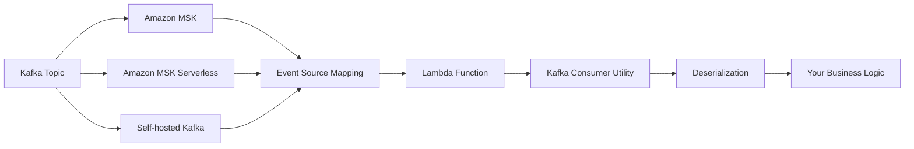
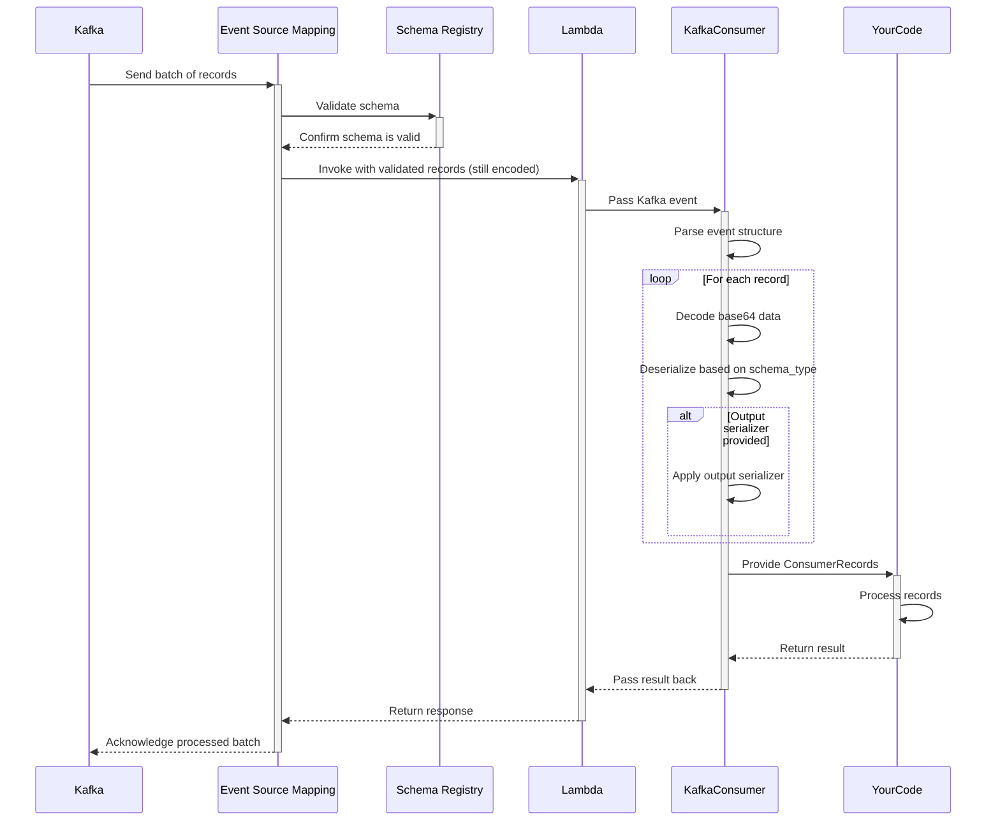
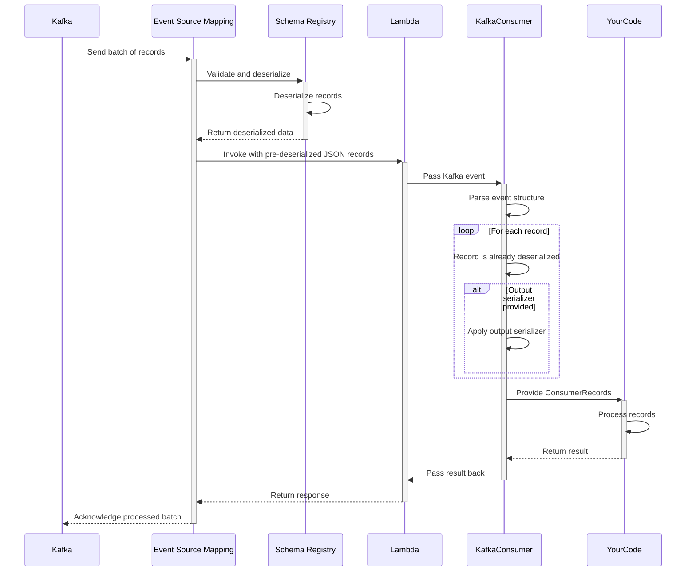
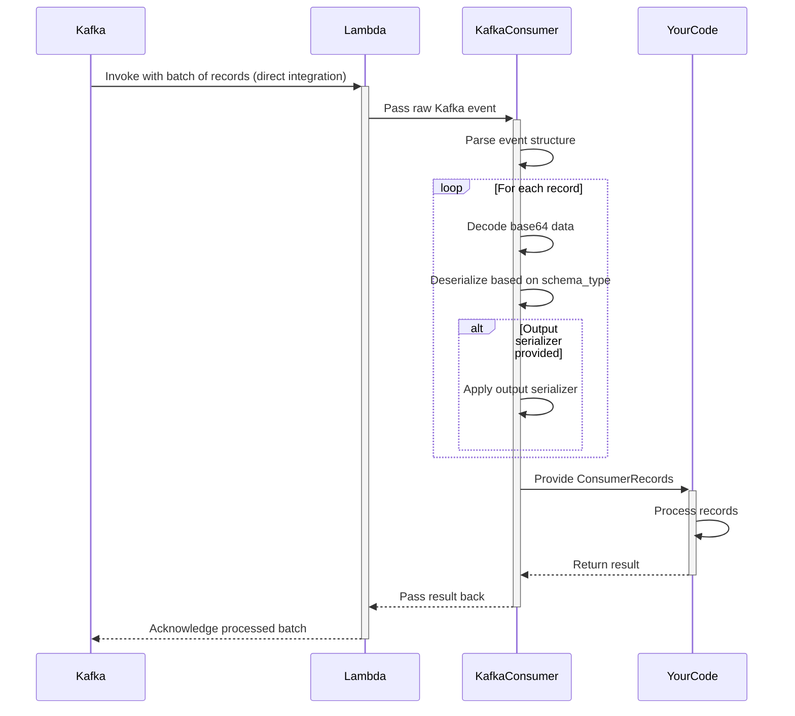

<!-- markdownlint-disable MD043 -->

The Kafka Consumer utility transparently handles message deserialization, provides an intuitive developer experience, and integrates seamlessly with the rest of the Powertools for AWS Lambda ecosystem.



## Key features

* Automatic deserialization of Kafka messages (JSON, Avro, and Protocol Buffers)
* Simplified event record handling with intuitive interface
* Support for key and value deserialization
* Support for custom output serializers (e.g., dataclasses, Pydantic models)
* Support for ESM with and without Schema Registry integration
* Support for offline Avro schemas with schema-registry wire-format prefixes
* Proper error handling for deserialization issues

## Terminology

**Event Source Mapping (ESM)**  A Lambda feature that reads from streaming sources (like Kafka) and invokes your Lambda function. It manages polling, batching, and error handling automatically, eliminating the need for consumer management code.

**Record Key and Value** A Kafka messages contain two important parts: an optional key that determines the partition and a value containing the actual message data. Both are base64-encoded in Lambda events and can be independently deserialized.

**Deserialization** Is the process of converting binary data (base64-encoded in Lambda events) into usable Python objects according to a specific format like JSON, Avro, or Protocol Buffers. Powertools handles this conversion automatically.

**SchemaConfig class** Contains parameters that tell Powertools how to interpret message data, including the format type (JSON, Avro, Protocol Buffers) and optional schema definitions needed for binary formats.

**Output Serializer** A Pydantic model, Python dataclass, or any custom function that helps structure data for your business logic.

**Schema Registry** Is a centralized service that stores and validates schemas, ensuring producers and consumers maintain compatibility when message formats evolve over time.

## Moving from traditional Kafka consumers

Lambda processes Kafka messages as discrete events rather than continuous streams, requiring a different approach to consumer development that Powertools for AWS helps standardize.

| Aspect | Traditional Kafka Consumers | Lambda Kafka Consumer |
| ------ | --------------------------- | --------------------- |
| **Model** | Pull-based (you poll for messages) | Push-based (Lambda invoked with messages) |
| **Scaling** | Manual scaling configuration | Automatic scaling to partition count |
| **State** | Long-running application with state | Stateless, ephemeral executions |
| **Offsets** | Manual offset management | Automatic offset commitment |
| **Schema Validation** | Client-side schema validation | Optional Schema Registry integration with Event Source Mapping |
| **Error Handling** | Per-message retry control | Batch-level retry policies |

## Getting started

### Installation

Install the Powertools for AWS Lambda package with the appropriate extras for your use case:

=== "JSON"
	```bash
	pip install aws-lambda-powertools
	```

=== "Avro"
	```bash
	pip install 'aws-lambda-powertools[kafka-consumer-avro]'
	```

=== "Protobuf"
	```bash
	pip install 'aws-lambda-powertools[kafka-consumer-protobuf]'
	```

### Required resources

To use the Kafka consumer utility, you need an AWS Lambda function configured with a Kafka event source. This can be Amazon MSK, MSK Serverless, or a self-hosted Kafka cluster.

=== "getting_started_with_msk.yaml"

    ```yaml
    --8<-- "examples/kafka/consumer/sam/getting_started_with_msk.yaml"
    ```

### Using ESM with Schema Registry

The Event Source Mapping configuration determines which mode is used. With `JSON`, Lambda converts all messages to JSON before invoking your function. With `SOURCE` mode, Lambda preserves the original format, requiring you function to handle the appropriate deserialization.

Powertools for AWS supports both Schema Registry integration modes in your Event Source Mapping configuration.

For simplicity, we will use a simple schema containing `name` and `age` in all our examples. You can also copy the payload example with the expected Kafka event to test your code.

=== "JSON"
	```json
    --8<-- "examples/kafka/consumer/schemas/user.json"
    ```

=== "Payload JSON"
	```json
    --8<-- "examples/kafka/consumer/events/kafka_event_json.json"
    ```

=== "Avro Schema"
	```json
    --8<-- "examples/kafka/consumer/schemas/user.avsc"
    ```

=== "Payload AVRO"
	```json
    --8<-- "examples/kafka/consumer/events/kafka_event_avro.json"
    ```

=== "Protobuf Schema"
	```protobuf
    --8<-- "examples/kafka/consumer/schemas/user.proto"
    ```

=== "Payload Protobuf"
	```json
    --8<-- "examples/kafka/consumer/events/kafka_event_protobuf.json"
    ```

### Processing Kafka events

The Kafka consumer utility transforms raw Lambda Kafka events into an intuitive format for processing. To handle messages effectively, you'll need to configure a schema that matches your data format.

???+ tip "Using Avro is recommended"
    We recommend Avro for production Kafka implementations due to its schema evolution capabilities, compact binary format, and integration with Schema Registry. This offers better type safety and forward/backward compatibility compared to JSON.

=== "Avro Messages"

    ```python  hl_lines="2 21-24 27"
    --8<-- "examples/kafka/consumer/src/getting_started_with_avro.py"
    ```

=== "Protocol Buffers"

    ```python  hl_lines="2 6 11-14 17"
    --8<-- "examples/kafka/consumer/src/getting_started_with_protobuf.py"
    ```

=== "JSON Messages"

    ```python  hl_lines="2 8 11"
    --8<-- "examples/kafka/consumer/src/getting_started_with_json.py"
    ```

### Deserializing key and value

The `@kafka_consumer` decorator can deserialize both key and value fields independently based on your schema configuration. This flexibility allows you to work with different data formats in the same message.

=== "Key and Value Deserialization"

    ```python hl_lines="2 31-36 39"
    --8<-- "examples/kafka/consumer/src/working_with_key_and_value.py"
    ```

=== "Key-only Deserialization"

    ```python hl_lines="2 19-22 25"
    --8<-- "examples/kafka/consumer/src/working_with_key_only.py"
    ```

=== "Value-only Deserialization"

    ```python hl_lines="2 21-24 27"
    --8<-- "examples/kafka/consumer/src/working_with_value_only.py"
    ```

### Handling primitive types

When working with primitive data types (strings, integers, etc.) rather than structured objects, you can simplify your configuration by omitting the schema specification for that component. Powertools for AWS will deserialize the value always as a string.

???+ tip "Common pattern: Keys with primitive values"
    Using primitive types (strings, integers) as Kafka message keys is a common pattern for partitioning and identifying messages. Powertools automatically handles these primitive keys without requiring special configuration, making it easy to implement this popular design pattern.

=== "Primitive key"

    ```python hl_lines="2 8 11"
    --8<-- "examples/kafka/consumer/src/working_with_primitive_key.py"
    ```

=== "Primitive key and value"

    ```python hl_lines="2 8"
    --8<-- "examples/kafka/consumer/src/working_with_primitive_key_and_value.py"
    ```

### Message format support and comparison

The Kafka consumer utility supports multiple serialization formats to match your existing Kafka implementation. Choose the format that best suits your needs based on performance, schema evolution requirements, and ecosystem compatibility.

???+ tip "Selecting the right format"
    For new applications, consider Avro or Protocol Buffers over JSON. Both provide schema validation, evolution support, and significantly better performance with smaller message sizes. Avro is particularly well-suited for Kafka due to its built-in schema evolution capabilities.

=== "Supported Formats"

    | Format | Schema Type | Description | Required Parameters |
    |--------|-------------|-------------|---------------------|
    | **JSON** | `"JSON"` | Human-readable text format | None |
    | **Avro** | `"AVRO"` | Compact binary format with schema | `value_schema` (Avro schema string) |
    | **Protocol Buffers** | `"PROTOBUF"` | Efficient binary format | `value_schema` (Proto message class) |

=== "Format Comparison"

    | Feature | JSON | Avro | Protocol Buffers |
    |---------|------|------|-----------------|
    | **Schema Definition** | Optional | Required JSON schema | Required .proto file |
    | **Schema Evolution** | None | Strong support | Strong support |
    | **Size Efficiency** | Low | High | Highest |
    | **Processing Speed** | Slower | Fast | Fastest |
    | **Human Readability** | High | Low | Low |
    | **Implementation Complexity** | Low | Medium | Medium |
    | **Additional Dependencies** | None | `avro` package | `protobuf` package |

Choose the serialization format that best fits your needs:

* **JSON**: Best for simplicity and when schema flexibility is important
* **Avro**: Best for systems with evolving schemas and when compatibility is critical
* **Protocol Buffers**: Best for performance-critical systems with structured data

## Advanced

### Accessing record metadata

Each Kafka record contains important metadata that you can access alongside the deserialized message content. This metadata helps with message processing, troubleshooting, and implementing advanced patterns like exactly-once processing.

=== "Accessing record metadata"

    ```python hl_lines="2 27 30"
    --8<-- "examples/kafka/consumer/src/access_event_metadata.py"
    ```

#### Available metadata properties

| Property | Description | Example Use Case |
| -------- | ----------- | ---------------- |
| `topic` | Topic name the record was published to | Routing logic in multi-topic consumers |
| `partition` | Kafka partition number | Tracking message distribution |
| `offset` | Position in the partition | De-duplication, exactly-once processing |
| `timestamp` | Unix timestamp when record was created | Event timing analysis |
| `timestamp_type` | Timestamp type (CREATE_TIME or LOG_APPEND_TIME) | Data lineage verification |
| `headers` | Key-value pairs attached to the message | Cross-cutting concerns like correlation IDs |
| `key` | Deserialized message key | Customer ID or entity identifier |
| `value` | Deserialized message content | The actual business data |
| `original_value` | Base64-encoded original message value | Debugging or custom deserialization |
| `original_key` | Base64-encoded original message key | Debugging or custom deserialization |
| `value_schema_metadata` | Metadata about the value schema like `schemaId` and `dataFormat` | Data format and schemaId propagated when integrating with Schema Registry |
| `key_schema_metadata` | Metadata about the key schema like `schemaId` and `dataFormat` | Data format and schemaId propagated when integrating with Schema Registry |

### Using an offline Avro schema with a schema-registry wire-format prefix

When your Kafka producer serializes messages with a schema-registry-aware Avro serializer (e.g. Confluent's `KafkaAvroSerializer` or the AWS Glue Avro serializer), each payload carries a short wire-format prefix in front of the Avro body:

* **Confluent**: `1-byte magic byte (0x00) + 4-byte big-endian schema ID` — 5 bytes total.
* **AWS Glue**: `1-byte header version + 1-byte compression + 16-byte UUID schema-version ID` — 18 bytes total.

When you enable the ESM Schema Registry integration, Lambda strips those bytes for you and populates `value_schema_metadata.schemaId`. But when you rely on an **offline Avro schema** (checked into your Lambda) and do **not** use the ESM Schema Registry integration, those prefix bytes reach your function and would otherwise corrupt Avro deserialization.

Use `value_schema_id_prefix_length` (and/or `key_schema_id_prefix_length`) on `SchemaConfig` to tell Powertools how many leading bytes to skip after base64 decoding, before running the Avro decoder.

???+ info "When do I need this?"
    Only when you are supplying the Avro schema yourself **and** the producer prepended a schema-registry wire-format wrapper. If the ESM Schema Registry integration is on, leave these parameters at their default (`0`).

=== "Offline Avro schema with a Confluent-style prefix"

    ```python hl_lines="10"
    from aws_lambda_powertools.utilities.kafka import SchemaConfig, kafka_consumer
    from aws_lambda_powertools.utilities.kafka.consumer_records import ConsumerRecords
    from aws_lambda_powertools.utilities.typing import LambdaContext

    AVRO_SCHEMA = open("user.avsc").read()

    schema_config = SchemaConfig(
        value_schema_type="AVRO",
        value_schema=AVRO_SCHEMA,
        value_schema_id_prefix_length=5,  # 1-byte magic byte + 4-byte schema ID
    )


    @kafka_consumer(schema_config=schema_config)
    def lambda_handler(event: ConsumerRecords, context: LambdaContext):
        for record in event.records:
            # record.value is the fully-deserialized Avro payload
            # with the 5-byte wire-format prefix transparently stripped.
            ...
    ```

The offset is applied symmetrically for keys — set `key_schema_id_prefix_length` when a schema-registry-aware serializer was used for record keys too.

???+ warning "Scope"
    `value_schema_id_prefix_length` / `key_schema_id_prefix_length` only affect the **Avro** deserializer. Protobuf already infers the wire-format from `value_schema_metadata.schemaId` when the ESM Schema Registry integration is on, and JSON-with-registry is not supported today.

### Custom output serializers

Transform deserialized data into your preferred object types using output serializers. This can help you integrate Kafka data with your domain models and application architecture, providing type hints, validation, and structured data access.

???+ tip "Choosing the right output serializer"
    - **Pydantic models** offer robust data validation at runtime and excellent IDE support
    - **Dataclasses** provide lightweight type hints with better performance than Pydantic
    - **Custom functions** give complete flexibility for complex transformations and business logic

=== "Pydantic models"

    ```python hl_lines="1 10-13 17 24"
    --8<-- "examples/kafka/consumer/src/serializing_output_with_pydantic.py"
    ```

=== "Dataclasses"

    ```python hl_lines="1 10-14 18 25"
    --8<-- "examples/kafka/consumer/src/serializing_output_with_dataclass.py"
    ```

=== "Custom function"

    ```python hl_lines="8-11 15"
    --8<-- "examples/kafka/consumer/src/serializing_output_with_custom_function.py"
    ```

### Error handling

Handle errors gracefully when processing Kafka messages to ensure your application maintains resilience and provides clear diagnostic information. The Kafka consumer utility provides specific exception types to help you identify and handle deserialization issues effectively.

!!! info
    Fields like `value`, `key`, and `headers` are decoded lazily, meaning they are only deserialized when accessed. This allows you to handle deserialization errors at the point of access rather than when the record is first processed.

=== "Basic Error Handling"

    ```python hl_lines="3 28"
    --8<-- "examples/kafka/consumer/src/working_with_record_error_handling.py"
    ```

=== "Handling Schema Errors"

    ```python hl_lines="4-7 36 42"
    --8<-- "examples/kafka/consumer/src/working_with_schema_errors.py"
    ```

#### Exception types

| Exception | Description | Common Causes |
| --------- | ----------- | ------------- |
| `KafkaConsumerDeserializationError` | Raised when message deserialization fails | Corrupted message data, schema mismatch, or wrong schema type configuration |
| `KafkaConsumerAvroSchemaParserError` | Raised when parsing Avro schema definition fails | Syntax errors in schema JSON, invalid field types, or malformed schema |
| `KafkaConsumerMissingSchemaError` | Raised when a required schema is not provided | Missing schema for AVRO or PROTOBUF formats (required parameter) |
| `KafkaConsumerOutputSerializerError` | Raised when output serializer fails | Error in custom serializer function, incompatible data, or validation failures in Pydantic models |
| `KafkaConsumerDeserializationFormatMismatch` | Raised when SchemaConfig format is wrong | When integrating with Schema Registry, the data format is propagated, so Powertools for AWS catches this error if the format is different from the configured one. |

### Integrating with Idempotency

When processing Kafka messages in Lambda, failed batches can result in message reprocessing. The [idempotency utility](idempotency.md){target="_blank"} prevents duplicate processing by tracking which messages have already been handled, ensuring each message is processed exactly once.

The [idempotency utility](idempotency.md){target="_blank"} automatically stores the result of each successful operation, returning the cached result if the same message is processed again, which prevents potentially harmful duplicate operations like double-charging customers or double-counting metrics.

=== "Idempotent Kafka Processing"

    ```python hl_lines="2 7 9 39-42"
    --8<-- "examples/kafka/consumer/src/working_with_idempotency.py"
    ```

TIP: By using the Kafka record's unique coordinates (topic, partition, offset) as the idempotency key, you ensure that even if a batch fails and Lambda retries the messages, each message will be processed exactly once.

### Handling partial batch failures

When processing Kafka messages, individual records may fail while others succeed. By default, Lambda retries the entire batch when any record fails. To retry only the failed records, use the [Batch Processing utility](batch.md#processing-messages-from-kafka){target="_blank"} with `EventType.Kafka`.

This feature allows Lambda to checkpoint successful records and only retry the failed ones, significantly improving processing efficiency and reducing duplicate processing.

=== "Kafka with Batch Processing"

    ```python hl_lines="2-6 12 18-19 27"
    --8<-- "examples/batch_processing/src/getting_started_kafka.py"
    ```

!!! note "Using with deserialization"
    The Batch Processing utility uses the basic `KafkaEventRecord` data class. For advanced deserialization (Avro, Protobuf), you can use the Kafka Consumer's deserialization utilities inside your record handler function.

### Best practices

#### Handling large messages

When processing large Kafka messages in Lambda, be mindful of memory limitations. Although the Kafka consumer utility optimizes memory usage, large deserialized messages can still exhaust Lambda's resources.

=== "Handling Large Messages"

    ```python
    --8<-- "examples/kafka/consumer/src/working_with_large_messages.py"
    ```

For large messages, consider these proven approaches:

* **Store the data**: use Amazon S3 and include only the S3 reference in your Kafka message
* **Split large payloads**: use multiple smaller messages with sequence identifiers
* **Increase memory** Increase your Lambda function's memory allocation, which also increases CPU capacity

#### Batch size configuration

The number of Kafka records processed per Lambda invocation is controlled by your Event Source Mapping configuration. Properly sized batches optimize cost and performance.

=== "Batch size configuration"
    ```yaml
    --8<-- "examples/kafka/consumer/sam/adjust_batch_size_configuration.yaml"
    ```

Different workloads benefit from different batch configurations:

* **High-volume, simple processing**: Use larger batches (100-500 records) with short timeout
* **Complex processing with database operations**: Use smaller batches (10-50 records)
* **Mixed message sizes**: Set appropriate batching window (1-5 seconds) to handle variability

#### Cross-language compatibility

When using binary serialization formats across multiple programming languages, ensure consistent schema handling to prevent deserialization failures.

=== "Using Java naming convention"

    ```python hl_lines="25-31"
    --8<-- "examples/kafka/consumer/src/using_java_naming_convention.py"
    ```

Common cross-language challenges to address:

* **Field naming conventions**: camelCase in Java vs snake_case in Python
* **Date/time**: representation differences
* **Numeric precision handling**: especially decimals

### Troubleshooting common errors

### Troubleshooting

#### Deserialization failures

When encountering deserialization errors with your Kafka messages, follow this systematic troubleshooting approach to identify and resolve the root cause.

First, check that your schema definition exactly matches the message format. Even minor discrepancies can cause deserialization failures, especially with binary formats like Avro and Protocol Buffers.

For binary messages that fail to deserialize, examine the raw encoded data:

```python
# DO NOT include this code in production handlers
# For troubleshooting purposes only
import base64

raw_bytes = base64.b64decode(record.original_value)
print(f"Message size: {len(raw_bytes)} bytes")
print(f"First 50 bytes (hex): {raw_bytes[:50].hex()}")
```

#### Schema compatibility issues

Schema compatibility issues often manifest as successful connections but failed deserialization. Common causes include:

* **Schema evolution without backward compatibility**: New producer schema is incompatible with consumer schema
* **Field type mismatches**: For example, a field changed from string to integer across systems
* **Missing required fields**: Fields required by the consumer schema but absent in the message
* **Default value discrepancies**: Different handling of default values between languages

When using Schema Registry, verify schema compatibility rules are properly configured for your topics and that all applications use the same registry.

#### Memory and timeout optimization

Lambda functions processing Kafka messages may encounter resource constraints, particularly with large batches or complex processing logic.

For memory errors:

* Increase Lambda memory allocation, which also provides more CPU resources
* Process fewer records per batch by adjusting the `BatchSize` parameter in your event source mapping
* Consider optimizing your message format to reduce memory footprint

For timeout issues:

* Extend your Lambda function timeout setting to accommodate processing time
* Implement chunked or asynchronous processing patterns for time-consuming operations
* Monitor and optimize database operations, external API calls, or other I/O operations in your handler

???+ tip "Monitoring memory usage"
    Use CloudWatch metrics to track your function's memory utilization. If it consistently exceeds 80% of allocated memory, consider increasing the memory allocation or optimizing your code.

## Kafka consumer workflow

### Using ESM with Schema Registry validation (SOURCE)

<center>

</center>

### Using ESM with Schema Registry deserialization (JSON)

<center>

</center>

### Using ESM without Schema Registry integration

<center>

</center>

## Testing your code

Testing Kafka consumer functions is straightforward with pytest. You can create simple test fixtures that simulate Kafka events without needing a real Kafka cluster.

=== "Testing your code"

    ```python
    --8<-- "examples/kafka/consumer/src/testing_your_code.py"
    ```

=== "Lambda handler"

    ```python
    --8<-- "examples/kafka/consumer/src/lambda_handler_test.py"
    ```
