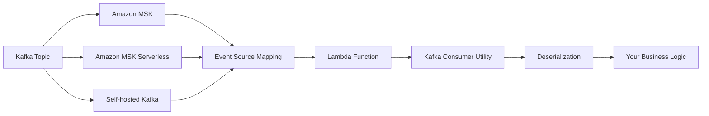
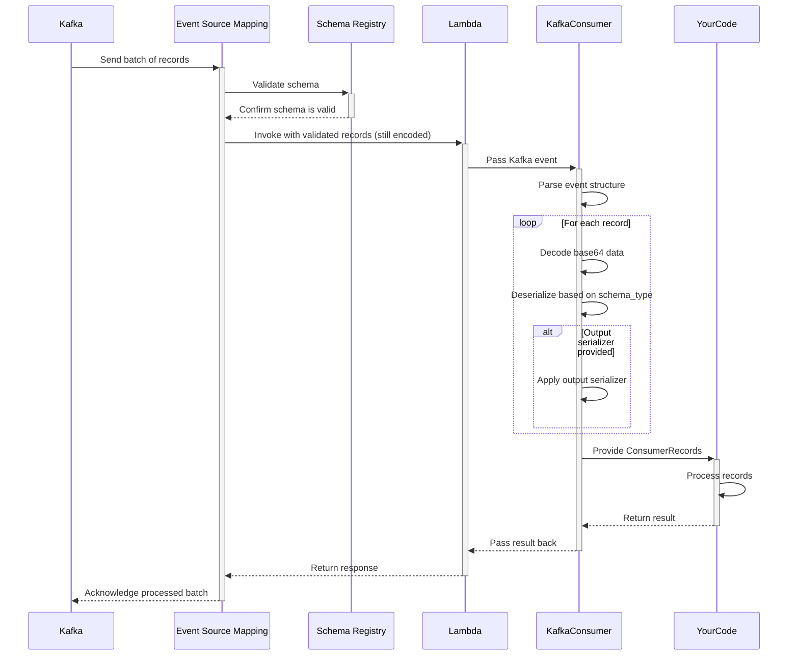
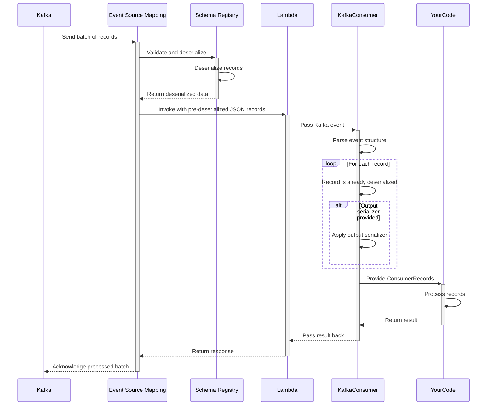
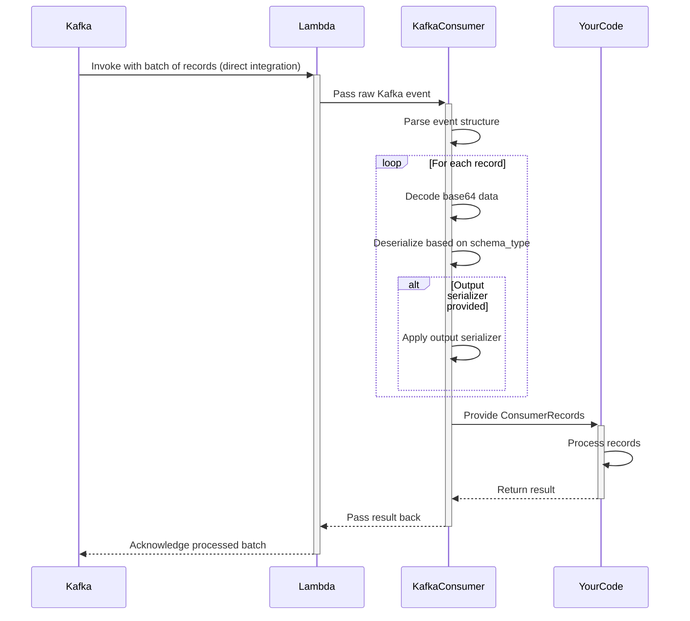

<!-- markdownlint-disable MD043 -->

The Kafka Consumer utility transparently handles message deserialization, provides an intuitive developer experience, and integrates seamlessly with the rest of the Powertools for AWS Lambda ecosystem.



## Key Features

* Automatic deserialization of Kafka messages (JSON, Avro, and Protocol Buffers)
* Simplified event record handling with intuitive interface
* Support for key and value deserialization
* Support for custom output serializers (e.g., dataclasses, Pydantic models)
* Support for ESM with and without Schema Registry integration
* Proper error handling for deserialization issues

## Moving from traditional Kafka consumers

Lambda processes Kafka messages as discrete events rather than continuous streams, requiring a different approach to consumer development that Powertools for AWS helps standardize.

| Aspect | Traditional Kafka Consumers | Lambda Kafka Consumer |
|--------|----------------------------|----------------------|
| **Model** | Pull-based (you poll for messages) | Push-based (Lambda invoked with messages) |
| **Scaling** | Manual scaling configuration | Automatic scaling to partition count |
| **State** | Long-running application with state | Stateless, ephemeral executions |
| **Offsets** | Manual offset management | Automatic offset commitment |
| **Schema Validation** | Client-side schema validation | Optional Schema Registry integration with Event Source Mapping |
| **Error Handling** | Per-message retry control | Batch-level retry policies |

## Getting started

### Using ESM integration with SOURCE

TBD - PLACEHOLDER

### Installation

Install the Powertools for AWS Lambda package with the appropriate extras for your use case:

```bash
# Basic installation
pip install aws-lambda-powertools

# For Avro support
pip install 'aws-lambda-powertools[kafka-consumer-avro]'

# For Protocol Buffers support
pip install 'aws-lambda-powertools[kafka-consumer-protobuf]'
```

### Required resources

To use the Kafka consumer utility, you need an AWS Lambda function configured with a Kafka event source. This can be Amazon MSK, MSK Serverless, or a self-hosted Kafka cluster.

=== "getting_started_with_msk.yaml"

    ```yaml
    AWSTemplateFormatVersion: '2010-09-09'
    Transform: AWS::Serverless-2016-10-31
    Resources:
      KafkaConsumerFunction:
        Type: AWS::Serverless::Function
        Properties:
          Handler: app.lambda_handler
          Runtime: python3.9
          Timeout: 30
          Events:
            MSKEvent:
              Type: MSK
              Properties:
                StartingPosition: LATEST
                Stream: !GetAtt MyMSKCluster.Arn
                Topics:
                  - my-topic-1
                  - my-topic-2
          Policies:
            - AWSLambdaMSKExecutionRole
    ```

### Processing a Kafka event

The Kafka consumer utility transforms the Lambda Kafka event into an easier-to-use format. The `kafka_consumer` decorator will automatically deserialize your Kafka records based on the schema config you provide.

=== "processing_json_messages.py"

    ```python
    from aws_lambda_powertools.utilities.kafka_consumer.kafka_consumer import kafka_consumer
    from aws_lambda_powertools.utilities.kafka_consumer.consumer_records import ConsumerRecords

    # Process JSON messages (default)
    @kafka_consumer()
    def lambda_handler(event: ConsumerRecords, context):
        for record in event.records:
            # Access the deserialized data
            message = record.value
            print(f"Name: {message.get('name')}")
            print(f"Age: {message.get('age')}")

        return {"statusCode": 200}
    ```

### Using schema configuration

The `SchemaConfig` class allows you to specify how your messages should be deserialized.

=== "processing_avro_messages.py"

    ```python
    from aws_lambda_powertools.utilities.kafka_consumer.kafka_consumer import kafka_consumer
    from aws_lambda_powertools.utilities.kafka_consumer.consumer_records import ConsumerRecords
    from aws_lambda_powertools.utilities.kafka_consumer.schema_config import SchemaConfig
    from dataclasses import dataclass

    # Define the Avro schema
    value_schema_str = """
    {
        "type": "record",
        "name": "User",
        "namespace": "com.example",
        "fields": [
            {"name": "name", "type": "string"},
            {"name": "age", "type": "int"}
        ]
    }
    """

    # Define an output dataclass
    @dataclass
    class UserProfile:
        name: str
        age: int

    # Configure schema with output serializer
    schema_config = SchemaConfig(
        value_schema_type="AVRO",
        value_schema=value_schema_str,
        value_output_serializer=UserProfile
    )

    @kafka_consumer(schema_config=schema_config)
    def lambda_handler(event: ConsumerRecords, context):
        for record in event.records:
            user = record.value  # This is now a UserProfile instance
            print(f"Name: {user.name}")
            print(f"Age: {user.age}")

        return {"statusCode": 200}
    ```

### Supported formats and schemas

The Kafka consumer utility supports three main types of message formats:

| Format | Schema Type | Description | Required Parameters |
|--------|-------------|-------------|---------------------|
| **JSON** | `"JSON"` | Deserializes JSON messages | None |
| **Avro** | `"AVRO"` | Deserializes Apache Avro binary messages | `value_schema` (Avro schema string) |
| **Protocol Buffers** | `"PROTOBUF"` | Deserializes Protocol Buffers binary messages | `value_schema` (Proto message class) |

### Comparison of serialization formats

| Feature | JSON | Avro | Protocol Buffers |
|---------|------|------|-----------------|
| **Schema Definition** | No formal schema | JSON schema | .proto file |
| **Schema Evolution** | None | Strong support | Strong support |
| **Size Efficiency** | Low | High | High |
| **Processing Speed** | Slower | Fast | Fastest |
| **Human Readability** | High | Low | Low |
| **Implementation Complexity** | Low | Medium | Medium |
| **Additional Dependencies** | None | `avro` package | `protobuf` package |

Choose the serialization format that best fits your needs:

* **JSON**: Best for simplicity and when schema flexibility is important
* **Avro**: Best for systems with evolving schemas and when compatibility is critical
* **Protocol Buffers**: Best for performance-critical systems with structured data

## Advanced

### Accessing record metadata

Each Kafka record contains metadata that can be accessed alongside the deserialized value:

```python
@kafka_consumer()
def lambda_handler(event: ConsumerRecords, context):
    for record in event.records:
        print(f"Topic: {record.topic}")
        print(f"Partition: {record.partition}")
        print(f"Offset: {record.offset}")
        print(f"Timestamp: {record.timestamp}")
        print(f"Timestamp Type: {record.timestamp_type}")
        print(f"Headers: {record.headers}")

        # Deserialized value
        print(f"Value: {record.value}")

        # Access base64-encoded raw value if needed
        print(f"Raw value: {record.raw_value}")
```

### Handling record keys

You can deserialize both the key and value of a Kafka record by configuring schemas for both:

```python
from aws_lambda_powertools.utilities.kafka_consumer.kafka_consumer import kafka_consumer
from aws_lambda_powertools.utilities.kafka_consumer.consumer_records import ConsumerRecords
from aws_lambda_powertools.utilities.kafka_consumer.schema_config import SchemaConfig
from dataclasses import dataclass

@dataclass
class UserKey:
    user_id: str

@dataclass
class UserValue:
    name: str
    age: int

# Configure schema for both key and value
schema_config = SchemaConfig(
    # Key configuration
    key_schema_type="JSON",
    key_output_serializer=UserKey,

    # Value configuration
    value_schema_type="JSON",
    value_output_serializer=UserValue
)

@kafka_consumer(schema_config=schema_config)
def lambda_handler(event: ConsumerRecords, context):
    for record in event.records:
        key = record.key      # UserKey instance
        value = record.value  # UserValue instance

        print(f"User ID: {key.user_id}")
        print(f"Name: {value.name}")
        print(f"Age: {value.age}")
```

### Using Protocol Buffers

Protocol Buffers require the generated message classes to be provided:

```python
from aws_lambda_powertools.utilities.kafka_consumer.kafka_consumer import kafka_consumer
from aws_lambda_powertools.utilities.kafka_consumer.consumer_records import ConsumerRecords
from aws_lambda_powertools.utilities.kafka_consumer.schema_config import SchemaConfig

# Import generated protobuf classes
from user_pb2 import User

schema_config = SchemaConfig(
    value_schema_type="PROTOBUF",
    value_schema=User,  # Provide the protobuf message class
)

@kafka_consumer(schema_config=schema_config)
def lambda_handler(event: ConsumerRecords, context):
    for record in event.records:
        user = record.value  # This is a dict representation of the protobuf message
        print(f"Name: {user['name']}")
        print(f"Age: {user['age']}")
```

### Custom output serializers

You can provide custom output serializers to transform deserialized data into any format you need:

```python
class CustomUserObject:
    def __init__(self, data):
        self.full_name = f"{data['name']}"
        self.user_age = data['age']
        self.is_adult = data['age'] >= 18

schema_config = SchemaConfig(
    value_schema_type="JSON",
    value_output_serializer=lambda data: CustomUserObject(data)
)

@kafka_consumer(schema_config=schema_config)
def lambda_handler(event: ConsumerRecords, context):
    for record in event.records:
        user = record.value  # This is now a CustomUserObject
        print(f"Full name: {user.full_name}")
        print(f"Is adult: {user.is_adult}")
```

### Error handling

The Kafka consumer utility provides clear error messages when deserialization fails:

```python
from aws_lambda_powertools.utilities.kafka_consumer.exceptions import KafkaConsumerDeserializationError

@kafka_consumer(schema_config=schema_config)
def lambda_handler(event: ConsumerRecords, context):
    try:
        for record in event.records:
            process_record(record.value)
    except KafkaConsumerDeserializationError as e:
        print(f"Failed to deserialize message: {e}")
        # Handle deserialization error
```

#### Exception types

| Exception | Scenario |
|-----------|----------|
| `KafkaConsumerDeserializationError` | Raised when message deserialization fails |
| `KafkaConsumerAvroSchemaParserError` | Raised when the Avro schema is invalid |

### Integrating with Idempotency

Kafka consumer works seamlessly with other Powertools utilities:

```python
from aws_lambda_powertools import Logger, Tracer, Metrics
from aws_lambda_powertools.metrics import MetricUnit
from aws_lambda_powertools.utilities.kafka_consumer.kafka_consumer import kafka_consumer
from aws_lambda_powertools.utilities.kafka_consumer.consumer_records import ConsumerRecords
from aws_lambda_powertools.utilities.kafka_consumer.schema_config import SchemaConfig

logger = Logger()
tracer = Tracer()
metrics = Metrics()

schema_config = SchemaConfig(value_schema_type="JSON")

@tracer.capture_lambda_handler
@metrics.log_metrics
@kafka_consumer(schema_config=schema_config)
def lambda_handler(event: ConsumerRecords, context):
    for record in event.records:
        logger.info(f"Processing record from topic {record.topic}")

        with tracer.capture_method("process_record"):
            process_message(record.value)

        metrics.add_metric(name="RecordsProcessed", unit=MetricUnit.Count, value=1)

    return {"processed": metrics.get_metric_values()["RecordsProcessed"]["Count"]}
```

### Best Practices

#### Large messages

When processing large Kafka messages, be mindful of Lambda's memory configuration. Although the Kafka consumer utility aims to minimize memory usage, deserialized messages still need to fit into memory.

For JSON, Avro, or Protocol Buffers messages over 10MB, consider:

1. Splitting large messages into smaller chunks
2. Storing large data in Amazon S3 and using Kafka to send references
3. Increasing Lambda memory configuration

#### Batch size configuration

The number of records processed per Lambda invocation is determined by the Kafka event source mapping configuration. Configure the `BatchSize` parameter appropriately to balance throughput with processing time:

```yaml
KafkaEventSourceMapping:
  Type: AWS::Lambda::EventSourceMapping
  Properties:
    FunctionName: !GetAtt KafkaConsumerFunction.Arn
    BatchSize: 100  # Adjust based on your needs
    StartingPosition: LATEST
    EventSourceArn: !GetAtt MSKCluster.Arn
    Topics:
      - my-topic
```

#### Cross-Language Compatibility

When using Avro or Protocol Buffers, ensure that schemas are consistent across all producers and consumers. Common issues include:

* Schema evolution compatibility
* Field name case sensitivity (particularly important for Protocol Buffers)
* Default value handling across different languages

### Troubleshooting common errors

#### Deserialization fails

If you encounter `KafkaConsumerDeserializationError`:

1. **Check schema definition**: Ensure it matches the format of your messages
2. **Examine raw message**: Use `print(record.raw_value)` to see the base64-encoded message
3. **Verify message format**: Confirm the message was properly serialized by the producer

Example debug approach:

```python
@kafka_consumer()
def lambda_handler(event: ConsumerRecords, context):
    try:
        for record in event.records:
            process_record(record.value)
    except Exception:
        # Print raw data for diagnostics
        for record in event.raw_records:
            try:
                # Try to decode base64 to see raw bytes
                import base64
                raw_bytes = base64.b64decode(record.get("value", ""))
                print(f"Raw bytes (hex): {raw_bytes.hex()}")
                # Try to decode as utf-8 string if possible
                try:
                    print(f"As string: {raw_bytes.decode('utf-8')}")
                except UnicodeDecodeError:
                    pass
            except Exception as e:
                print(f"Error examining raw record: {e}")
        raise
```

#### Schema compatibility issues

If messages are properly formatted but deserialization still fails:

1. **Check schema versions**: Ensure producer and consumer use compatible schemas
2. **Validate default values**: Some serialization formats require default values for backward compatibility

#### Memory or timeout errors

If you encounter Lambda memory errors or timeouts:

1. **Increase Lambda memory**: Higher memory also allocates more CPU
2. **Reduce batch size**: Configure smaller batches in event source mapping
3. **Optimize processing**: Consider parallel processing patterns for large batches

## Kafka consumer workflow

### Using ESM with Schema Registry validation (SOURCE)

<center>

</center>

### Using ESM with Schema Registry deserialization (JSON)

<center>

</center>

### Using ESM without Schema Registry integration

<center>

</center>

## Testing your code

You can easily test functions that use the Kafka consumer by creating a sample Kafka event:

```python
import base64
import json

def test_kafka_consumer_handler():
    # Create a test message
    test_data = {"name": "John Doe", "age": 30}
    encoded_data = base64.b64encode(json.dumps(test_data).encode("utf-8")).decode("utf-8")

    # Create a test Kafka event
    test_event = {
        "eventSource": "aws:kafka",
        "records": {
            "my-topic-1": [
                {
                    "topic": "my-topic-1",
                    "partition": 0,
                    "offset": 15,
                    "timestamp": 1545084650987,
                    "timestampType": "CREATE_TIME",
                    "key": None,
                    "value": encoded_data,
                }
            ]
        }
    }

    # Call your handler
    response = lambda_handler(test_event, {})

    # Assert the response
    assert response["statusCode"] == 200
```
