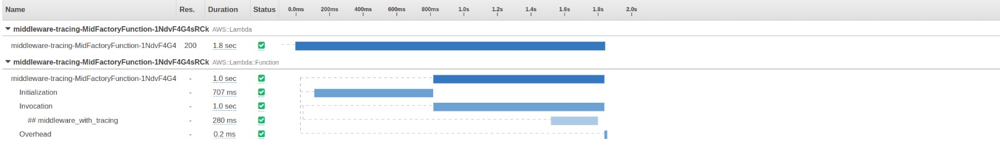

<!-- markdownlint-disable MD043 -->

Middleware factory provides a decorator factory to create your own middleware to run logic before, and after each Lambda invocation synchronously.

## Key features

* Run logic before, after, and handle exceptions
* Built-in tracing opt-in capability

## Getting started

???+ tip
    All examples shared in this documentation are available within the [project repository](https://github.com/aws-powertools/powertools-lambda-python/tree/develop/examples){target="_blank"}.

You might need a custom middleware to abstract non-functional code. These are often custom authorization or any reusable logic you might need to run before/after a Lambda function invocation.

### Middleware with no params

You can create your own middleware using `lambda_handler_decorator`. The decorator factory expects 3 arguments in your function signature:

* **handler** - Lambda function handler
* **event** - Lambda function invocation event
* **context** - Lambda function context object

### Middleware with before logic

=== "getting_started_middleware_before_logic_function.py"
    ```python hl_lines="5 26 27 32 33 35 40 41"
    --8<-- "examples/middleware_factory/src/getting_started_middleware_before_logic_function.py"
    ```

=== "getting_started_middleware_before_logic_payload.json"

    ```json hl_lines="9-13"
    --8<-- "examples/middleware_factory/src/getting_started_middleware_before_logic_payload.json"
    ```

### Middleware with after logic

=== "getting_started_middleware_after_logic_function.py"
    ```python hl_lines="7 14 15 21-23 37"
    --8<-- "examples/middleware_factory/src/getting_started_middleware_after_logic_function.py"
    ```

=== "getting_started_middleware_after_logic_payload.json"

    ```json
    --8<-- "examples/middleware_factory/src/getting_started_middleware_after_logic_payload.json"
    ```

### Middleware with params

You can also have your own keyword arguments after the mandatory arguments.

=== "getting_started_middleware_with_params_function.py"
    ```python hl_lines="6 30 31 32 36 52"
    --8<-- "examples/middleware_factory/src/getting_started_middleware_with_params_function.py"
    ```

=== "getting_started_middleware_with_params_payload.json"

    ```json hl_lines="18 19 20"
    --8<-- "examples/middleware_factory/src/getting_started_middleware_with_params_payload.json"
    ```

## Advanced

For advanced use cases, you can instantiate [Tracer](../core/tracer.md){target="_blank"} inside your middleware, and add annotations as well as metadata for additional operational insights.

=== "advanced_middleware_tracer_function.py"
    ```python hl_lines="7 9 12 16 17 19 25 42"
    --8<-- "examples/middleware_factory/src/advanced_middleware_tracer_function.py"
    ```

=== "advanced_middleware_tracer_payload.json"

    ```json
    --8<-- "examples/middleware_factory/src/advanced_middleware_tracer_payload.json"
    ```


### Tracing middleware **execution**

If you are making use of [Tracer](../core/tracer.md){target="_blank"}, you can trace the execution of your middleware to ease operations.

This makes use of an existing Tracer instance that you may have initialized anywhere in your code.

???+ warning
    You must [enable Active Tracing](../core/tracer/#permissions){target="_blank"} in your Lambda function when using this feature, otherwise Lambda cannot send traces to XRay.

=== "getting_started_middleware_tracer_function.py"
    ```python hl_lines="8 14 15 36"
    --8<-- "examples/middleware_factory/src/getting_started_middleware_tracer_function.py"
    ```

=== "getting_started_middleware_tracer_payload.json"

    ```json hl_lines="18 19 20"
    --8<-- "examples/middleware_factory/src/getting_started_middleware_tracer_payload.json"
    ```

When executed, your middleware name will [appear in AWS X-Ray Trace details as](../core/tracer.md){target="_blank"} `## middleware_name`, in this example the middleware name is `## middleware_with_tracing`.



### Combining Powertools for AWS Lambda (Python) utilities

<!-- markdownlint-disable MD013 -->
You can create your own middleware and combine many features of Powertools for AWS Lambda (Python) such as [trace](../core/logger.md){target="_blank"}, [logs](../core/logger.md){target="_blank"}, [feature flags](feature_flags.md){target="_blank"}, [validation](validation.md){target="_blank"}, [jmespath_functions](jmespath_functions.md){target="_blank"} and others to abstract non-functional code.

In the example below, we create a Middleware with the following features:

* Logs and traces
* Validate if the payload contains a specific header
* Extract specific keys from event
* Automatically add security headers on every execution
* Validate if a specific feature flag is enabled
* Save execution history to a DynamoDB table

=== "combining_powertools_utilities_function.py"
    ```python hl_lines="11 28 29 119 52 61 73"
    --8<-- "examples/middleware_factory/src/combining_powertools_utilities_function.py"
    ```

=== "combining_powertools_utilities_schema.py"
    ```python hl_lines="12 14"
    --8<-- "examples/middleware_factory/src/combining_powertools_utilities_schema.py"
    ```

=== "combining_powertools_utilities_event.json"
    ```python hl_lines="10"
    --8<-- "examples/middleware_factory/src/combining_powertools_utilities_event.json"
    ```

=== "SAM TEMPLATE"
    ```python hl_lines="66 83 89 96 103 108-113 119 130"
    --8<-- "examples/middleware_factory/sam/combining_powertools_utilities_template.yaml"
    ```

## Tips

* Use `trace_execution` to quickly understand the performance impact of your middlewares, and reduce or merge tasks when necessary
* When nesting multiple middlewares, always return the handler with event and context, or response
* Keep in mind [Python decorators execution order](https://realpython.com/primer-on-python-decorators/#nesting-decorators){target="_blank"}. Lambda handler is actually called once (top-down)
* Async middlewares are not supported
