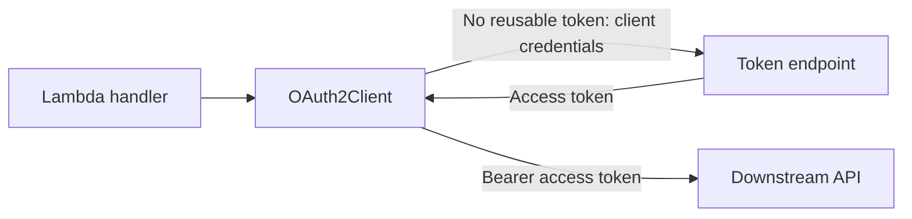

!!! warning "Alpha / experimental"
    This utility ships under the `auth_alpha` namespace while we collect feedback. Its public API may change before GA. Pin your Powertools version before using it in production.

`OAuth2Client` obtains bearer tokens for a Lambda function calling an OAuth2-protected API on its own behalf. Each client owns its resource configuration and token cache.
It supports the client-credentials grant with `client_secret_basic` (default) or explicit `client_secret_post` authentication.

Use [JWT verification](auth.md) to authenticate incoming requests. The OAuth client obtains separate credentials for outgoing requests; it does not forward an incoming caller's token.



## Key features

* Cache access tokens across warm Lambda invocations and reacquire them before expiration.
* Coordinate concurrent token requests within one client.
* Resolve a client secret for each exchange attempt.
* Authenticate using HTTP Basic or form-body credentials, as required by your provider.
* Select a downstream API using a provider-specific audience or an RFC 8707 resource indicator.
* Obtain headers for your HTTP client or send a synchronous authenticated request.
* Report fixed failure reasons without exposing credentials or provider responses.

## Getting started

### Install

```shell
pip install "aws-lambda-powertools[oauth2]"
```

The `oauth2` extra installs urllib3. It does not require PyJWT or cryptography. The client is available from both `aws_lambda_powertools.utilities.auth_alpha` and `aws_lambda_powertools.utilities.auth_alpha.oauth2`.

The Parameters example below also uses the AWS SDK. For local development or runtimes without boto3, install `aws-lambda-powertools[oauth2,aws-sdk]`.

### Configure your identity provider

Register an application that can use the client-credentials grant and grant it access to the downstream API.
Obtain its client ID, client secret, and HTTPS token endpoint. Configure the scopes and API identifier required by that provider.
`OAuth2Client` does not register applications, discover token endpoints, or grant permissions.

### Call a downstream API

Create the client outside the Lambda handler so warm invocations reuse its token cache.
This complete Lambda loads a plain-string secret through Parameters and calls `GET /stock/{sku}` on an inventory API that returns JSON:

```python title="client_credentials.py"
--8<-- "examples/auth_alpha/oauth2/src/client_credentials.py"
```

Configure these environment variables:

| Variable | Required | Value |
| -------- | -------- | ----- |
| `TOKEN_URL` | Yes | Trusted HTTPS token endpoint |
| `CLIENT_ID` | Yes | Registered application client ID |
| `CLIENT_SECRET_NAME` | Yes | Secrets Manager secret name or ARN; its value must be a plain string |
| `INVENTORY_URL` | Yes | Trusted HTTPS base URL of the downstream API |
| `SCOPES` | Provider-dependent | Space-separated scopes, such as `inventory:read inventory:write`; omit when none are needed |
| `AUDIENCE` | Provider-dependent | API identifier required by your provider; omit when unused |
| `RESOURCE` | Provider-dependent | RFC 8707 resource URI; omit when unused |

Set at most one of `AUDIENCE` and `RESOURCE`. They are independent of `INVENTORY_URL`; an API's identifier need not match its request URL.
See [provider configuration](#choose-the-resource) before choosing these values.

Invoke the example with an event such as `{"sku": "item/123"}`. The handler encodes the SKU as one URL path component.

The example allows five seconds for token acquisition and five seconds for the API request. Set the Lambda timeout above their sum, with time left for application work and error handling.
These example settings do not change the client's three-second acquisition default. See [timeouts and cold starts](#timeouts-and-cold-starts) when tuning your function.

### Required resources

The Parameters example needs `secretsmanager:GetSecretValue` on its secret and `kms:Decrypt` when the secret uses a customer-managed KMS key.
It also needs connectivity to Secrets Manager. Token exchange itself uses the registered OAuth credentials, without additional IAM permissions.
For local execution, configure AWS credentials and a region for the SDK.

The function needs outbound HTTPS access to the token endpoint and downstream API.
A Lambda function in private subnets may need a NAT gateway for public endpoints or suitable private connectivity.

### Choose the client authentication method

| `auth_method` | Credentials sent to the token endpoint |
| ------------- | -------------------------------------- |
| `client_secret_basic` (default) | Form-encoded client ID and secret in HTTP Basic authentication; neither is in the form body |
| `client_secret_post` | `client_id` and `client_secret` in the form body, without an Authorization header |

Select the method configured for your application at the provider. The client never switches methods automatically after a rejection.
Both methods resolve the current secret for every exchange attempt and share the same token-cache behavior.
Calls made through `request()` use the acquired bearer token regardless of the client authentication method.

This POST example uses `CLIENT_SECRET` instead of `CLIENT_SECRET_NAME`, and calls `INVENTORY_URL` directly. The other deployment settings are the same:

```python title="client_secret_post.py"
--8<-- "examples/auth_alpha/oauth2/src/client_secret_post.py"
```

You can also pass the Parameters `load_secret` function from the first example as `client_secret`.

### Choose how to send the API request

`OAuth2Client` provides two operations:

| Method | Use when |
| ------ | -------- |
| `auth_headers()` | You want an Authorization header for an application-owned HTTP client |
| `request(method, url, ...)` | You want the utility to send an authenticated HTTPS request |

Both methods acquire a token only when one is needed. Constructing `OAuth2Client` does not fetch a secret or token.

### Choose the resource

| Parameter | Token-request field | Purpose |
| --------- | ------------------- | ------- |
| `audience` | `audience=<value>` | Provider-specific API selection, such as an Auth0 API identifier |
| `resource` | `resource=<value>` | One resource indicator for providers supporting RFC 8707 |

These parameters are mutually exclusive and are not interchangeable. Configure the parameter supported by your provider. If neither is supplied, the provider must select the intended API through its client configuration or scope conventions; scopes alone do not universally identify a resource.

`resource` must be an absolute URI without a fragment, such as `https://inventory.example.com` or `urn:example:inventory`. Query parameters and percent-encoded characters are preserved. Relative paths and malformed URI characters are rejected during construction. `audience` remains a provider-specific, nonempty string.

Use a separate client for each API. The eventual request URL does not change the token's audience, and clients do not share token caches. Changing the requested resource requires creating a new client.

Common provider configurations are shown below. They still require an application with the appropriate permissions at that provider.

| Provider | Token endpoint path | API selection |
| -------- | ------------------- | ------------- |
| [Amazon Cognito](https://docs.aws.amazon.com/cognito/latest/developerguide/token-endpoint.html) | `/oauth2/token` on the user pool domain | Custom resource-server scopes such as `inventory/read` |
| [Auth0](https://auth0.com/docs/get-started/authentication-and-authorization-flow/client-credentials-flow/call-your-api-using-the-client-credentials-flow) | `/oauth/token` | `audience` set to the API identifier; scopes as configured for the API |
| [Microsoft Entra ID](https://learn.microsoft.com/en-us/entra/identity-platform/v2-oauth2-client-creds-grant-flow) | `/{tenant}/oauth2/v2.0/token` | One resource's `/.default` scope, such as `https://graph.microsoft.com/.default` |
| [Okta custom authorization server](https://developer.okta.com/docs/guides/implement-grant-type/clientcreds/main/) | `/oauth2/{authorizationServerId}/v1/token` | Custom API scopes |
| [Keycloak](https://www.keycloak.org/docs/latest/server_admin/index.html#_service_accounts) | `/realms/{realm}/protocol/openid-connect/token` | Service-account roles and client scopes configured in the realm |

Okta's organization authorization server [requires `private_key_jwt` for service apps](https://developer.okta.com/docs/guides/implement-oauth-for-okta-serviceapp/main/) requesting Okta management scopes. That authentication method is outside this client's scope.

For multiple identity providers, construct one client per provider and resource, with each client's trusted endpoint, credentials, and scopes.
The application chooses which client to use. There is no automatic provider routing or failover.

### Use your own HTTP client

`auth_headers()` returns a new dictionary containing `Authorization: Bearer <token>`. You can pass it to urllib3, requests, httpx, or another HTTP client:

```python title="headers.py"
--8<-- "examples/auth_alpha/oauth2/src/headers.py"
```

The example validates that `INVENTORY_URL` uses HTTPS before obtaining any credentials or sending requests. It uses an environment-provided secret; the Parameters loader from the first example also works here. With your own HTTP client, enforce HTTPS and configure its timeouts, redirects, and retries yourself. Never log the returned headers or forward them to an untrusted destination.

## Advanced

### Lambda execution environments and token lifetimes

The token cache is local to one client in one Lambda execution environment. A new environment acquires its own token.
Warm invocations may reuse a cached token, but correctness does not depend on a previous invocation.
Scaling to multiple environments can cause multiple simultaneous exchanges with the provider; there is no shared cache across functions or environments.

Tokens are cached while more than 30 seconds of their positive `expires_in` remain. On demand, the client reacquires a token when 30 seconds or less remain. This performs a new client-credentials exchange; it does not use an OAuth refresh token.

Tokens with an advertised lifetime of 30 seconds or less, or without `expires_in`, are returned without caching. A call does not loop trying to obtain a longer-lived token. Invalid lifetimes and tokens that expire during acquisition are rejected.
Lifetime accounting uses a monotonic clock starting immediately before the token request, after secret lookup. Secret lookup consumes the acquisition budget but does not shorten the newly issued token's lifetime.

Concurrent callers share one in-progress exchange, including short-lived tokens and failures. A waiting caller has its own acquisition deadline. Separate clients and Lambda execution environments have separate caches.

### Secret rotation

`client_secret` accepts a nonempty string or a callable returning one. A callable runs for each exchange attempt, including retries. The client does not cache the callable's returned secret separately.

An already cached access token can remain usable after a secret changes. Parameters also has its own cache: the first example's `max_age=300` can delay observation of a changed secret by five minutes.
Configure secret-provider timeouts independently; the client cannot interrupt an application-supplied callable.

The environment-variable examples illustrate a static secret. Reading `os.environ` through a callable does not fetch updated credentials from Secrets Manager or another external store.

### Timeouts and cold starts

| Setting | Default | Applies to |
| ------- | ------- | ---------- |
| `OAuth2Client(timeout_seconds=...)` | 3 seconds | One acquisition, including waiting, secret lookup, token requests, and retry backoff |
| `request(..., timeout=...)` | 5 seconds | The downstream request after token acquisition, including reading its response |
| Secret-provider SDK timeouts | Provider-specific | Each secret lookup; configure independently |

The acquisition and downstream budgets are sequential. Set the Lambda timeout above their sum and leave room for application work and error handling.
Otherwise, Lambda may terminate the invocation before the client can raise an exception that your handler can process.

The first token acquisition requires a secret lookup and a token exchange. SDK initialization can also add latency if it happens inside the secret loader.
Measure cold starts as well as cached requests at your configured Lambda memory and network settings.
The three-second default may be too short when acquisition includes the first Secrets Manager access.

The Parameters example constructs its SDK client outside the handler and configures one-second connect and two-second read timeouts, with one SDK attempt per lookup.
It explicitly allows five seconds for token acquisition. Treat these as example values to tune for your workload, not a guarantee that every cold start finishes within that budget.

The remaining budget is enforced while reading response headers and bodies, including chunked response framing.
This is not a universal wall-clock limit: synchronous DNS resolution, application-provided secret loaders, and upload producers cannot be interrupted. Their elapsed time still consumes the budget. Configure their timeouts separately where supported, and leave room in the Lambda invocation timeout.

### Retries and downstream responses

Transport failures, HTTP 429, and HTTP 5xx responses from the token endpoint allow at most two retries within the acquisition budget.
Backoff starts at 100 milliseconds, then 200 milliseconds. Other HTTP failures, malformed token responses, and secret-loader failures are not retried.

`request()` returns an urllib3 HTTP response with `.status`, `.headers`, `.data`, and `.json()`.
Non-success HTTP responses are returned for your application to interpret. A downstream 401 or 403 does not automatically invalidate the cached token or trigger another exchange.
The client does not replay downstream operations after a failure.

The helper buffers the entire downstream response in memory. For large downloads or streaming, use `auth_headers()` with an HTTP client configured for streaming.
The examples expect HTTP 200 with a JSON body; handle other success statuses and empty bodies according to your API's contract.

### Destination safety

The helper requires HTTPS, rejects an existing Authorization header, and never follows redirects or automatically retries downstream requests. It forwards only `body`, `fields`, `json`, `encode_multipart`, and `multipart_boundary` options to urllib3. Use `auth_headers()` with your own client for streaming responses or other transport options.

Header names must use HTTP token syntax: letters, digits, and the permitted token punctuation. Empty names, whitespace (including trailing spaces or tabs), and delimiters such as colons are rejected before token acquisition. Authorization is rejected regardless of casing.

Header values must fit Latin-1 and cannot contain ASCII control characters other than horizontal tabs. Invalid names and values are rejected before loading the client secret.

!!! warning "Use trusted destination URLs"
    `request()` does not derive or restrict destinations from the configured audience or resource. Supply trusted URLs from application configuration; never pass a caller-controlled destination. A token intended for one API must not be sent to another.

### Errors and diagnostics

OAuth errors inherit from the common `AuthError` in `auth_alpha.exceptions`. Existing JWT exception imports continue to work.

| Exception | Reason | Retryable |
| --------- | ------ | --------- |
| `TokenExchangeError` | `token_exchange_failed` | True for transient endpoint failures or acquisition timeouts; otherwise false |
| `DownstreamRequestError` | `downstream_request_failed` | False: the server may already have performed the operation |

Invalid client configuration and invalid method, URL, timeout, headers, or unsupported request-option names raise `ValueError` before token acquisition.
`retryable=true` means a later attempt might succeed; it is not a guarantee and does not authorize replaying a downstream operation.

Use the fixed `reason.value` and `retryable` fields for logs and metrics:

```python title="diagnostics.py"
--8<-- "examples/auth_alpha/oauth2/src/diagnostics.py"
```

This HTTP handler returns a proxy-style response on both success and failure. It uses the same deployment settings as the other environment-secret examples.

The utility performs no automatic logging. It removes provider exception chains before exposing an auth error.
Never log client secrets, access tokens, Authorization headers, token-request bodies, or full provider responses.

### Supported scope

The client acquires bearer access tokens with the client-credentials grant. Tokens may be opaque strings or JWTs; the client does not decode or verify their claims.
The downstream API validates and authorizes the token.

Interactive login, authorization code/PKCE, refresh-token grants, token exchange, introspection, revocation, JWT client authentication, mTLS, and DPoP are not implemented.
The client is synchronous; use your application's threading strategy when calling it from async code.

### Calling downstream APIs from an MCP tool

An MCP server can use the same client after authorizing the incoming caller. Obtain a separate token for the downstream API instead of forwarding the caller's bearer token. In an async tool, offload this synchronous client to a worker thread:

```python
import asyncio
from urllib.parse import quote

from client_credentials import INVENTORY_URL, inventory_api
from mcp.server.auth.middleware.auth_context import get_access_token


async def check_stock(sku: str) -> dict:
    caller = get_access_token()
    if caller is None or "inventory:read" not in caller.scopes:
        raise PermissionError("Inventory read permission is required")
    response = await asyncio.to_thread(
        inventory_api.request,
        "GET",
        f"{INVENTORY_URL}/stock/{quote(sku, safe='')}",
        timeout=5,
    )
    if response.status != 200:
        raise RuntimeError("Inventory lookup failed")
    return response.json()
```

Package `client_credentials.py` alongside this tool and register `check_stock` with your MCP server.
Configure the server's incoming authentication separately; the context lookup above requires an authenticated caller established by the MCP SDK.
The SDK owns transport authentication and protocol error responses; adapt the permission error to your SDK's handling.
Cancelling the awaiting task does not stop an in-progress worker thread, so network timeouts still apply. No MCP dependency is added to Powertools.

## Testing your code

Mock the client operation when testing application behavior, and test your provider configuration separately:

```python title="test_client_credentials.py"
--8<-- "examples/auth_alpha/oauth2/tests/test_client_credentials.py"
```
