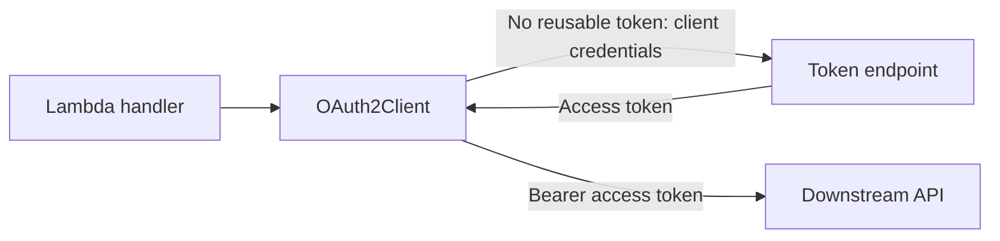

!!! warning "Alpha / experimental"
    This utility ships under the `auth_alpha` namespace while we collect feedback. Its public API may change before GA. Pin your Powertools version before using it in production.

`OAuth2Client` obtains bearer tokens for a Lambda function calling an API on its own behalf.
It uses the client-credentials grant with `client_secret_basic` (default) or explicit `client_secret_post` authentication.

Use [JWT verification](auth.md) to authenticate incoming requests. The OAuth client obtains separate credentials for outgoing requests; it does not forward an incoming caller's token.



## Key features

* Cache access tokens across warm Lambda invocations and reacquire them before expiration.
* Coordinate concurrent token requests within one client.
* Resolve a client secret for each exchange attempt.
* Authenticate using HTTP Basic or form-body credentials, as required by your provider.
* Select a downstream API using a provider-specific audience or an RFC 8707 resource indicator.
* Obtain headers for your HTTP client or send a synchronous authenticated request.
* Report fixed failure reasons without exposing credentials or provider responses.

## Getting started

### Install

```shell
pip install "aws-lambda-powertools[oauth2]"
```

The `oauth2` extra installs urllib3; PyJWT and cryptography are not required.

#### Compatibility with boto3

If the function also uses boto3, including through Parameters, install and validate the SDK together with OAuth:

```shell
pip install "aws-lambda-powertools[oauth2,aws-sdk]"
python -m pip check
```

Resolve all function dependencies together, lock their versions, and package boto3, botocore, and urllib3 together. Make a failed `pip check` fail the build.

Packaged urllib3 overrides the runtime copy and can conflict with the runtime's SDK.
Build checks cannot validate dependencies supplied only by the runtime or separate layers. See [AWS packaging guidance](https://docs.aws.amazon.com/lambda/latest/dg/python-package.html#python-package-dependencies).

### Configure your identity provider

Register a client-credentials application with access to your API. Obtain its client ID, secret, HTTPS token endpoint, and required scopes or API identifier.
`OAuth2Client` does not register applications or discover endpoints.

### Call a downstream API

Create the client outside the Lambda handler so warm invocations reuse its token cache.
This complete Lambda loads a plain-string secret through Parameters and calls `GET /stock/{sku}` on an inventory API that returns JSON:

```python title="client_credentials.py"
--8<-- "examples/auth_alpha/oauth2/src/client_credentials.py"
```

Configure these environment variables:

| Variable | Required | Value |
| -------- | -------- | ----- |
| `TOKEN_URL` | Yes | Trusted HTTPS token endpoint |
| `CLIENT_ID` | Yes | Registered application client ID |
| `CLIENT_SECRET_NAME` | Yes | Secrets Manager secret name or ARN; its value must be a plain string |
| `INVENTORY_URL` | Yes | Trusted HTTPS base URL of the downstream API |
| `SCOPES` | Provider-dependent | Space-separated scopes, such as `inventory:read inventory:write`; omit when none are needed |
| `AUDIENCE` | Provider-dependent | API identifier required by your provider; omit when unused |
| `RESOURCE` | Provider-dependent | RFC 8707 resource URI; omit when unused |

Set at most one of `AUDIENCE` and `RESOURCE`; neither is derived from `INVENTORY_URL`. See [provider configuration](#choose-the-resource).

Invoke with `{"sku": "item/123"}`; the handler URL-encodes the SKU.

The example allows five seconds for acquisition plus five for the API request. Set the Lambda timeout higher; see [timeouts and cold starts](#timeouts-and-cold-starts).

### Required resources

Parameters needs Secrets Manager connectivity, `secretsmanager:GetSecretValue`, and `kms:Decrypt` for a customer-managed key.
Local execution also needs SDK credentials and a region. OAuth token exchange itself requires no additional IAM permissions.

Allow outbound HTTPS to the token endpoint and API. Private subnets may require NAT or private connectivity.

### Choose the client authentication method

| `auth_method` | Credentials sent to the token endpoint |
| ------------- | -------------------------------------- |
| `client_secret_basic` (default) | Form-encoded client ID and secret in HTTP Basic authentication; neither is in the form body |
| `client_secret_post` | `client_id` and `client_secret` in the form body, without an Authorization header |

Select your provider's method; there is no automatic fallback. API requests always use the acquired bearer token.

This example uses `CLIENT_SECRET` instead of `CLIENT_SECRET_NAME` and calls `INVENTORY_URL` directly:

```python title="client_secret_post.py"
--8<-- "examples/auth_alpha/oauth2/src/client_secret_post.py"
```

You can also pass the Parameters `load_secret` function from the first example as `client_secret`.

### Choose how to send the API request

`OAuth2Client` provides two operations:

| Method | Use when |
| ------ | -------- |
| `auth_headers()` | You want an Authorization header for an application-owned HTTP client |
| `request(method, url, ...)` | You want the utility to send an authenticated HTTPS request |

Both acquire tokens on demand; construction fetches no secret or token.

### Choose the resource

| Parameter | Token-request field | Purpose |
| --------- | ------------------- | ------- |
| `audience` | `audience=<value>` | Provider-specific API selection, such as an Auth0 API identifier |
| `resource` | `resource=<value>` | One resource indicator for providers supporting RFC 8707 |

Use at most one parameter, as required by your provider. If omitted, API selection depends on the provider's client configuration or scope conventions.

`resource` must be an absolute URI without a fragment, such as `https://inventory.example.com` or `urn:example:inventory`.
`audience` accepts a provider-specific, nonempty string. Both are validated during construction.

Common provider configurations:

| Provider | Token endpoint path | API selection |
| -------- | ------------------- | ------------- |
| [Amazon Cognito](https://docs.aws.amazon.com/cognito/latest/developerguide/token-endpoint.html) | `/oauth2/token` on the user pool domain | Custom resource-server scopes such as `inventory/read` |
| [Auth0](https://auth0.com/docs/get-started/authentication-and-authorization-flow/client-credentials-flow/call-your-api-using-the-client-credentials-flow) | `/oauth/token` | `audience` set to the API identifier; scopes as configured for the API |
| [Microsoft Entra ID](https://learn.microsoft.com/en-us/entra/identity-platform/v2-oauth2-client-creds-grant-flow) | `/{tenant}/oauth2/v2.0/token` | One resource's `/.default` scope, such as `https://graph.microsoft.com/.default` |
| [Okta custom authorization server](https://developer.okta.com/docs/guides/implement-grant-type/clientcreds/main/) | `/oauth2/{authorizationServerId}/v1/token` | Custom API scopes |
| [Keycloak](https://www.keycloak.org/docs/latest/server_admin/index.html#_service_accounts) | `/realms/{realm}/protocol/openid-connect/token` | Service-account roles and client scopes configured in the realm |

Okta's organization authorization server [requires `private_key_jwt` for service apps](https://developer.okta.com/docs/guides/implement-oauth-for-okta-serviceapp/main/) requesting Okta management scopes. That authentication method is outside this client's scope.

Create one client per provider and resource. The request URL does not change token selection; changing the resource requires a new client.
Your application selects the client; routing and failover are not automatic.

### Use your own HTTP client

Pass the fresh `Authorization: Bearer <token>` dictionary from `auth_headers()` to your HTTP client:

```python title="headers.py"
--8<-- "examples/auth_alpha/oauth2/src/headers.py"
```

This example validates HTTPS before acquiring credentials. Configure your HTTP client's timeouts, redirects, and retries yourself.
Never log the returned headers or send them to an untrusted destination.

## Advanced

### Lambda execution environments and token lifetimes

Each client caches tokens within one Lambda execution environment. Warm invocations may reuse them; new environments acquire their own tokens and can exchange concurrently.

Cached tokens are reused while more than 30 seconds remain. After that, the next call performs a new client-credentials exchange, not a refresh-token grant.
Tokens with missing or at most 30 seconds of advertised lifetime are returned uncached. Invalid lifetimes and tokens that expire during acquisition are rejected.

Lifetime accounting starts immediately before the token request. Secret lookup consumes the acquisition budget without shortening the token's lifetime.

Concurrent callers on one client share an exchange, including short-lived tokens and failures. Each waiting caller keeps its own acquisition deadline.

### Secret rotation

`client_secret` accepts a nonempty string or a callable, invoked for each exchange attempt including retries. The client does not cache the callable's result.

Cached access tokens may remain usable after rotation. Parameters' `max_age=300` can delay reading an updated secret by five minutes.

Environment-variable secrets are static; a callable reading `os.environ` does not fetch external updates.

### Timeouts and cold starts

| Setting | Default | Applies to |
| ------- | ------- | ---------- |
| `OAuth2Client(timeout_seconds=...)` | 3 seconds | One acquisition, including waiting, secret lookup, token requests, and retry backoff |
| `request(..., timeout=...)` | 5 seconds | The downstream request after token acquisition, including reading its response |
| Secret-provider SDK timeouts | Provider-specific | Each secret lookup; configure independently |

These budgets are sequential. Set the Lambda timeout above their sum, leaving time for application work and error handling.

Measure cold starts at your chosen memory and network settings: initial secret lookup and SDK setup can exceed the three-second default.
The Parameters example initializes the SDK outside the handler, uses one-second connect/two-second read timeouts with one SDK attempt, and allows five seconds for acquisition. Tune these values for your workload.

HTTP header and body reads use the remaining budget. DNS resolution, secret loaders, and upload producers cannot always be interrupted, although their elapsed time still counts.
Configure their own timeouts where supported.

### Retries and downstream responses

Token-endpoint transport failures, HTTP 429, and HTTP 5xx allow at most two retries, with 100 ms then 200 ms backoff within the acquisition budget.
Other HTTP errors, malformed token responses, and secret-loader failures are not retried.

`request()` returns an urllib3 HTTP response with `.status`, `.headers`, `.data`, and `.json()`.
Handle HTTP statuses in your application: even 401/403 does not invalidate the cached token or trigger another exchange. Downstream operations are never automatically replayed.

Responses are fully buffered in memory; use `auth_headers()` and a streaming client for large downloads.
The examples expect HTTP 200 with JSON. Handle other statuses or empty bodies according to your API.

### Destination safety

`request()` requires HTTPS, disables redirects, and forwards only `body`, `fields`, `json`, `encode_multipart`, and `multipart_boundary` options to urllib3.
Use `auth_headers()` for other transport options.

Header names must follow HTTP token syntax; values must fit Latin-1 without ASCII controls other than tabs.
Invalid headers and case-insensitive Authorization overrides are rejected before secret lookup.

!!! warning "Use trusted destination URLs"
    Use configured, trusted URLs, never caller-controlled destinations. `request()` does not restrict URLs using the configured audience or resource.

### Errors and diagnostics

OAuth errors inherit from `AuthError` in `auth_alpha.exceptions`.

| Exception | Reason | Retryable |
| --------- | ------ | --------- |
| `TokenExchangeError` | `token_exchange_failed` | True for transient endpoint failures or acquisition timeouts; otherwise false |
| `DownstreamRequestError` | `downstream_request_failed` | False: the server may already have performed the operation |

Invalid client configuration, method, URL, timeout, headers, or option names raise `ValueError` before token acquisition.
`retryable=true` means a later acquisition might succeed.

Use the fixed `reason.value` and `retryable` fields for logs and metrics:

```python title="diagnostics.py"
--8<-- "examples/auth_alpha/oauth2/src/diagnostics.py"
```

This handler returns proxy-style responses and uses the environment-secret deployment settings.

The client emits no logs and removes provider exception chains. Never log secrets, tokens, request headers/bodies, or provider responses.

### Supported scope

The client treats bearer tokens, including JWTs, as opaque strings. The downstream API validates and authorizes them.

Other grants, introspection, revocation, JWT client authentication, mTLS, and DPoP are not supported. Calls are synchronous.

### Calling downstream APIs from an MCP tool

After authorizing the MCP caller, use `asyncio.to_thread()` to call the downstream API with separate client credentials:

```python
import asyncio
from urllib.parse import quote

from client_credentials import INVENTORY_URL, inventory_api
from mcp.server.auth.middleware.auth_context import get_access_token


async def check_stock(sku: str) -> dict:
    caller = get_access_token()
    if caller is None or "inventory:read" not in caller.scopes:
        raise PermissionError("Inventory read permission is required")
    response = await asyncio.to_thread(
        inventory_api.request,
        "GET",
        f"{INVENTORY_URL}/stock/{quote(sku, safe='')}",
        timeout=5,
    )
    if response.status != 200:
        raise RuntimeError("Inventory lookup failed")
    return response.json()
```

Package `client_credentials.py` alongside the tool and register `check_stock` with an authenticated MCP server. The SDK owns transport authentication and error responses.
Cancelling the task does not stop the worker's request; timeouts still apply. Install the MCP SDK separately.

## Testing your code

Mock the client operation when testing application behavior, and test your provider configuration separately:

```python title="test_client_credentials.py"
--8<-- "examples/auth_alpha/oauth2/tests/test_client_credentials.py"
```
