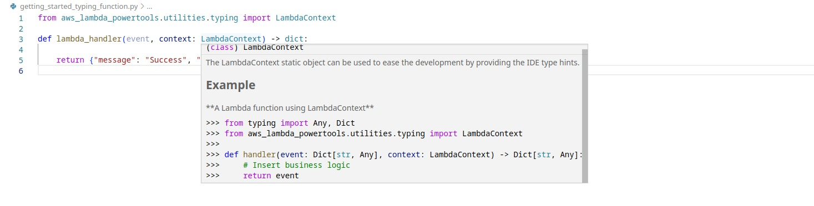

<!-- markdownlint-disable MD043 -->

This typing utility provides static typing classes that can be used to ease the development by providing the IDE type hints.

## Key features

* Add static typing classes
* Ease the development by leveraging your IDE's type hints
* Avoid common typing mistakes in Python



## Getting started

???+ tip
    All examples shared in this documentation are available within the [project repository](https://github.com/aws-powertools/powertools-lambda-python/tree/develop/examples){target="_blank"}.

We provide static typing for any context methods or properties implemented by [Lambda context object](https://docs.aws.amazon.com/lambda/latest/dg/python-context.html){target="_blank"}.

## LambdaContext

The `LambdaContext` typing is typically used in the handler method for the Lambda function.

=== "getting_started_validator_decorator_function.py"

	```python hl_lines="1 4"
    --8<-- "examples/typing/src/getting_started_typing_function.py"
	```

## Working with context methods and properties

Using `LambdaContext` typing makes it possible to access information and hints of all properties and methods implemented by Lambda context object.

=== "working_with_context_function.py"

	```python hl_lines="6 15 22 23"
    --8<-- "examples/typing/src/working_with_context_function.py"
	```

### Available properties and methods

| Name                           | Type     | Description                                                               |
| ------------------------------ | -------- | ------------------------------------------------------------------------- |
| `function_name`                | property | The name of the Lambda function                                           |
| `function_version`             | property | The version of the function                                               |
| `invoked_function_arn`         | property | The Amazon Resource Name (ARN) that's used to invoke the function         |
| `memory_limit_in_mb`           | property | The amount of memory that's allocated for the function                    |
| `aws_request_id`               | property | The identifier of the invocation request                                  |
| `log_group_name`               | property | The log group for the function                                            |
| `log_stream_name`              | property | The log stream for the function instance                                  |
| `identity`                     | property | Information about the Amazon Cognito identity that authorized the request |
| `client_context`               | property | Client context that's provided to Lambda by the client application        |
| `tenant_id`                    | property | The tenant_id used to invoke the function                                 |
| `get_remaining_time_in_millis` | method   | Returns the number of milliseconds left before the execution times out    |
